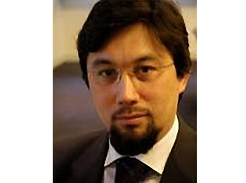

#沙里亚在世俗社会中的目标

* [原链接](http://www.norislam.com/?viewnews-13293)

[编译者按语﹕在圣纪日前夕(2月27日)﹐世界各国伊斯兰法学家聚会在意大利罗马﹐讨论西方国家穆斯林实行伊斯兰法制(沙里亚)的问题。  会议四天﹐深入谈论的主体是“沙里亚所面临的现代挑战”。  本文是根据意大利伊斯兰协会副会长﹐兼罗马市大清真寺伊玛目叶海雅‧帕拉威奇尼的发言稿整理而成。]

伊斯兰是世界上唯一以法律为基础的宗教﹐从功修和日常生活到社会活动﹐一切都依法办事﹐伊斯兰的法制通常称为“沙里亚”。  生活在非伊斯兰国家的穆斯林﹐遇到很不适应的现状之一﹐就是社会把伊斯兰看成一般性宗教﹐成为穆斯林的精神追求和自我制约﹐而不承认穆斯林小区必须遵循的沙里亚法规。   西方国家实行世俗体制﹐宗教在近代历史上被边缘化了﹐排除在社会管理“局外”﹐甚至被划定为“个人私生活”。   穆斯林从信仰的角度谈法制﹐西方官员们感到奇怪﹐因为其他宗教没有法制要求﹐只满足于一片安静的祈祷场所﹐而穆斯林被剥夺了服从沙里亚原则的生活方式﹐感到信仰不自由﹐精神受压迫。  假如两种文明有冲突的话﹐在现实生活中﹐这是一例。

作为穆斯林的学者和社会学家﹐对于伊斯兰信仰所密切关联的沙里亚体制﹐在任何情况下都不能放弃﹐否则﹐伊斯兰必然不完整﹐有可能堕落到简单的“迷信”礼仪。  沙里亚体现了穆斯林的各种美德﹐表现了伊斯兰的优秀文明﹐因为沙里亚对穆斯林的家庭和小区生活﹐提出了许多原则性规范﹐没有沙里亚的依据﹐伊斯兰信仰必然受到伤害和贬损﹐因此在穆斯林小区中坚持沙里亚精神是原则性问题﹐不能让步。  穆斯林所在国家﹐必须遵守当地法律﹐但是穆斯林自有一套自我管理的思想意识和社会模式﹐这是不容忽略的事实。  作为西方国家的公民﹐遵纪守法﹔作为穆斯林﹐遵从信仰的法制沙里亚﹐因此穆斯林有双重法规标准。

在西方世俗化的社会环境中﹐穆斯林社会为坚持沙里亚精神﹐应当有五个明确目标﹕一曰捍卫生命﹔二曰捍卫信仰﹔三曰捍卫公正﹔四曰捍卫财产﹔五曰捍卫家庭。  这是人类赖以有尊严生存的基本原则﹐受到各种国际法和人权法的保护。  这五大目标﹐不仅是生活在非伊斯兰国家穆斯林社会的要求﹐也是伊斯兰国家对那里非穆斯林居民权益给予保护﹐互相平等﹐因为这些是属于人类有尊严生存的基本人权。

在许多非伊斯兰国家﹐当地的官员﹑学者和社会工作者﹐对穆斯林提出的沙里亚小区管理体制十分不理解﹐往往被解释为“宗教干涉法制”﹐因为西方社会数百年的改革运动早把宗教排除在政治体制之外了﹐而他们的宗教已经被沦为“民俗”﹐本身也没有法制要求。  他们不理解﹐伊斯兰是法制性宗教﹐沙里亚是穆斯林精神信仰和生活方式不可或缺的一部分。  西方国家的宪法中﹐普遍都有“尊重宗教信仰自由”这一条款﹐对于穆斯林﹐就应当包括穆斯林内部自我管理的沙里亚﹐否则﹐就不是完整的自由﹐没有落实宪法原则﹐必然引起许多穆斯林对抗。

生活在西方国家的穆斯林﹐绝无干预政治﹑颠覆政府或用伊斯兰改造社会的野心﹐但希望保留完美的信仰体制﹐享有充份的自由﹐建树穆斯林社会内部的道德体制﹐因此伊斯兰由貌7b主独一信仰和五大功修与其伴随而来的沙里亚精神﹐是两个方面﹐不可偏废。   穆斯林争取信仰自由的合法权利﹐首先应获得社会和官方的理解﹐需要有个耐心宣传的过程﹐所以这个要求﹐不可操之过急。   在暂时还不能实现的地方﹐穆斯林学者们绝不能放弃这个要求﹐可以成为长期奋斗的方向。  我们有必要强调﹐沙里亚是从信仰角度的要求﹐而不是政治诉求或政权要求﹐穆斯林渴望以遵循真主的法度而取悦于真主﹐得到真主在复活日的报偿。

实现沙里亚﹐是穆斯林享有完美人权的要求﹐也是全体穆斯林的奋斗目的﹐例如捍卫生命。  生命是真主恩赐每个人的礼物﹐保护生命﹐自己的生命和他人的生命﹐都是在以崇高的真主尊名下神圣的使命和责任。  在生命之后﹐是坚守信仰﹔穆斯林认主独一﹐只崇拜真主﹐并且遵从真主命令的各种法规﹐在日常生活中有确切的信仰表现。  第三捍卫的目标是公正﹐其中包括尊重合理的逻辑思维﹐维护理智和人性尊严﹐人人都享有思想和言论自由。  第四是捍卫财产﹐主要是私人财产﹐其中包括知识产权。  每个人的劳动所得﹐是他应得的报酬﹐他享有合法权利对他个人财产的保存﹑消费﹑投资﹑继承﹑转让和施舍。  财产也代表了个人的生活保障﹐保护了私人财产﹐等于是保护了个人生活﹐在所以西方国家都被认作是基本人权。   第五是捍卫家庭﹐包括亲属﹐伊斯兰视家庭为社会基本细胞﹐保护它的健康存在和发展﹐是社会繁荣和稳定的基础。  家庭是繁衍子孙后代﹐传承信仰和文化的基地﹐其中妇女们是家庭主力军﹐所以﹐保护家庭﹐就等于保护种族文化和妇女儿童。

穆斯林与非穆斯林的学者﹐在实现沙里亚问题上存在见解和感受的分歧。  西方官员和学者由于对伊斯兰偏见和无知﹐容易把沙里亚看成是“穆斯林对西方法制的入侵”﹐而穆斯林从自身体验感受到﹐沙里亚是对敬畏真主的行为规范和法则﹐是精神力量的需要﹐而不是争夺政治权力。  对于西方普遍存在的无神论思想﹐他们所认知的生命﹑信仰﹑公正﹑财产和家庭﹐都同坚持认主独一的穆斯林有严重差异。 穆斯林所理解的现实世界﹐一切生命和物质﹐都归功于真主的造化和意欲﹐穆斯林以顺从真主的命令而保持高昂的生命力﹐而那些无神论官员却不这么看﹐他们认为这些均属无稽之谈﹐人是天地的主人﹐没有上帝﹑神仙或救世主。  双方的思维方式存在很难以跨越的深沟﹐因此穆斯林想说服那些官员以及他们所依附的社会﹐是难上加难﹐因为这是生活在两个不同精神世界的两种人类。  虽然双方说的是同样的语言﹐使用同样的词句﹐但是两边的人﹐在大脑中的概念和联想大相径庭。

欧洲是一个典型的地方﹐穆斯林与世俗体制的矛盾最为明显。 从世界各地涌入的穆斯林移民﹐他们来到欧洲国家找工作﹑求学﹑安家落户﹐但对这些国家的历史﹑文化﹑语言和传统﹐一无所知。  而另一方面﹐每个欧洲国家都在过去的三百年里经历了千变万化﹐从王权到立宪的社会改革﹐从宗教到世俗社会的转化﹐从农牧业到工业化和城市化的改造﹐从对外开拓的殖民主义掠夺到世界大战重新瓜分世界的变革﹐沧海桑田﹐天翻地覆。  在西方社会这些社会动乱和变革中﹐只产生了一个优点﹕民主。  我们得利于西方社会变革的成果﹐享有他们的民主和自由法制﹐因此有机会发表意见﹐开展不同文明的对话和辩论﹐促进彼此了解﹐互相沟通。

在西方世界﹐每个国家都有宪法﹐而且宪法内容大致相同﹐譬如都有“宗教信仰自由﹐言论自由”的条款。  在西方社会﹐除了有选举和集会﹐而且有媒体宣传的自由和结社的自由。 那么﹐在这些有利的条件下﹐穆斯林可以充份发挥宪法精神所赋予的权利﹐发表自己的意见﹐宣传伊斯兰基本理念﹐建立自己的组织﹐提出自己的合理要求 ---- 穆斯林要求允许在小区内部实行沙里亚管理。

西方国家号称“自由”世界﹐比起东方国家﹐他们有更多的言论自由﹐穆斯林有机会向社会说话﹐反穆斯林的组织和团体﹐也有机会向社会宣传他们的观点。  所以﹐不要因为看到一部分人对穆斯林不友好或歧视﹐而感到惊讶或恐惧。  俗云“林子大了什么鸟都有”﹐所以不必懮虑。  穆斯林社会的重要使命是提高文化素质和宣传水平﹐增强社会竞争能力﹐适应这里的环境﹐要看到西方社会的优点和穆斯林小区发展的希望。

穆斯林世界同西方互相接触有一千多年历史﹐过去曾经有过许多战争和对抗﹐而实际彼此渗透﹐进入对方社会生活和工作﹐只是近代的趋势﹐尤其在二十世纪都半期年代里。  来势凶猛的穆斯林移民潮﹐以及穆斯林坚持信仰精神不愿向西方文化屈服的表现﹐使西方人对穆斯林有恐惧感。  由于这些不正常的现象﹐产生了异常的反应﹐出现对穆斯林的种族歧视﹐穆斯林大可不必大惊小怪。  随着穆斯林的第二代﹐第三代﹐甚至第四代﹐他们在西方社会出生和成长﹐穆斯林后代之中将出现一大批教授﹑律师﹑记者﹑议员和富翁﹐文化的融入问题就很容易解决了。 

我们寄希望于下一代﹐但我们老一辈人必须保持清醒的头脑﹐坚持沙里亚是信仰一部分的理念﹐把一个完美的伊斯兰传授给下一代﹐当他们羽毛丰满之日﹐自然会为之奋斗。 只要我们的后代不背离伊斯兰的基本精神﹐伊斯兰在西方世俗国家的发展就大有希望。  让我们努力争取﹐坚持原则﹐等待这一天的到来 ---- 以伊斯兰的法制管理穆斯林小区﹐在西方实现完美的伊斯兰文明社会。

Wa Allah Alam (真主所知最多)﹗

 (阿里编译自Shariah Encounter with Europe by Yahya Sergio Yahe Pallavicini)