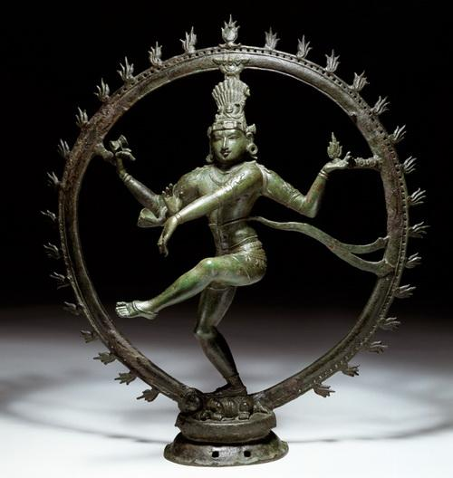

# 伊斯兰问题，还是阿拉伯问题？

* 作者: [李子暘](http://blog.caijing.com.cn/liziyang)
* 2015-12-22 13:35:15
* [原链接](http://blog.caijing.com.cn/expert_article-151432-88318.shtml)

现在，几乎所有恐怖主义都来自伊斯兰世界，恐怖分子几乎都是穆斯林，伊斯兰极端主义成了恐怖主义的代名词。这就不免让人疑惑，是不是伊斯兰教有什么问题？这个宗教是不是已经成了恐怖主义思潮的来源？

看上去的确如此。人们果然在《古兰经》和“圣训”中找到了发动圣战、武力消灭异教徒的内容。可是，你同样能在《圣经》或犹太教经典中找到类似内容。实际上，同属一神教的犹太教、基督教、伊斯兰教在强调信仰纯正、排斥异教徒和异端、主张使用武力、号召为宗教牺牲等方面，共同点颇多。

根据经典来判断宗教的本质，很不可靠。决定宗教形态的，是教徒的行为，而不是古老经书上的文字。实际上，在《古兰经》《圣经》《塔木德》这种包罗万象、语义繁复、解释庞杂的经书中，人们可以找到任何他想要找到的内容。不是有人在《易经》中找到了计算机的起源吗？

## 湿婆之舞

如果只看教义，印度教其实是更可怕的宗教。印度教有三大主神：梵天、毗湿奴、湿婆。三大主神各有分工。梵天创造世界，毗湿奴维护世界，湿婆毁灭世界。而正因为有了湿婆的毁灭，世界才能涅槃重生，并一次次轮回。轮回是印度教和佛教的核心教义。

在这三大主神中，现在信奉梵天的人很少，信奉毗湿奴和湿婆的人很多。著名的雕像“湿婆之舞”，含义就是世界在湿婆的舞蹈中毁灭。

按照这种教义，拥有核武器以后，印度教的极端分子应该很乐于把原子弹到处扔，尽快毁灭这个世界。对印度教徒来说，世界毁灭不但不是坏事，反而是涅槃重生的必要过程。没什么可惋惜的，应该高兴才对。

虽然印度教在印度很兴盛，信奉湿婆的印度教徒尤其多，但显然并没有什么印度人主张毁灭世界。其他人也不担心会有这样的印度人。虽然有这种教义，但如果没有毁灭世界的想法，你不难找个理由做出圆满的解释。

如果有机会去印度，我打算买上一个“湿婆之舞”的雕像（不能说“买”，应该说“请”）。用这个雕像作为熊彼特所说的市场经济中“创造性毁灭”的象征，贴切又生动，最好不过。

经书只是文字，往往还是语义含混的文字。你想怎么解释都成，不是吗？

把恐怖主义的根源归因于宗教，让千百年前的古人，让流传已久的古老经书为今天的现实负责，是浅尝辄止不求甚解，无助于我们找到恐怖主义的真正根源。

## 愤怒和仇恨

伊斯兰教产生于7世纪，距今已有一千多年。如果这个宗教是恐怖主义的来源，为什么只在最近几十年才发作起来？历史事实是，除了产生之初阿拉伯帝国扩张时期的战争以外，伊斯兰教大部分时期确实很和平。典型的古代阿拉伯人形象是骑在骆驼上的商人。

中东地区的犹太人及其以色列国家，现在成为地区冲突的焦点。很多人忽略的问题是，为什么中东地区聚集了那么多犹太人？原因可能有点意外。历史上这里并没有严重的种族歧视。相比反复迫害犹太人的欧洲，中东地区很长时间内宗教很宽容。所以，大量犹太人才会自发迁徙到这里。并且，他们和当地的阿拉伯人相处得不错。横眉冷对、大打出手，是20世纪以来的事情。

伊斯兰教的历史中，当然也有战争和暴力，但并不比其他宗教更多，尤其不比其他一神教更多。在历史中找不到恐怖主义兴起的原因。

接下来看看穆斯林的人口分布。

目前全世界伊斯兰教信徒，也就是穆斯林，约有16亿人，占世界人口总数的23%，将近四分之一。但其中只有20%生活在中东北非，也就是阿拉伯地区。虽然这里是伊斯兰教的发源地，但现在大部分穆斯林都生活在阿拉伯地区以外的其他地方。

按穆斯林数量计算，前五大国分别是印度尼西亚、印度、巴基斯坦、孟加拉和尼日利亚，都不是阿拉伯国家。这五个国家中，除了巴基斯坦以外，都没有严重的伊斯兰极端恐怖主义问题。在印度，以印度教为旗帜的印度人民党取代国大党上台以后，更严重的问题是多数印度教徒打压少数穆斯林。

虽然伊斯兰教义对女性很不利，但印尼、印度、巴基斯坦、孟加拉都有女性的总统或总理。教义并不能真正决定现实政治。

如果恐怖主义的根源是伊斯兰教，那么，恐怖组织、恐怖人员的分布应该和穆斯林人口的分布大致一致，至少相差不多。可实际上，绝大多数恐怖组织和人员都来于仅占穆斯林总人口20%的中东北非阿拉伯地区。

即使是那些阿拉伯以外的恐怖主义，也可以明显看出阿拉伯“辐射”的影响。这方面的典型是巴基斯坦。巴基斯坦和阿富汗相邻。阿富汗聚集了大量来自阿拉伯的宗教极端组织。在美军打击之下，极端组织纷纷避往巴基斯坦，也把巴基斯坦变成了恐怖主义严重的国家。

纵向的历史比较和横向的地区比较都说明，很难用一个遍布全球的、历史超过千年的宗教来解释一个局部地区最近几十年发生的事情。恐怖主义并不是伊斯兰问题，而是阿拉伯问题，或者说是中东问题。恐怖主义不是源远流长的老问题，而是这个时代的新问题。

这种区分有意义吗？阿拉伯地区是伊斯兰教的发源地。阿拉伯语是伊斯兰教的宗教语言。在很多人看来，伊斯兰和阿拉伯差不多是同义词。

首先，伊斯兰和阿拉伯并不是同义词。阿拉伯人甚至都已经不是穆斯林的多数。更重要的是，这种区分在于提示一个事实：对宗教极端势力来说，是先有的愤怒和仇恨，然后才有的那些来自经书的理由和虔诚的姿态。

伊斯兰教一直在那里，一千多年了，只是在最近几十年，因为现实政治原因，阿拉伯人心中产生了大量的愤怒和仇恨。他们采用宗教这个冠冕堂皇、深入人心的思考和表达方式。真正的问题并不在于古老的宗教，而在于现实的政治。

那么，阿拉伯地区的现实政治有哪些问题，以至于这里成了恐怖主义、极端主义的来源地？

## 文明的失落

现代化的起源是英美。对其他国家来说，现代化其实就是英美化，政治、法律、经济，甚至生活方式都英美化。议会制、独立司法、私有产权、市场经济这些现代化要素，起初只是英国的“本土特色”，现在却成了全球各国的“默认选项”。英国没有自己的民族服装，这是因为起源于英国的西服已经成了全世界男士的正装。牛仔裤也不是美国人只在过节时穿的民族特色服装。

由于这种情况，英美以外的其他国家，在现代化过程中都会体验到或多或少的失落感。眼睁睁看着自家的古老文明被边缘化，必须改弦更张另行打造一套社会结构和生活方式，这个过程，既不轻松，也不愉快。

法国人至今还在徒劳地抵抗英语对法语的“侵蚀”。纳粹德国轻蔑地把英国称为“小店主的国家”。甘地用手摇纺车和简陋的腰围布号召印度人用自己古老的文明对抗来自英国的现代工业文明。俄国、中国的失落感更强。

马克思曾预言共产主义革命会率先在发达的西欧爆发。预言落了空。共产主义革命在欧洲最落后的俄国爆发，然后传播到了更落后的中国。这其中的原因就是，发达工业国并不需要共产主义革命，失落感强烈的后进国家却很需要借此发泄心中的愤懑，并找到“超英赶美”“毕竟还是我先进”的幻觉。

疾风暴雨式的共产主义革命过去了，俄国、中国因为文明失落感而产生的愤懑也发泄得差不多了。在这些国家，还能见到一些口头上挑战西方的“愤怒青年中年老年”，但在实际行动中，大家都已经全面接受现代化，也就是英美化了。

可是，阿拉伯地区的文明失落感还远远没有充分发泄。

阿拉伯人认为自己有着古老而灿烂的文明，本不应该像今天这样成为西方的附庸。石油带来的滚滚美元，让他们相信自己可以赶上并超过西方，一举摆脱西方附庸的地位。这个想法很快就被证明是个天真的幻想。一个现代化的工业体系不是那么容易打造出来的。即使油价上涨超过十倍，阿拉伯国家依然没有摆脱西方附庸的地位。军事上对以色列的屡战屡败，加剧了阿拉伯人的屈辱感和挫败感。

曾经，阿拉伯精英非常向往西方。他们乐于到西方的大学留学，热衷于效仿西方人的生活方式。但随着赶超西方的努力一再失败，直至彻底无望，他们对西方的态度转为嫉恨。这是典型的文明失落带来的负面情绪。在这种情绪刺激之下，上层精英的不满，扩散到社会底层就成为直接诉诸暴力的愤怒和仇恨。西方世界成了他们所有现实失败的根源和罪人。

虽然如此，由于实力弱小，阿拉伯世界的愤怒仇恨并不是什么严重问题。一直到苏军撤出阿富汗，这个世界的主要问题都是法西斯、军国主义、苏俄这样的大流氓。任何一个大流氓都可以轻松压制阿拉伯人。以苏军撤出阿富汗为标志，大流氓的表演落幕了。原来根本不值一提的小流氓、小小流氓、土混纷纷登场。

太阳底下无新事。想当个全新的流氓，其实很难。稍加分析就可看出，新来的小流氓们津津乐道的义正词严，无一例外全是拾人牙慧。区别只在于表面。他们翻遍经书，给自己套上了一个伊斯兰的外壳，可惜，其中的内核仍然是个现代化的小学生。他们的兴起，其实从另一个角度证明了现代化的不可回避。

从经书中，恐怖分子能找到支持他们暴行的神圣理由。不过，就算没有经书，他们也照样能在其他地方找到施暴的理由。他们真正的老师是红色旅、爱尔兰共和军、光辉道路这样的老牌恐怖分子。不区分地袭击公众、利用舆论扩大影响、制造社会恐慌、自杀式攻击……这些都是现代技术。古代暴徒或许更残酷，但对这些现代技术，他们闻所未闻。

强烈的文明失落感会带来愤怒和仇恨，但也不必然如此。如果人们的时间和精力有其他更好的用处，比如拓荒开垦、探索未知、努力赚钱、发家致富，后进国家也有可能顺利完成现代化。可是，阿拉伯世界并不具备这个替代渠道。

## 资源诅咒

在分析的恐怖主义的原因时，常常可以见到一种滥俗的观点，把恐怖主义归因于贫困和发达国家的“剥削”，认为解决恐怖主义的关键就在于让发达富裕国家拿出更多的钱援助贫困落后国家。

这种观点之远离事实，已经到了可笑的地步。阿拉伯地区恰恰是伊斯兰世界最富裕的部分。来自西方的石油美元，多年以来潮水一般涌向阿拉伯国家，比任何可能的援助都要多得多。富有讽刺意义的是，恐怖主义恰恰产生在伊斯兰世界最富裕的地方，而不是贫困或较贫困的地方。本拉登这样的恐怖大亨，本身就富可敌国。把本拉登们的恐怖行径描述为不堪忍受贫困、剥削的“被迫反抗”，是知识上的无知和道德上的无耻。

虽然不能把恐怖主义的原因归结为贫困和被剥削，但恐怖主义确有其经济上的原因，那就是“资源诅咒”。因此，甚至可以说恐怖主义产生于富裕。如果没有那么多石油美元，阿拉伯地区根本不会有严重的恐怖主义。

再没有什么地方像阿拉伯地区那样充分地表现出经济学所说的“资源诅咒”了。资源诅咒的含义是，对一个国家来说，过于丰富的自然资源不但不是好事，反而很可能成为坏事。尤其对于发展中国家来说，过于丰富的自然资源会在很多方面阻碍该国形成有利的社会环境和国家制度，从而从根本上破坏国家的发展基础。

石油这样的自然资源，国家很容易控制和独占，人民难以参与；开采、出售这些自然资源，换得美元，不需要国内民众参与，依靠少数外国公司的技术人员和专业设备即可。

如果国家的主要产业是工业、农业、服务业这样需要人民广泛参与的行业，政府通过税收获取收入，那么，国家就必须保持起码的有利于生产的制度环境。制度太过苛刻，人民难以生产，贫困不堪，国家自己的收入也会减少。

政府不收税，靠自然资源直接获取收入，看似好事，其实是天大的坏事。如此一来，国家和人民之间的激励一致不复存在。人民对政府来说不是财源，而是“多余的人”。国家不但对打造维持促进生产的制度环境没兴趣，还会有强烈的动机防范、压制“多余的人”，防止他们不守本分、觊觎肥厚的自然资源收入。

沙特阿拉伯一向是国际军火市场的大买家，其GDP的13%用于国防军事。萨达姆时期的伊拉克，这一比例更是高达25%-40%。这其中固然有用于防御外部敌人的需要，但也有很大部分用于维持国内的情报系统和镇压机制。相比之下，世界头号军事强国美国的军费开支仅占其GDP的5%左右。

在阿拉伯国家中，不仅石油生产国深陷资源诅咒，其他一些国家也有类似石油的资源。埃及的石油资源不丰富，但每年靠苏伊士运河的过路费即可得到20亿美元，另外还有美国外援22亿美元。这些收入和石油美元一样不依靠本国人民的生产劳动。约旦全国GDP只有170亿美元，但美国援助就有10亿美元。

资源诅咒的核心在于，丰富的自然资源扭曲了政府的行为方式。一个依赖税收的政府，不管是否民选上台，都必须呼应民间对有利于生产的制度环境的需求。政府有激励改正错误，完善制度，促进生产，以增加人民和政府自己的收入。虽然程度有别，但这种国家的制度建设总会取得或快或慢的进步。

那种坐拥丰富的自然资源，根本不愁收入的政府，对民间的要求置之不理，只是一味压制控制人民。他们中比较好的，会用小恩小惠收买人民，维持统治，但绝不会有兴趣和能力去进行艰难复杂的制度建设。

正是在资源诅咒之下，阿拉伯国家最近几十年的政治严重失败。这其实才是恐怖主义勃兴的主要原因。

## 政治失败

以北美、西欧、东亚、东南亚这样地理单元来看，中东阿拉伯地区是过去几十年间全世界政治最失败的地方。这里政治之糟糕，比非洲还不如。非洲至少没有向世界输出大量的恐怖主义。近年来，非洲的发展也颇有起色。而中东阿拉伯地区可说看不到什么希望。

最近几十年的阿拉伯国家政治，一言以蔽之，就是始终没有走上正轨。明明被现代化冲击得面目全非，当局却还自欺欺人地想要维持中世纪的王权政治。石油美元让他们的幻想暂时还能维持，但代价是沉疴积累，病入骨髓。

资源诅咒之下，阿拉伯国家政治最突出的特点就是封闭，对外封闭，对内尤其封闭。对外，只向少数石油公司、金融巨头开放，只接受外籍劳工，此外，既不需要吸引外国投资发展本国生产，更不需要思想文化交流。

对内，尽量把人民全面排斥在政治体系之外。不但没有选举，也没有任何公民政治参与。阿拉伯国家的人民，运气好的，生活在沙特这样的富裕国家，被国家用石油美元养起来，坐吃山空，工作主要靠外籍劳工。运气不好的，连残羹剩饭也吃不上，只能眼睁睁看着少数王室高官巨商挥金如土。丰富的石油资源，成了独夫民贼及其家族的私产。

美军打退了萨达姆对科威特的侵略，同时彻底解除了伊拉克对沙特的威胁。美国人可能认为这两国人民会对美国感激不已，可是，普通的沙特人、科威特人的真实感受却是：美国不过是在拯救科威特和沙特的王室。

阿拉伯统治者乐于接受物质现代化。他们喜欢豪华汽车、七星级酒店、设施完备的飞机场，当然还有最先进的战斗机和坦克。但他们却同时抵制制度、精神层面的现代化。在中东石油被大量发现以前，埃及等国的知识分子比后来开明进步得多。他们热烈地向往西方、效仿西方。大量石油美元涌入之后，他们反倒自我封闭起来。曾经，埃及以其精神和文化成为阿拉伯世界的中心。现在，阿拉伯世界的中心是手握大把美元的沙特阿拉伯。

政府和民众之间总会有矛盾和分歧。区别在于，在政治封闭的国家，这种矛盾和分歧会发酵成为人民对政府的强烈不满。这种情况下，看到美国是他们所痛恨、厌恶的政府的支持者以后，人们也恨起美国来。美国的慷慨和热情不但无助于改善局面，反而进一步恶化了局面。

在封闭的社会中，人们得不到足够的外来思想资源。他们只能转身向后，从自己的传统中去寻找精神支持，那就是伊斯兰教。而且，清真寺是唯一一个国家无法禁止人们聚集的地方。人们在这里聚集，能做的就是用一厢情愿的宗教幻想去比较现实中的丑恶政治。想象中的宗教原初状态、返回传统成为解决所有问题的万能灵药。在这种情况下，极端原教旨主义宗教兴起，不是很自然的结果吗？

到这里，就形成了恶性循环。阿拉伯国家的统治者因为忌惮宗教极端势力的上台，只好继续维持对内对外的政治封闭。由于同样的忌惮，西方国家不得不支持这些他们很看不惯的独裁专制统治者。但这种政治封闭天天都在刺激更多的人同情甚至直接投身于极端主义。越封闭，宗教极端分子越多；宗教极端分子越多，政治越不敢放开。

当由于某种原因，政治封闭突然被打破以后，毫不意外地就是，各种极端势力一下子冒了出来，到处横行。他们的诉求，除了神，谁也不能满足。失望和愤怒之余，他们就向无辜的人们举起了屠刀。唯有如此，才能发泄他们那多年积累而来的愤怒。

## 宗教也有原因

虽然阿拉伯世界遍布独裁和奴役，但实际上，伊斯兰教的最大问题恰恰不是权威太多，而是权威缺失。伊斯兰教并没有天主教那样的教士阶层，没有从教皇到底层牧师的等级制度。任何一个穆斯林，比如本拉登，都可以起而宣布为了纯洁信仰，挑战现有的宗教体系。

在西方政治发展史上，足以和国家相抗衡的教会体系至关重要。它提供了国家以外的另一个权力来源，并形成对国家权力的有效制约。正是在国家、教会二元权力的对立中，形成了很多构成现代政治基础的元素。

由于缺乏这种体系性的宗教制度，阿拉伯国家的权威从来都居于伊斯兰教会之上。阿拉伯世界也因此无从发展出现代意义上的分权政治体系。

仅有的类似天主教会体系的是伊朗什叶派的教士制度。因此，伊朗的神权制度看起来很黑暗，其实反而有可能在未来创造出更大的改革空间。霍梅尼可以把他和继承人都弄成至高无上的宗教领袖，代价是他们只好也像教皇那样永不犯错——其实就是尽量少说话，一定要说，也模棱两可、含含糊糊地说。体系的力量是双向的，对外强大的同时，对内的约束力也跟着强大。

或许伊朗人有机会体验中世纪以来欧洲人在国家-教会二元权力对立中的感受，在某种程度上以某种方式重走一遍欧洲宗教改革之路，并因此让伊斯兰教像基督教那样发展为心灵指引，而不是目前这样的现实规范。

但什叶派是穆斯林的少数。逊尼派是大多数。在逊尼派阿拉伯国家，宗教不是独立于国家之外的另一种权力体系。政治和宗教之间的对抗是非体系和不正规的，不但不能导向对权力的法定约束，反而为各种极端主义打开了大门。阿拉伯国家政府，虽然腐败低效无能，但确实比他们国内的宗教势力和民众要开明得多。

不受宗教体系约束、也不可能进入正式政治制度的各种散兵游勇，比如本拉登，争相提出各种稀奇古怪、匪夷所思的主张，不是以现实性、可行性争取人心，而是以极端性、彻底性、毫不妥协性获得支持。越极端，喝彩者越多，追随者越多。

而且，无论多么极端的主张，极端分子都不难从经典中找到根据和先例，并因此抢占宗教制高点。

## 解决之道

对极端分子来说，最大的、他们要极力避免的就是现实。只有远离现实，他们才能保持极端性和吸引力。在他们彻底性、决绝性偏激观点的对比下，考虑现实的人看上去是那么软弱、动摇、啰嗦。极端分子的极端性甚至具有某种强烈的美感。不谙世事的青少年最容易被这一套迷住，不能自拔。

不幸的是，由于出生率高，阿拉伯国家人口中青年人的比例很高。这其实是极端主义流行的重要基础。青年人多的社会，本来就容易不稳定，现在又面对层出不穷、花样翻新的极端主张。阿拉伯年轻人被迷惑，确实很难避免。从这个意义说，恐怖主义其实也是个青年问题。

中东地区的可悲之处就在于，好几代青少年因为政治封闭和资源诅咒被剥夺了通过商业、市场、挣钱真切感受和理解世界的机会。在同龄人学习社会知识、赚钱本领的时候，他们只是在埋头学习经书，而且学的是别人有意挑出来专门让他们学的偏激言词。这些人根本不可能在社会中找到自食其力的工作。他们唯一的去向就是成为极端恐怖组织的炮灰或者魔头。

必须远离现实，这就注定了今天的恐怖分子不可能像纳粹等大流氓那样真正做大，从实力层面威胁文明世界。极端主义稍为做大，比如大到叙利亚国家那样大，就必然要陷入各种现实事务中去。

掌握了政权的托洛茨基曾慨叹道：“这一切说着容易。可甚至在五百亩的小农场，也有的是各种各样的农业领域；各个部门必须维持必要的相互联系，相互提供支援；实现这种内部的照应，是一项因难的任务，苏维埃政权还做不到。”

托洛茨基的困惑，其他极端分子照样会遇到。当他们开始统治、管理国家，而不是破坏国家时，他们同样要修路、建医院、弄亮路灯、疏通下水道、运来粮食、运走垃圾、修缮清真寺、建造加油站、抓小偷和禁止乱停车……现实中的种种琐碎、具体事务，是化解激情和不切实际幻想的最佳利器。

因此，对极端分子最有效的解决之道就是迫使他们到现实中去。国家的政治、经济必须做到真实的开放，把极端分子容纳到体制中去，让他们也面对种种现实问题。如此一来，极端性必然钝化。他们也会变得软弱、动摇、啰里啰唆，会更多地看账本，更少地读经书。宗教很好，周五不妨去清真寺做礼拜；但做生意赚钱，劳驾把那份市场调查报告递给我。

在消弭分歧、化解极端、让截然不同的人也能互相协作、友好相处方面，资本主义及其商业有一整套解决方案。现代意义上的宗教宽容最早出现在荷兰。荷兰的交易所里，在其他地方厮杀不休、势不两立的天主教徒、新教徒、犹太教徒、穆斯林被生意联系到了一起，和平而热烈地讨论价格、交货期、质量、借贷这些俗事。至今为止，还没有哪个宗教、哪个文明能抗拒商业的这种巨大力量。我确信以后也不会有。

当然，对恐怖分子，强有力的、有效的武力打击是必须的，否则不足以恢复秩序。问题的关键在于恢复秩序以后做什么。

现在西方国家最大的政策误区也在这里。他们在控制住局面以后，往往进行大规模的政府援助。这等于延续甚至恶化资源诅咒。受援助的人们可以继续脱离现实而生活。结果就是接受大量西方援助的难民营反倒成了仇视西方的极端分子的孵化器。美国还特别热衷于一人一票的选举。不管其他方面表现如何，只要有了选举，美国就认可新政权的政治表现。

其实，政府援助和一人一票的选举并不重要。私人慈善援助也好不到哪里去。真正重要的是为了赚钱而来的私人投资。只有这种投资才能把商业力量引入新国家，促进该国人民广泛参与各种生产，从事实上打破政治和经济的封闭，只有这样，阿拉伯国家才有可能摆脱恶性循环，真正形成国家发展的原动力。

私人商业投资的前提条件是安全的局面。这就要求西方国家敢于使用包括武力在内的各种手段维护国际财产权。国际财产权是19世纪资本主义在全世界引发经济高速增长的秘诀，可惜后来被污名为殖民主义，在20世纪被大量抛弃。这也是20世纪技术发达得多，但全球经济发展却缓慢、失衡得多的重要原因。

至于政府间援助，应严格限制于极小范围的紧急需求。不应该随便浪费纳税人的钱，更不应该用纳税人的钱去供养未来的极端组织。

没有一人一票的选举，只要有广泛发展的商业和本土产业，人民照样可以具有种种政治参与的手段和条件。其充分性和有效性往往远超一人一票的选举。事实上，在极端主义思潮流行、商业力量还不稳固的时候，一人一票的选举反而要慎之又慎。投票这种脱离现实的表态行为，其实是极端分子最需要的。还有什么比竞选更能让口舌之辈、爱唱高调者大显身手的吗？对局面稳定、制度完善的发达国家来说，选举的这种弊端都难以克服，对局面混乱、政治薄弱的国家来说，选举的这个弊端很有可能是致命的。

## 结语

不必夸大恐怖主义的威胁。文明世界不会被恐怖主义摧毁，恐怖分子没有那么大的破坏力。恐怖主义其实是人类在解决了纳粹、苏俄等大问题以后，原有的小问题升级而成的新问题。但毕竟还是小问题，所以各大国难以下决心全力以赴。犹犹豫豫之间，给小流氓们留出了生存空间。仅此而已。

解决问题的关键在于找对问题的根源。如果把恐怖主义的根源归因于宗教，这不仅是不正确的，也基本上取消了解决问题的可能。你能拿16亿人信仰的宗教怎么办呢？好消息是，恐怖主义的根源并非宗教，而是阿拉伯地区现实政治的惨痛失败。

坏消息是，即使成功地压制和战胜了恐怖主义，人们也必然面对其他新问题。童话世界中的“王子和公主从此幸福地生活下去”只是童话。生活就是不断迎接和战胜各种挑战的过程。人们永远都要承担起各种责任，面对各种压力。试图想要摆脱责任、回避压力，这种天真的幻想及其一厢情愿的行动，才是包括恐怖主义在内的各种邪恶在人间出现的根本原因。