#《星洲日报》窥探汶莱伊斯兰刑法：当穆斯林占多数的时候，世俗社会无处容身

* 2016年10月7日
* [墙外仙](https://www.letscorp.net/archives/author/lynn)
* [原链接](https://www.letscorp.net/archives/110978)

无人可置身事外……走进汶莱探伊法禁忌

在东南亚，汶莱是第一个全面落实伊刑法的国家。今年7月正好是它落实伊刑法以来的第二个斋戒月，也是第二次全面实施“禁止公开进食令”的斋戒月，这样的禁令对非穆斯林居民与游客，造成什么程度的冲击？

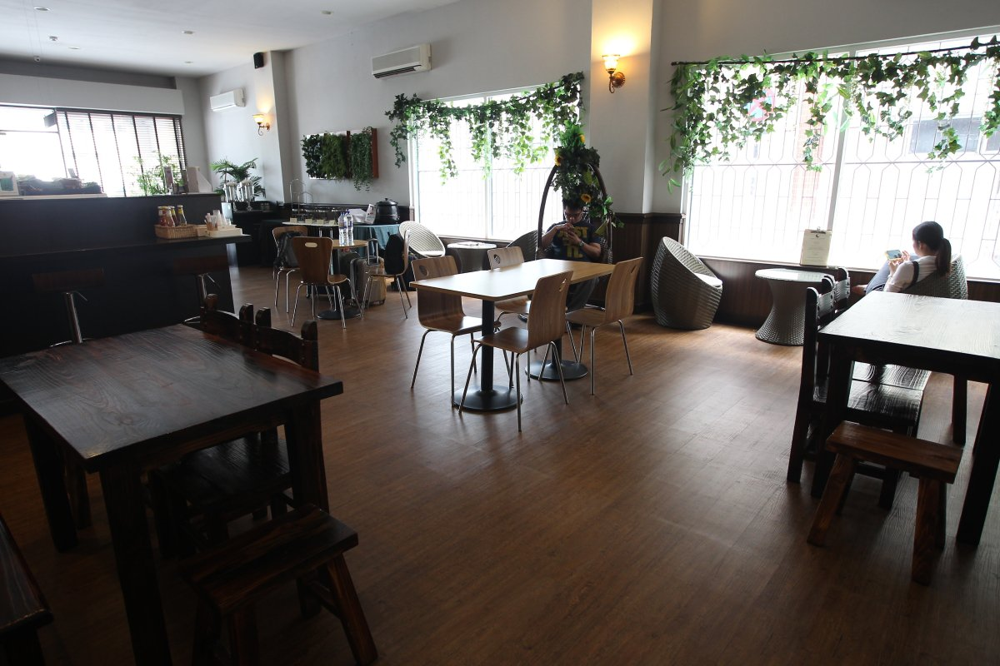

記者以“旅客”身份到訪汶萊，曾向店員求證是否真的不能堂食，店員都會面露難色，嚴正重申：“no”，但卻可入內休息，並借用餐廳內的廁所，到裡頭“喝水”。（圖：星洲日報）

伊斯兰党多次尝试在国会提呈私人法案以便为推行伊刑法铺路，引起华社的极大反弹和抗议。在10月份即将召开的国会下议院会议，相信该党会继续提呈这项法案，展示其不到黄河心不死的决心。

在东南亚，汶莱是第一个全面落实伊刑法的国家。今年7月正好是它落实伊刑法以来的第二个斋戒月，也是第二次全面实施“禁止公开进食令”的斋戒月，这样的禁令对非穆斯林居民与游客，造成什么程度的冲击？

当地商家与旅游业如何调适？

或许，参考汶莱这一落实伊刑法经年的国家，再对比跃跃欲试的大马，我们能从中理性的分析，这套法律究竟是否适合马来西亚。

是迷思？还是事实？让星洲日报记者，带你走进汶莱，看看这里的伊刑法对整个社会，尤其是非穆斯林的日常，有什么样的影响。

落实伊法让人感神秘

汶莱是亚洲首个落实伊斯兰法律的国家，包括极具争议的伊斯兰刑事法，其国土所有人都必须在尊重伊斯兰教义大前提下，以穆斯林的生活模式为标准。汶莱凭着取之不尽的石油而富，人民丰衣足食，伊斯兰法律是汶莱治国安邦的国法。

这里不注重旅游业，境内旅游景点乏善可陈，对国际游客而言，汶莱绝对不比沙巴神山、砂州国家公园、新加坡赌场、泰国沙滩更具吸引力。就因为她不着重于旅游业，对外提供的旅游资讯又少之又少，自然让人对汶莱产生神秘与幻想。

就地理位置而言，她位于婆罗洲岛西北角，国境以北连接林梦、南面则可直达美里，从北走到南不过3小时的车程，沿岸一带的海景尽是喷着高温火焰的钻油台与炼油厂。

自大马伊斯兰党坚持落实伊刑法以来，我们就被“伊刑法究竟会带来什么影响？”的疑云笼罩，也让大马人好奇，已经正式落实伊刑法超过两年的汶莱，究竟当地人民过着怎样的日常生活？

近几年，我们不时于斋戒月期间在新闻上，看到一些学校安排或强迫非穆斯林学生到厕所、更衣室或储物室喝水、用餐的新闻。每当登上新闻版面，非穆斯林总会愤慨地表达不满，甚至穆斯林也会站出来为非穆斯林说话，认为校方在处理这种事件上，忽略非穆斯林的感受，当然最重要的是，教育部也会勒令校方小心、持平处理投诉事件，并确保不再重犯。

非穆斯林公开饮食照罚款

马来西亚是世俗国，伊斯兰虽然是官方宗教，但大马是个多元种族、文化、宗教信仰的国家，并基于宪法下所强调的公平理念，政府在实施、落实任何法令或政策之前，必须平衡地考量各种族国民的感受与需要，同时保障所有国人各方面权利。

然而，就在与我们比邻的邻国——汶莱，情况却有所不同，或说正好相反。

汶莱于2014年正式开始分阶段落实伊斯兰法，虽然当年这项宣布在国际上引起争议，甚至西方媒体对此展开猛烈抨击与抵制行动，但是汶莱政府依然执意落实伊刑法，而且其执法范围涵盖、影响该国的非穆斯林。

伊刑法在汶莱分阶段落实后，该国法令不再维护非穆斯林在斋戒月期间自由进食的权利，反而派出执法人员对在公开场合进食的民众，即便游客也一样）进行取缔。无论穆斯林或非穆斯林于斋戒时段，在公共场所包括餐厅、咖啡店或食摊等饮食及抽烟，不尊重斋戒月者，可被罚款不超过4千汶币、监禁不超过1年或两者兼施。但当地人告知，一般上“偷吃”罪成将被罚款300汶币（约900令吉）已有不少人遭到惩处。

如果大马也落实伊刑法，试想这种情况若出现在我国，那将是何等悲哀的景况。

斋戒月游汶莱很不便

汶莱的风土人情、语言都与马来西亚的“小地方”相似，在汶莱街头游走，偶尔甚至会忘了自己身在国外。这里的马来语和马来西亚的特别像，比印尼还像。确实，在语言上汶莱予以马来西亚人浓浓的亲切感，但这样的一份亲切感，在每天早午晚三餐进餐时间到来时，被冲刷得很淡，很淡。

只能躲进厕所偷喝

身为非穆斯林（尤其是游客），汶莱的斋戒月实在很不方便，早上起床后，已经进入斋戒时间，只能打包食物又再折返酒店房间。

汶莱的天气与马来西亚一样酷热，30多度的大热天，以游客身份在汶莱首都斯里巴加湾“访问”的记者们，去了几个地方，口干舌燥，却只能躲进厕所，贪婪地大口多喝几口水。

在汶莱，斋戒月期间的非穆斯林需躲进厕所，甚至是厕格（没人看见的地方）喝水，并不会被定义为“委屈”，也不会登上新闻版面，相反地若“公然喝水”被看见，你就有被放大在显微镜下，在社交媒体上、在法庭上被审讯。

禁令给餐馆极大杀伤力

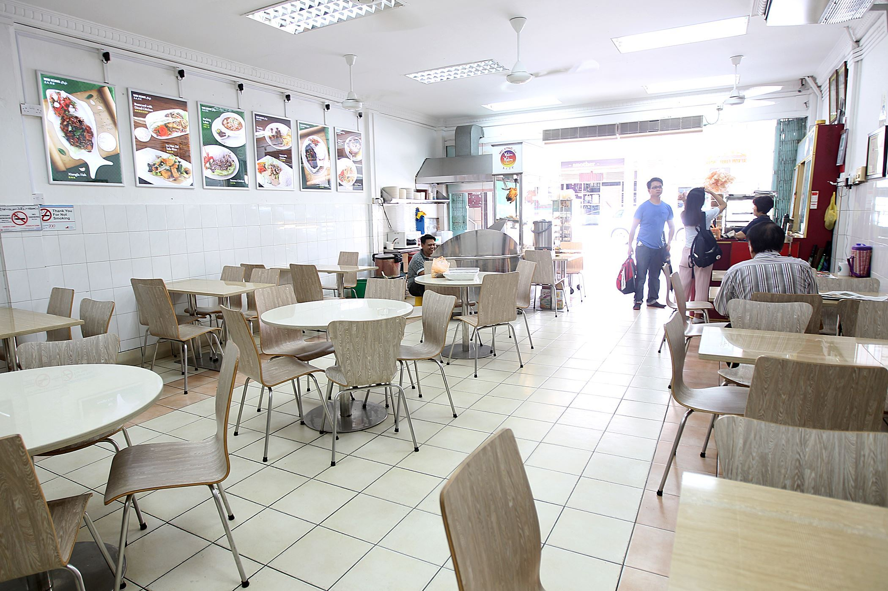

有餐厅店主告知，汶莱斋戒月期间，餐厅生意量会下滑80%，言谈间透露着对禁令的不满。餐厅内只见等待打包食物的客人。（图：星洲日报）

除了生活、生理上的不便，这项禁令的落实，其实对商家的业绩也带来了极大的杀伤力，尤其是经营餐馆生意的商家。

2015年，是汶莱第一年落实，餐馆在斋戒月期间不能开放堂食的政策。

我们在午餐时间前往一家华人餐馆打包食物，餐厅老板娘说：“今年斋戒月，生意量下滑了80%，比去年严重很多。”

老板娘说，或许去年，游客还不清楚这项法令，所以依然在斋戒月期间到汶莱来，因此受影响幅度较少。而2016年，法令落实的第二年，其执行的严谨度，让大家“敬而远之”。

在汶莱逗留期间记者多次与当地民众聊起这事，大家都已肯定的口吻说：“是的，不准堂食，只能打包。已经有很多人被开罚单了。大家都可以拍下你吃东西的照片，告发你。”

餐厅改“黑”偷做堂食生意

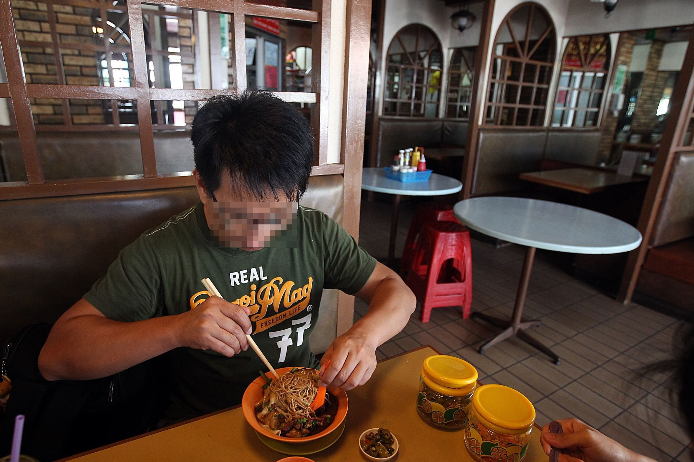

汶莱所有餐厅大摆“空城”的境况，在我国堪称“奇观”；饥肠辘辘的我们意外遇见一家“阳奉阴违”的华人餐厅，让我们“躲”在餐厅内指定的视觉死角位置，冒险进餐。（图：星洲日报）

生意量下滑的情况相信不只是以上这家华人餐馆，记者还曾到另一家餐馆，相信是要保住生意量，而冒险秘密开放堂食。

那是星期五中午，汶莱法令规定每星期五，穆斯林前往清真寺祈祷期间，所有政府部门、机构、商店等，由中午12时休业至2时。我们赶在餐厅休业前，前往另一家华人餐厅预备打包午餐，惊讶地发现该华人餐厅内有人在用餐。

视线死角 取缔风险低

那是一家冷气、售卖猪肉餐点的餐厅，玻璃门是黑色的，里头灯光略显昏暗，但是凑近一些，隐约还是看得到里头的情况。我们对有人堂食的情况感到惊讶，于是向店员询问。

“可以堂食？我们也可以吗？”

店员表示可以，但只可坐在餐厅内特定的一个角落。后来发现，那是个视线死角，由外头看不清楚那角落的情况，再加上那是一家售卖非清真食物的华人餐厅，一般上穆斯林不会踏足，因此被取缔的风险较低，餐厅老板才敢铤而走险。

餐厅内另一桌的食客（两名华人大叔）说，这是上有政策，下有对策，叫我们不用担心，放心吃。

另外，记者也遇上一名小吃档的华人业主，他抱怨说，对非穆斯林而言是不公平的政策，无奈政府强硬落实，人民也只好乖乖听令。

◎汶莱小档案

根据2014年人口统计，汶莱人口约42万，其中持绿色身份证之外籍人士约10万人，马来人口约27万人，华人为国内第二大族群，约4万5千人，占11%。但因华人年轻一代生育率降低，致华人占国家人口比率逐年下降。

汶莱在1929年于境内马来奕县─Seria发现石油而突飞猛进，现为东南亚第3大石油生产国，凭藉石油及天然气的收入，2013年平均国民所得约5万4800美元，国民享有免缴个人所得税及免费医疗、教育等多项福利措施。

◎多懂一些 汶莱落实伊刑法后的禁令：
●禁止传播任何宗教信仰
●禁止侮辱伊斯兰先知、可兰经、伊刑法
●禁止发表或作出侮辱苏丹、政府宗教机构、官员的言论或行为
●禁止通过网络，包括微博、微信、WhatsApp等传播针对伊斯兰和伊刑法的任何谣言、评论
●避免在穆斯林面前崇拜明星、人物、动物等
●避免在公开场合使用设计伊斯兰的固定词汇。（包括问候语）
●禁止在国内或国外的公开场合饮酒
●不得向穆斯林提供、推荐、售卖酒精饮料
●斋戒月期间，避免公开场合饮食、吸烟、买卖可现场消费的食品
●每周五中午12至2时，穆斯林必须到清真寺祈祷，届时餐厅、店铺等将停止营业
●雇主不得限制穆斯林雇员按时祈祷的权利
●禁止与穆斯林女性发生未婚或婚外性关系，或引诱穆斯林女性私奔
●避免与容易引起嫌疑的未婚男女独处或同居
●公开场合尽量保持距离，避免拥抱、亲吻等过度亲密行为
●避免穿着异性服装或模仿异性工作、神态
●避免在公开场合穿着曝露（女性建议穿长袖衣裤）
●偷盗、抢劫、强奸、通奸及谋杀等犯罪行为将根据伊刑法进行审判

春节舞狮处处限制·汶莱伊刑法冲击非穆斯林

在这里，清真寺祈祷声响彻大街小巷，路上是豪华进口车，没有捷运地铁；巴士与德士等公共交通班次，比飞机航班更少。

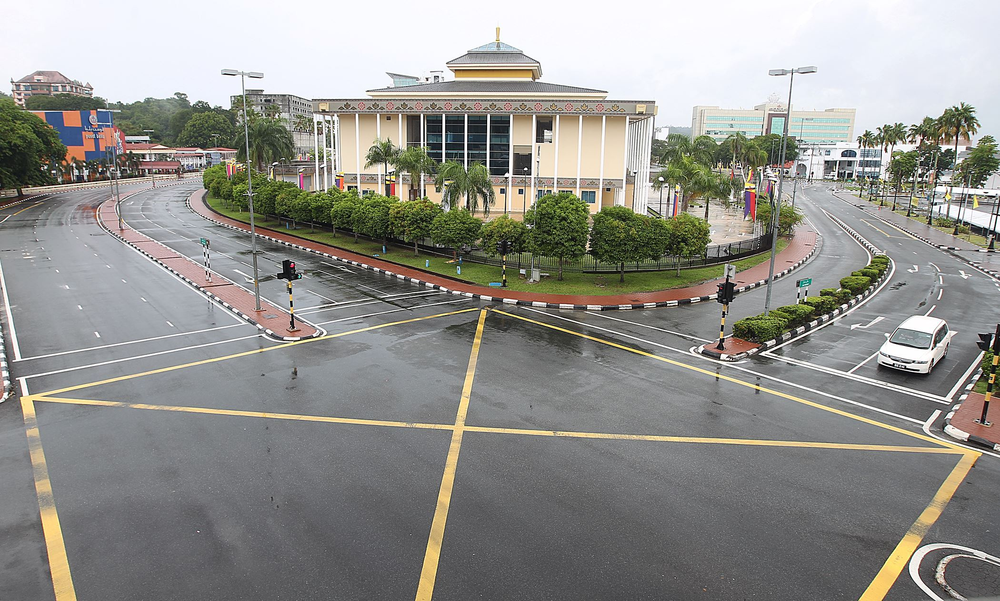

每逢星期五中午12时至2时，汶莱首都像停顿了一样，路上不见人烟，即便是平日最热闹的市中心也一样。（图：星洲日报）

作为世界上少见政教合一的君主制国家，外人看汶莱总认为那里有着童话故事般风采：斯里巴加湾常见宏伟的金顶清真寺、最热闹的商业金融中心保留大片绿野，建筑物停留在上世纪的设计模样，如此简朴低调，就连最具规模的购物中心，却比不上雪隆任何新开的购物广场。

在这里，清真寺祈祷声响彻大街小巷，路上是豪华进口车，没有捷运地铁；巴士与德士等公共交通班次，比飞机航班更少。

在这个落实伊刑法的国度，汶莱治安虽不至于夜不闭户，但平日倒甚少发生重大的刑事案，多数是赌博、入屋行窃、伤害及非法移民等。

据截至2013年数据，汶莱每1000人口中，仅有16人有犯罪记录，治安良好是外国人对汶莱所称许的正面印象。

然而值得思考的是，汶莱的低罪案率，到底是因为汶莱苏丹与人民共享国家财富，因此不必作奸犯科来求存？

还是伊刑法严酷刑罚震慑了民众丶让百姓都奉公守法而不敢有任何违法行为，免得落个断了手掌、被乱石掷死的下场？

断肢法石刑 伊刑法施於所有人

伊刑法是汶莱的法律，施行在每一个人身上，不管是不是穆斯林，绝对不可能像大马一些人所倡议的“一国两制”。

非穆斯林不能提伊教义

一名要求匿名的汶莱华人受访时说，这里的华人是挺为难的，虽然不用像穆斯林女性般戴头巾，但出门也不能穿得太随性、不能在外头喝酒；周五穆斯林祷告时，华人的餐厅不能营业，非穆斯林不能讲到伊斯兰教义的字眼，包括真主之类的，如果讲到的话会被罚款和坐牢。

在这里涉及穆斯林和非穆斯林的案件，一律用伊刑法执行，非穆斯林的刑罚一样有砍手、石刑，这对非穆斯林来说是人权侵犯和宗教侵犯。

汶莱现任苏丹是哈桑纳博尔基亚，在位至今48年，2年前宣布分阶段落实伊刑法，一如去年，今年境内所有餐厅都不准在斋戒月期间，让顾客堂食，只能外卖带走，就连非穆斯林也受限，理由是“尊重穆斯林斋戒，在他们面前饮食是在考验他们斋戒的决心。”

为了表达抗议苏丹把习俗和其思维强迫实行在其它宗教上，汶莱苏丹在外国持有的酒店已经受到外国的巨星大亨和名人杯葛，全都不会入住这些酒店，直到汶莱苏丹肯放弃伊刑法。

自苏丹力排众议落实伊刑法后，汶莱成了国际媒体的“新宠”，三不五时便有与伊刑法相关的新闻登上版位。

这名不愿具名的汶莱人说，媒体从来没有报道过有人在伊刑法下受审判，也没有听人家说过。法律是有了，但没有真正执行过，一提到汶莱，人人都知道这里有断肢法，有一定心理压力，就不敢乱来了。

非清真罐头食品，只能在一些华人经营的商店购得，这类罐头被放在特别划分的区域内，以避免混淆。（图：星洲日报）

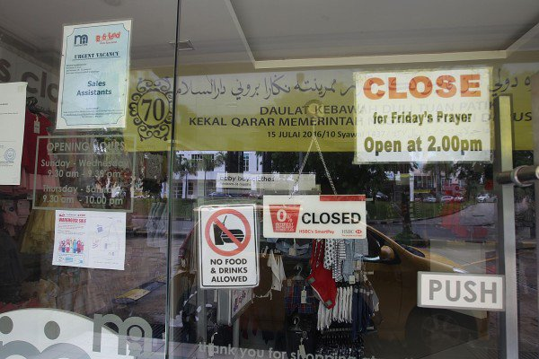

每周五的中午12至2时，是穆斯林到清真寺祈祷的时间，汶莱所有政府部门、商店都必须暂停营业。（图：星洲日报）

禁公开庆祝圣诞节

看到汶莱目前的情况，或许就不难理解华社强烈反弹伊斯兰党一意孤行欲在大马落实伊刑法。

马来西亚福建社团联合会（福联会）发起“坚决反伊刑事法，捍卫联邦宪法”签名运动，巡回全国各地以收集100万人签名，并将於10月国会复会时，提呈给222名国会议员，表达华社坚决反对落实伊刑法的决心。

这是因为一旦伊党主席拿督斯里哈迪阿旺所提呈私人法案，即修正355法令并扩大伊斯兰法庭权限，一旦获国会通过，将严重影响联邦宪法第8条文赋予全民在法律前，享有人人平等权益的保障；非穆斯林不能置身度外，认为私人法案仅提高伊斯兰教法庭的判决权限，并没有影响到非穆斯林权益。

纵使伊党与福联会对话，解释私人法案内容与伊党的本意，签名运动仍在全国各地巡回，累积签名逼近百万人，人人对修正法案後对产生的未知效应，乃至对民族未来与国家发展都感到忧心忡忡。

事实确实如此。汶莱自落实伊刑法以来，有太多新政策都对非穆斯林社群带来实际冲击与影响，纵使在41万汶莱总人口中，约三分之二为马来人，华人只占总人口9%。

去年，汶莱政府宣布，禁止该国人民公开庆祝圣诞节，原因是这个来自西方的节庆，使用具有宗教意义的十字架、蜡烛、竖立圣诞树、唱圣诞歌、传达圣诞问候语，都违反了伊斯兰信仰。穆斯林装扮成圣诞老人是犯法的，罪成可被罚监禁5年，圣诞老公公顿时沦为阶下囚。

基督徒怎么办？汶莱政府说，他们可以庆祝，但“不可过度和公开”。虽然国际社会纷纷谴责，但汶莱政府立场强硬，警告外国政府不要干预内政，于是汶莱的圣诞节冷清清，一些基督徒宁愿出国欢庆。

大马每逢圣诞佳节，随处可见高耸的圣诞树、灯饰、圣诞老人……气氛温馨、欢腾。然而这一切在汶莱都是禁忌，在落实伊刑法的国度，各族人民都失去了公开欢庆佳节的自由与权利。（图：星洲日报）

春节舞狮限3天3地点

农历新年也不好过，今年，汶莱政府对该国华社颁布一项指示，即新春期间的舞狮，只限在年初一至初三出外采青，同时只限在3个地点，即汶莱唯一的华人庙宇――腾云殿、学校及华人社团的会员住宅。

同时，舞狮活动不可在酒店、餐厅、商业大厦和公共场所进行，舞狮采青也有时间限制，遇到祈祷时间也须休息，以示尊重。

其它对舞狮活动的禁令，如舞狮表演时不可燃放烟花及爆竹，且舞狮成员必须是华裔。汶莱政府也禁止欲举办新春联欢晚会的华人社团，在晚宴上呈献舞狮和舞龙表演，或任何违反汶莱风俗礼仪的活动，这包括迪斯哥舞蹈、交际舞、由模特儿呈献的服装表演和走猫步。

内政部也禁止晚宴以售票形式进行，募捐或任何赌博性质的游戏、轮盘游戏等都被禁止。

除了播放贺岁歌曲，吃喝完毕后静静散去，他们还能在新春团拜活动上做什么？如果非穆斯林不遵守这些指示，将受到法律行动对付。

华校必修爪夷文

汶莱的教育体制实行双语政策，即马来文和英文，然而政府也允许华校（小学、中学）的存在，但华校除了可以上华文课，近几年开始必修爪夷文。

与记者交谈的华裔老夫妇说：“这是近几年才实施的教育政策，我们的小孩以前并没有上爪夷文课，但孙子们现在却都需要修读爪夷文。无论是华校生或其他源流的学校都一样。”

虽然目前汶莱教育体制强制所有学童必修爪夷文，但据悉并没有强迫非穆斯林研读可兰经。

每周五中午12至2时 汶莱像“死城”

除了斋戒月，汶莱全国陷入缓慢的生活步骤之外，每逢星期五中午12至2时，汶莱就像掉入时间的黑洞一样，彷佛整个城市静止了下来。当地华裔民众向我们形容：就好像“死城”一样。

确实，上午11时开始，我们看到民众纷纷前往餐厅打包午餐。12时整点，所有商店、行政中心、餐厅，都拉闸关门休业。路上的车辆也开始渐渐减少，约1时左右，即使是在汶莱最大的城市——首都斯里巴加湾市中心的交通枢纽，不仅路上不见人烟，车辆也仅三三两两。

至于未能履行周五祈祷、不尊重斋戒月、不雅举动、在公共场所男扮女装或女扮男装、唆使已婚者离婚或不履行对配偶或子女的义务、诱骗穆斯林女子逃离父母或监护人等，也将被惩罚；涉及堕胎、通奸、肛交、致伤、伪造指控和企图自杀等罪行，在次阶段逐步落实，包括以丢石头处死通奸者、偷盗者被断肢、堕胎及喝酒者将遭鞭笞。

汶莱逾90%收入来自石油与天然气。天然资源赋予汶莱富裕的先天条件，让汶莱有别于周边的国家，有“本钱”在确定推行伊刑法上，不用看人脸色，不必靠外国游客增加收入。

人民福利措施完善

汶莱在国际上被誉为“东方石油小王国”，其富裕的程度在国际经济成绩单上也名列前茅。其完善的福利措施，如终生免费医疗服务、免费教育（包括大学，甚至为大学生提供生活津贴）、免所得所、入口税……等，让人民对苏丹极为顺从。

虽然星期五中午休业、斋戒月非穆斯林也不可以公开用餐等政策在落实初期，确实引起抱怨的声音，但人民还是很快地适应并接纳苏丹所颁布的御旨。

更何况，以汶莱华人只占总人口9%的情况而言，即使发出反对的声浪，相信也只是水中涟漪，稍纵即逝。

政府禁建华人神庙．百年腾云殿汶莱唯一

汶莱地广人稀，全国人口约40万人，穆斯林占了人口的67%，佛教徒13%，基督徒10%，以及其他宗教信仰者10%。汶莱超过30%的非穆斯林是否依然享有宗教自由？汶莱有没有庙宇、基督教堂？

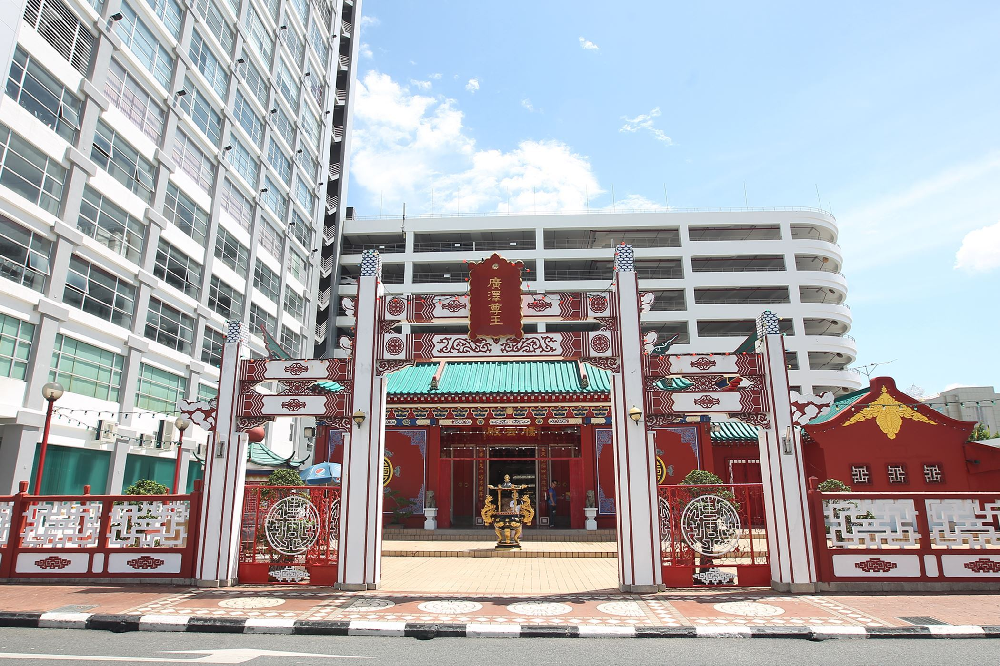

“腾云殿”四周环绕着建筑风格新颖的高楼大厦，这是汶莱前苏丹下令以保留，汶莱国境内唯一的华人神庙。（图：星洲日报）

汶莱西部的诗里亚，自1929年发现数亿桶的油田后，这里从农业国变成超富有的石油国，在石油价格高涨时代，汶莱成了区域国家羡慕不已的国度。

因为有石油做经济基础，汶莱成了真正的福利国，无论打工经商、买车置业、日常买卖都不用缴税，政府用取之不尽的石油收入让全民享有免费教育、生病了还有国家付费治疗、每年斋戒月时大开国库，为国内所有弱势群体派给数万汶币的援助金，最少都拿到4000汶币，新闻与图片占据该国各语文报章封面与内页，人人对汶莱皇室感恩戴德，伊刑法反而显得不太重要了。

不再发新准证 仅有3所大教堂

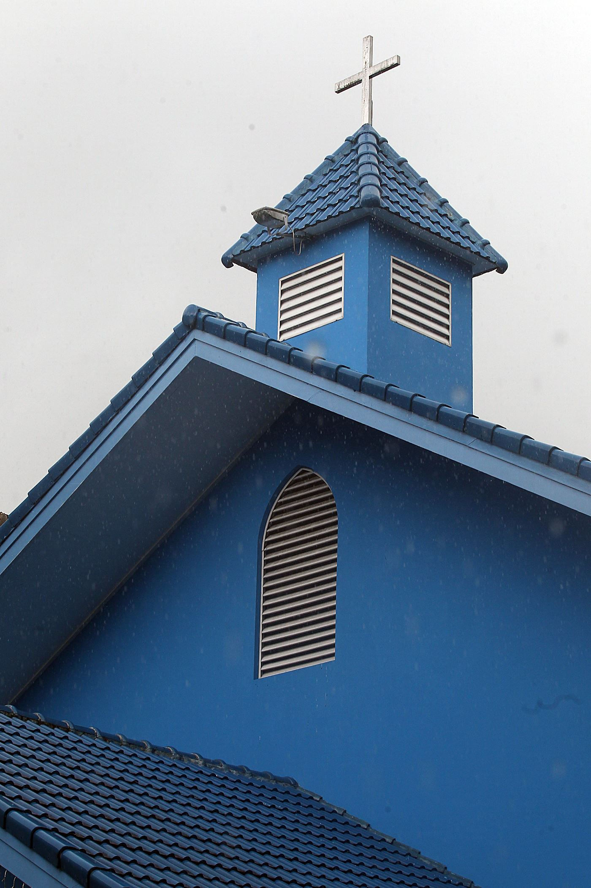

汶莱国土内有3座教堂建筑物，教堂的顶端都耸立着十字架，但教堂外观并没有任何宣扬基督教的标语。（图：星洲日报）

不过在日常，汶莱基督教徒对伊刑法的感受特别深刻，较早前有汶莱网民在社交媒体上贴文，要求美里市政府拆教堂的新闻，在马来西亚的新闻版面闹得沸沸扬扬，该网民认为美里市内的教堂不顾汶莱穆斯林的感受，在教堂外展示赞美耶稣、上帝的标语，是不尊重穆斯林的表现。

这起小风波经已落幕，然而汶莱超过30%的非穆斯林是否依然享有宗教自由？汶莱有没有庙宇、基督教堂？

汶莱地广人稀，全国人口约40万人，穆斯林占了人口的67%，佛教徒13%，基督徒10%，以及其他宗教信仰者10%。记者在华人餐厅购买食物时，遇见了一对来自砂拉越州，在汶莱生活了55年的老夫妇。老夫妇是基督徒，于是谈起了汶莱基督教徒的状况。

老夫妇说，汶莱较大的教堂只有3间，即圣安德鲁（圣公会）、圣乔治（天主教）和圣约翰（位于马来奕）。

旧有教堂准证可获保留

“政府已经不会再发出新的执照建新教堂，而这之前就建有的教堂或教会执照则可获得保留。”

老夫妇去的教会并不是独栋典型的教堂建筑，而是店屋式教会。他们说，店屋式教会的准证虽也获得保留，但却也只能保持原状，不能申请扩建成教堂。换言之，汶莱全国仅有三栋拥有独立建筑物的教堂，而且不会增加。

记者亲身前往位于汶莱首都斯里巴加湾市区的圣安德鲁和圣乔治，发现2所教堂位于伊斯兰刑事法庭斜对面的一条岔路上，相互对望，只有几步路的距离。

教堂建筑物顶端都悬挂着十字架，墙上未见任何基督教标语。记者在星期五中午前往，由于圣乔治教堂是天主教堂，因此当时有不少天主教徒在教堂内进行弥撒，圣安德鲁则一片宁静。

户外购物中心禁圣诞装饰

老夫妇说，汶莱的基督徒被允许在教堂内或自家“低调”地庆祝圣诞节，惟不获允在户外或购物中心等，布置圣诞节装饰、送圣诞卡……否则将被指冒犯穆斯林，甚至触法，因为汶莱的法令并不允许宣扬伊斯兰之外的宗教。

伊刑法也规定非穆斯林不可向穆斯林或无神论者宣教。犯罪者可被判罚款2万汶币，或监禁最高5年，或两者兼施。

除此之外，汶莱政府也与我国计划落实伊刑法的伊斯兰党看齐，宣布19个单词专属伊斯兰，禁止非穆斯林使用，这项禁令也限制了该国基督徒使用马来语版圣经的自由。

前苏丹下旨永久保留 仅一华人神庙受承认

除了基督教，汶莱也有不少华人信奉佛教和道教。

但是，全汶莱只有一间百年华人神庙——腾云殿是受政府承认的庙宇。当地居民告知，除了腾云殿，汶莱当地也有一些住家式的神坛或佛坛，但是都没有获得正式注册，一旦遭到告发，执法单位将上门取缔并查封。

位于斯里巴加湾市坐落在市中心的腾云殿，周边环绕着建筑风格新颖的高楼，腾云殿的古色古香在该处特别显眼。而腾云殿作为汶莱最具代表性的佛教膜拜场所，是汶莱佛教徒相当重要的精神寄托，因此百年来香火鼎盛。

不允许兴建新庙宇

“这是唯一一间华人神庙，也是前苏丹下旨永久保留的百年古迹，也因为苏丹的御令，这间神庙才得以保留。”当地一名华裔汶莱人对记者说。

与基督教堂的命运一样，汶莱政府已经不再允许兴建任何新的庙宇。

汶莱穆斯林不庆祝情人节

节庆方面，汶莱穆斯林向记者透露，当地人几乎不庆祝情人节，情人节期间也不见花店、商场、餐厅特别配合节日推出情人节花束、礼物或套餐。甚至当地许多穆斯林年轻人都误以为，情人节是基督教的节日。

与好几名穆斯林年轻人共进开斋晚餐时，记者说：“庆祝情人节在我们国家很流行。而且那也并不是基督教的节庆呀。”

他们表情惊讶地说：“那不是基督教节庆吗？无论如何，我们没有庆祝情人节的习惯。”

或许因为情人节是西方传入的节庆文化，导致一些人对情人节背景与典故有所误解，我国的伊党也曾不止一次禁止穆斯林庆祝情人节。这样的举措，在我国被视为是伊斯兰化的手段之一，以宗教之名限制人民自由，但在汶莱却已“深入民心”。

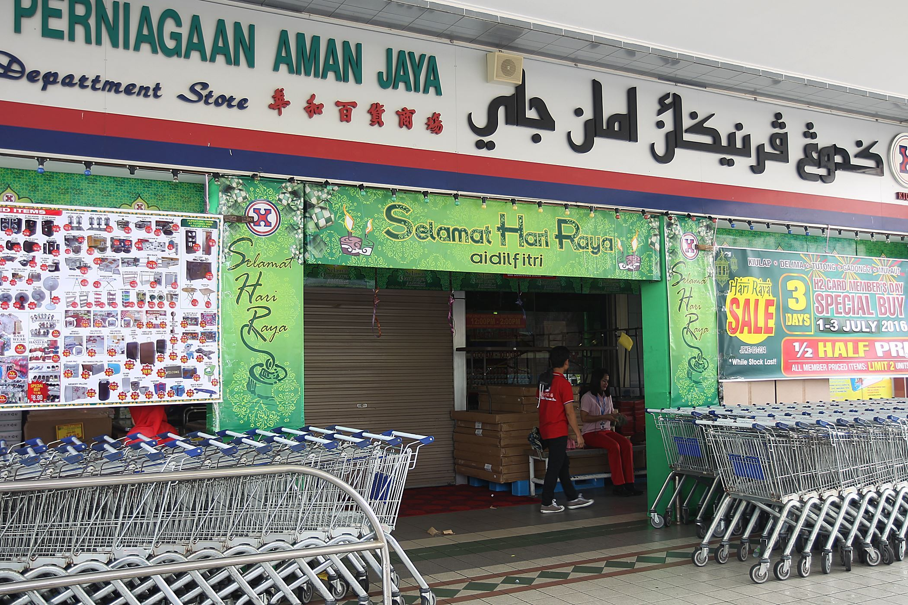

汶莱所有商店的招牌都有斗大的爪夷文。近年来，当地的学子，无论什么种族、信仰，都需要在学校学习爪夷文。（图：星洲日报）

禁穆斯林孩子交非穆斯林照顾

更多未知的禁令逐一曝光，汶莱也禁止穆斯林父母将孩子交由非穆斯林照顾，若罪成被罚款2万汶币，或监禁最高5年，或两者兼施。这项禁令让非穆斯林忧心，担心一旦改教，可能失去孩子的抚养权。

汶莱伊刑法让非穆斯林充满疑虑与忧愁。纵使已然全面落实，但由于没有任何实际案例，他们仍无法预测伊刑法对基督徒的影响程度。

在伊刑法于宪报颁布2年后，汶莱已全面落实伊刑法，包括判处死刑的法律。但迄今为止汶莱并没有真正执行过严竣的刑罚，没有人因通奸等罪名被判处死刑，政府依然倾向于引用世俗法来审理该国少有的罪案。

有报道指出，政府承认尚未有支持落实伊刑法的架构，其中缺少的就是伊斯兰法庭法官。但在汶莱于2015年度财政预算案中，提呈200万汶币的预算，充作落实伊刑法各项开支。

“落实伊刑法只是时间的问题，一旦完成这一步，伊刑法就很容易地在（地理）较小的汶莱执行了。”

“届时，很多信徒的自由将大幅度地被限制，不单单是实践信仰方面，连进行日常生活也会如此，被指控的可能性会显著上升。因此，基督教学校和有宣教意识的教会在传教时必须更加小心以免触犯反传教法律。”

无酒吧夜店卡拉OK．汶莱电影院男女同坐

由伊斯兰党执政并已于2015年通过《1993年吉兰丹伊斯兰刑事法令二修正案》的吉兰丹州，一直以来频频传出各种让人匪夷所思的行动，例如：女性理发师不能为男性理发、电影院要男女分开坐兼开灯播放电影、钟表行宣传海报太性感等。

电影院是汶莱少数被允许的娱乐场所，汶莱的电影院内，不需要男女分开坐，电影播放期间也不需要亮灯。(图：星洲日报)

由伊斯兰党执政并已于2015年通过《1993年吉兰丹伊斯兰刑事法令二修正案》的吉兰丹州，一直以来频频传出各种让人匪夷所思的行动，例如：女性理发师不能为男性理发、电影院要男女分开坐兼开灯播放电影、钟表行宣传海报太性感等。

此外，各州宗教局、伊党成员也常对我们习以为常的事情，发出“敏感抗议”声，如早前在雪州沙亚南主办的“美国小天后赛琳娜演唱会”也因赛琳娜被认定太性感，而发起抗议行动，促请当局取消该演唱会。

诸如以上种种个案不时在我国发生，让非穆斯林对伊刑法的执行越发“好奇”，若以已落实伊刑法的汶莱作为借镜，能否对照出两地之间的异同？

理发店隔开男女间．女客人由女理发师服务

不少大马人以为，落实伊刑法后，汶莱女性包括非穆斯林都必须穿着密实。然而据记者的观察，汶莱非穆斯林女性并没有围头巾，一些非穆斯林年轻女子也身穿短裤、背心外出，同时也甚少见到中东穆斯林女性式的黑色罩袍。

在汶莱从事健身教练的大马人告诉星洲日报记者，电影院和保龄球场是汶莱仅有的娱乐中心；酒吧、夜店、卡拉OK在汶莱都不见踪迹，但是汶莱的电影院其实与马来西亚一般电影院没什么差别，不需要男女分开坐，电影播放期间也不会亮灯。

至于理发店，汶莱大部份理发店只招待男客，或女客，抑或将理发店隔开男女间，女性客人只由女理发师服务，因为根据伊斯兰“TutupAurat”的教义，女性不能向丈夫或家人以外的男性展露头发，因此在分隔了男女性理发间的理发店内，男客必须止步“女性理发专区”。

另一方面，男性理发的规格则没有那么严格，星洲日报男记者前往汶莱斯里巴加湾市的时代广场（Time Square）洗头时，是由一名“洗头妹”（菲律宾女性）服务。据观察，该理发店的“男性理发专区”所有理发师都是男性，但当地人告知，只要男性顾客不介意，其实女性理发师也可以帮男性顾客洗头、理发。

汶莱人并不会对男女性“隔间”理发，觉得有何不妥，大家对此习以为常，认为这是对女性的保护，是必要的。但这样的惯例看在大马人眼里，甚至或任何非伊斯兰国的国民眼里，都总觉得不太对劲。

允非穆斯林限量带入．汶莱难买酒精饮料

汶莱是个买不到酒精饮料的国家，惟非穆斯林获准许从国外一次带2瓶1公升的酒或12罐啤酒入境汶莱，但是从当地知情人士的口中得知，一些酒店会在顶楼开酒吧，避开执法人员眼线，秘密经营酒水生意。

也有当地穆斯林在与我们交谈时，透露自己本身经常到国外，尤其是汶莱边界的美里和林梦抽烟、喝酒。对政府利用法令规范人民的生活方式，他感到不甚满意。

这名中年司机很坦白地说：“我在这里安安份分地工作赚钱，每个月或者两个月拿个长假，或者趁长周末出国旅行，有什么难？隔壁就是林梦和美里，要不就出国，汶莱人常去万隆、香港、曼谷。苏丹不给我们做的事，我们就到外国做，有什么难？”

他的话不夸张也不造假，从汶莱油田开取区取道马来奕县前往美里的路上，在衔接汶莱与大马的边境处，很突兀地出现两排店屋。这两排店屋与美里关卡的距离大概一两公里，人烟甚少。路旁的招牌，除了“XXX按摩院”、“YYY不夜城”、“ZZZ酒店”……别无其他。

汶莱边境“春色无边”

店屋不见热闹的生意门面，但只有丰胸长腿的性感女郎或坐或倚在门边，2名穿着紧身衣、超短裙的女郎，更穿越等待过关卡的车龙，一路扭腰摆肢地招摇过市，引人注目。其实以汶莱边境那么“春色无边”写照来看，似乎泄露出即使是伊刑法也无法禁止的酒色。

人类的欲望是最无法禁闭的，另有一名受访者掏出智能手机，随便点开几个“约炮软件”，里面弹跳出来多少痴男怨女，遍布整个汶莱。根据伊刑法，通奸者处石刑、偷窃者砍手，饮酒和堕胎，将遭到鞭刑伺候。然而，以在汶莱国内盛行的“约炮软件”来看，只要用手指头轻轻点击手机屏幕，就能轻易叩开情欲大门，更别说那些设在私人场所的酒吧、边境的按摩院。

汶莱的路上、商场内，偶尔亦可看到穿着女性化的男子，或穿着男性化的女子，似乎法令（在公共场所男扮女装或女扮男装，罪成将罚款不超过1000汶币，或监禁不超过3个月，或两者兼施）的执行，目前仍处于宽松阶段。

纵观以上种种情况，已经正式落实伊刑法的汶莱政府，其“敏感度”其实并不会比伊党目前在执政州属（尚未落实伊刑法）的情况严重很多，甚至不相上下。也基于此，让人不禁担心，若马来西亚真的追随汶莱的步伐正式落实伊刑法，其严格度会不会有过之而无不及？

汶莱仍用旧惩处方式．偷窃罪没落实断肢法

其实，汶莱民众对伊刑法的落实并没有太大感觉，普罗大众甚至并不清楚伊刑法目前已经落实到哪个阶段，据悉偷窃等刑事案，仍采用过去的罚款等惩处方式，还没有落实断肢法。

根据民众的说法，汶莱苏丹要落实伊刑法的目的，只是想要给穆斯林一个生活规范，而不是要残忍对待人民，因此迟迟没有落实断肢法。问起相关课题时，大家都说：“没那么容易执行。”

或许汶莱在落实法令上，尚有许多技术上的问题未解决，导致仍无法完全实践严苛的刑罚，因此在正式落实伊刑法两年后，汶莱依然处于逐步强化其实践度的过程，导致大家并不自觉伊刑法的效应。

然而“没那么容易执行”并不代表政府就会放弃执行，毕竟谁也无法否认汶莱的“施法列车”，正开往将伊刑法发挥得极致的方向。而既然列车已经启程了，那总有一天，会到达目的地。

禁赌禁酒令等实行．丹已变成小汶莱

汶莱因落实伊斯兰法律而实施的各项条规，早就在吉兰丹执行多时，从早期的禁赌、禁酒令、强制商店在周五祈祷时段关门、强制商店在重要的节庆全日休假，到后来对没有规定女穆斯林穿上符合教义衣服的雇主开罚单、也惩罚替男顾客洗头剪发的女员工，这些已然执行的事，将吉兰丹变成了小汶莱。

附表是吉兰丹州政府与地方政府执行伊斯兰法律后，对商家与民众的具体影响案例，对比汶莱已落实的伊斯兰法律，其中的相似度是非常接近，甚至有过之而无不及。

既然已有先例，这些在吉兰丹落实的伊斯兰法律特质，是否将会在未来进一步扩大至全国，这是全民必须深思与筹谋应对的事。

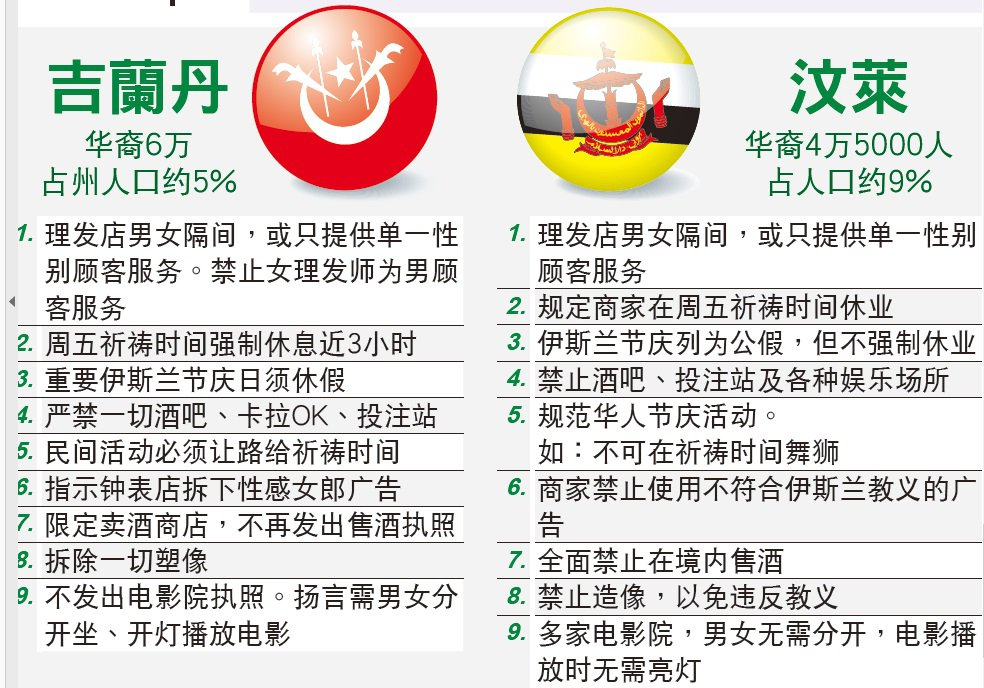

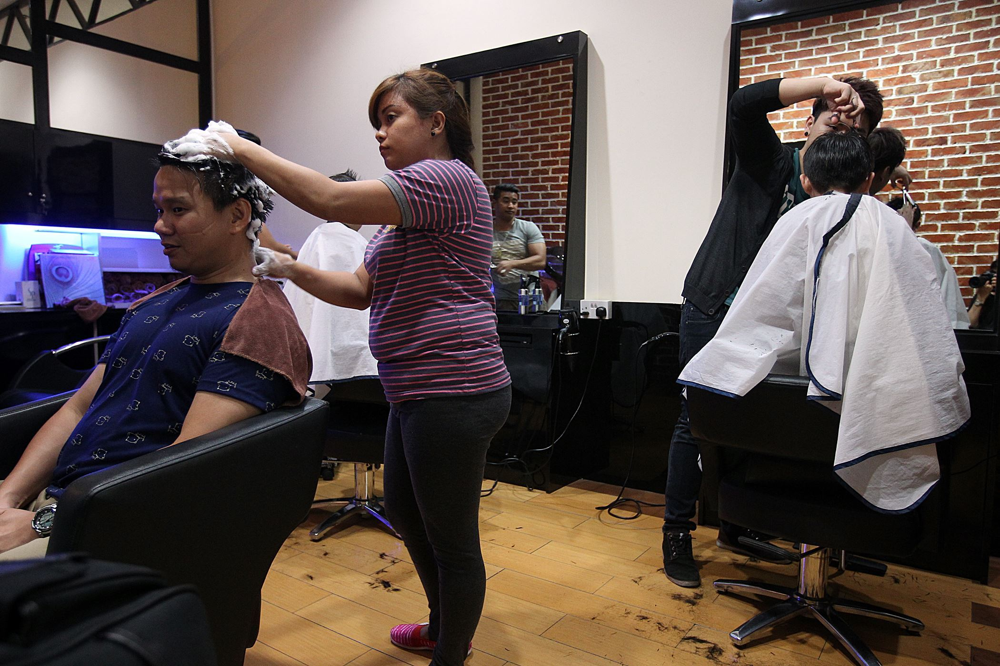

在汶莱，若男性顾客不反对，女性可以为男性洗头、剪发，但男性为女性提供相同服务，却是不寻常的。（图：星洲日报）

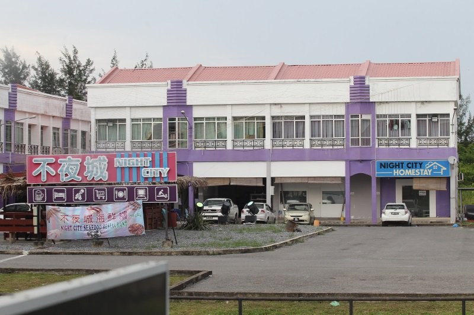

汶莱进入美里关卡的位置，出现了两排店屋，该处人烟不多，除了几辆停泊的车子，只在楼梯口、路上见到几个性感女郎，摇曳生姿。而营业的除了酒店，就是按摩院、KTV等娱乐场所。（图：星洲日报）

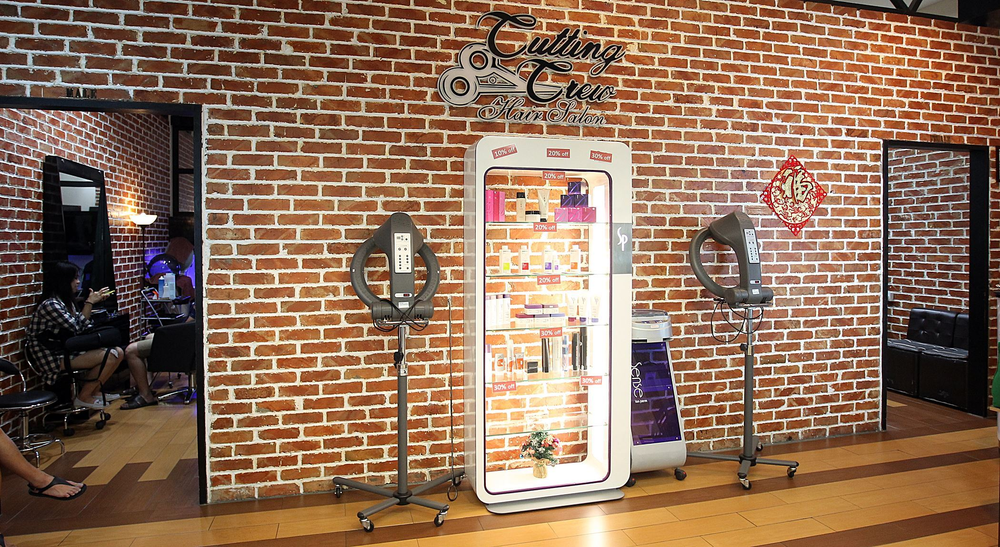

一般上，汶莱的理发院都会以“男客”及“女宾”隔开两个空间，“女客间”男人须止步，“男客间”则较无设限。（图：星洲日报）

[Source](http://www.sinchew.com.my/node/1571249)

----

穆斯林果然有当上等人的本能！

宗教大多数都是以要求别人都信自己为目标的，只是有些后来改革了

让他们占多数就是这个下场

只怕最后说非穆呼出的空气不清真，这就有意思了

所谓的封斋只是白天中午不吃饭，一到了晚上还不是大吃大喝[笑cry][笑cry]……如果相信真主是全能的，先饿三天表示虔诚，看看真主会不会现身打救？……宗教是律己的，律他人的统为邪教！

妈的，这是公开侵犯人权，人权组织呢？国际法庭呢？

中国永远捍卫世俗社会，让疯狂的宗教始终呆在家里自娱自乐，不得外出半步。

清楚了吧，穆斯林占多数的时候，所以懂的

我在文莱待了4年，文莱确实变得越来越保守了。不过普通年轻一代的文莱穆斯林也没那么多讲究，非常世俗。一起健身的一些穆斯林肌友，斋月期间我问过他们，说健身时候需要喝水怎么办？他们回答是“反正我们只能晚上练，你随便喝，没事儿”就是政府官方变的越来越呵呵

非穆国家里要求尊重他们，穆斯林国家里却不尊重非穆。真是野蛮是野蛮者的通行证。

在中国清真食品是一种软性的宗教入侵世俗手段，民X委这个机构推行高铁飞机等公众地方强制清真，更是一个幕后黑手 宗教食品入侵世俗标志非教徒被迫接受来自宗教的压迫，这是宗教野蛮地对他人自由、权利、信仰的侵犯！清真泛化标志着宗教控制经济的话语权越来越大，更别说因宗教食品衍变出的宗教执法权

中国猪年春晚不准提猪，邪教徒跑到非穆家里查抄不清真的东西 // 文莱至少还允许非清真餐厅的存在 国内某些地方禁止超市卖猪肉已经做得比文莱还极端，意图全面伊斯兰化 借“民族团结”之名行邪教扩张之实，必须打击这些邪教徒的嚣张气焰。否则，那道枷锁迟早要落在你我身上 // 让他们占多数就是这个下场

国内某些地方禁止超市卖猪肉，意图全面伊斯兰化，借“民族团结”之名行邪教传播之实，必须打击这些邪教徒的嚣张气焰。否则，那道枷锁迟早要落在你我身上。

在宁夏某些地方，汉人吃猪肉也是这样吧，是伊法治国还是依法治国？宁夏出来说说？为什么不能在伊斯兰教徒前面吃猪肉，我讨厌伊斯兰教，请他们以后别在我前面吃清真食品。

当初埃及出台法律，要求斋月期间，非穆也必须禁食，中穆网上一片叫好声

很多年前去文莱，感觉是个很友好的国家，在机场亲友接机都是拥抱互致问候。国王很亲民，深受人民爱戴。真是一年不如一年？

干扰世俗生活明显的邪教特征，中国绿化后也会如此，有过之而无不及。

欧洲花了五百年才侃侃摆脱宗教的桎梏，发展起来资本经济和近代文明，现在看来有些地方可能还需要再来个五百年
