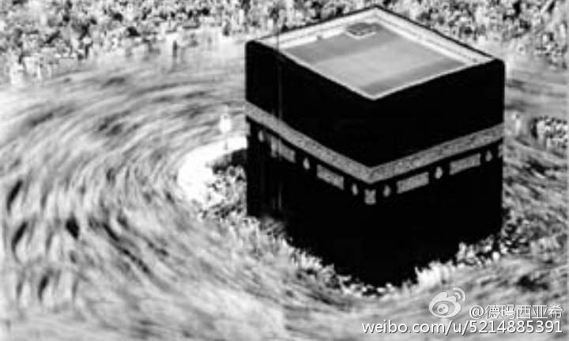

#瓦哈比派的由来及演变

* [德玛西亚希](http://m.weibo.cn/u/5214885391)
* 2015-03-12 15:34
* [原链接](http://card.weibo.com/article/h5/s#cid=1001603819594107202473)

很多人由我的微博关注伊斯兰教，有很多网友问我，伊斯兰教的瓦哈比教派是不是个极端保守的教派，是不是拒绝世俗化的教派，ISIS和瓦哈比是什么关系？我突然觉得，大家对瓦哈比教派的认识很少，甚至有误解，有必要给大家通俗的介绍一下瓦哈比教派。其实，瓦哈比教派并非伊斯兰教的保守势力，相反，他是伊斯兰教的改革派；不是拒绝世俗化的教派，相反，瓦哈比教派是世俗化过头了的教派。

可能大家对我的结论很吃惊，是不是完全颠覆了你对瓦哈比教派的看法？没关系，看了下面对瓦哈比教派由来及演化的介绍，你就会明白。

瓦哈比教派的创始者，穆罕默德·伊本·阿卜杜里·瓦哈比，是瓦哈比派的创立人，生于阿拉伯半岛纳季德地区艾知奈地方宗教世家。瓦哈比年轻时，生性叛逆，深受西方文化影响，被西方文艺复兴时期马丁.路德的宗教改革所鼓舞，倡导人权，反对神权和封建特权，倡导个性解放和自由，反对一切宗教权威和封建文化。因此，他仿效马丁路德的宗教改革，开创了瓦哈比教派。人生而平等，任何人没有支配他人的特权，是瓦哈比教派的思想基础。看到这，你是不是立刻对瓦哈比教派产生了好感？事情远远没这么简单。

由于瓦哈比教派痛恨特权，提倡人人平等，所以，瓦哈比提出两个凡是：凡是古兰经里的，都是至高无尚不容质疑的；凡是瓦哈比本人说过的话，都要严格遵守。下面发生的事情，你也许会很熟悉。瓦哈比由于其思想的先进性，倡导平等，反对特权和压迫，同时当时的阿拉伯半岛面临着帝国主义，封建主义的双重压迫，很快瓦哈比派就获得了广大中下层穆斯林群众的拥护和支持。在伊斯兰世界中，掀起了一场轰轰烈烈的文化大革命。

首先倒霉的，是穆圣。瓦哈比认为，穆罕默德及其后裔、圣徒和门宦们正是宗教权威和封建统治思想的代表，由于他们的存在和影响，鼓吹了封建道德观及特权思想，诸如：赞美穆圣，探望和瞻仰穆圣、先贤、圣裔、圣徒、筛海的陵墓，对圣裔、圣徒、筛海的追随和敬仰等都是“为主举伴”的行为；

同时，因为如上这些人的存在和影响导致了人与人之间的不平等和个人自由权力的丧失：他们的存在和影响导致了阿拉伯半岛人民面对封建统治者的统治却显得沉默和不抗争。因此，他们的存在是罪恶的。要使阿拉伯半岛人民获得解放和自由，就必须彻底打倒和铲除一切反动权威。包括四大教法学伊玛目、两大教义学权威艾什阿里和安萨里等。于是就有了后来贬损穆圣，否认穆圣晶位和能力。

轰轰烈烈的“破四旧”运动中，他们捣毁穆圣陵墓，洗劫天房内财物，大肆批斗圣裔、圣徒，把否定并抛弃四大教法学派伊玛目和教义学二位长老。他们印制了大量的绿宝书《古兰经》，倡导人人可以理性注释《古兰经》，每天背诵经文，开展大辩论，大批判等“革命”运动。由于失去了上层知识分子对伊斯兰教义的解释，普遍文化程度不高的中下层穆斯林不加辩证得接受古兰经的内容，导致原教旨主义泛滥，把一些正常的娱乐活动和传统文化当成腐杇没落的封建文化和封建迷信。于是，他们认为衣着暴露的妇女是万恶之源，让其从从到脚包起来，不准出门。音乐和其他娱乐活动认为是靡靡之音，是落后的封建文化予以取谛。只允许讼扬伊斯兰思想的经文朗诵做为娱乐。

同时，瓦哈比提倡暴力革命，鼓吹枪杆子里出政权，在打倒一切反动派和牛鬼蛇神的口号下，“反右”运动也开始了。瓦哈比教派妄断他人信仰，把一大批其他教派的穆斯林定义为“卡费勒”，并且和“保皇派”进行了激烈的武斗。导致阿拉伯各地冲突不断。

现在大家应该明白了，瓦哈比其实是伊斯兰教的左派，是激进改革派，而非保守派。由于瓦哈比派的影响，和伊斯兰世界要求变革的潮流，左派力量在伊斯兰世界逐渐成为主流，虽然很多不承认是瓦哈比教派，但是“回归经训”，生活革命化，反封建迷信（也就是反传统），反生活腐化堕落（也就是反西方文化）逐渐影响了整个伊斯兰世界。

瓦哈比派在接受了沙特国王的招安后，逐渐剔除了对穆圣的抵毁和真主人格化的内容，承认了沙里亚法，承认了天房的地位，走以沙里亚法治国的道路，逐渐成为了一个正常和非激进的教派但是“输出革命”的理念从未绝断，对伊斯兰世界的影响也并未停止。

ISIS的出现，其实是另一场伊斯兰革命，他们的做法主张完全和当时的瓦哈比派一模一样，文化上摧毁一切他们认为的“封建落后文化”，政治经济上搞绝对平均主义，宁要伊斯兰的草，不要世俗世界的苗。军事上搞恐怖主义，从思想和肉体上双重消灭异教徒（当然包括不同教派的穆斯林，IS不承认他们是穆斯林）。

伊斯兰世界的思想变化，并不是大家所认为的不思进取，反而是激烈追求进取的结果。瓦哈比派是伊斯兰革命的先行者，但是却犯了左倾主义的错误，最重要的一点是，他们想仿效西方宗教改革，推翻宗教特权和封建特权，提倡平等，但是西方文艺复兴的精髓，人文主义，却被他们丢弃！不承认自由，平等，生命是超越宗教信仰，至高无尚的权力。

要警惕右，但主要是防止左，对伊斯兰世界，同样适合。