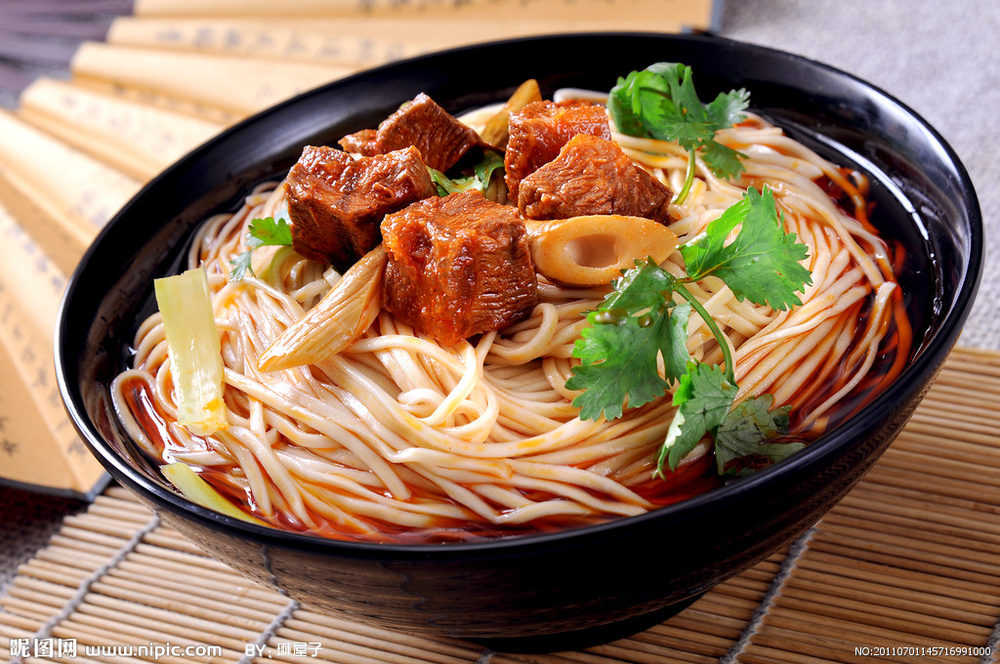

# 为什么兰州牛肉面不好吃呢？
（利益相关：不常吃拉面的回族）
* 作者: [灵异档案员王昙](http://m.weibo.cn/u/2981083181)
* 原链接: http://weibo.com/2981083181/DuJ5V7EbZ

  其实我以前也想过这个问题，为什么到处都有兰州牛肉面呢？为什么这么有名的兰州牛肉面会跟我妈妈做的拉面一个味道呢（汤有点发苦，不好吃）？我一直以为是自己的口味有问题，但后来我发现，越来越多的人跟我差不多，都觉得不好吃。

  后来我才知道，其实真正的兰州牛肉面，是非常好吃的。因为它的用料很讲究，都得按照一清（汤清）、二白（白萝卜）、三红（辣椒油红）、四绿（香菜、蒜苗绿）、五黄（面条黄亮）的标准。

  换句话说，如果你在拉面馆里看到一碗面里只有几片牛肉，一坨面条，那么很遗憾，你被骗了，这根本不是兰州牛肉面。
  
  而且更可能的是，给你做这碗面的人，根本不是兰州人。兰州牛肉面并不是一个单纯的品牌，它背后涉及到一股打着少数民族旗号的势力——**化隆拉面派**。化隆群众在全国各地开拉面馆，主要是因为当地政府的支持，化隆这个地方的回族很多，大部分回族都在全国各地开拉面馆。
  
  大家平时看到的兰州牛肉面馆，其实大部分都是他们开的，他们的店面比较小，面也比较便宜，一般面的样子，就是一碗面加几片牛肉香菜。店主和店员则都是少数民族。店员以青少年为主，这些店员大多数教育程度不足，很早就出来工作了，有的店还涉及到用童工的问题。
  
  可能有人要问了，为什么这些年轻人不在当地好好上学，要这么早出来打工呢？这个事跟当地的教育环境有关系，而且年轻人留在化隆当地，也容易引发治安问题。青海省化隆县、贵州省松桃县和广西合浦县可是我国三大**“造枪基地”**,你说这些年轻人如果留在家乡，他们会干什么？
  
  而真正的兰州牛肉面馆则与化隆出来的拉面馆不同，兰州牛肉面本身就是汉族研发，回族和东乡族一起改进推广的，所以即使在兰州当地，也有汉族人开的拉面馆，只是上面不会写上清真字样而已。
  
  真正的兰州牛肉面是很讲究的，汤、配料都有严格的规定，里面的汤汁都要几个小时来做，而且不止要用到牛肉，还会用到牛肝，牛骨头，土鸡还有一些其他的材料，熬制的过程中还会不断的把浮沫去掉，保持汤的澄清。
  
  这里面涉及到23种调料，当初研制兰州牛肉面的**陈维精**先生做过一首**《维精送子位林孙和声西行手记》**，里面把这些配料都说了一遍：“众鸟高飞尽，“桂子”独去远。“豆蔻”年华和，身强余“百倍”。春风草“木香”，“当归”怀庆府。新绿欲涌，“丁香”初开，花“香叶”茂，“荜菝”涟漪，百里林“草果”然繁盛“芳香”。路远难行，高“山柰”何？汝等避“草寇”而返苏寨。“车前”着吉服马褂“红袍”，夜宿“八角”楼，晨饮“胡荽”汤。马“良姜”行千里，遍“地黄”花时至，司碧玉书联水席相敬，“月山姜”汤“茴香”豆，烹“肉扣”碗“贵老”忙，横“披垒”灶。”
  
  （把我写饿了）
  
  所以真正的兰州牛肉面做起来比较难，用的材料比较多，价格也会贵上不少，兰州人在外开兰州牛肉面馆会得到政府扶持，但各方面要求都比较高，因为这毕竟是兰州的一块招牌。
  
  这次拉面馆被砸事件背后的势力，不用我说大家也清楚是哪帮人了吧？事实上这不是第一次了，去年就有过类似的新闻，当时被砸的是一家东方宫拉面馆，是兰州人开的清真兰州牛肉面馆……就像我之前说的那样，极端的人需要的只是一个借口罢了。
  
  地区、民族、宗教都是他们的借口罢了，说到底无非是为了欲望，比如钱，比如暴虐偏激的性格。
  
  之所以拉面馆会被砸，涉及到青海拉面协会的行规，他们内部的规定是一家拉面馆几百米内不能开设别的拉面馆，按照他们的说法，如果有别的人乱开拉面馆，那行业内部就乱套了。
  
  对这个行规，我是比较无语的，**饭馆能不能站得住脚，靠的从来不是行规，而是味道，这种行规看起来是在保护拉面馆，可其实恰恰是造成了一部分拉面馆东西难吃的原因**，我不是说所有的化隆同胞开的拉面馆里的东西都难吃，但却是很多很多人，都觉得不好吃。
  
  这里没有任何要贬低化隆的意思，只是说这套行规也好，个别化隆人砸店的行为也好，都只是在破坏化隆自己的名声而已，最后只会弄得没人去吃拉面。而且这个锅本来不该整个回族来背，却因为个别人在砸店的时候用了回族的名号，还戴着白帽……于是就变成了回族不需别人开拉面馆……
  
  **所以希望汉族同胞，不要把整个回族和部分违法乱纪的回族划上等号。也希望回族同胞在遇到这种指责的时候，能把这里面的原因说清楚，化解这种误会。**我们回族中的大部分，都是遵纪守法的好公民，我家里人在外面从来没有利用少数民族政策干过违法乱纪的事情。
  
  这种违法乱纪的行为，只是少数回族，为了个人的利益，利用和煽动民族情绪，利用国家对少数民族的优待干出来的（希望国家早点把一些优待政策分给那些边远穷地区的人们，而不是给少数民族，至于违法行为，真的没必要宽待，该抓的抓，该杀的杀就好，我身边的回族同胞都是这意思），它对汉族同胞伤害很大，对回族同胞伤害更大。
  
  而且这种腐朽的行规，也阻碍了咱们国家饮食文化的发展，希望有关部门早点依法惩处！
