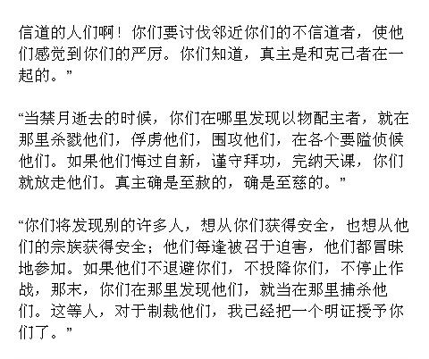
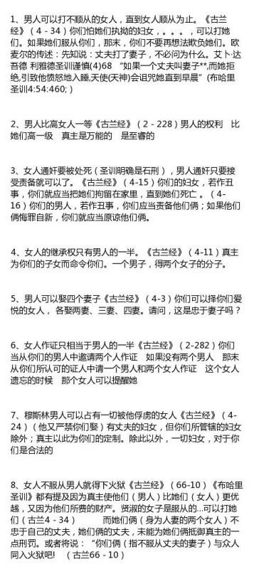
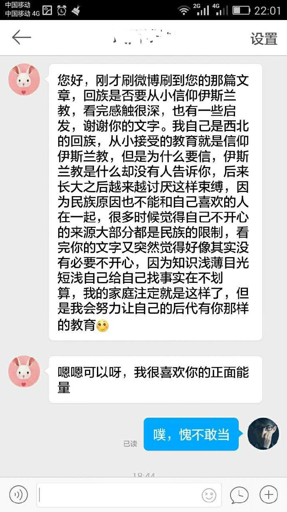

#伊斯兰教徒们或许应该这么做？（利益相关：不信伊斯兰教的回族）

* 作者: 灵异档案员王昙
* [原链接](http://weibo.com/2981083181/DtPBhjmoX)

伊斯兰教的处境，大家都是知道，我家里穆斯林挺多的，一部分是看过古兰经，一部分以不吃猪肉为最低标准。
他们大部分人都觉得伊斯兰是一个信仰，不明白为什么会有人去敌视，接着我拿出一些进攻性的经文给他们看，告诉他们是古兰经里的。（经文内容见图1、图2）（图三是一个回族姑娘给我的私信，图四是无耻的配图，是盗唐缺的）

他们当时都惊呆了，所有人都没看过这些内容。接着他们迷茫了，大多数人接触伊斯兰教都是从阿訇、家长那得到传授，没有认真研究过这些内容。
因为不想亲戚被敌视，所以我也想过很多。
伊斯兰就是落后的么？
伊斯兰文明曾经非常辉煌，它的成就不亚于其他文化。他们曾经有在当时非常先进的水利设施、医疗系统、建筑技术等等。
之所以能有这样大的成就，当然和伊斯兰教分不开关系，在以人力为本的古代，谁能组织更多的人，有更强大的号召力，就可以战胜敌人。宗教无疑是最好的手段，比如仇视异教徒的内容，就可以让伊斯兰教徒和其他的宗教、种族对立起来，从而增加凝聚力。
形成猜疑链，你是温和派，但你的经书里写着要杀死我们，那你不杀我是不是装的呢？我是不是先该杀了你以防万一呢？万一我不杀你，你怕我杀你却要杀我，那该怎么办呢？
这就是现实，从古至今无数的战争都与这种猜疑链有关，所以如果你想笼络更多人，让他们和你信同一个宗教，是最简单的选择，同时如果这个宗教还能有伊斯兰教的这种配置，那在古代简直棒棒哒。
但时代不同了，现代社会还有人海战术？马克沁机枪早就结束那个时代了。这是为什么中东会在近百年和中华文化受尽屈辱的原因之一。曾经的制胜法宝，在技术进步的车轮前被碾压的粉碎，而且也渐渐成了拖累。
所以现在继续保留这些经文，对于穆斯林，没有任何益处。只会招来仇视，而且随着中东穆斯林的极端化，中国的普通穆斯林也开始给他们背锅了。
很多人或许认为古兰经是先知留下的经典，是不能改一字的，其实这是个错误的观点，穆圣还在人间的时候，就曾经改变过他的观点，他当时曾经禁止过穆斯林移植树木，因为他觉得树木无法存活，空耗人力。
但后来越来越多的人移植树木成功，他又改变了自己的观点，开始支持移植树木了。可见穆圣本人是个很现实的人，他懂得变动，穆斯林也应该向穆圣学习这一点对么？
所以请你大声说出来，我反对古兰经里杀戮异教徒的内容，我反对古兰经里迫害女性的内容。
如果有穆斯林觉得经文一字都不能改，那么我只能说，你现在即使不是极端派，未来也会成为一个极端派。下面要说的话，就是给你的。
现代还以宗教思想作为主导思想的国家，无一不是弱国，可能有人会说，欧美难道不是天主教和基督教的天下么？其实不是的，欧美国家对宗教的淡化做到了极致，学校里教的是进化论、有识之士也会有意识的压制宗教势力干涉世俗权力。
那些世俗权力被宗教严重干涉的国家，基本都很惨。具体原因有很多，但主要原因无非是几个，一方面是宗教只是外衣，权力和享受才是本质。那些权力越大的，越不信教，他们所要做的，只是用宗教控制群众罢了。
你说你很虔诚是么？我怎么没看出来你很虔诚呢？神之所以要我做这个官，而你只是一介贫民，肯定是因为我更虔诚，所以我有权利剁了你。
一切都是神的安排，我之所以能当国王，除了个人的努力，还有神的护佑，君权乃是神授，反我就是反神，拉出去剁了。
所以那些极端的，以为某个地区全是穆斯林就好了的人，你们想的太幼稚了，宗教在自律方面确实有效，但如果某个宗教在一个地区得到了绝对的权威，遭殃的永远是老百姓而已，这是绝对的，古往今来无不如此。
所以如果你只是一个贫民，居然还想帮着那些权贵建立所谓的神国，那我只能说你是脑子抽了，别理我，我真的不想和你说话。
至于那些位高权重，妄图以宗教控制群众，想做点什么的极端分子，我只能说，至少在中国，你什么都做不了，中华的五十六个民族都会杀死你，用你的血染红我们的国旗。
我们这个国家经历了几千年的岁月，曾经屈辱过，沉沦过，但从来没有任何一个人灭亡过它，试图灭亡它的人，没有一个有好下场的，他死了，也会被挖出来，挫骨扬灰。
最后说一个很关键的问题，我看到回复里有很多人提到少数民族的同学禁止他们在宿舍里吃猪肉，甚至反应特别大。这种情况可能有两种原因。
一是确实受不了猪肉味，有些人从小没接触过猪肉，突然闻见会觉得恶心，受不了那个腥味，我小时候在幼儿园，无意中吃了猪肉，吐的不行不行的，不过现在我没事了，习惯就好。
如果受不了同学吃猪肉，可以先出去溜达溜达，闻着恶心就涂点清凉油在鼻子下面，慢慢就适应了。
至于还有人认为，别人吃猪肉是侮辱，不尊重信仰。其实这是错的，古兰经里没说过不能看人吃猪肉，也没说过闻到猪肉味道会怎么样。所以别那么敏感，好么？
这里想送给任何有信仰的朋友一句话：
请不要用你的信仰，干涉别人的生活。
你的信仰，与他人无关。

