# 关于抵制宗教食品运动

* 作者: [PETG善待绿色组织](http://m.weibo.cn/u/3138561560)
* 源链接已被删除, 这里还有一份: http://weibo.com/ttarticle/p/show?id=2309403986954088783897

(@PETG善待绿色组织 旨在帮助大家增进对伊斯兰的了解，解答对伊斯兰教的疑问，传播与穆斯林相处的策略，团结非穆斯林，维护大家的合法权益。)

# 一、解释几个名词

在开展本文的讨论之前，由于可以预见到争论，首先向各位卡费尔（Kuffar，非穆斯林）科普下背景知识。

## 1、自由的定义

争论类似的问题往往公说公有理，因此为了构建讨论的基础，我们最好在自由的定义上达成一致。自由是个不错且受欢迎的概念，我们喜欢自由，不喜欢别人侵犯自己的自由，我们喜欢用自由为自己的行为辩护。但什么是自由？很多人认为自由就是“为所欲为”，但由于社会的交互性，自由不可能没有边界。一个大家都能接受的边界应该是“一个人的为所欲为不能影响其他人的为所欲为”，所以自由是一个嵌套的定义：在不影响他人自由的条件下你是自由的。在本文的背景下，只要你不影响我，随你吃或不吃、抵制或支持宗教食品都关我屁事，反之亦然。

## 2、什么是清真食品 

大多数人都了解穆斯林不食用猪肉及相关成分的食物，因此很多人认为清真食品就是不含猪肉成分的食品，这是错误的。清真(Halal)食品是一种宗教食品，字面上Halal是合法（符合沙利亚法）的意思，不仅要求不含伊斯兰教禁忌成分，而且屠宰加工方式必须按照伊斯兰教法规定。根据完美、高贵、不可更改的古兰经，安拉禁止信徒们食用的动物，除了猪，还包括狗、蛇、青蛙、驴等等。伊斯兰屠宰法要求将牲畜绑住放倒在地上（朝麦加方向），用刀割断颈动脉放血直至死亡（残酷而痛苦），阿訇还要念诵经文感谢安拉（伊斯兰圣战士杀卡费尔也是这种宰法）等等，详细规定可参见我国公布的《清真食品认证通则》。根据该通则，卡费尔制作的非猪肉制品不能算清真食品。

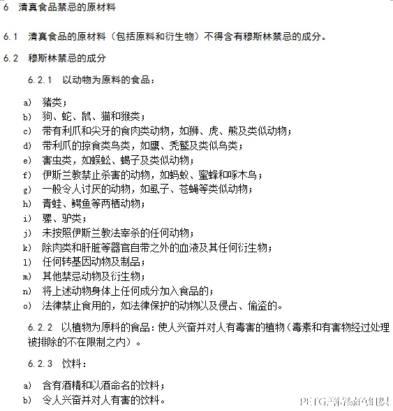
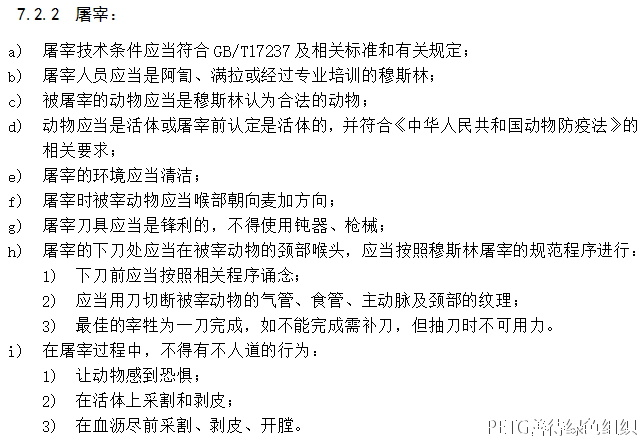
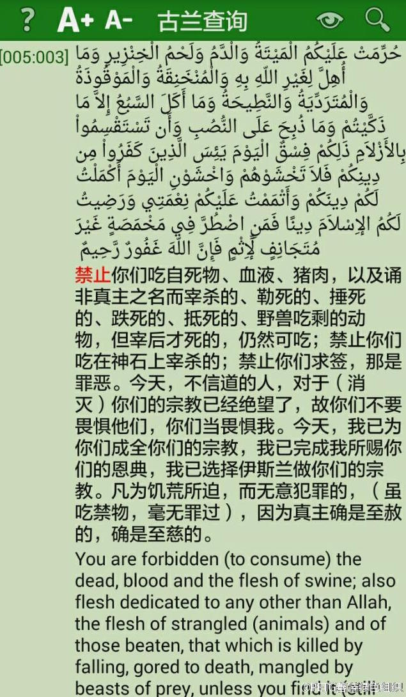

讽刺的是，古兰经原文并没有这些附加规定［005:003］，他们的安拉只禁止吃“死物、血液、猪肉以及颂非真主之名宰杀的XXX”，无神论者宰杀牛羊时并不颂给任何神，穆斯林理应是可吃的。《清真食品认证通则》里额外附加条款不过是为了垄断市场，歧视性就业，以及收宗教税而已。

## 3、最晚诞生的宗教——伊斯兰

大多数人印象里也就知道伊斯兰教是世界三大宗教之一，似乎与别的宗教没有什么区别，这是常犯的第二个错误。

常听见绿教徒们说：“伊斯兰是最晚诞生的宗教，所以伊斯兰是完美的，最先进的blablabla。”这句话没多大问题，在大约1400年前……。（今天有法X功，还有飞天面条神教）

作为三大宗教最晚创立的（基督教创立600年后），有前面的参考，伊斯兰相对基督教、佛教等确实有更先进的地方。比如对食品卫生的规定在当时是先进的；对判教行为的严惩可以防止信徒的流失（杀死判教者/异教徒可以进天堂）；掠夺奴役异教徒来奖励信徒，将异教徒女性作为性奴，强迫异教徒接受伊斯兰（不接受安拉就去死，异教徒结婚必须入教）都有助于其宗教的传播与扩张；对古兰经的极度崇拜与迷信，几乎无所不包的沙利亚法（法制）等等。

伊斯兰教具有”准政治组织“的特性，在社会生活中，天然比其他宗教或民族多一层组织架构：

有自己的党纲——古兰经；

有自己的党支部——清真寺；

有自己的政委——阿訇；

有自己的党规——伊斯兰教法；

有自己的最高理想和共同理想——为主道而奋斗，向全世界传播信仰；死后进乐园；

有自己的政治生活——阿訇宣讲、信徒礼拜，一生中必须回总部受训一次，受训后在本组织中的地位和荣耀得到提升；

有自己的整风运动——无论贫富和地位，每年禁食一个月，期间停止娱乐和战争；

有自己的税收体系——天课；

有自己的民政系统——清真寺会接济穷困穆斯林，介绍婚姻等；

有自己的政治敌人——不信主道的卡费勒；

有政治生态中常见的派系区分——极端派和温和派（可类比左派和右派）；

有秉持相同理念的强大外援——沙特等穆斯林国家，以及其他伊斯兰组织；

甚至有当今最时髦的普世价值——只要信教，不问来历，不问出身，不问肤色，人人平等，天下穆斯林皆兄弟；

比起其他宗教，伊斯兰教提供的是涵盖生活方方面面事无巨细的指导和标准，包括且不仅限于：

1.成文法，也即是初级的法律条文；

2.社会组织架构，也即是社会应当是什么样的结构、社区的规模、组织的层级、上下的等级以及责任/义务；

3.生活方式的规则，也即是如何组织生产、进行社会生活与政治生活；

4.文化系统，也即是诗歌、文学等方面的基本指导，以及精神方面的服务；

5.如何进行军事组织与训练，并提供了区分敌/我的简单方法。

总之要注意的是：伊斯兰教对教徒的控制力，它的组织力与执行力即使在现代也是超前的，虽然野蛮但是管用。

4、卡费尔、吉哈德与沙利亚法

卡费尔(Kuffar)严格的定义应该是:一是指那些曾经信仰安拉又叛离伊斯兰教的；二是在穆斯林遭到迫害时不仅没有提供帮助反而落井下石的；三是与穆斯林为敌的。按教义，杀掉卡费尔不是犯罪，还能上天堂（发72处女）。不过极端分子在杀卡费尔时可没法按这几条标准给你细查，一般看你会不会背古兰经颂清真言，不会的杀掉。所以将卡费尔理解成(伊斯兰的)异教徒没有问题。

吉哈德（Jihad）法学定义是：以言语，财产和生命为主道奋斗；为捍卫宗教信仰、生命财产、扩张侵略而努力奋斗。极端派的Jihad可以翻译成圣战，温和派洗地Jihad只是穆斯林与内心邪念战斗的过程。所以讽刺的一幕出现了，一边是极端恶劣的恐怖主义，一边是所谓的修行，两种“截然相反”“相差甚远”的行为共用一个词描述，卡费尔们被耍的团团转。在一个文化里，如果两个概念用同一个词代表，只能说明：这两概念没有区别！

事实上吉哈德是一个非常广义的概念，只要是穆斯林为伊斯兰做的斗争都属于吉哈德，与具体行为无关，只与行动的目的有关。比如穆斯林商人赚钱，不一定是吉哈德，但如果赚了钱是为了资助伊斯兰教扩张，就可以算作是吉哈德；穆斯林女人生孩子不一定是吉哈德，倘若作为子宫武器一个又一个生孩子，也可以算吉哈德。所以，911是吉哈德，75、昆明、金水桥也是吉哈德，偷卡费尔也是吉哈德，骗卡费尔也是，偷税漏税是，上街示威也是，反正只要目的是增强伊斯兰，削弱卡费尔的都是。

沙利亚法(al-Shari’ah law，原意是“通往水源之路”（沙漠神教呵呵呵呵），引申为“应该遵循的正道”)是伊斯兰宗教法的总称，包括《古兰经》中所启示的、圣训中所解释的安拉所有命令和训诫，是每个穆斯林必需遵循的宗教义务。伊斯兰教的主要理论文献是古兰经、穆圣传和圣训，堪称伊斯兰教的“三位一体”。古兰经只占很小的一部分，在文字上只有 14%。伊斯兰教义的86%是献给圣行 （穆圣传和圣训）的。目前伊斯兰教中的所有圣训一般就是指逊尼派的“六大圣训集”和什叶派四圣书。这六部圣训集是：《布哈里圣训实录》、《穆斯林圣训实录》、《艾布·达乌德圣训集》、《奈撒伊圣训集》、《铁里密济圣训集》、《伊本马哲圣训集》。什叶派四圣书又称为“四大圣训经”是：《宗教学大全》《教法自通》《教法修正》《圣训辨异》。

沙利亚法的一个特点是无所不包，不仅是一部法律（一部与现代法律存在诸多冲突的法律），还规定了穆斯林生活方式的方方面面，包括信仰、知识、举意、虔诚、沐浴、礼拜、礼拜堂、殡礼、天课、乐捐、斋戒、朝觐、满克和麦地纳两圣地；商业、农业、继承、遗嘱、放赦、婚姻、离异、刑事、抵偿、判断、誓愿、宰牲、渔猎、饮食、衣着、医药；启示、贤哲、天经优点、天经注解、战争和战役；伦理、道德、解梦、虔行、祷词、后世特征、复生、乐园、火狱等等等等。

这些规定在大约1400年前是先进的，有其合理性，但到了现代，许多已经过时，一些违背现代法律精神，一些不科学甚至可笑的，比如如何入厕：用水或者石头（穆罕默德当时还没用上纸），只能用左手，入厕左脚先跨，出厕先卖右脚，男人小便也应该蹲着（穆罕默德幼女老婆阿伊莎细心记录的圣行）等等。

（阿伊莎是穆罕默德9个老婆中唯一以处女之身出嫁的，７岁和穆罕默德结婚，９岁同床，穆罕默德死时，阿伊莎只有１８岁，由于是圣妻，终身未再婚。）

穆斯林女性普遍穿戴的不同遮蔽程度的头巾就来源于圣训：

要求女穆斯林遮蔽羞体（蒙面），外出得男性家属陪同，是由于当时的社会治安恶劣强奸盛行；而现代专业警察的出现和治安的改善导致该规定不仅没必要而且限制了女性自由，但一些教派仍然一字不改的遵循，这就成了极端主义。

沙利亚法另一特点是它的双重标准， 它包含两套法律：一套是给穆斯林的，另一套是给卡费尔的。卡费尔不被视为平等对象，而是被当成下等人。比如我们对小偷恨之入骨，觉得伊斯兰教法小偷要剁手的规定，很给力和解气。但是沙利亚法同时规定，卡费尔没有财产权，穆斯林拿走卡费勒的财产是安拉的赏赐，偷卡费尔不算偷！（理解某族小偷了吧）

第三个特点：自相矛盾与后法废前法。沙利亚法充满了自相矛盾，比如，伊斯兰教在涉及卡费尔时，几乎在每一个问题上都保持两种观点。下面是选自古兰经的例子：

[古兰经 73:10] 你应当忍受他们所说的谰言，而温和地退避他们。

从这个宽容的立场，我们进到不宽容的立场：

[古兰经 8:12] 当时，你的主启示众天神：“我是与你们同在的，故你们当使信道者坚定。我要把恐怖投在卡菲尔的心中。故你们当斩他们的首级，断他们的指头。”

古兰经充斥着类似的自相矛盾，因此它提供了一种解决办法，这种办法被称作“后法废前法”：后面经文的效力要强于前面经文的效力。两段经文依然都是对的，因为整本古兰经都是真主的降示。但由于第一段经文的降示时间早于第二段经文，因此在效力上较弱。

经文之所以会自相矛盾，原因很简单。穆罕默德的事业分为前后两个截然不同的阶段。在麦加，穆罕默德是一位宗教布道家。而在麦地那，他成了一位手眼通天、令人畏惧的政治家和武士。麦加时期的经文是真主给处于弱势的伊斯兰的建议；而麦地那时期的经文则告诉穆斯林，当伊斯兰强大后该干什么。因此强大起来的穆罕默德变得十分强硬，他发动了对卡菲尔的战争。古兰经为不同处境的穆斯林提供了不同的锦囊妙计。早期的、较弱的“好”经文被后期的、较强的“坏”经文所取代。但它依然是正确的，并且可以被利用。伊斯兰支持者经常引用这些早期的经文来证明伊斯兰的“仁慈与包容”（欺骗麻痹卡费尔是他们的诡术，也是一种吉哈德）。参考阅读： 针对非穆斯林的沙里亚法

# 二、抵制宗教食品的理由

## 1、竞争、成本与宗教税

宗教食品是否让我们付出了更多的成本？当然是的。首先是清真认证费用，根据各省具体情况会有所不同，根据财政部向国家宗教事务局下发的《 关于中国伊斯兰教协会收取清真食品认证费收费标准及有关问题的通知 》，可知收费标准是货值总金额0.15%，每份证书100-350元。只要你购买带有清真标识的商品，你就向伊斯兰教缴纳着宗教税。

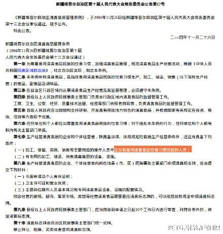
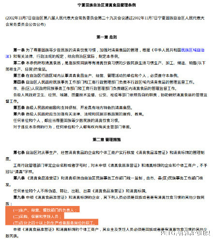

上市的清真食品，光交纳清真认证费用还不够，根据《清真食品认证通则》：清真食品生产经营企业的企业负责人或主要管理人员中应当有穆斯林，采购保管制作人员应当是穆斯林，屠宰主刀应当是阿訇(hong)、满拉或专业培训的穆斯林。影响更大的是这条：“企业员工应当有一定数量的穆斯林”，一些省规定该数量是5%，一些省甚至规定是40%。

考虑到商品只有经过充分竞争才能接近其合理价格，劳动力也是。清真食品不仅避开了和非清真食品竞争，而且通过强制性消费有其封闭的市场；在劳动力市场方面，强制雇佣穆斯林不仅是对其他劳动者的不公平竞争，其工资必高于普通雇员，这些都进入商品的售价，转嫁到消费者手中。

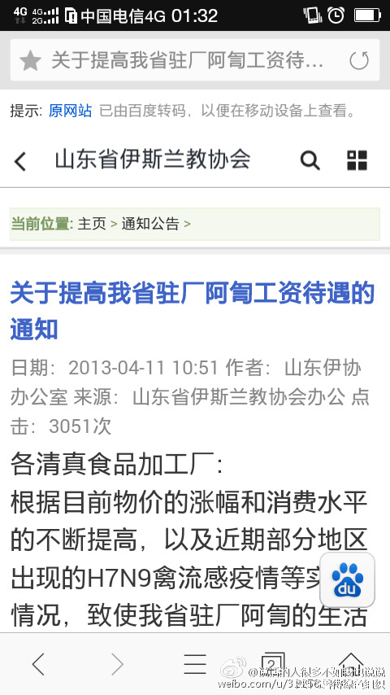
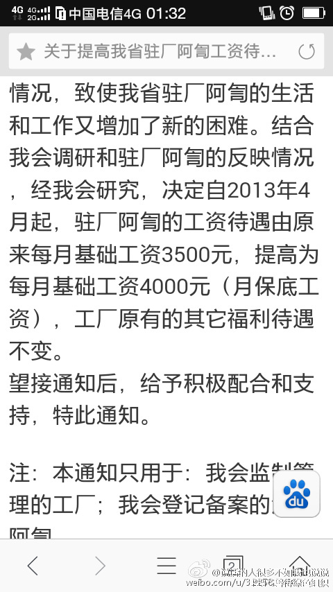

既然清真商品付出了多余的宗教认证的成本，但为什么有些商品清真的要比同类非清真的还便宜呢？这是因为这些清真企业受到了政府扶持，享受税收优惠。这种政策不仅推动了资金流向了伊斯兰群体，而且隐性的剥削了卡菲尔，对其它企业也是不公平竞争。

最后，消费者为了清真食品付出的多余成本，很多都用于兴建更多清真寺，雇佣清真执法队（宗教警察），使伊斯兰教进一步扩张。澳大利亚就有清真认证收益流入恐怖组织的报道，这是个恶性循环。

## 2、嘴上说团结，心里嫌你脏 

穆斯林嘴上要卡费尔尊重民族团结，要有独立的食堂，甚至要求清真食堂里不能有卡费尔，否则就是不尊重少数民族。其实清真食品本身就代表着对非清真食品的丑化，非清真食品是“不洁”、“肮脏”，“吃非清真食品的卡费尔上不了天堂，将永居火狱”。所以无论非清真食品在正常人闻起来多么美味，甚至盲测无法区分清真与非清真的羊肉制品，穆斯林由于心理作用仍会对卡费尔的食物以及卡费尔本身厌恶反感。

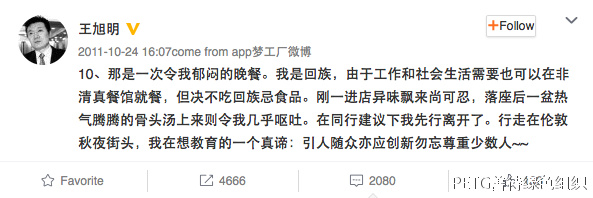

清真食堂（以及清真寺）不让卡费尔进，就是嫌你肮脏，对你极不尊重。一边要你尊重，一边嫌你肮脏，这是“团结”吗？广大卡费尔是否有必要尊重一个嫌你脏的人？是否同意让这种歧视变成我国法律的一部分？你是否相信一个认为你低贱肮脏的厨师会重视你食物的卫生？

## 3、清真食品更卫生吗？

这是清真食品支持者常用的一个理由，似乎“有‘信仰’的人制作的食品更靠谱”，也是大家容易产生的一个误解。实际上从现代食品健康和卫生的角度看，这个结论存疑：

（1）缺乏健康食用油和现代卫生的观念

清真厨师大多文化不高，很早就出来跟师傅学厨艺，穆斯林厨师和穆斯林消费者基本上没有健康用油的观念。不少清真餐馆使用的一种“化油”，实质上是回收的重复用动物油，使用回收过程中致癌物不断累积，大多数穆斯林与卡费尔食客没有意识到。

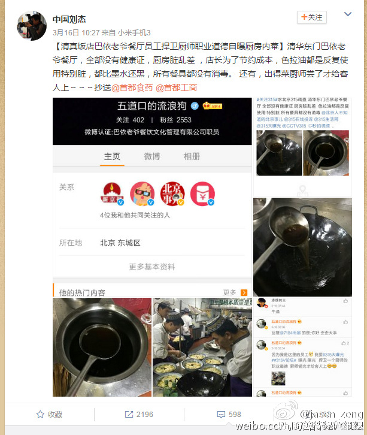
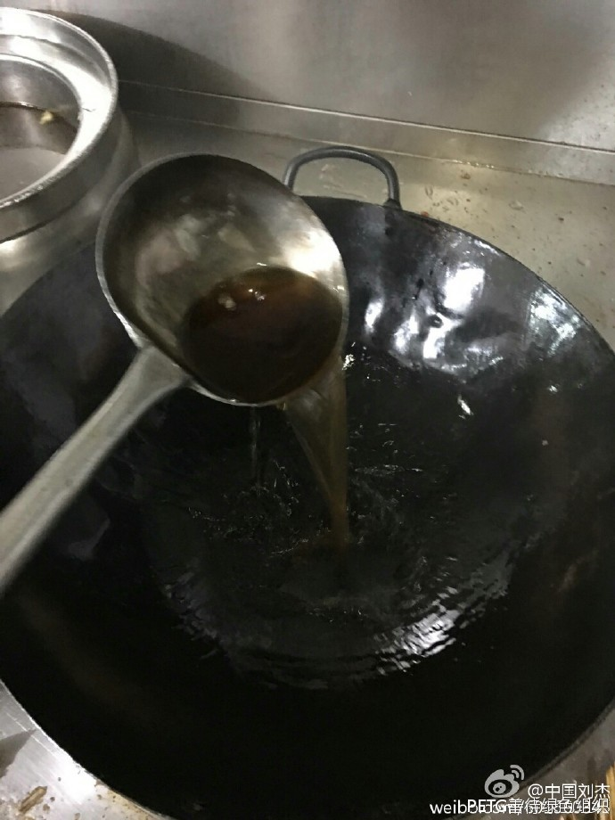
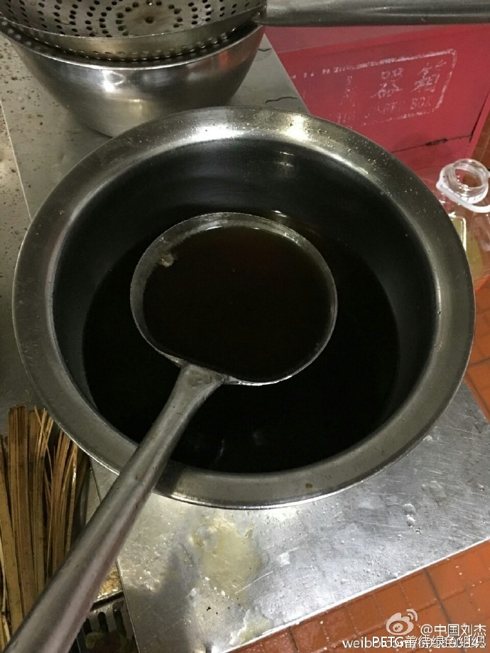
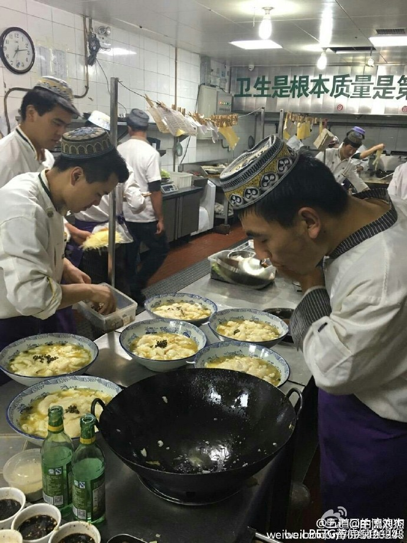

其次传统的清真餐馆也缺乏现代卫生观念，笔者也观察过各种清真餐馆，基本上不戴手套与口罩，收银员收完钱后直接用手给顾客拿牛肉，厨师玩完手机给顾客拉面等等，原因是他们没有细菌传播的概念。

（2）恐怖的“黄金左手”

关于清真食品一直流传着一个恐怖的传说……：穆斯林厨师大便后不用纸而是用手擦屁股。这个清真屎的传说是不是真的？可以看一下圣训：

“由艾布胡莱勒（愿主喜悦他）传述，一次，在贵圣（真主的称赞、祝福与安宁属于他）大便时，他为贵圣（真主的称赞、祝福与安宁属于他）拿着水袋，以备贵圣（真主的称赞、祝福与安宁属于他）便后清洗，当他靠近他时，贵圣问道：谁啊？他说：我是艾布胡莱勒。他说：你去给我找一些石子用来净下，不要捡骨头和干粪。艾布胡莱勒说：我捡来一些石子，用衣角兜着，放在了他旁边，然后，我就离开了，直到贵圣完毕，我过去问道：不捡骨头和动物粪便，是什么原因呢？他说：那是镇尼（精灵）的食物… （布哈里圣训集 3571）。”

沙利亚法确实对入厕有诸多规定，细节到大小便的朝向、进出时先迈哪只脚念什么祷词，擦几遍……。记住，在穆斯林的观念里，左手是脏手：

－不可使用右手清除污秽，在直接清除污秽时，应使用左手，以符合以上那段圣训的意义，另外，贵圣（真主的称赞、祝福与安宁属于他）还说：“当你们擦拭污秽时，不可使用右手。” 布哈里圣训集 5199。另由圣妻哈芙赛（愿主喜悦她）传述，贵圣（真主的称赞、祝福与安宁属于他）将右手用于吃饮、做小净、穿衣、给予和拿取，将左手用于此外的其它事务。 由伊玛目艾哈迈德记述，载于《萨嘿哈·加米尔》4912，由艾布胡莱勒传述，真主的使者（真主的称赞、祝福与安宁属于他）说：“你们在清理身上的污秽时，不应使用右手，你们当用左手净下。” 伊本玛哲记述 308，另记载于《萨嘿哈·加米尔》 

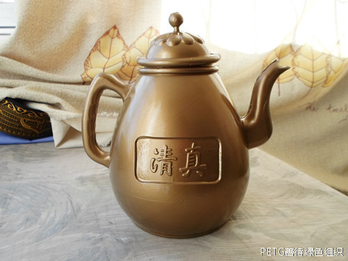

一个虔诚(未充分世俗化)的穆斯林确实是用左手沾水清洁肛门的，用到的工具叫“罗塔”（lota，一种球形水罐），具体可参见 穆斯林卫生间里的秘密 。清真屎中标的后果也有报道：

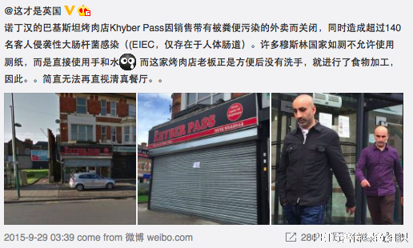

怎样判断你去的清真餐厅厨师擦屁股的方式呢？很简单，去他们厕所看看。如果厕所里有个小水罐，那么恭喜你，正宗清真的味道~虽然只有左手是脏手，但记住，拉面师傅可没法用一只手给你拉面！

（3）监管困难

卡费尔的餐馆暴露的问题似乎不少，很容易造成清真餐馆更信得过的印象（绿教徒也喜欢用地沟油攻击非清真餐食），但事实上到底如何？正规餐厅的食品安全依靠一套完善的监管制度，包括人员健康管理，定期检查与公布等等，保证了大致上的卫生与安全；而清真餐厅由于少民大人问题敏感，动不动就上升成民族问题群体，政府监管乏力，媒体不敢报道，风险更大。

最近发生的“上海徐汇区非法拉面馆对峙”事件：政府关闭一家无证拉面馆，大量白帽（回回）聚集与特警对峙。涉案拉面馆经营多年，不仅无证（卫生许可证、健康证、经营许可、营业执照），也不交税不交房租，食品卫生如何保证？

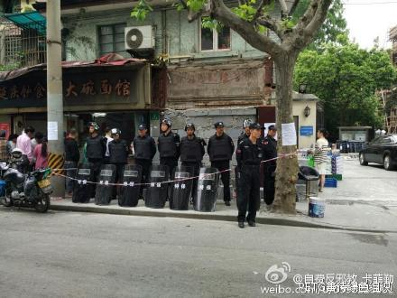

综上，清真食品丑闻不过是大多数时间没人敢管没人敢查没人敢曝光而已。

## 4、抵制是维护自由选择的权利

回顾我们关于自由的定义，“抵制宗教食品”运动既不是要消灭清真食品，也不会强迫穆斯林食用非清真的食品，只是为占中国人口绝大多数的世俗人口发出自己的声音，维护我们自由选择宗教或非宗教食品的权利！如今，在有穆斯林的航班上，几乎所有机上食物都清真化，为了照顾穆斯林，卡费尔连闻下红烧肉香味的机会都没有；在西部的麦当劳、肯德基快餐店，找不到内地常供的皮蛋瘦肉粥；奶制品大多数也清真化，卡费尔毫无选择毫无意识的向伊斯兰缴纳着宗教税。

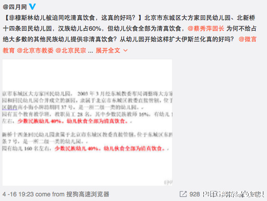
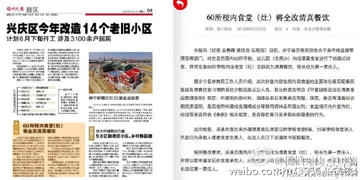
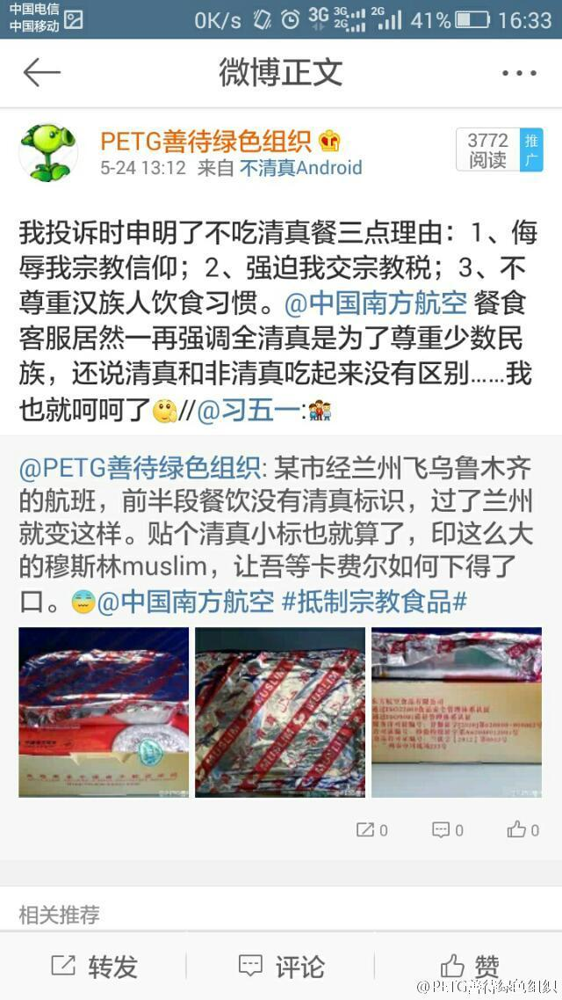

清真甚至变成了伊斯兰经济扩张的工具，考察西安某街巷餐饮业的变迁（只剩下唯一一家汉族餐馆），非清真餐馆被威胁排挤，市场逐渐被穆斯林垄断。不少非清真餐馆，被以气味扩散等借口，受到穆斯林威胁甚至打砸而不得关店。

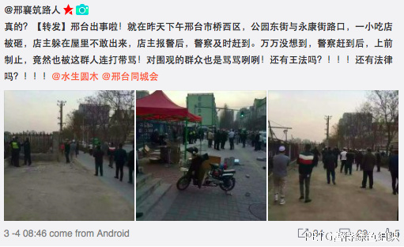
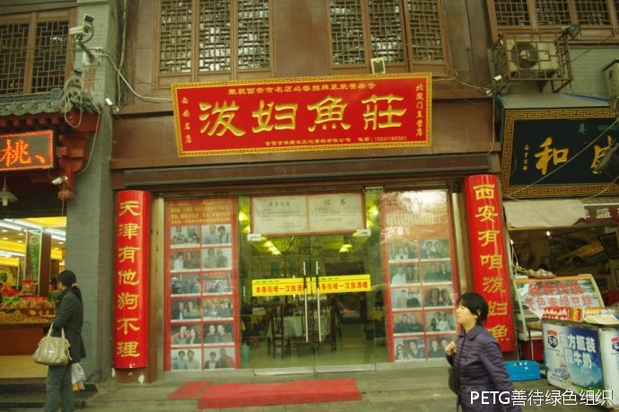

食品商进行清真认证的动力是在传统市场的基础上进入穆斯林的市场，因此常为了照顾穆斯林而忽略卡费尔；而#抵制宗教食品#运动是要告诉食品生产商，卡费尔市场与穆斯林市场不可兼得，不得忽视广大非穆斯林。

# 三、宗教食品之外

关注新闻的人们会不断注意到：清真已从肉制品的狭义概念，扩展到所有食品， 甚至到了制药业、化工业等，侵入了日常生活的方方面面，出现了清真盐、清真纸、清真聚乙烯树脂、清真水泥、清真收银台、清真澡堂、清真厕所、清真公交、清真金融……。

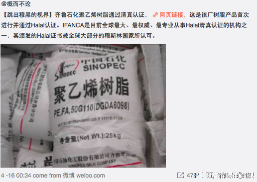
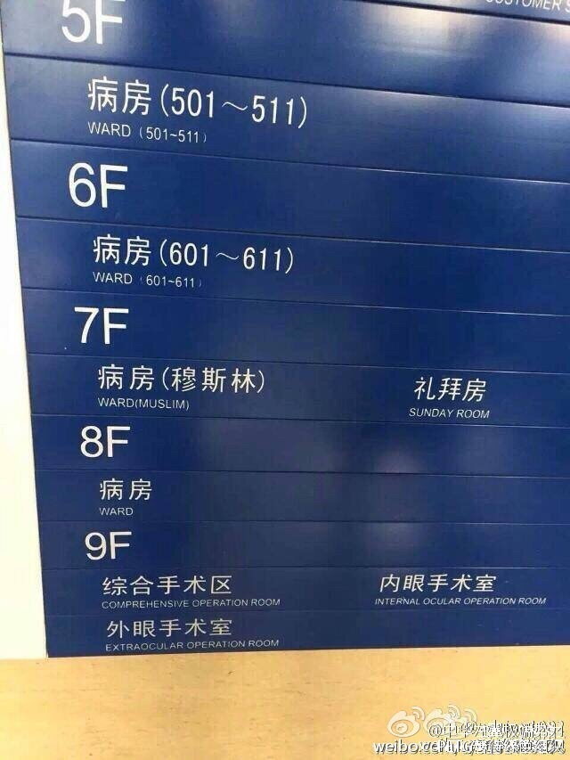
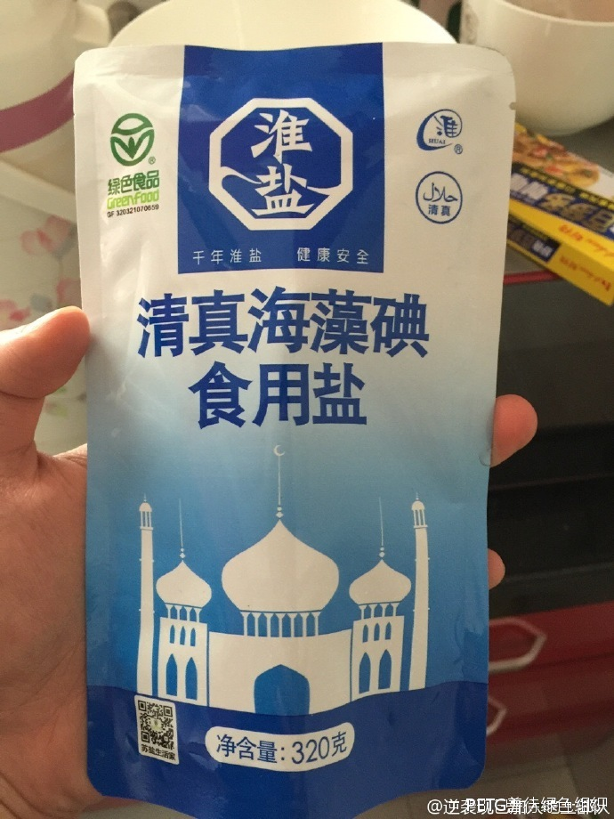

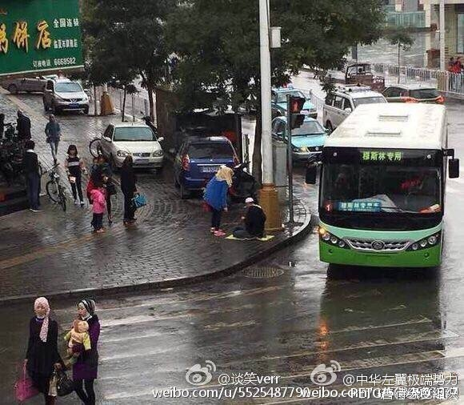

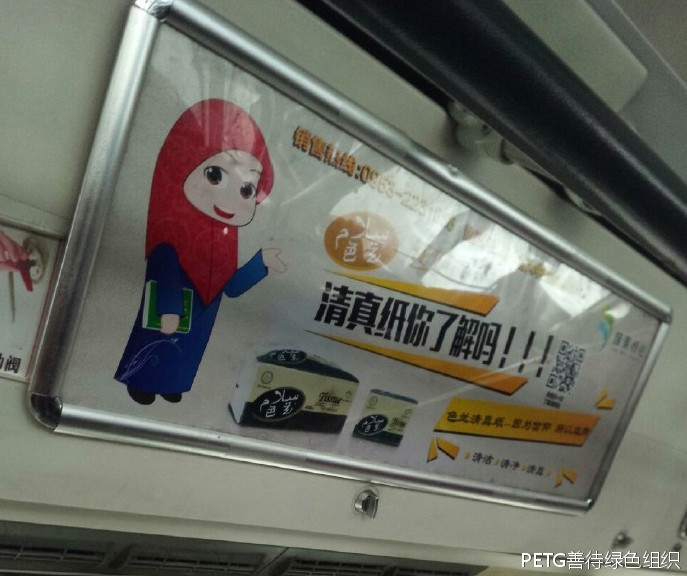
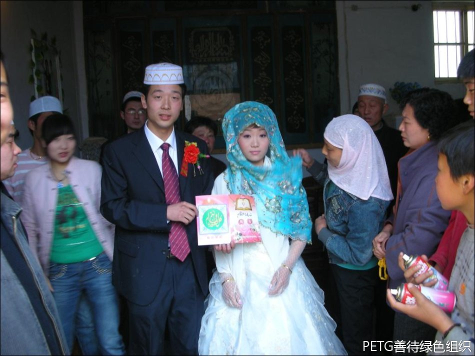
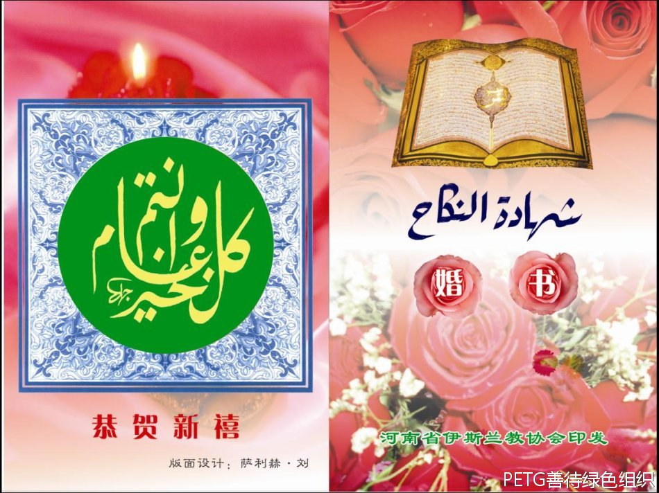
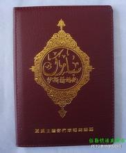
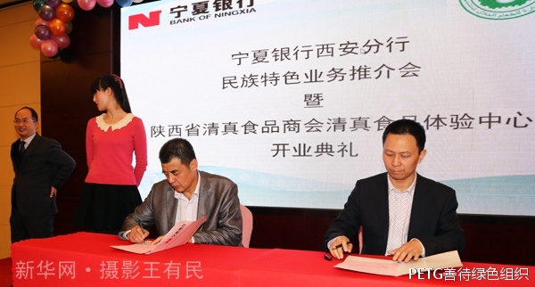
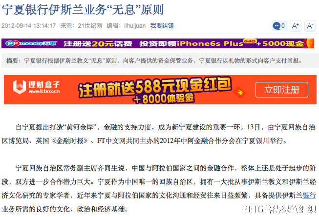
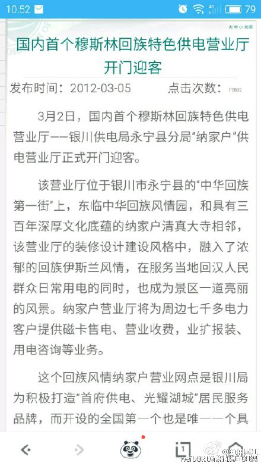

为什么清真不是专指食品呢？因为清真(halal)原意就是“合法（沙利亚法）”的意思，而沙利亚法本就是无所不包，食物仅是其规范的一小部分。考虑到沙利亚法很多部分与现代法律与观念存在冲突，而清真食品是世俗社会较容易接受的一部分，所以穆斯林在阿訇的领导下，会先哭着喊着要清真食品。

“穆斯林强加于我们社会的每一道命令都是以沙里亚法为基础：穆斯林要求公共场所腾出空间给他们祷告，他们是在要求我们遵守沙里亚法；女穆斯林戴头巾，是在遵守沙里亚法； 报纸不能批评伊斯兰，是在屈从于沙里亚法；医院商场给予穆斯林特殊对待，是在遵循沙里亚法；当食品、出版物接受伊斯兰协会的检查时，也是在遵守沙里亚法；911、昆明火车站恐袭是执行沙里亚法规定的圣战命令……。沙里亚法是所有穆斯林宗教、政治和文化生活的基础。通过研究沙里亚法，可以切实地了解古兰经和穆罕默德。”

全面实施沙利亚法是穆斯林的最高理想，在他们吃的需求满足后，会追求清真的进一步泛化。如果说清真食品仅是冲击世俗社会食品业的话，清真泛化更加危险，例如清真金融不仅冲击金融业，而且其收益作为宗教税变成了伊斯兰的活动资金（比如资助吉哈德圣战）（参考：宁夏不满足金融试点 力争建伊斯兰金融中心 ）；清真婚姻等更是对国家法律的直接挑战：“政府发的结婚证不清真（不符合沙利亚法），清真寺认定才算”。 

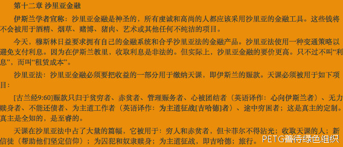

不断渐进的推进清真泛化，就是在逐步施行沙利亚法；最终目标，就是对社会中所有穆斯林与卡费尔施行沙利亚法。

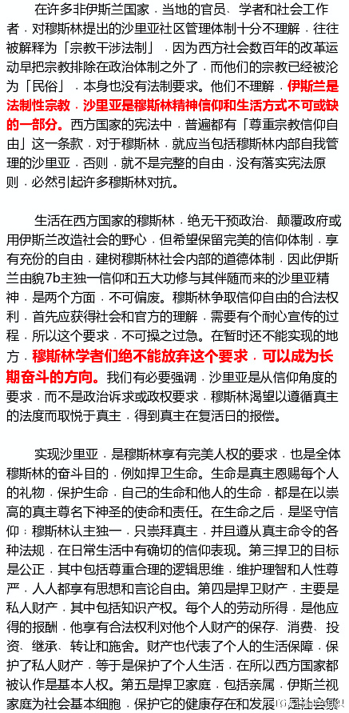

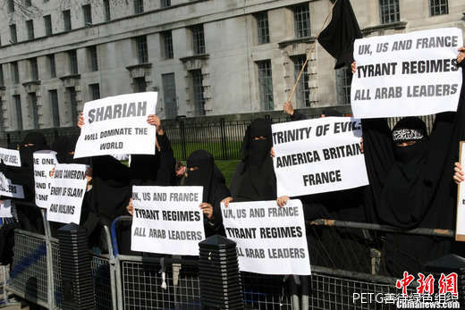
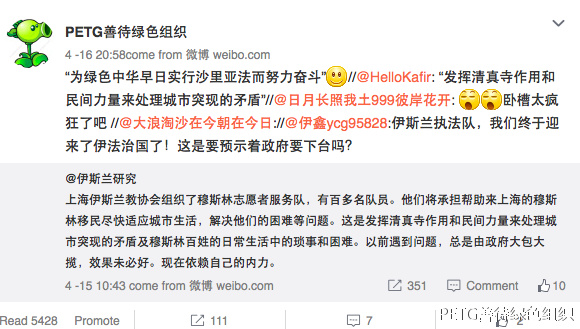
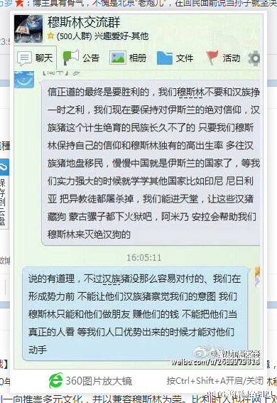
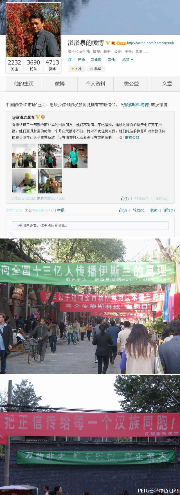

沙利亚法与现代法律不可调和，而全面实施沙利亚法是穆斯林的最高理想，卡费尔们感受一下，想象下这个可能的未来~（目前印尼、马来西亚、土耳其正在伊斯兰化，逐步推行沙利亚法）。

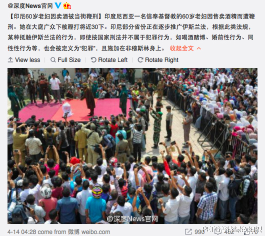

**抵制宗教食品#运动旨在提醒世俗社会对清真的泛化有所警惕。政府应对清真的定义范围严格限制，禁止清真行业在税收、销售等方面拥有不公平竞争的特权；分割限制阿訇的权利，防止清真寺变成政教合一的事实政府；保护广大卡菲尔自由选择的权利。**