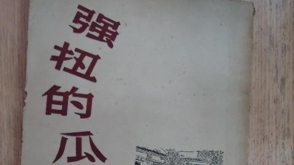

#总有人说我对古兰经的理解是断章取义，那么就来看看，古兰经的原文…

* 作者:[灵异档案员王昙](http://m.weibo.cn/u/2981083181)
* 06.03 11:49
* [原链接](http://media.weibo.cn/article?id=2309403982249728065419)
我不是穆黑，我只讲道理。

古兰经里如果有注明这样的话：“请在阅读时结合本句内容的时代背景。”

那我肯定什么话都不说，毕竟当时穆罕默德正在进行战争，说一些狠话很正常，但古兰经里没有吧？

如果古兰经里的话是“杀死那些异教徒，当他们要来杀死你的时候。”

我也无话可说，毕竟这里面还有点正当防卫的意思，虽然也可能被曲解，但本意并没有大错。

但古兰经里的内容是这样的么？我下面引用一段：“信道的人们啊！你们要讨伐邻近你们的不信道者，使他们感觉到你们的严厉。你们知道，真主是和克己者在一起的。”

呵呵……请问如果你不是穆斯林，您看到这句话心里会怎么想？害怕不害怕，穆斯林将心比心的想想吧。

结合历史背景？请问你觉得一个普通的穆斯林，可以研究历史到什么程度呢？他能结合历史背景到什么程度？

你书里写着这种话，还叫别人理解你，那就叫欺负人。

还有人说我这段话引用的有问题：“当禁月逝去的时候，你们在哪里发现以物配主者，就在那里杀戮他们，俘虏他们，围攻他们，在各个要隘侦候他们。”

说不是完整版，好的，这句话后一句是：“如果他们悔过自新，谨守拜功，完纳天课，你们就放走他们。真主确是至赦的，确是至慈的。”

那么我来结合背景理解一下这句话，公元1193年伊斯兰的大军开进那烂陀寺，也就是唐三藏取经的那个寺庙，当时佛教已经没落，所以没什么力量抵抗，穆斯林要求僧人改宗，可大部分僧人都不愿意，于是穆斯林学习那烂陀寺……

呵呵，真主确是至赦的，确是至慈的。

还有人说我这一句，也是断章取义：“如果他们不退避你们，不投降你们，不停止作战，那末，你们在那里发现他们，就当在那里捕杀他们。这等人，对于制裁他们，我已经把一个明证授予你们了。”

然而这一句的前一句是：“你们将发现别的许多人，想从你们获得安全，也想从他们的宗族获得安全；他们每逢被召于迫害，他们都冒昧地参加。”

“你们应当记得，当时你们在地方上是少数，是被人认为软弱可欺的，你们生怕当别人的俘虏，但他使你们安居，并以他的援助辅助你们，以佳美的食物供给你们，以便你们感谢。”

这句话明显就是不让穆斯林和非穆斯林和平共处……这也是为什么伊斯兰文明会四处扩张的原因，结合历史我们可以看出，伊斯兰文明从出现的那一刻起，就在用非常极端的方式四面扩张，谁能说这种情况和这种经文无关呢？

这种经文读多了，肯定会没有安全感，对非穆斯林缺乏信任吧？

所以很多人说我是穆黑，我压根就不同意，我没有黑，伊斯兰历史就摆在那，有必要还抹伊斯兰么？必须明白的是，过去的历史，我可以不在意，可以忘记，中华民族的优良传统就是仁义礼智信。

但有个问题，没有人希望悲剧重演，大家都不想在看到因为宗教而引起的无端杀戮，所以聚集在我微博的人们，希望的是穆斯林能主动正视历史，促进改革，而不是说一些：“我们穆斯林都爱和平。”

“我们是宇宙间最中正的宗教。”“古兰经充满了智慧。”“你们这些穆黑，根本就是破坏团结。”

这样没有意义，只会激化矛盾罢了。

最后提醒一句……

