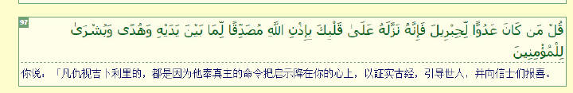
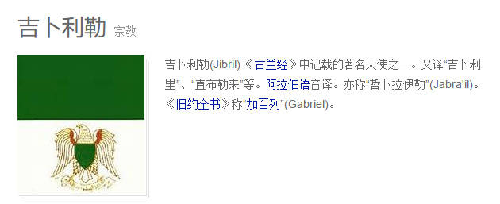
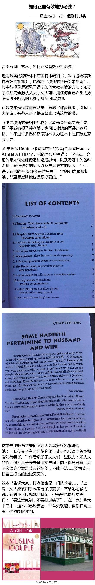

# 普及知识【伊斯兰教“论妇女”】

* 作者: [轻轻闲影](http://m.weibo.cn/u/3844773596)
* [原链接](http://media.weibo.cn/article?id=2309404002345276068464)

对于【伊斯兰教“论妇女”】，会引用其经文，因此先提供古兰经在线阅读链接以便参照（共三个，第一个是不同的译本，可以对应参照。第二个链接是中穆网的有下载。第三个是阿文翻译,第四个链接为布哈里圣训）

http://koran.link/zh/

http://www.2muslim.com/forum.php?mod=forumdisplay&fid=16

http://www.happiness-tv.com/%E5%8F%A4%E5%85%B0%E7%BB%8F.aspx

http://www.2muslim.com/forum.php?mod=forumdisplay&fid=83&filter=typeid&typeid=78(**布哈里圣训**)

古兰经是伊斯兰教最权威的经典，被称最完美的经典，一字不改。根据古兰经第二章97节：你说，凡仇视吉卜利里（天使长）的，都是因为他奉真主的命令把启示降在你（穆罕默德）的心上，以证实古经，引导世人，并向穆斯林报喜。(说明：“吉卜利里”天使长，“你”为穆罕默德，这经文告诉我们，天使从真主奉真主的命令把古兰经启示给了穆罕默德。如图) 穆斯林朋友，这无异议吧？

## 论妇女

在古兰经中，我们要通过“地位，婚姻，离婚，婚姻以外的性关系”了解妇女

## 地位

1. 男人比妇女更优越(古兰经4：34)

2.男人的权利，比女人高一级(古兰经2：228)

3.一个男人的作证等于两个女人的作证(古兰经2：282)

4.在继承遗产的律例上，一个男子，得两个女子的份子(古兰经4：11，176)

5.要用外衣蒙着自己的身体；这样做最容易使人认识她们，而不受侵犯(古兰经33：59)

6.要降低视线，遮蔽下身，莫露出首饰，除非自然露出的，叫她们用面纱遮住胸瞠，莫露出首饰，除非对她们的丈夫，父亲，丈夫的父亲，儿子，丈夫的儿子，兄弟，弟兄的儿子，姐妹的儿子，女仆，奴婢，无性欲的男仆，不懂妇女之事的儿童；叫她们不要用力踏足，使人得知她们所隐藏的首饰(古兰经24：31)

## 婚姻

1.[你们可以择娶你们爱悦的女人，各娶两妻，三妻，四妻；如果你们恐怕不能公平地待遇她们，那末，你们只可以各娶一妻](古兰经4：3) 

2.即使你们贪爱公平，你们也绝不能公平地待遇众妻；但你们不要完全偏向所爱的，而使被疏远的，如悬空中。](古兰经4：129)

3.女性穆斯林不要嫁给这些人:以物配主的男人(古兰经2：221)；男性非穆斯林(古兰经60：10)

丈夫对妻子的态度

1.[你们怕她们执拗的妇女，你们应该劝戒她们，可以和她们同床异被，可以打她们。如果她们服从你们，那末，你们不要再想法欺负她们。](古兰经4：34)

2.[你们的妻子好比是你们的田地，你们可以随意耕种。](古兰经2：223)

不得强占妇女，当作遗产，也不得压迫她们，除非她们作了明显的丑事；丈夫当善待妻子；3.如果丈夫厌恶妻子，那末，丈夫应当忍受妻子(古兰经4：19)

4.迷惑世人的，是令人爱好的事物，如妻子、儿女、金银、宝藏、骏马、牲畜、禾稼等。这些是今世生活的享受；而真主那裡，却有优美的归宿。(古兰经3：14)

5. 丈夫打妻子的背景 (参照布哈里圣训7：72：715)

## 离婚

1.如果夫妻不睦，当从他们俩的亲戚中各推一个公正人，如果两个公正人欲加以和解，那末，神(真主)必使夫妻和睦(古兰经4：35)

2.当男人休妻的时候，当在她们的待婚期之前休她们，不要把她们从她们的房裏驱逐出门，她们也不得自己出门，除非她们做了明显的丑事；当她们满期的时候，男人当善意地挽留她们，或善意地离别她们；当以两个公正人为见証(古兰经65：1，2)

3.男人要休妻当期待四个月(古兰经2：226)

4.被休的妇人，当期待三次月经；她们不得隐讳神(真主)造化在她们的子宫裡的东西；在等待的期间，她们的丈夫是宜当挽留她们的，如果他们願意重修旧好(古兰经2：228)

5.[休妻是两次，此后应当以善意挽留她们，或以优礼解放她们。如果他休了她，那末，她以后不可以做他的妻子，直到她嫁给其他的男人。如果后夫又休了她，那末，她再嫁前夫，5.对于他们俩是毫无罪过的。](古兰经2：229，230)

被休的妻待婚期满，可以嫁人(古兰经2：232)

6.在男人未与妻子交接，也未为她们决定聘仪的期间，如果男人休了她们，那对於他们是毫无罪过的，但须以离仪赠与她们 (古兰经2：236)

7.凡被休的妇女，都应得一份照例的离仪(古兰经2：241)

8.根据男人比女人地位高，女性无权离婚。

## 通奸

**丈夫告发自己的妻子通奸**

1.你们的妇女，若作丑事，你们当在你们的男人中寻求四个人作见証；如果他们已作见証，你们就应当把她们拘留在家裡，直到她们死亡，或真主为她们开辟一条出路。(古兰经4：15)

2. 凡告发贞节的妇女，而不能举出四个男子为见証者，你们应当把每个人打八十鞭，并且永远不可接受他们的见証。这等人是罪人。以后悔过自新者除外，因为真主确是至赦的，确是至慈的。(古兰经24：4，5)

3. 凡告发自己的妻子，除本人外别无见証，他的証据是指真主发誓四次，証明他确是说实话的，第五次是说：他甘受真主的诅咒，如果他说谎言。她要避免刑罚，必须指真主发誓四次，証明他确是说谎言的，第五次是说：她甘受天谴，如果他是说实话的。(古兰经24：6至9)

**对通奸的惩罚**

1.      淫妇和奸夫，你们应当各打一百鞭。你们不要为怜悯他俩而减免真主的刑罚，如果你们确信真主和末日。叫一伙信士，监视他俩的受刑。奸夫只得娶淫妇，或娶多神教徒，淫妇只得嫁奸夫，或嫁多神教徒，信道者不得娶她。(古兰经24：2，3)

2.      你们的妇女，若作丑事，你们当在你们的男人中寻求四个人作见証；如果他们已作见証，你们就应当把她们拘留在家裡，直到她们死亡，或真主为她们开辟一条出路。(古兰经4：15)

3.      你们的男人，若作丑事，你们应当责备他们俩；如果他们俩侮罪自新，你们就应当原谅他们俩。真主确是至宥的，确是至慈的。(古兰经4：15)

男性穆斯林可与女奴发生性关系

1.  如果你们恐怕不能公平对待孤儿，那末，你们可以择娶你们爱悦的女人，各娶两妻、三妻、四妻；如果你们恐怕不能公平地待遇她们，那末，你们只可以各娶一妻，或以你们的女奴为满足。这是更近于公平的。(古兰经4：3)

2.   他们是保持贞操的，除非对他们的妻子和女奴，因为他们的心不是受谴责的；(古兰经23：5，6)

3.  先知啊！我确已淮你享受你给予聘礼的妻子，你的奴婢，即真主以为你的战利品的，你的从父的女儿、你的姑母的女儿、你的舅父的女儿、你的姨母的女儿，她们是同你一道迁居的。信道的妇女，若将自身赠与先知，若先知愿意娶她，这是特许你的，信士们不得援例——我知道我为他们的妻子与奴婢而对他们做出的规定——以免你感受困难。真主是至赦的，是至慈的。（古兰经33：50）

4.  以后不淮你再娶妇女，也不淮你以她们换掉别的妻子，即使你羡慕她们的美貌，除非是你的奴婢。真主是监视万物的。（古兰经33：52）

5.  他们是保守贞操的，除非对自己的妻子和奴婢，他们确是不因此而受责备的；（古兰经70：29，30）

要说的是：圣训相女性的态度比古兰经残忍多了，下火狱多数是女性，哎，经文还是不贴了。有兴趣的可以点击链接

http://www.2muslim.com/forum.php?mod=forumdisplay&fid=83&filter=typeid&typeid=78(布哈里圣训)

暴力就不说了，最典型的残忍就是荣誉谋杀（犯奸淫者，用石头打死。婚前性行为，笞刑百下。来源沙里亚法 12.2，即伊斯兰教法）

“荣誉谋杀”（honor killing)，也称作荣誉处决，大多出现在信奉伊斯兰教的国家，是指那些确实背弃或者被怀疑背弃伊斯兰教贞节观的男女遭到家人或族人无情杀戮的现象。即便许多伊斯兰国家政府认为“荣誉谋杀”是不合法的，在穆斯林群体这种残忍现象依然严重存在。

例子：纪录短片《河中女孩：宽恕的代价》（Girl in the River）中记录了她是如何在父亲和叔叔策划的一场以荣誉为名义，实则意在杀害她的噩运中存活的故事。导演夏明•欧白德•奇诺（Sharpen Obaid-Chinoy），大家google或baidu可以下载收看

加拿大“荣誉杀人”案震惊国际（图）http://legal.people.com.cn/GB/17046712.html

还有最近发生的 网红美女被亲兄谋杀

**最后问一句：古兰经要不要改革？**

附上：

