# 遇见极端宗教服饰怎么办？

* 作者:[PETG善待绿色组织](http://m.weibo.cn/3138561560)
```
喂，110吗
```
前天发布了一个目击消息，在上海大街上有人穿着黑色蒙面服饰：

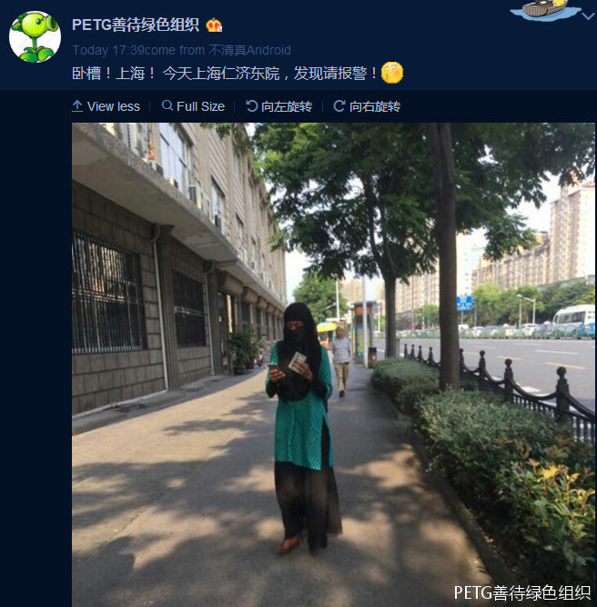

看到大家的回复，感觉有必要作一期科普了：


## 一、哪些是极端宗教服饰/特征

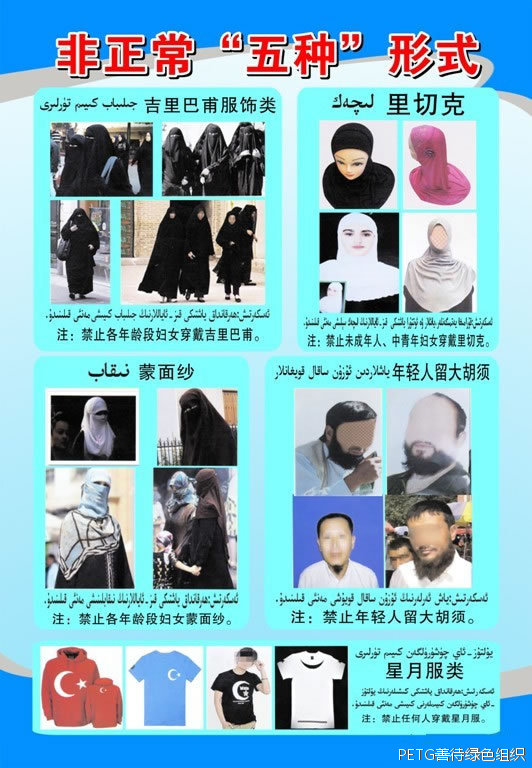

新疆这幅宣传材料进行了很好的总结：

第一个是吉里巴甫 （即Burka，波卡） ，为伊斯兰极端主义女性服饰，特点是：蒙面，面部只露出眼睛（有些连眼睛也得有纱网），一身黑色，是上世纪伊斯兰复古运动的产物，流行于西亚。注意禁止的是**各年龄阶段妇女穿戴吉里巴甫**。

第二个是里切克， “里切克”不蒙面，遮住的是脖子与头发，头巾颜色不仅限于黑色。同样是极端宗教服饰，但是目前只**禁止未成年与中青年妇女穿着里切克**，按照我国的定义，只有大于55岁才能如此穿着。

第三个是蒙面纱，遮挡部位与吉里巴甫一致，但颜色与服装式样稍多样。**禁止各年龄阶段妇女蒙面纱**。

第四个是大胡须，年轻男性穆斯林不刮胡子就是极端宗教的表现，目前只禁止年轻人留大胡须。

第五个是星月标志，这是东突组织的标志（东突旗帜和土耳其国旗只是颜色不同），在我国任何地方都是禁止的。

## 二、极端宗教服饰的来源

阿拉伯地区和近代中国经历类似，都遭到了先进西方文明的入侵。在外部文明的威胁下，自然会产生思变的思潮，这种思潮一般有两种趋势，一种是学习新的文明，一种是复古旧的文化。两种思潮互相竞争，最后民主化进程失败，阿拉伯地区文化复古主义全面复燃 。“回到古兰经”中去，找回“传统道德”的提法大兴于世。“吉里巴甫”这种传说中服饰被“还原”出来，出现在阿拉伯妇女的身上。与之类似的，还有男性的大胡子、”里切克“服饰等等。 

穆斯林为主喜为主怒，古兰圣训圣行要求的必须一字不差的做到，做一点就能让安拉喜悦的，极端主义就做到极致。

**阿依莎رضي الله عنها传述：艾布伯克尔的女儿阿斯玛رضي الله عنها来到先知的家，身穿一件轻薄的纱外套。穆圣（صلى الله عليه و سلم）叫住她，并且对她说：“阿斯玛呀！女孩子到了有月经的年龄，穿衣服就不应当有显露了，除了这里和这里（先知用手指着面部和双手）。 《艾布‧达伍德圣训集》**

穆圣只指了手和脸两个地方可以露，其它地方都是羞体必须包裹住，但具体这两个地方能露多少，那就靠讲经人（ 掌握教义拥有对伊斯兰教义解读权利的人，在阿拉伯叫“乌里玛”，在中国叫“阿訇”、“毛拉” ）来诠释了。比如我国大部分地方，只要求穆斯林女性戴头巾就行（不需要遮住所有头发），也不禁止穿短袖，这算宽松的诠释了；再严一点，必须长袖，可以露脸但头发和脖子一点都不能露，那就是里切克的标准了；最严的就是吉里巴甫那样的蒙面了，最最严的连眼睛都得用纱网遮住。如果不是走路需要眼睛的话，极端宗教恨不得把女人全包起来。**极端宗教认为女人任何可能引起男性性欲的东西都是羞体**。 在ISIS和塔利班统治地区，连女性的声音都被认为会引起男性欲望，女人在宗教场合不能说话，有问题只能拍掌……（我国一些传教的QQ群里，女性聊天只能打字，不能发音频！！！）。下图你能看到这种渐近式的极端。

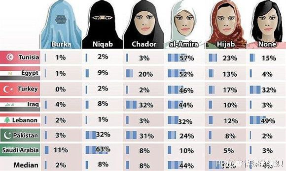

伊斯兰原教旨主义瓦哈比派提出的“人人都有解读《古兰经》的权利”，就是针对各地教宗，期望剥夺教宗们权利，建立统一的、政教合一伊斯兰教派。新疆本地伊斯兰教和最近传入的伊斯兰原教旨主义，根本就是不同的，而且是有冲突的。喀什市艾提尕尔清真寺伊玛目居玛·塔伊尔大毛拉被害事件，就是这种冲突的体现。伊斯兰原教旨主义在传播的时候，首先要消灭的就是当地原生伊斯兰教。 

瓦哈比认为伊斯兰教法中的合法与非法的依据只有安拉降示的《古兰经》和先知的圣训。至于教义和教法学家们的分析，只要不只取自《古兰经》 和圣训文字内容的，都不能成为论据。 瓦哈比派反对异端行为，如生日聚会，妇女在灵车后行进，对天房帷幕的典礼以及举行有苏非派歌咏和舞蹈的纪念活动。此外，人们日常的生活习惯如：吸烟、喝咖啡、男子着丝缎衣服以及染须、佩带戒指也被视为异端行为。瓦哈比派还查禁那些有多神崇拜倾向内容的书籍。瓦哈比教派主张回到穆罕默德时代，回到《古兰经》中去，以及恢复伊斯兰教法演绎制度。

瓦哈比派尊崇这古兰经圣训里杀卡费尔上天堂之类赢72处女的叙述（自杀性恐怖袭击的理论根源），而且由于信仰唯一神论，认为信徒们只能在先知的坟墓前进行训戒和说教，以表达敬意而不是为了诉说和祈求。在清真寺和其它圣徒坟墓祷告都是异端， 因此瓦哈比不断的拆毁圣徒陵墓及其附属的清真寺，以至欧洲人称他们为“摧毁庙宇者”。今年7月4日，一名自杀式袭击者在沙特麦地纳的默罕默德先知清真寺前点爆了身上的炸药带导致4名警察丧生、5人受伤。很多人不理解为什么伊斯兰恐怖分子要炸先知穆罕默德的清真寺，甚至认为这不是穆斯林干的，用脚趾头想都知道这是瓦哈比派ISIS干的。

瓦哈比派催生了新疆第一个恐怖组织——东突伊斯兰党。新疆瓦哈比教派最具盛名的阿不力克木·买合苏木及其培养的“八百弟子”。阿不力克木原本是阿克苏库车县的一个农民，20世纪50年代，曾因分裂主张被判入狱20年，1977年刑满释放。因其宗教学术上的修养，出狱后的阿不力克木当选了自治区人大代表、伊斯兰教协会常委、叶城县政协副主席。1987年他开始创办经文学校。据不完全统计，全疆各地追随他学经的学员约有800余名，号称“八百弟子”。他曾组织学员穿着统一的服装，在库车的新城、老城里进行无声地游行。这些学员后来遍布散落全疆，成为各地从事暴力恐怖活动的骨干分子。

**综上，极端服饰意味着极端宗教，穿着极端服饰的人和她的配偶肯定是宗教极端分子。发现穿着极端宗教服饰的人不仅要对本人进行检查，还需要顺藤摸瓜：检查其亲友家人，对其住所等进行搜查看是否有极端宗教资料以及武器危险品等。**

**此外就如清真HALAL食品认证暗示非清真食品肮脏一样，极端宗教服饰也暗示世俗女性的穿着是淫荡不自重的，甚至用来作为强奸、伤害非穆斯林女性的借口。**

Sheik Taj Din al-Hilali是澳大利亚最高级别的伊斯兰宗教领袖。他近日将没有穿戴穆斯林服饰的女性比喻为“没有遮挡覆盖的裸露肉”、“这块肉在街道上游荡，被猫吃掉。” 在悉尼清真寺的开斋节仪式上，他发表评论说最近一批因为轮奸妇女而被判处监禁的穆斯林男性不应当受到谴责。“那些女人穿着裸露放荡的衣服，浓妆艳抹，给人暗示。当你看到她，完全不会有任何同情怜悯之情。因此我觉得问题在于，（这些强奸）事件是谁引起的？”台下有500名信徒正在聆听他关于奸淫的讲话，Sheik Taj Din al-Hilali接着说到：“**当你拿着一块肉上街、或者去公园等地方，没有任何覆盖，完全暴露，最后猫过来把肉吃掉了。那么错在谁呢？是应该怪猫呢还是应该怪这块裸露的肉呢？**” 他最后肯定地说：“问题当然出在这块裸露的肉上。”“如果她们戴上面纱和头巾，（强奸）这些问题就不会存在了。”**(Outrage as Muslim cleric likens women to 'uncovered meat')(Muslim leader blames women for sex attacks)**

    2005 夏天，数名男性穆斯林来到悉尼东区一个叫cronulla 的海滩区， 以当地白人女性不遵守伊斯兰教规定，裹长袍、带头巾，且在海边享受阳光海滩这一借口， 对海滩上的女性极尽侮辱，激起公愤，被当地人追打。事件发生之后，悉尼周边2000多名穆斯林上街游行示威，因为他们认为受到了种族歧视。游行后来演变成骚乱，数千辆汽车被砸毁，300多人受伤。两周之后事件才得以平息，警察逮捕了105人。

    2002年，5名阿富汗难民以谓“伊斯兰姿式”在一公园轮奸了一名十七岁的少女。他们在法庭上他们声称，受害人被他们用真主的方式轮奸是她的荣幸。 

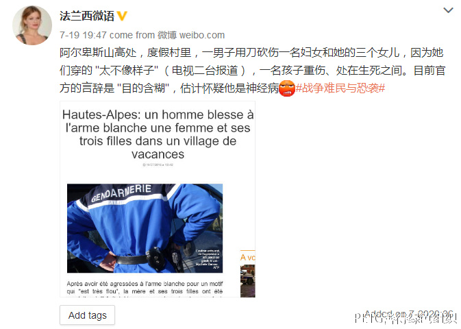

## 三、极端宗教服饰在我国是否合法

许多国家出台了禁止极端宗教服饰的法律： 荷兰、丹麦、瑞典支持禁穿“吉里巴甫”服。法国、西班牙、比利时、意大利甚至发布了禁止女性在公共场合穿着吉里巴甫服的禁令。我国 2015年11月1日施行的刑法修正案增加了针对极端主义的罪行：

**第一百二十条之三【宣扬恐怖主义、极端主义、煽动实施恐怖活动罪】以制作、散发宣扬恐怖主义、极端主义的图书、音视频资料或者其他物品，或者通过讲授、发布信息等方式宣扬恐怖主义、极端主义的，或者煽动实施恐怖活动的，处五年以下有期徒刑、拘役、管制或者剥夺政治权利，并处罚金;情节严重的，处五年以上有期徒刑，并处罚金或者没收财产。**

**第一百二十条之四【利用极端主义破坏法律实施罪】是指利用极端主义煽动、胁迫群众破坏国家法律确立的婚姻、司法、教育、社会管理等制度实施的，处三年以下有期徒刑、拘役或者管制，并处罚金;情节严重的，处三年以上七年以下有期徒刑，并处罚金;情节特别严重的，处七年以上有期徒刑，并处罚金或者没收财产。**

**第一百二十条之五【强制穿戴宣扬恐怖主义、极端主义服饰、标志罪】以暴力、胁迫等方式强制他人在公共场所穿着、佩戴宣扬恐怖主义、极端主义服饰、标志的，处以三年以下有期徒刑、拘役或者管制，并处罚金。**

**第一百二十条之六【非法持有宣扬恐怖主义、极端主义物品罪】明知是宣扬恐怖主义、极端主义的图书、音视频资料或者其他物品而非法持有，情节严重的，处三年以下有期徒刑、拘役或者管制，并处或者单处罚金。**

其中，**【强制穿戴宣扬恐怖主义、极端主义服饰、标志罪】**就是一项全国性明确针对极端宗教服饰的法律。一部分女性是被迫穿着极端宗教服饰，该条款对于解救这部分女性有很大帮助。

最高人民法院、最高人民检察院、公安部2014年9月9日颁发的**《关于办理暴力恐怖和宗教极端刑事案件适用法律若干问题的意见》** 规定：  “5、设计、制造、散发、邮寄、销售、展示含有宗教极端、暴力恐怖思想内容的标识、标志物、旗帜、徽章、服饰、器物、纪念品的；……”实施上述行为， 以煽动民族仇恨、民族歧视罪定罪处罚；同时构成煽动分裂国家罪的，依照处罚较重的规定定罪处罚。 

虽然没有明确的针对 极端宗教服饰 穿着者的条款，我国现有的刑法条款也是可以适用的，可以以“寻衅滋事”，“煽动民族仇恨、宗教仇恨”，“非法持有宣扬恐怖主义物品”，“宣扬恐怖主义” ，“聚众扰乱社会秩序罪” ，甚至“煽动分裂国家，煽动颠覆国家政权”等罪行进行处理。

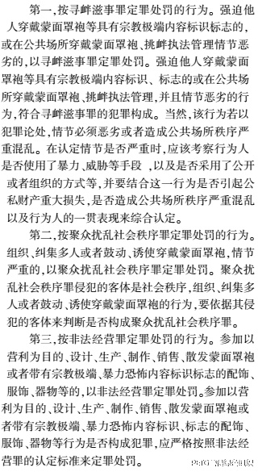

与刑法有关的定罪依据

各省市做的最好的是新疆，2015年1月，新疆维吾尔自治区人大常委会批准了**《乌鲁木齐市公共场所禁止穿戴蒙面罩袍的规定》**，规定公共场所禁止穿戴蒙面罩袍，禁止在公共场所穿戴其他宣扬宗教极端思想的服饰、佩戴或者使用徽章、器物、纪念品和标识、标志，将禁令上升到了法规层面。**《新疆维吾尔自治区宗教事务条例》**也对宗教活动进行了很好的规范。

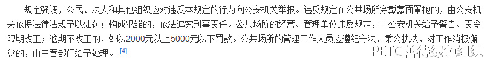

乌鲁木齐市公共场所禁止穿戴蒙面罩袍的规定

目前全国性的明确禁止蒙面罩袍的法规尚未制定，但已得到部分人大代表的关注与支持； 《新疆维吾尔自治区去极端化条例》也正在制订当中。 各地公安已逐渐增强了要管这类事的意识，但是相关立法还是太缺少，尤其是缺乏细化的司法解释、政策意见。

以下是两起处理案例可供参考：

新疆克拉玛依市**天山路派出所迅速办理一起“两类人员”妨碍执行公务案**

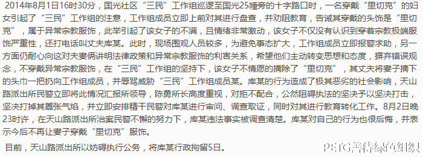

**河南黑衣蒙面女子被武警带走 五种服装明令禁止穿戴**

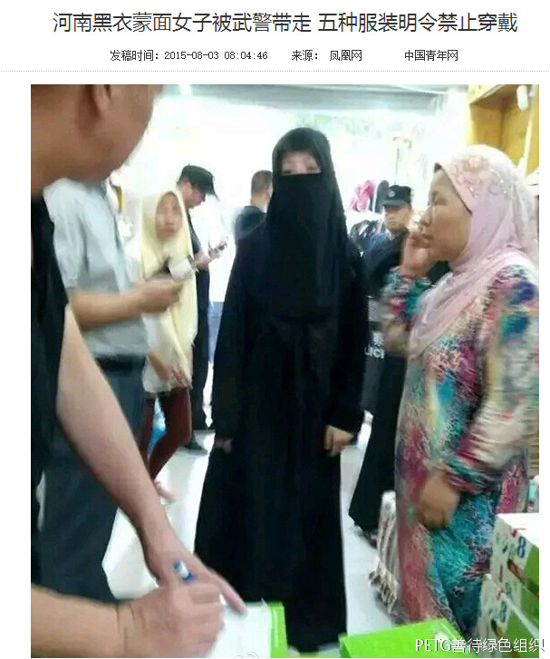

## 四、发现该如何处置

如果您在街上碰上极端宗教服饰，你该怎么做呢？

最方便有效的办法就是打110，110有一套完善的接警、出警、处置和回报制度，可保证出警的及时与效果；你不用担心会被警察批评，这肯定是极端宗教分子不会错，即使存在浪费警力的风险，但与消除恐怖袭击风险相比肯定是利大于弊。

告知警察在什么时间什么地点发现极端宗教服饰，描述清对象的特征、行为与动向。在保证自身安全的前提下，可以继续跟踪，与民警保持联系。

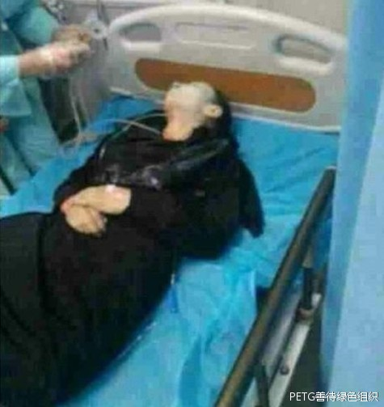

**昆明火车站“3·01”暴恐案女恐怖分子作案时就穿着极端服饰，如果人们对极端服饰多一点警惕，这场悲剧可以避免。**

**所以无论你在任何时间任何地点发现极端服饰，请毫不犹豫拿起电话订（bao）购（jing）吧~！**

最后请欣赏极端宗教服饰~

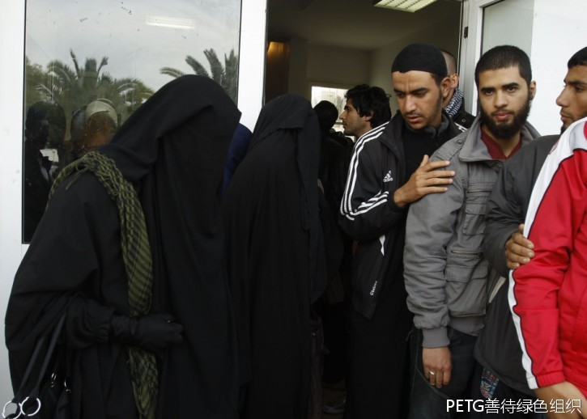

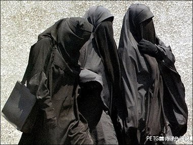

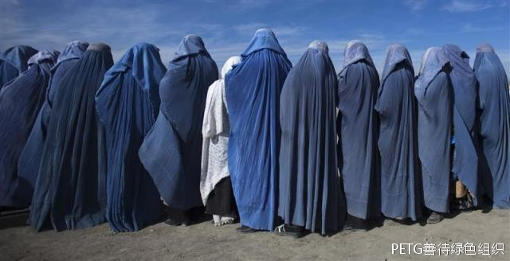

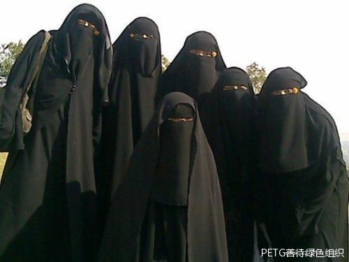

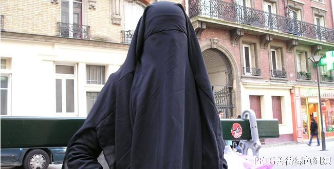

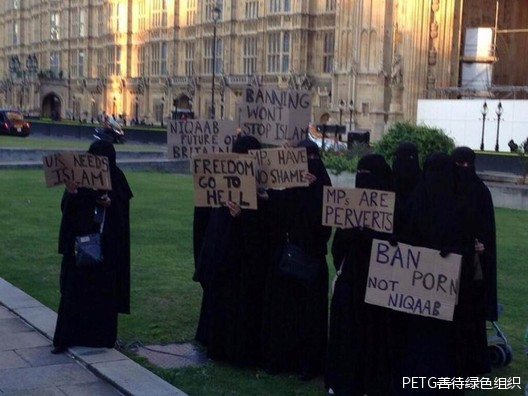


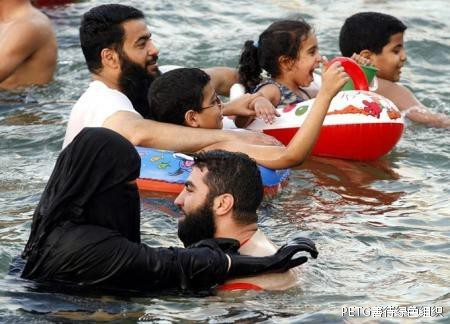

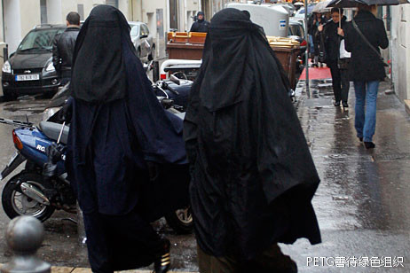

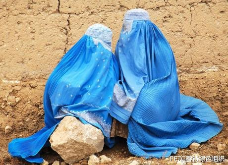

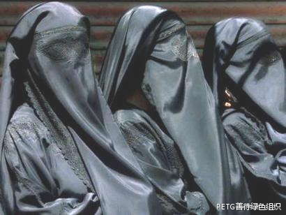

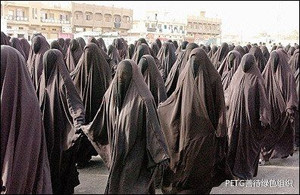


