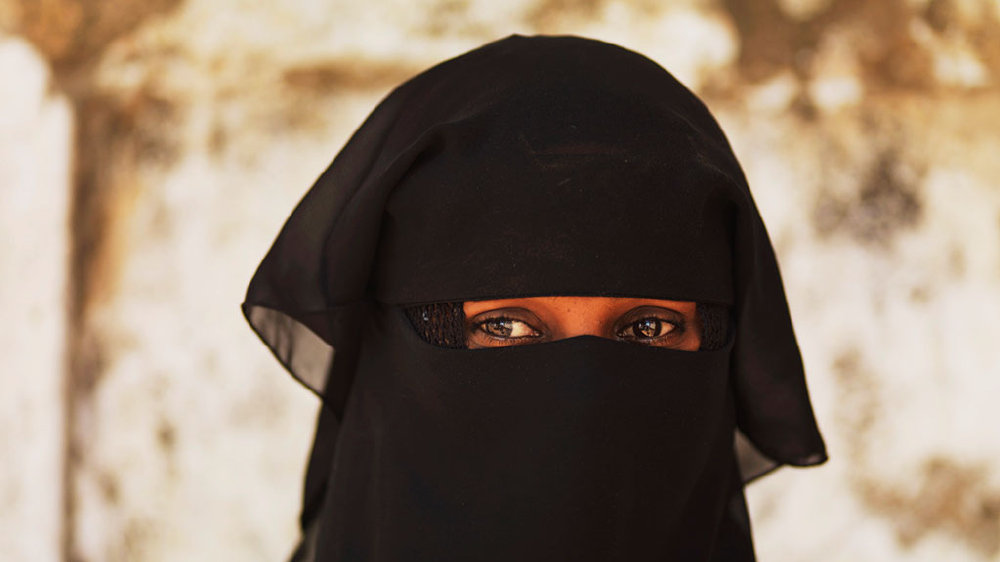
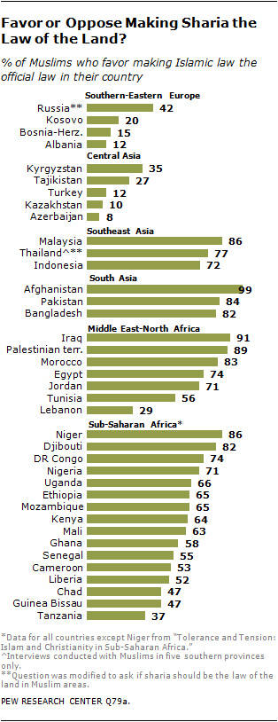
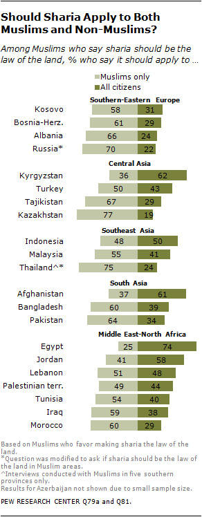
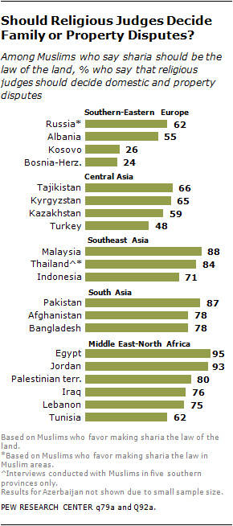
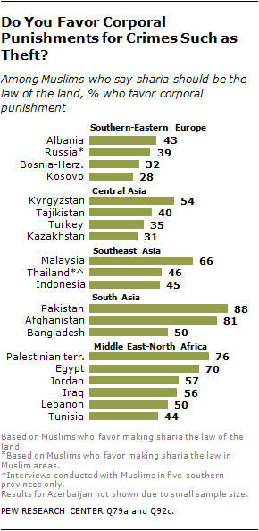
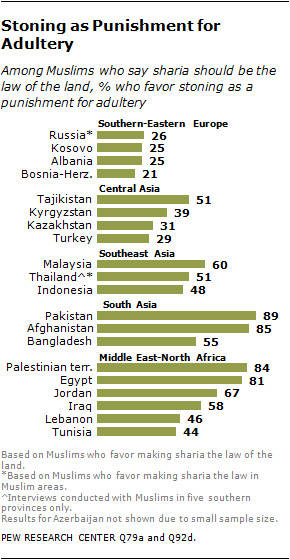
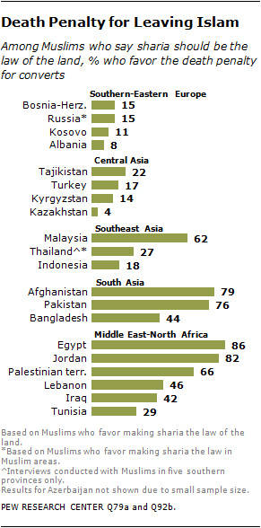
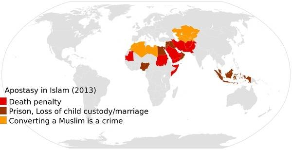

#中东地区是否存在温和派穆斯林？

* 作者: [灵异档案员王昙](http://m.weibo.cn/u/2981083181)
* 原链接: http://media.weibo.cn/article?id=2309403980107332067680

有人说中东地区的恐怖分子是少数穆斯林，大多数穆斯林是好的，那么我们从数据上来观察一下，看看是不是这样。

皮尤研究中心2013年做过一个关于全球穆斯林对沙里亚法态度的调查，我们来看其中的几项数据：

是否支持将沙里亚法作为现实法律？

中东各国穆斯林的支持率是：

伊拉克（91%），巴勒斯坦（89%），摩洛哥（83%），埃及（74%），约旦（71%），突尼斯（56%），黎巴嫩（29%）

那么什么是沙里亚法呢？沙里亚法（ الشريعة al-Shari‘ah law）：阿拉伯语音译，原意为“通往水源之路”，意为“宗教的规定的一切，好像一个口渴的人需要水一样，是必须的。

引申为“应该遵循的正道和常道”。又称“沙里亚”( الشرع al—Shari‘) 。即“伊斯兰教法”。伊斯兰教宗教法的总称。指《古兰经》中所启示的、可靠圣训中所解释的安拉所有的命令和训诫，为每一个穆斯林必须遵行的宗教义务。

那么在沙里亚法下的异教徒是怎么样生活的呢？说实话，真的有点惨……

§ 要缴纳很重的人头税(即交纳丁税)(古兰经9：29)，及地税

§ 不准参军

§ 不能举行公开宗教集会（祭祖上坟肯定是没戏了）

§ 所建造的房屋不能高于穆斯林所建造的

§ 所穿的衣服与穆斯林所穿的不同，通常要佩带作为识别的徽章

§ 不准骑马，只准骑骡或驴

§ 对穆斯林表示尊敬，例如让座

o 根据伊斯兰法学家，其它条例还有

§ 不准公开出售他们的宗教书籍，只可在他们当中发行，出售

§ 在法庭中的见证不具有和穆斯林同等的效力

§ 不准携带自己的武器

§ 隔离在少数民族居住区，让他们在政经上成为社会的下层

· 若一个穆斯林杀死一个非穆斯林，不需判死刑(布哈里圣训4：52：283；9：83：50)

· 若一个非穆斯林杀死一个穆斯林，就要接受伊斯兰律法判为死罪

· 由于古兰经记载[神(真主)绝不让不信道者对信道的人有任何途径](古兰经4：141)，不准一家公司的穆斯林老板授权给一个异教徒管辖一个穆斯林，非穆斯林没有尊荣(古兰经63：8)

你们自己感受下……

是否支持沙里亚适用于非穆斯林？
埃及（74%），约旦（58%），黎巴嫩（48%），巴勒斯坦（44%），突尼斯（40%），伊拉克（38%），摩洛哥（29%）

是否支持宗教法官裁决家庭或财产纠纷？埃及（95%）约旦（93%）巴勒斯坦（80%）伊拉克（76%）黎巴嫩（75%）突尼斯（62%）

是否支持对偷盗处以肉刑？巴勒斯坦（76%）埃及（70%）约旦（57%）伊拉克（56%）黎巴嫩（50%）突尼斯（44%）

是否支持对通奸罪处以石刑？巴勒斯坦（84%）埃及（81%）约旦（67%）伊拉克（58%）黎巴嫩（46%）突尼斯（44%）

是否支持对不再信仰伊斯兰教者处以死刑？埃及（86%）约旦（82%）巴勒斯坦（66%）黎巴嫩（46%）伊拉克（42%）突尼斯（29%）

这是早年间的调查，经过这几年的折腾，估计温和派的数量已经少之又少了，当然，如果这个锅完全扔给伊斯兰教，是不符合逻辑的，人们思想上的保守可能还和经济、境遇、受教育程度有关。

我们在讨论的时候，经常会说中东的穆斯林也有好人，从上面这组数据，我们可以看得出来，确实中东的穆斯林中也有一定比例的好人，但这个比例好像……远不如我们想象的多。

而相比之下，想以宗教代替法律的，则更多，比如突尼斯2014议会选举的结果显示，复兴运动成为第二大党，得票率（27.79%）；伊拉克2014年议会选举中，主要由达瓦党组成的法制国家联盟得票率最高（24.14%）；

约旦2013年选举中，伊斯兰中央党成为得票数最多的政党，获3席；埃及2015年大选中，光明党得票数494042张，位列第三。后两国的选举情况还要考虑到政府的刻意限制。

所以如果把中东的温和派穆斯林等同于改革派，世俗派穆斯林，我们可以得出下面这样的结论，中东的大部分穆斯林不支持信仰自由，政教分离，男女平等。他们或许不会是恐怖分子，但和我们之间的观念，还是有巨大差异的。

前几天我们看到一个话题，说的是为什么中国人没爱心，不愿意接受难民，我倒是想反问一下说中国人没爱心的朋友，请问带着这种思想的难民，我们接收后怎么安置？怎么改变他们的观念？怎么去说服他们学会平等对待异教徒、无神论者？

至于有人说，即使在中东，穆斯林也可以随意退教……

那么请看下面这组数据，这是伊斯兰为主流信仰的国家，对叛教者的态度：

红色是退教者死刑。

褐色是退教要判刑，被剥夺权利。

我决定去吃点猪排骨压压惊……
