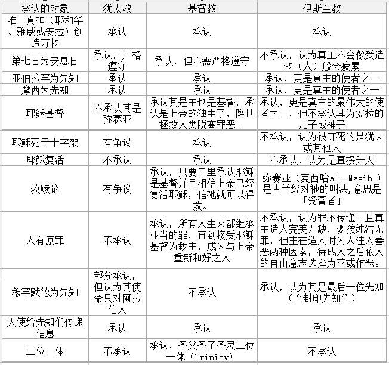
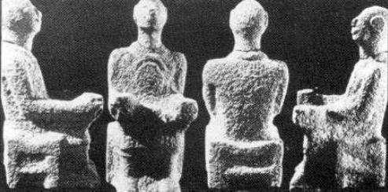
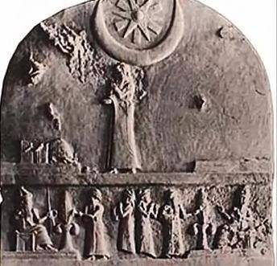

#剖析亚伯拉罕诸教（基督/犹太/伊斯兰）区别，＆伊斯兰主义

* [布云轩](http://m.weibo.cn/u/2284806045?)
* 07.19 00:17
* [原链接](http://media.weibo.cn/article?id=2309403998745304936035)

```
都别装神秘。如果一定要有选择，不要被一家之言或狂热的口号所蒙蔽。
```

##零

不讨论有没有神（上帝或者安拉）这个问题。目前不可证有，也无法证伪。很不科学，因为这是哲学范畴。

真不想黑某一宗教，这是我真实的想法，所以我保证不以“邪教/毒瘤”字样来形容，大家心里都有数。尽量保持客观，少夹私货，能引用尽可能引用。

##一

基督教用书：圣经新旧约全书

犹太教用书：摩西五经（圣经旧约律法部分）

伊斯兰教用书：除古兰经外，逊尼派+6圣训【布哈里圣训（Sahih al-Bukhari），穆斯林圣训（Sahih Muslim），艾布·达吾德圣训（Sunan Abu Dawood），提尔密济圣训（Sunan al-Tirmidhi），穆吉台巴圣训（Al-Sunan al-Sughra），伊本·马哲圣训 （Sunan ibn Majah） 】；什叶派+4圣书【宗教学大全（Kitab al-Kafi），教法自通（Man la yahduruhu al-Faqih），教法修正（Tahdhib al-Ahkam），圣训辨异（Al-Istibsar）】

##二

要做区分，说明他们有**相似性**：

①都自称宇宙唯一真神造物主。②共同祖先。③共同的圣地。④经典的部分雷同。

展开

①都自称宇宙唯一造物主。基督教源于古犹太教。伊斯兰教是是在吸收了犹太教与基督教的经典和教义思想的基础上创立的，但伊斯兰教徒（穆斯林）对此说法持否定，反认为前二者把古老的一神教内容更改。**时间轴先后顺序**为：犹太教，基督教，伊斯兰教。

②共同祖先。没看错，是共同祖先。根据《圣经》和《古兰经》记载，亚伯拉罕（《古兰经》阿拉伯语音译易卜拉欣，下同）有两个儿子：以实玛利（易斯玛仪），以撒（易司哈格）。

以实玛利：亚伯拉罕和原配妻子撒拉（撒立哈）的女仆夏甲（哈哲尔）生的儿子。穆斯林根据《古兰经》认为他是阿拉伯人的祖先,《圣经》中也认为其为阿拉伯人的祖先。

以撒：亚伯拉罕与原配妻子撒拉之子。以撒又有两子：雅各（叶尔孤白）（后改名以色列，以色列国的由来）；和以扫（后改名以东）。
**
犹太人和阿拉伯人都认为亚伯拉罕（易卜拉欣）是他们的祖先**。亚伯拉罕在基督徒、穆斯林中都有很高地位。在基督教信仰中，亚伯拉罕是信心之父，穆斯林则称易卜拉辛为“众人的师表”。事实也确实是这样。

③共同的圣地。耶路撒冷（古都斯）。

④经典的部分雷同。敏感的会看出端倪，情节怎么会相似度那么高？都是同源，雷同也正常，抄家谱嘛。但还是要**理清先后顺序**：圣经旧约BC1400-BC400，由不同先知在不同地点书写。圣经新约AD50-AD95，由不同先知在不同地点书写。古兰经AD610-AD632，默罕默德的继承人根据默罕默德在世时所言，收集后抄录的定本。

以上都有原文/文献/历史可查，没读过圣经和古兰经，那抱歉，确实在书中记载，就不信我没办法替你读书，在下文作为**论据**我会引用一些。

##三

不同点也很多，这正是问题的所在。因为根据以上几点，很多人，包括梵提冈的那位教皇也倡议的一种观点：大家信的都是一位神嘛，吧啦吧啦…搞大联合嘛，吧啦吧啦……对此我真不敢苟同，**不同点如下表**。



各教主要论点对比
图片来源于 非盈利性组织——以色列计划  
按上面表格卡定义，我应该归类于基督教信徒。我并不承认我属于任何宗教，完全不属于大陆三自教会（教堂），更不接受任何组织的领导。

※注1：不讨论孔子的“性本善”，也不讨论荀子的“性本恶”。

※注2：各教上天堂/乐园方式

A：犹太教信上帝守诫命上天堂，主要是犹太人。

B：基督教信耶稣（以及他的事）就上天堂。

C：伊斯兰教想上天堂：圣战而死的烈士——直接进；普通穆斯林都要先在火狱受完刑法才能进 。以下是论据和拓展：
```

麦格达姆.本.麦阿迪凯勒拜(愿安拉喜悦之）的传述：使者（愿安拉福安之）说：“烈士在安拉那里可获得六种报酬：1）在流第一滴血时安拉就恕饶他，2）看见天堂中自己的位置，3）从坟墓的刑罚上受到拯救，从大的惊恐上获得平安，4）获得伊玛尼的装饰，5）聘娶仙女为妻，6）给自己七十个亲戚说情。” ——Sunan ibn Majah
“以掌控我的生命的神的名义，我需要为真主而死；然后我会复生，然后再次为真主而死”；“先知说，‘没有任何上了天堂的人愿意再返回这个世界，即便给他所有东西，除了那些烈士。他们愿意为了赐给他们的无上光荣而回到这个世界死上10次’。”——sahih 781, 782
艾布.乌玛麦（愿安拉喜悦之）的传述：使者（愿安拉福安之）说：“安拉准许进入乐园的每个人，安拉均让他聘娶七十位妻子，二位仙女，....——Sunan ibn Majah
```
使者是指默罕默德，understand？

##四

**历史角度的不同**：

从历史而言，耶和华是以色列人的神，而亚当、闪及亚伯拉罕只是以色列民族的祖先。以后，随着犹太教衍生出来的基督教在非犹太人为主的地区（如罗马帝国时期的欧洲和美洲）传播，加上后来的伊斯兰教在闪米特人所在的西亚以外很多地区亦广泛传播，古犹太民族的“神”耶和华由于其衍生出来的宗教的传播，遂变成了所有信仰闪米特一神教教徒的神，尽管这些人群大多并不属于闪米特民族。由于闪米特一神教的排他性和扩张性，在改信闪米特一神教的民族人群中，闪米特的信仰和神变便取代了本民族人群原有的信仰和神。

出处引用wiki  共同祖先最后一段 点这里[跳转wiki](https://zh.wikipedia.org/zh-cn/%E4%BA%9E%E4%BC%AF%E6%8B%89%E7%BD%95%E8%AB%B8%E6%95%99)

##五

**基督教与犹太教的主要区别**：

犹太教几乎否认了新约圣经全部要点，认为人无原罪，进天国是根据行为，守教条，不需要救赎，等待弥赛亚降临。基督教认为犹太教所说的预言之子弥赛亚（旧约记载）就是新约的耶稣基督，并且如耶稣所说自己是上帝的儿子。犹太教否认耶稣是上帝的儿子，否定他是弥赛亚，并且至今都在等待弥赛亚的到来。耶稣符合旧约中300多条预言，包括先知弥迦预言降生伯利恒，以赛亚预言其由童女怀孕（存异，有违常理，有记载却无法重演），撒迦利亚预言骑驴进圣城，他的门徒卖他，大卫预言弥赛亚手脚被戳士兵拈阄分他的衣服，等等。可是并不符合犹太人对弥赛亚政治领袖的预期。而**以赛亚对弥赛亚的预言之一是以赛亚书53章7节：“它被欺压，在受苦的时候他不开口；他像羊羔被牵到宰杀之地，又像羊在剪毛的人手下无声，他也是这样不开口。”**。这可不是解决与别国的冲突，并把百姓从敌人手中解救出来的政治领袖的描述。看来人们的认知还是存在偏差的，至于谁是谁非，我的判断只能代表我自己。

**基督教与伊斯兰教重要区别：**

伊斯兰教不承认安拉有儿子，基督教承认耶稣是上帝的儿子。有没有儿子可这不是小事，这都能搞错了？结合“四”来看，还能是同一位神？耶路撒冷从金顶清真寺里面看房顶就写着，**安拉没有儿子**，一圈，一共三遍，有好事儿的可以去证实，再回来打我脸。圣经新约中明确表示耶稣是圣子，路加福音1:30-33“**天使对她说：“马利亚，不要怕！你在上帝面前已经蒙恩了。你要怀孕生子，可以给他起名叫耶稣。他要为大，称为至高者的儿子；主上帝要把他祖大卫的位给他。他要作雅各家的王，直到永远；他的国也没有穷尽。**”。所以根本不是同一个上帝。我想这条没得洗了吧。

##六

既然不是同一位神，那是从何而来呢？

我们知道基督教的记号是十字架，在迫害严重的时代，记号是Α（alpha，**阿尔法，希腊文首字母）和Ω（omega，欧米茄，希腊文尾字母），这不是没有原因的，前者是耶稣钉十字架，后者是启示录22：13”我是阿拉法，我是俄梅戛；我是首先的，我是末后的；我是初，我是终。**”的象征，分别在以赛亚书44：6；48：12-15都有类似的经文。

然而伊斯兰教标志是什么呢？绿色，以绿为贵，同时还有黑和白，似乎没什么。仔细观察会发现还有星月标志，《古兰经》说，拜像“是魔鬼的行为”，可是**统观伊斯兰世界，从国旗到清真寺都有星月标志**，而这是从何起源呢？答案是月神，名叫安拉（Allah）。伊斯兰世界对此十分避讳，也不做解释，可谓只字不提。有什么证据呢？展开会很长。

先贴出处[油管视频](https://www.youtube.com/watch?v=1O-Zse7n8V0)

**文章评论处贴英文原文，先翻译些重要的。**

```
穆罕默德的父亲、叔叔都把Allah （安拉）放入了他们的名字：父亲的名字叫做Abd-Allah，叔叔的名字叫做Obied-Allah。这对应了巴比伦文化中，将别人的神嵌入自己名字的传统，通过将伟大月神放入名字的办法来敬拜它。 
这回答了以下疑问：为什么在《古兰经》中未对Allah（安拉）进行定义和解释？为什么穆罕默德默认为那些个“异教阿拉伯人”早已认识了安拉？ 
答案是阿拉伯人确实早已认识了安拉——安拉本来就是他们的月神。穆罕默德甚至没有在《古兰经》中费力介绍这位新神的概念，而仅将这位新神建立在阿拉伯地区已经存在的月神身上。穆罕默德与那些敬拜多神的阿拉伯人的不同之处在于，他更进一步：多神教阿拉伯人崇拜月神安拉的时候，认为安拉是阿拉伯众神中最伟大的神，而穆罕默德则认定安拉不仅最伟大，而且安拉是唯一的神。
穆罕默德说：“看啊，你们已经相信月神安拉是众神中最伟大的神，但我要你们接受安拉是唯一的神。我不是要把安拉拿走，只是要把安拉的妻子、女儿们和其他的神拿走。”下图是在阿拉伯地区发现的安拉塑像，注意在胸前的新月形。
```



星月A



星月B

```
那些敬拜多神的阿拉伯人，从未指责穆罕默德，因为穆罕默德没有引进一位新的安拉神；考古学的证据发现，安拉神一直维持不变。【大英百科全书——宗教】：“安拉是一个伊斯兰教出现以前已经存在的神，对应于巴比伦的BEL神（巴力）”。安拉是换了新名字的巴力，其他并无改变。
穆罕默德两手准备：对阿拉伯人，他说他依然相信月神安拉；对犹太人和基督徒，他说安拉和上帝无区别。这也是天主教的招数，他们将基督教和多神宗教混合起来。今天，很多基督徒不明就里、相信安拉和上帝是同一位神，而事实上，安拉其实就是古老的巴力神。幸运的是，那个时代的犹太人和基督徒很清楚穆罕默德的骗局，他们拒绝了安拉，并认定安拉也是假神之一。这激怒了自封的先知——穆罕穆德。
A计划之奉承和操纵失败后，B计划之威胁、杀戮和暴力随之降临。
穆罕默德与犹太人的敌对关系可以非常清晰地被看出来。《古兰经》前后两个部分存在非常明显的风格分化，这与穆罕穆德的前后两个人生时期所呈现的状态高度相关——早年穆罕穆德住在麦加（Mecca），没有什么名望和影响力，比较弱小；后来他成为一位富庶的军阀式首脑，迁至麦地那（Medina），并在那里获得政权。
麦加时期撰写的《古兰经》，行文宁静，此时穆罕默德还没有多少军事实力，他要让当地的犹太人相信他是上帝的先知。这是A计划时期。 后来穆罕默德在麦地那获得财富和权力，该时期他所撰写的《古兰经》，充满对犹太人的仇恨和怒火。这是B计划时期。穆罕默德开始预备战争，对象是那些反对他、或反对他的教训的人。
※※※伊斯兰教中的"作废"的原则，对我们理解古兰经十分重要： 古兰经中，若有两段自相矛盾的经文，那么前面的段落（或较早的段落）将作废；《古兰经》中关于暴力、战争的经文是在后半部分、较晚（麦地那时期）撰写，麦加时期的那些宁静的经文就作废了。
这个原则，是穆斯林的工具：当我们质疑他们有关伊斯兰教的暴力时，他们就会引用麦加时期（早期）的温和的经文。一般人也许就这么被说服了，因不明白伊斯兰教中的“作废”原则。穆罕默德在麦地那时期的言行，让伊斯兰教无止境地恨恶犹太人、造成中东的问题，这些言行也以侍奉安拉的名义，鼓励一切形式的恐怖主义、谎言、暴力、对不信者的谋杀/压制/统治，然后任意抵消所行的一切罪恶。
伊斯兰恐怖分子并没有违背穆罕默德的教训，他们的行为与1400年前没有变化。圣经里说："你们要从树的果子来认识树。“整个伊斯兰教的历史，充满了这种形式的暴力，当我们看到穆罕默德的人生细节，就能发现为问题。坏树的树根伸到黑暗王国，坏树结出坏果子。
```
各大搜索引擎都用用看，以考古为基础，阐述安拉本是月神的文章很多很多。这样的文章下面常有歧视谩骂发生，相比流血事件，这显然温和了很多。伊斯兰世界高层面对这一说法回以不解释不承认不理会的态度。全当看不到。

##七

**伊斯兰主义**

如今很多暴利恐怖事件，尤其欧洲接受难民以来，隔三差五，接二连三，这些恐怖袭击者要的是什么，想法是什么，我想这对于减少恐怖袭击有很大作用。Is声称对多起恐怖袭击负责，从巴黎，到Nice，有些真的毫不相干，好像是在立flag，仔细观察也不难发现，凶手确实是虔诚或不虔诚的穆斯林。先**引用一些伊斯兰经典**，否则没有说服力，根据上文说到的自相矛盾时“作废”原则，**主要看看在麦地那时期以后的教导**吧。

```
”与挡在安拉道路上的人打仗，杀死那些不相信安拉的人。“——Ibn Ishaq 992
"不管在哪里遇到异教徒，就和他们打仗，战场上围攻、埋伏、抓住他们，杀死他们；如果他们相信愿意相信安拉，就建立正常的祷告敬拜生活，给他们生路。"——Sure篇9章5节
安拉的使者呼叫阿里（Ali）说：“往前去（战斗），不要观望，直到安拉将胜利赐给你。“阿里按照命令做了一会儿、没有观望，然后停下来问：”安拉的使者，我要战斗到什么时候？”先知说：“战斗到知道认定安拉是他们唯一的神、穆罕默德是他们的使者”——Sahih Muslim 5917
“Fartana和她的朋友是歌者，她们曾唱歌嘲讽使徒穆罕默德，所以命令杀死她们。“——Ibn Ishaq 819
”除了俘虏之外，所有的结过婚的女人，你们不可以玷污。“—— Sura 篇4章24节
```
※上面这条真是无法和世俗社会，文明社会对接，不改革的话，谁能接受得了？所有的为所欲为，都可以说是安拉的启示。

```
”使者说：“杀死任何落入你手的犹太人”。于是，穆哈伊塞（Muhayyisa ）跳到犹太商人Ibn Sunayna的身上，并杀了他，Ibn Sunayna与他有商业上往来。Huwayyisa是穆哈伊塞的长兄，当时还不是穆斯林，动手打了穆哈伊塞，并且说：“你这个神的敌人，是犹太人的财富养肥了你，你却杀了他吗？”穆哈伊塞回答说：“若那个命令我杀他的人，同样命令我杀你，我会毫不犹豫地砍下你的头。”这是Huwayyisa接受伊斯兰教的........Huwayyisa惊呼道：“以安拉发誓，一个能让你到如此境界的信仰，是一个了不起的奇迹！”于是他成为了穆斯林。——Ibn Ishaq 554
穆斯林被教导说，犹太人被全部消灭后救赎才会到来，因此他们不会停止对犹太人的战争：”穆斯林杀死犹太人后，末日才会到来。犹太人将藏在石头和树的后面。“石头和树木也将呼叫说：“噢，穆斯林，噢上帝的使者！有一个犹太人在我后面，来杀死他们.“ ——Bukhari 4:176-177
```
变态般地鼓动杀人，并且杀光犹太人以后救赎才会到来！在穆斯林内部，这种鼓动杀人依然存在：若有人不再信伊斯兰教，那么他甚至会被父母或兄弟姐妹杀死。他们称这为“仁慈的死刑/荣誉谋杀”。

荣誉谋杀，链接[点击跳转wiki“荣誉谋杀”](https://zh.wikipedia.org/zh-cn/%E8%8D%A3%E8%AA%89%E8%B0%8B%E6%9D%80)案例 ：[点击跳转BBC](http://www.bbc.com/news/world-asia-35943732)

有几个概念要明确

沙里亚法规=**伊斯兰教法**=伊斯兰法律：是一套以伊斯兰教教义为准则的法律，根据《古兰经》和圣训的内容，对人民日常生活和行为作出法律规定，普遍暴力血腥。

出处wiki，链接[点击跳转wiki](https://zh.wikipedia.org/wiki/%E4%BC%8A%E6%96%AF%E8%98%AD%E6%95%99%E6%B3%95)

**伊斯兰主义**：是指一种主张伊斯兰不仅仅是宗教信仰，而且是一套政治体制的意识形态。

Ps：好熟悉的说法！客观地描述，伊斯兰主义不单是政教合一，而是一股综合了宗教、国家主义、民族主义、社会主义以及“反现代化”并带有愤怒情节的思潮。

出处wiki，链接[点击跳转wiki](https://zh.wikipedia.org/wiki/%E4%BC%8A%E6%96%AF%E5%85%B0%E4%B8%BB%E4%B9%89)

说起政教合一圣经里这么一段记载，在**马太福音22:15-22，法利赛人问耶稣：纳税给该撒可不可以？（想钓鱼执法）。耶稣说：上帝的归上帝，凯撒的归凯撒。**这是较早的政教分离说法，还有**彼得前书2:17也提到过“敬畏神，尊敬君王”。罗马书13章讲得更具体:“在上有权柄的，人人当顺服他，因为没有权柄不是出于神的。凡掌权的都是神所命的。所以，抗拒掌权的就是抗拒神的命；抗拒的必自取刑罚”(13:1-2)。接下来又讲:“当得粮的，给他纳粮；当得税的，给他上税；当惧怕的，惧怕他；当恭敬的，恭敬他”(13:7)。**想起当初西欧天主教政教合一，主张因行称义，从而大肆敛财，本质就是批着宗教外衣的封建专制，还好后来马丁路德做了改革，才冲破了这种专制制度。

**但伊斯兰则相反，伊斯兰主义的终极目标是扩张影响力，统领全球，建立哈里发国，使用伊斯兰教法。**穆斯林的视野里，世界目前被分割为两部分，伊斯兰教的帐棚和不信伊斯兰教的帐棚，他们盼望全世界成为伊斯兰教的世界，在伊斯兰世界里实行伊斯兰教法，也就是政教合一，并为此努力。并把放弃伊斯兰教法视为叛教行为，后果可想而知。结果就是今天的全球绿化，和恐怖主义盛行。不难发现比较的伊斯兰国家，例如沙特，科威特等收了几个难民？倒是很舍得为全球穆斯林提供资金建造清真寺。不敢说清真寺包庇谁，只是单纯地欣赏日本对清真寺严密监控的做法。

`相关视频 ：@空耳同传君 ：【双语短片】穆斯林女权主义者蕾切尔·拉扎发布短片，批评那些否认恐怖主义和穆斯林文化无关的说法。她引用皮尤研究所2013年在穆斯林国家调查的数据，展示支持极端思想的人在这些国家的比例。她说极端伊斯兰的崛起是这个时代的重要话题，支持人权不能为被支持“政治正确"所代替。` [点击跳转秒拍](http://weibo.com/p/23044423a2d380b86a8d183ff0b6617f5a2c10?page=17#feedtop)

##八

去提莫的政治正确。卡菲勒的文字就是又臭又长，如何？

我想说你的言论充满了对哈里发的偏见和傲慢，是完全不能接受的！你了解沙利亚吗？你去过拉卡吗？如果我们不能很好地圣战，伊斯兰国能取得这么大发展吗？你没有发言权，而圣战士有，欢迎一切善意的狂热，但我们拒绝卡菲勒的指责。 

可以，这很清真。

##九

证据，逻辑，独立思考，**相互尊重**。这些都是好东西...

##十

以上。