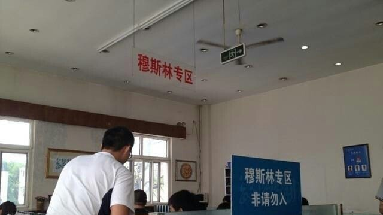
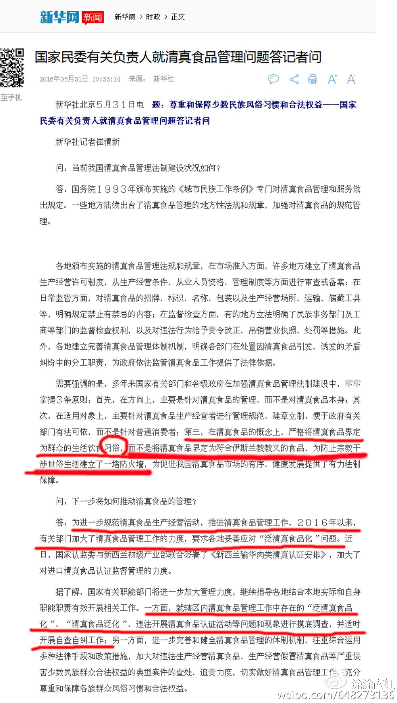
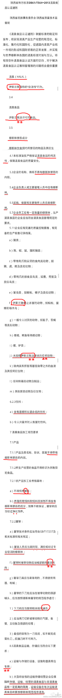
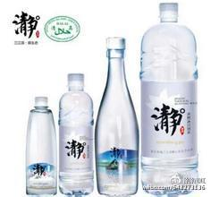
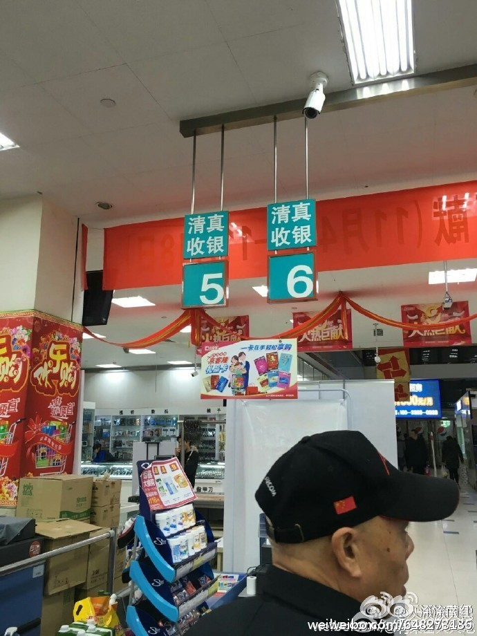
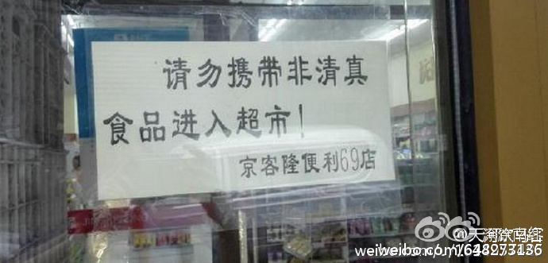
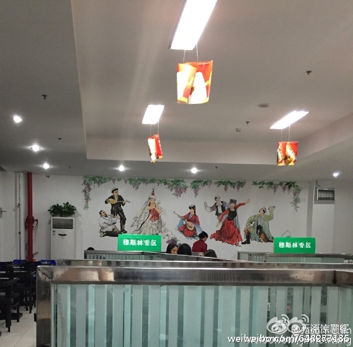
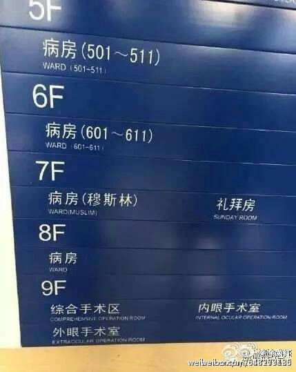
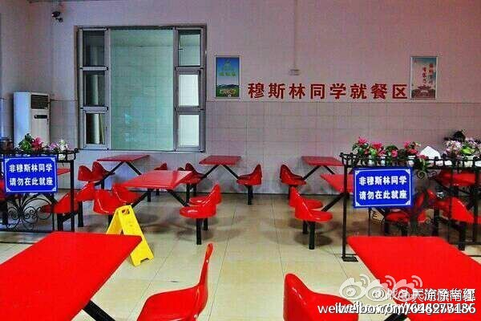
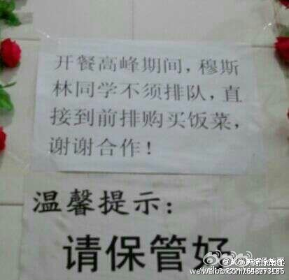

#再说清真：民俗+宗教=隔离？

* [涂涂南红](http://m.weibo.cn/u/1431843524)
* 2016-07-29 00:23:41
* [原链接](http://weibo.com/ttarticle/p/show?id=2309404002370798419289)

```
严格的宗教教法，泛化的民俗，是否会造成民族的隔离？
```

 根据 新华社北京５月３１日电  国家民委有关负责人就清真食品管理问题答记者问时，就清真食品是这样回答的：“.....三，**在清真食品的概念上，严格将清真食品界定为群众的生活饮食习俗，而不是将清真食品界定为符合伊斯兰教教义的食品，为防止宗教干涉世俗生活建立了一堵防火墙**......"

据民委负责人的这个回答，清真食品的非宗教化就很清楚了。

然而，由陕西民委和陕西质量监督局发布的《清真食品认证通则》则极为严格和清晰地定义并详解了清真食品：“**伊斯兰教法许可的食品**”。

这就奇怪了：都是民委，国家民委负责人说清真不是伊斯兰教义上的食品，可是陕西民委却白纸黑字地说：“必须是伊斯兰教法许可的食品。”这两个定义严重冲突，哪里出问题了？

以下是国家民委有关负责人就清真食品管理问题答记者问 （有删节，无改动）



5月31日，新华网报导，国家民委有关负责人就清真食品管理问题答记者问5月31日，新华网报导，国家民委有关负责人就清真食品管理问题答记者问


以下是 陕西民委和陕西质量监督局发布的《清真食品认证通则》  （有删节，无改动）



陕西民委和陕西质量监督局发布的《清真食品认证通则》陕西民委和陕西质量监督局发布的《清真食品认证通则》


显然，**国家民委的表述和陕西民委的规定根本不是一回事**。

甚至**有些通过了清真认证的食品，恐怕既不能用民俗，也不能用伊斯兰教法来解释**，比如清真水、清真酱油。


清真水？民俗？教义产物？清真水？民俗？教义产物？


这根本不是什么传统习俗的产物，它就是个新玩意；它也不可能是按着伊斯兰教法朝向麦加割喉宰杀而得......那么，谁来回答：**这样的清真食品，是怎么个清真法？谁审批的？审批标准是什么？认证收费是怎么管理和使用的？**

我们完全有理由质疑：**由于清真认证带来的收费利益，清真食品认证已经泛滥到毫无原则的地步了！必须尽快得到合理解决！甚至有必要暂停清真食品认证、暂缓清真优惠政策的推行，因为显然有太多的浑水摸鱼。**

更严重的是，**清真的泛化不止是清真食品的泛化，而是已经泛化到了世俗社会的各个方面**。国家民委负责人说要为防止宗教干涉世俗生活建立了一堵防火墙，这显然是十分正确和必要的。但遗憾的是，现实形成了强烈的反差，我们尚未看到这样的防火墙，倒是看到了许多以清真为名的隔离“墙”。

当清真定义在官方层面上都出现重大歧义的时候，它实际上变得又是民俗、又是宗教，并且在保护少数民族的利益的口号下肆意延伸，比如**餐厅清真专用，非穆学生不得入内；比如清真收银（大家都在脑补：怎样收银才算是清真的收银？收特制的清真钞票？）；清真超市；清真车辆；以及越来越多的清真专区、穆斯林专区、回民通道......**这些跟清真有什么关系？跟民俗有什么关系？跟伊斯兰教法有什么关系？难道连收银交钱都不能在一个收银台了？**这是民族大团结？怎么像是南非的故事？**

**以清真之名、以民俗或宗教之名、以保护少数民族利益之名，处处强调民族差异，发展下去离民族隔离又有多远呢？**














