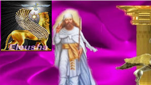
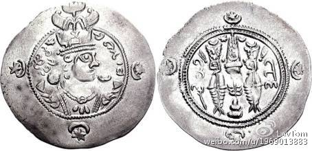

#波斯皇帝叶兹格德三世给穆斯林哈里发欧麦尔的回信

* [LevTom](http://m.weibo.cn/u/1969013883)
* 08.30 11:36
* [原链接](http://media.weibo.cn/article?id=2309404014136597077559)

`我们可以看出波斯的正直，还有阿拉伯穆斯林的强盗嘴脸，虽然伊朗人的抗争失败了，但虽败犹荣。`

全文：

And here is Yazdgird III, famous respond to Omar:

这里是Yazdgird三世,著名的奥马尔回答:

From: Shah of Shahs, Shah of Persia and Beyond, Shah of many Kingdoms, Shah of Aryans and Non Aryans, Shah of Persians and many other races as well as Arabs, Shahanshah of Persian Empire, Yazdgird III Sassanid

来自，万王之王,波斯国王,许多王国的国王,雅利安人和和非雅利安人的国王,波斯人和许多其他种族的国王以及阿拉伯人,波斯帝国的万王之王,Yazdgird三世。萨珊王朝

To: Omar Ibn Al Khatab, Khalifat of Tazi (Persian term for Arabs,

致：欧麦尔·伊本·哈塔卜，  塔兹人的哈里发，(波斯对阿拉伯人的称呼）

In the name of Ahura Mazda, creator of Life & Intelligence,

以阿胡玛兹达的名义,生命与智慧的创造者。

You in your letter wrote that you want to direct us towards your God, Allah O Akbar, without having the true knowledge of who we are & what do we worship! It is amazing that you occupy the position of Khalifat (Ruler) of Arabs, yet your knowledge is the same as a lowly Arab rambler, roaming in deserts of Arabia, & same as a desert tribal man!

你在你的信中写道,你想我们直接向你的神,所谓伟大的安拉祭拜,要求我们向没有真正的知识的事物敬拜!令人意外的是,你占据的位置哈里发的职位(统治者)的阿拉伯人,但你的知识和一个卑微的阿拉伯流浪者毫无区别，漫游在阿拉伯沙漠,和沙漠部落的人一样!

"Little Man" ( mardak) you offer me to worship a united & single God without knowing that it has been thousands of years that Persians worship the mono God & they pray to him Five Times a day! In this land of culture & art this has been the normal path of life for years.

“小男人”(mardak)你要求我崇拜统一且单一的神，我们不知道已经信仰它几千年了,波斯人崇拜神每天向他祈祷五次!在这片土地上的文化与艺术多年来一直正常的生存。

**When we established the tradition of hospitality & good deeds in the world & we waved the flag of "Good Thoughts, Good Words, Good Deeds" in our hands, you & your ancestors were roaming the deserts, eating Lizards for you had nothing else to feed yourselves & burying your innocent daughters alive (an old Arab tradition, cause they preferred male children to female)!**

**当我们建立热情好客和从事善行的传统，在世界上，我们高举的旗帜是把“善言,善思,善行”的宗旨握在我们的手中,那时候你和你的祖先正在漫游沙漠,因为你们不能养活自己，就去吃蜥蜴，然后将你无辜的女儿活埋(一个古老的阿拉伯传统,因为他们更重男轻女）！**

**​Tazi people have no value for God's creatures! You behead God's children, even the POWs (Prisoners of War), Rape Women, bury your daughters alive, attack the Caravans, mass murder, kidnap people's wives & steal their property! Your hearts are made of stone, we condemn all these Evil which you do. How can you teach us Godly Ways when you commit these action?**

**塔兹人（阿拉伯人）做为上帝的被造物毫无价值!你把神的孩子斩首,即使是战俘，强奸妇女,活埋你的女儿,抢劫商队,大规模谋杀,绑架人的妻子，然后偷他们的财产!你们的心是石头做的,我们谴责你做的这一切的恶。当你在做这些事情的时候，你们怎么有资格教我们去如何虔诚的侍奉上帝?**

**You tell me to stop my Fire Worship! Us, Persians see the Love of Creator & power of inventor in the light of Sun & warmth of Fire. Lights & Warmth of the Sun & Fire makes us see the light of truth & warmens our hearts to the creator & to one another. It helps us to be kind to one another, it enlightens us & makes us to keep Mazda's Flame, alive in our hearts. Our lord is Ahura Mazda & it is strange that you people also, just discovered him & named him Allah O Akbar! But we are not the same as you, we are not in the same level as you. We help other human being, we spread love among humanity, we spread Good throughout the Earth, we have been spreading our culture but in respect for other cultures throughout the whole world for thousands of years, yet you in the name of Allah invade other men's land! You mass murder the people, create famine, fear & poverty for others, you create Evil in the name of Allah. who is responsible for all this catastrophe?**

**你告诉我停止我对火的崇拜！我们,波斯人看到造物主的爱和力量被从代表太阳的光与力量和温暖的火里面发明出来。光和温暖来自太阳和火，它让我们看到真理的光和心中的造物主。它帮助我们彼此善待,它启示我们，让我们保持马自达的火焰活在我们心中。我们的主是阿胡玛兹达。你们的人也真奇怪,只是刚刚发现他，就叫它伟大的安拉！但我们不是和你一样,我们不是在同一个水平。我们帮助其他的人,我们传播爱和人性,我们传播善的原则在整个地球,我们传播我们的文化,但在整个世界几千年来一直尊重其他文化。然而你以安拉的名义侵犯别人的土地!你大规模屠杀人民,制造饥荒,恐惧和贫困，并以安拉的名义作恶，谁负责这一切灾难？**

叶兹格德三世的硬币头像，当时他是22岁的青年（在637年）

​Is it Allah who commands you to murder, pillage & to destroy?

是安拉命令你谋杀,抢劫和破坏吗？

Is it you the followers of Allah who do this in his name?

是你的追随者用安拉的名义这样做的吗？

Or Is it both?

还是两个都有？

**You have risen from heat of the deserts & burnt out infertile lands with no resources, you want to teach people the love of God by your military campaigns & the power of your Swords! You are Desert Savages, yet you want to teach Urban people like us who lived in the cities for thousands of years, the love of God! We have thousands of years of culture behind us, a powerful tool indeed! Tell us? With all your military campaigns, barbarianism, murder & pillage in the name of Allah O Akbar, what have you taught to this Muslim Army? What knowledge have you taught the Muslim that you also insist on teaching it to non Muslim? What culture have you learned from your Allah, now that you want to force-teach it to others?**

**你已经从炎热的沙漠和被烧坏且贫瘠没有资源的土地上崛起,你想告诉人们神的爱,以你的军事行动和你宝剑的力量！你是沙漠的野蛮人,但你想教我们城市人，像我们这样住在城市几千年来的人,什么是神的爱!我们有几千年的文化在我们身后,确实是一个强大的工具!告诉我们?你所有的军事行动,野蛮，谋杀和掠夺，以所谓伟大的安拉的名义去进行,你是怎么教导穆斯林军队的?你教什么知识给穆斯林？你还教了什么给非穆斯林?你学到了什么文化从你的安拉那里,现在你想强制教给别人吗？**

Alas, Oh Alas...... that today our Persian Armies of Ahura have been defeated from your recently Allah Worshiping Armies; Now, our people have to worship the same God, the same Five times a day, but forced by the sword to call him Allah & pray to him in Arabic, cause your Allah only understands Arabic!

唉,唉……今天我们阿胡拉的波斯军队最近被击败了，被你崇拜安拉的军队;现在,我们的人民崇拜同一个神,同样的一天五次礼拜,但迫于你们的剑去叫它安拉，然后以阿拉伯语给它祈祷,因为你的安拉只懂阿拉伯语!

**I suggest, you & your gang of bandits pack up & move back to your deserts where they are used to live. Take them back where they used to the burning heat of the sun, tribal life, eating Lizards & drinking Camel urine. I forbid you to let your band of thieves loose in our fertile lands, civilized cities & our glorious nation. Don't turn these "beasts with hearts of stone" loose, to mass murder our people, kidnap our women & children, rape our wives & send our daughters to Mecca as slaves! Don't let them do these crimes in the name of Allah O Akbar, put a stop to your criminal behavior.**

**我建议,你和你那群土匪打包搬回你的沙漠，你们曾经住过的地方。带他们回到炽热的太阳土地下,过部落生活,吃蜥蜴和饮用骆驼尿。我不许你的匪帮在我们的肥沃的土地,文明的城市和我们伟大的国家去胡作非为。不要以这些“野兽的石头心肠”,去屠杀我们的人民,绑架我们的妇女和儿童,强奸我们的妻子和我们的孩子发送到麦加作为奴隶!不要让他们做这些罪行的名义以安拉的名义,停止你们的犯罪行为。**

**Aryans are forgiving, warm, hospitable, & decent people and everywhere they went, they have spread seeds of friendship, love, knowledge & truth; therefore, they shall  punish you & your people for your pirate ways & criminal acts.**

**雅利安人是宽容,热情,好客,正派的人,到哪里都是这样,他们传播友谊的种子,爱,知识和真理;因此,它们将要惩罚你和你的人，因为你们从事海盗的道路和犯罪的行为。**

I claim you to remain with your Allah O Akbar in your deserts & do not move close to our civilized cities, for your believes are "Much cruel" & your behavior is "Most Barbaric"!

我要求你和你的安拉留在你的沙漠里，不要移动接近我们的文明城市,你们的信徒是“最残忍的”，你的行为是“最野蛮的”!