# 关注清真食品安全与健康

* [PETG善待绿色人类](http://m.weibo.cn/u/3138561560)
* 08.30 09:10
* 原链接(http://media.weibo.cn/article?id=2309404014099854941600)

`好久木写长文鸟~：）`

​清真食品消费对象既包括穆斯林，也包括非穆斯林。为了穆斯林兄弟姐妹们（以及非穆斯林）的健康，本文对清真食品的安全问题进行整理分类（将不断更新），以便于大家选择食品消费时，能够注意，以免误买误食问题食品。

## 一、健康用油

首先科普下健康食用油的观念（[知乎：健康食用油](http://www.zhihu.com/question/19863369)）：**心血管疾病**是目前主要的健康杀手之一，而防治心血管疾病，了解反式脂肪酸、饱和脂肪和不饱和脂肪酸的概念很重要。

**饱和脂肪**、特别是**反式脂肪酸**是造成心血管疾病的重要诱因，吃饱和脂肪、反式脂肪和总脂肪高的食品会显著升高血液中的胆固醇比例，容易导致肥胖，非酒精性脂肪肝，心脑血管疾病等一系列代谢综合征。**饱和脂肪、反式脂肪含量高的油就不健康，如各种动物油、黄油、棕榈油等。**

而**不饱和脂肪酸**能降低心血管疾病风险已经得到充足的验证，因此为健康着想，应优先选择不饱和脂肪酸含量高的植物油。不饱和脂肪酸又细分为 n-3、n-6、n-7、n-9，其中**n-6与n-3**比例在1：1到5：1之间都算健康，但是n-6含量过高，如达到10：1就有害，  可能会诱导肝脏CD4+ T细胞的凋亡，从而促进肝脏氧化损伤甚至肝癌的发展。

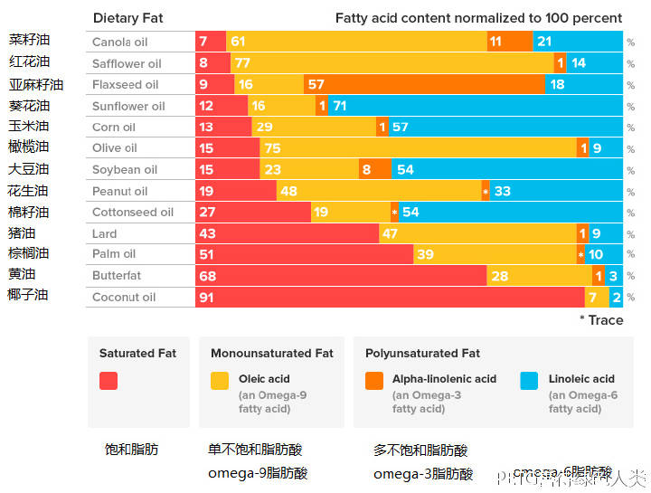

​除此之外，油的**烟点**也很重要，食用油的加热温度不宜超过烟点，加热到**冒烟就意味着开始生成各种有害物质了**！所以如果你不是凉拌，而是要爆炒、油炸的话选择高烟点油更健康。

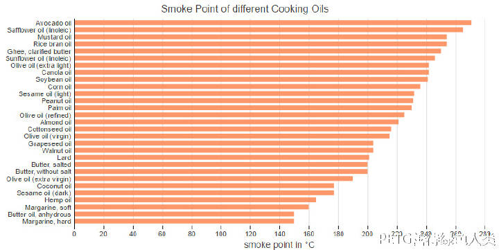

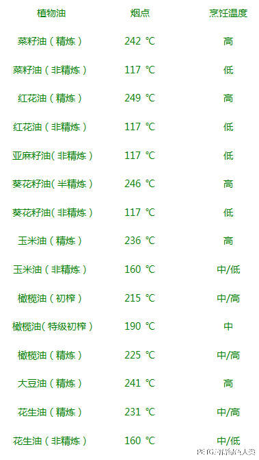

因此健康食用油的选择准则是：**无反式脂肪酸、饱和脂肪少、不饱和脂肪酸n-3多、胆固醇少的油 **。

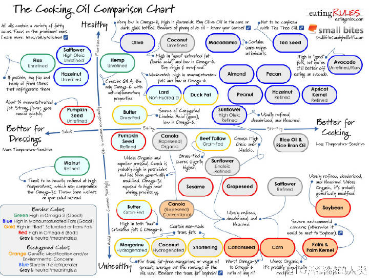

越靠上越健康，越靠右烟点越高，推荐右上的油（自行翻译）
知乎答者居然都不推荐转基因油，本博仍然是推荐的，具体推荐顺序是：

**紫苏籽油>亚麻籽油>>橄榄油>牛油果油>茶籽油>>菜籽油**

紫苏籽油(Perilla oil)：n-3 50+%，n-6 14%，**烟点210℃**

亚麻籽油（Flaxseed oil）：n-3 57%，n-6 18%，烟点107℃（可一定程度替代鱼油）

橄榄油（Olive oil）：n-3 1%，n-6 9%，烟点160~240℃

牛油果油（Avocade oil）：n-3 很少，n-6 12%，烟点270℃

茶籽油（Tea Seed oil）：n-3 少，n-6 不多，烟点252℃

菜籽油（Canola oil）：n-3 11%，n-6 21%，烟点242℃（精炼）

另一知乎答主给出的推荐顺序是：**紫苏籽油，亚麻籽油> 初榨橄榄油>双低菜籽油（芥花籽油）,普通橄榄油，茶油>大豆油>花生油，玉米油>猪油>普通菜籽油，棕榈油。（供参考）**

为了大家的健康，我们完全不推荐动物油！可有些餐馆里用的油比这些动物油还不健康的多，那就是**重复用动物油**！！！前面提到油冒烟就开始产生有害物质，而这些重复用油（无论动物油和植物油）不知用了多少遍，致癌物在不断累积。**有些人觉得这种油味道“独特”，甚至渐渐喜欢上，却不知道其致癌性和危害性仅次于地沟油，心脏病、癌症在向你招手！**

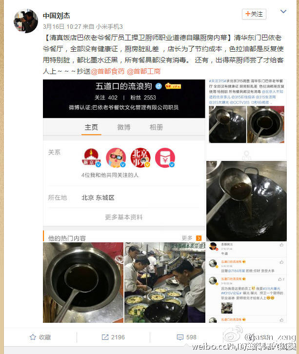

清真墨水油

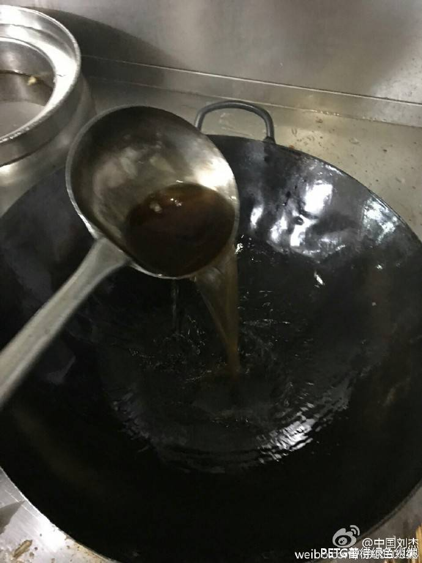

清真墨水油

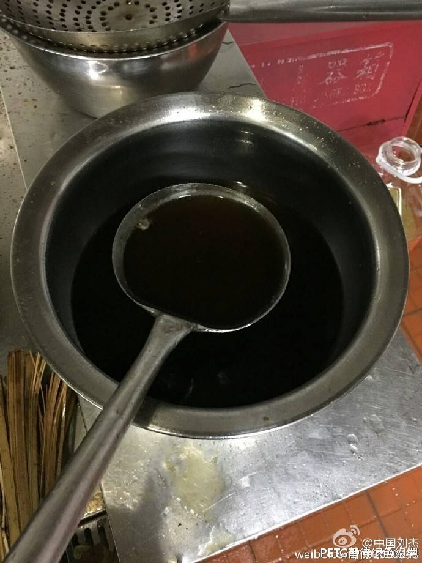

清真墨水油

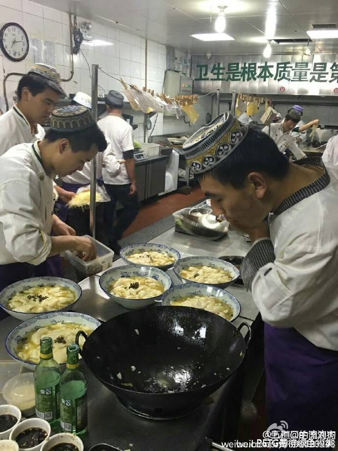

清真墨水油
## 二、地沟油

比重复用动物油更危险的**地沟油**，无论是清真餐馆还是非清真餐馆都存在，我们更得注意！

“地沟油”确实是健康的大敌，尤其是对人们的肠胃健康，有着不可估量的破坏力。利益+黑心=地沟油         1、“地沟油”会导致消化不良：在炼制“地沟油”的过程中，动植物油经污染后发生酸败、氧化和分解等一系列化学变化，产生对人体有重毒性的物质；砷，就是其中的一种，人一旦使用砷量巨大的“地沟油”后，会引起消化不良、头痛、头晕、失眠、乏力、肝区不适等症状。

　　2、“地沟油”会导致腹泻：“地沟油”的制作过程注定了它的不卫生，其中含有的大量细菌、真菌等有害微生物一旦到达人的肠道，轻者会引发人们腹泻，重者则会引起人们恶心、呕吐等一系列肠胃疾病。

　　3、“地沟油”会引发强烈腹痛：“地沟油”中混有大量污水、垃圾和洗涤剂，经过地下作坊的露天提炼，根本无法除去细菌和有害化学成分。所有的“地沟油”都会含铅量严重超标，是个不争的事实，而食用了含铅量超标的“地沟油”做成的食品，则会引起剧烈腹绞痛、贫血、中毒性肝病等症状。

　　4、“地沟油”可导致胃癌、肠癌：令人作呕的炼制过程，是地沟油毒素滋生的原因。“地沟油”是对从酒店、餐馆收来潲水(泔水、残菜剩饭等)和地沟油进行加工提炼，去除臭味而流到食用油市场的成品油。潲水油中含有黄曲霉素、苯并芘，这两种毒素都是致癌物质，可以导致胃癌、肠癌、肾癌及乳腺、卵巢、小肠等部位癌肿。

**居然给穆斯林兄弟姐妹们吃地沟油，是可忍，孰不可忍！**

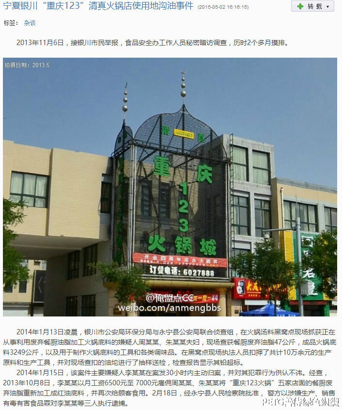

清真地沟油：居然给穆斯林兄弟姐妹们吃地沟油，是可忍，孰不可忍！

## 三、工业盐

**工业盐就是亚硝酸钠**。氯化钠与亚硝酸钠同属盐类，外观相似，都是白色晶状颗粒，密度几乎相同，都有咸味。亚硝酸钠是无情的“杀手”，毒性很强。它进入体后能使体内携氧的低铁血红蛋白，变成高铁血红蛋白。高铁血红蛋白一遇到氧，就牢固地结合起来，不易分离。这样，人体的全身组织就会缺氧，尤其从大脑缺氧对人体的影响最严重。 当人体摄入0·3～0·5克亚硝酸钠，即可引起急性中毒，3克即可致人于死地。

**工业盐煮羊肉！你敢吃吗？！！**

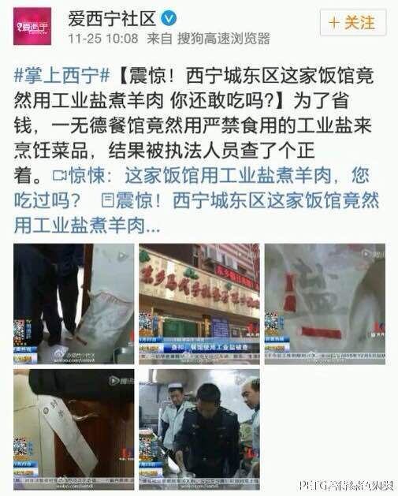

清真工业盐

## 四、大肠杆菌

一些知名企业，有着现代化的生产线和质量管理体系，采用了双重清真认证，居然在多批次上市产品中查出了大肠杆菌超标！！！​

要知道： 大肠杆菌是人和动物肠道中的正常菌群。只有宿主免疫力下降或细菌侵入肠外组织或器官时引起肠外感染，或者某些菌株具有较强的毒力而引起肠内感染。大肠杆菌在外界环境中常随**宿主粪便**污染环境或人类食品、物品。

我们郑重提醒南方黑芝麻食品股份有限公司！为了穆斯林兄弟姐妹们的身体健康！除了必要的消毒设备消毒程序外，员工的卫生习惯特别要重视，他们指甲是否剪了？进车间前是否彻底消毒？加工辅料是否达到卫生要求？特别是加工用手要清洁！！！

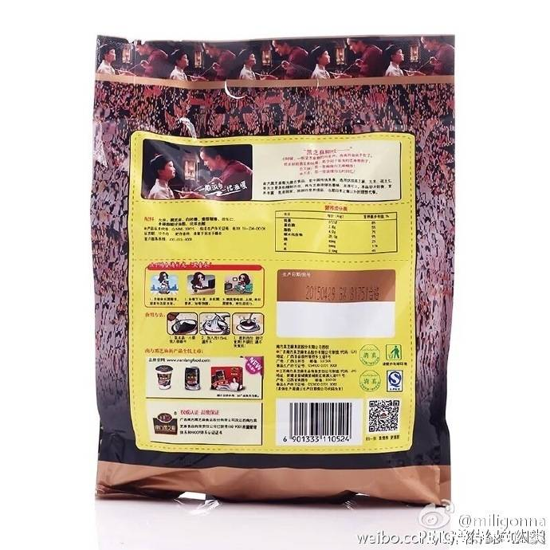

我们​相信“黄金左手”这种现象只存在于国外，我们相信南方黑芝麻食品股份有限公司 的工人们更不会有这种不卫生的习惯，在此谨提醒英国的留学生朋友们，警惕巴基斯坦大叔的烤肉店！

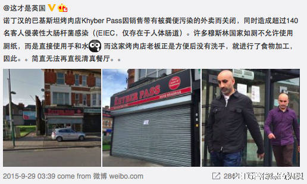

黄金左手
## 五、三聚氰胺

那一年是2008年，很多食用三鹿集团生产的奶粉的婴儿被发现患有肾结石，随后在其奶粉中被发现化工原料三聚氰胺。截至2008年9月21日，接受治疗婴幼儿累计39,965人，住院的有14,471人，死亡4人。

很多人不知道臭名昭著的三鹿奶粉是清真食品！是我们很多穆斯林兄弟姐妹们育儿选择！我们庆幸，犯罪者都得到了应有惩罚！

三鹿前董事长田文华被判无期徒刑。涉嫌制造和销售含三聚氰胺的奶农张玉军、高俊杰及耿金平三人被判处死刑，薛建忠无期徒刑。

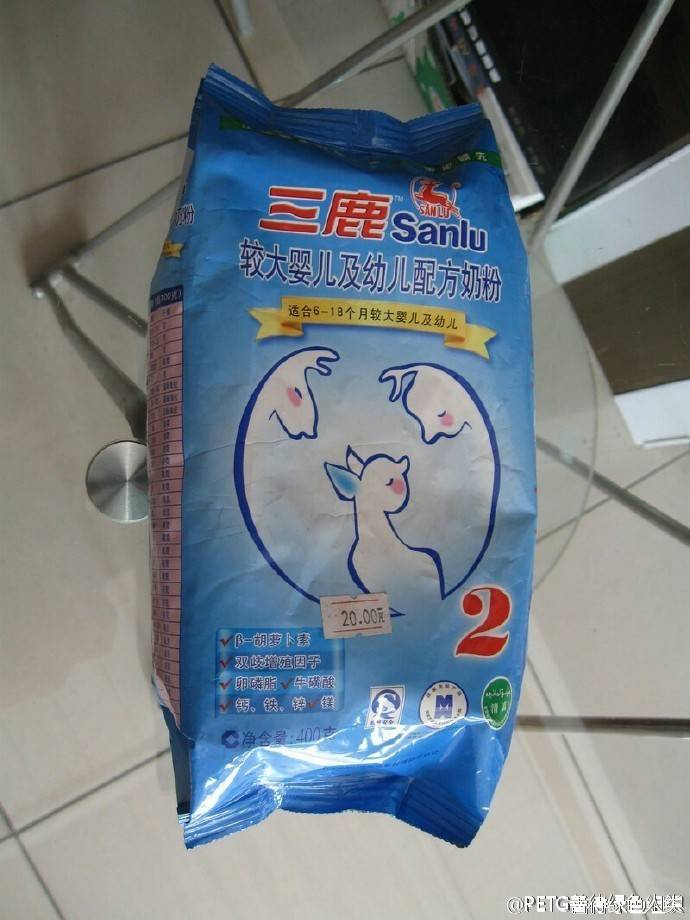

## 六、重金属与二氧化硫

蓬灰(Pottasche)，主要成分是[碳酸钾](http://baike.sogou.com/lemma/ShowInnerLink.htm?lemmaId=820872)，在拉面中使用，没有国家标准可执行（[蓬灰-搜狗百科](http://baike.sogou.com/v7684448.htm?fromTitle=%E8%93%AC%E7%81%B0)）。在拉面里加了后，可以增加拉面的口感。拉面能拉成细如棉线的“一窝丝”，有筋道柔韧的口感依赖于添加的拉面剂——蓬灰。现在市面上使用的蓬灰一种是蓬草烧制，一种是根据蓬灰成分配制。

烧制蓬灰因容易含有铅、砷重金属成分，目前已趋于淘汰，但是一些“传统”的面店依然“传承”（[篷灰和面吃出正宗兰州味](http://www.dxbei.com/n/20120529/36319.html)）。一些辟谣（xidi）文以该配方使用千年，所以“无害”完全站不住脚。古人没有现代化检验手段，也没有慢性（重金属）中毒的概念，只以为吃了没马上死亡就是无毒。这种拉面我们不推荐。

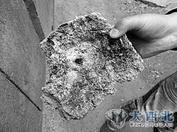

​配制蓬灰去除了重金属等有害成分，是目前的主流。但其问题在于用量没有标准，添加完全依照拉面师傅喜好，有些超标五倍不止：[拉面师傅揭行业黑幕：你吃的不是面是蓬灰](http://www.qingdaonews.com/gb/content/2011-02/25/content_8677083.htm)。

甘肃省质监局曾发现现市场上90%的蓬灰（甘肃力司食品科技有限公司）二氧化硫超标，该公司已于2010年3月份因此被停产整顿，二氧化硫超标会影响人的肠胃系统，导致恶心呕吐，还会影响钙质吸收。

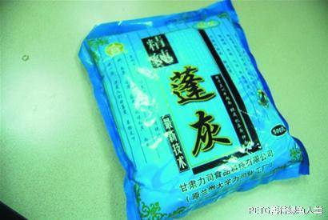

## 七、总结

  太可耻！这些人见利忘义！胆敢危害穆斯林兄弟姐妹们的身体健康！我们决不答应！！！希望有关部门站在民族团结的层次，高标准，严要求！对穆斯林兄弟姐妹们的食品市场展开雷霆行动，全面严查严打！对违法犯罪分子毫不留情，最高可以判处死刑！​

（如果您也关心穆斯林兄弟姐妹们的身体健康，欢迎打赏~！）