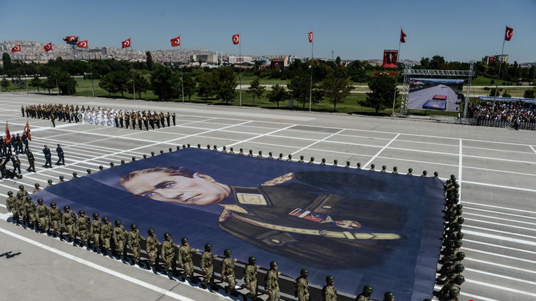
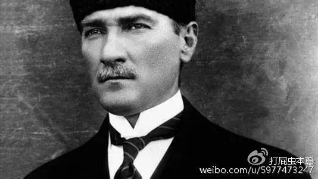
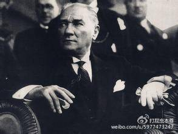
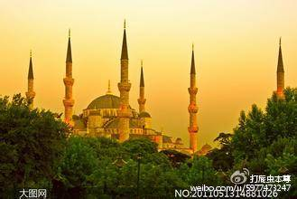
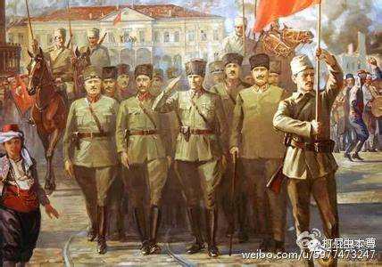
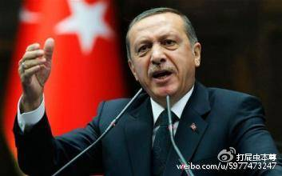

#《伊斯兰往事1：不虔诚的凯末尔》

* [打屁虫先生](http://m.weibo.cn/u/5977473247)
* [原链接](http://media.weibo.cn/article?id=2309404004418671519696)

```
浅谈土耳其的世俗化探索与伊斯兰主义回潮
```

**“做为土耳其，从来都不是一件容易的事”—— 艾哈迈德·达乌特奥卢**

  做为讲述穆斯林国家系列文章的第一篇，先说土耳其的原因有三，一是土耳其是穆斯林国家中世俗化最早，最成功的国家，二是因为土耳其当前的政变让世界感到世俗化将要倒退。三是这个国家太复杂，它在穆斯林世界中的特殊性、以及他和欧美的关系，加之他自身独特的历史，让它变得十分复杂。那么从哪里入手讲述土耳其呢？就从它的一位总统，开国总统穆斯塔法.凯末尔



## 激荡的前半生：

  说到 这位土耳其的缔造者，他有两个个人特点，第一个特点：**他是一个杰出的军事将领**，第二个特点：**他是一个半吊子穆斯林**。这两个个人特点后来成为了土耳其的国家特色。凯末尔出生于1881年，出生在希腊萨罗尼卡 ，14岁进入军事预备学校学习，18岁进入军官学校，21岁那年进入参谋学院深造，军事素质过硬，而且热衷于伏尔泰、卢梭等欧洲的启蒙思想家的著作，属于典型激进派青年军官，对于传统伊斯兰那一套东西他内心是比较抵触的，毕业后参加了青年土耳其党，1908年该党发动政变把阿普杜勒二世苏丹赶下台了，凯末尔也在席卷全国的政变中立了功，31岁出任保加利亚武官，一战前期凯末尔明确表示不赞成奥斯曼加入德奥一方，而因保持中立，以观其变，然而并没有什么卵用，奥斯曼帝国当局还是选择跳入了火坑。参战这件事对于对于帝国和凯末尔个人的意义是不同的，对于帝国是致命的一击，而对于凯末尔则是“好风凭借力，送我上青云”。他以师长的身份参战（其实他当时早已是反政府组织成员，但值得尊敬的是他并没有趁外战之际对苏丹政府倒打一耙），在伊斯坦布尔保卫战中，他率土军负责阻击协约国澳新军团登陆（协约国进攻伊斯坦布尔的部队中最强的一只），结果不但阻击成功，而且还打出了1:1的伤亡比，这在那个时代几乎是难以想象的奇迹，凯末尔由此成为了奥斯曼的本土战争英雄（保卫战总指挥是德国人），战役的胜利并不代表战争的胜利，同盟国战败后奥斯曼帝国也随之解体，凯末尔头顶着国家的耻辱和个人的光环走进了新的时代。



## 艰难的时局：

  帝国没了怎么办？在中国答案很清晰：群雄并起打群架，胜出一家当老大！但在当时的奥斯曼不行。为何不行？首先外部环境不允许，身旁就是当时世界文明顶峰：欧洲！奥斯曼和欧洲（也包括俄国）可为“一天二地恨，三江四海仇”，双方前前后后断断续续的互殴了600年！而且前四百年奥斯曼还处于优势地位，即战略进攻方，后二百年欧洲崛起后才反打奥斯曼，但欧洲反击时两个文明已经不在一个层级上了，奥斯曼是绝无胜算的，但瘦死的骆驼比马大，对于奥斯曼这样的巨兽，即便欧洲在各方面领先的情况下依然不能做到一击得手，那如何是好？只有继续二击、三击、四击，以至五六七八击咯！击打了200年，先失去了巴尔干，后丢了北非，最后阿拉伯也反了，困兽之斗终归徒劳，欧洲人可谓长舒了一口气，试问在这种情况下列强们还会希望身边的这只巨兽再活过来吗？而相对于外部环境，内部状况更堪忧，奥斯曼虽大但它的主体统治民族突厥人（土耳其人）在帝国内所占的人口比例并非绝对优势（具体数据不清楚，差不多三分之一左右），且多数集中居住在小亚细亚半岛，在广阔的阿拉伯半岛、巴比伦、北非等地分布的不多。也就是说土耳其人在当时对于帝国其他地区的经济、军事、行政方面的硬控制力已经明显不足甚至完全丧失了（而其中大部分地区也已经沦为了英法的殖民地或直接独立了，只剩小亚细亚这块核心区域尚在手中，但也岌岌可危）。这里外两个因素叠加在一起让凯末尔有了一个明确而务实的理念，即奥斯曼帝国至少在一个较短的历史时期内（一百年、两百年、三百年~~~）是不可能重新构建起来了，而当务之急是保住小亚细亚这块还勉强握在手里的祖产！



## “叛教者”的国度：

   1919-1922这4年凯末尔一方面通过军事手段搞定了希腊、亚美尼亚、法国的外部战争，一方面取得了国内的实际控制权，在1922年年底他把奥斯曼的最后一位苏丹驱逐，1923年举行了大选，凯末尔毫无争议的当选土耳其的共和国第一任总统，1924年开年，凯末尔便干了一件惊天恸地影响深远的大事：驱逐了哈里发（安拉在人间的“代理人”，也就是穆斯林的教头）！！！同样是驱逐，但驱逐苏丹和驱逐哈里发的意义却不可比，在当时的时局下，国家重建，走向共和，是一件毫无争议的事情，赶走苏丹无非是给国家换了一件衣服，但在广大普通穆斯林心中需要重建的是土耳其而不是伊斯兰，赶走哈里发等于中断了延续1300年的哈里发制度，等于斩断了伊斯兰在土耳其的支柱，这更换的不是衣服，而是灵魂！对，说得对，凯末尔要给这个国家做的第一件事就是更换它的灵魂！他要告诉世界在这个新的国度里，没有伊斯兰教的位置，这个国家的人民也只有一个身份，一个民族身份：土耳其人，而不是宗教身份：穆斯林。在奥斯曼时期，当局把帝国定义为全世界穆斯林的老巢，只要你是穆斯林，则天然享受帝国的庇护，也就是说奥斯曼帝国臣民的第一身份是穆斯林，而民族则成为了第二身份，而这是凯末尔无法接受的，在这个半吊子穆斯林和坚定洋务派看来，伊斯兰与现代文明相悖，等同于落后！凯末尔很清晰的看明白了“师夷长技以制夷”这种技术层面改革根本不足以弥补伊斯兰世界和欧洲的差距，唯一的办法是脱胎换骨，他提出来一个明确的口号：把土耳其带入西方文明社会的大家庭！而要达到这一目的首先就是要：去伊斯兰化！在一个伊斯兰侵染千年的国家去伊斯兰化谈何容易？但凯末尔却能做到，因为以他当时在土耳其的权威没有任何力量可以阻止他的个人意识成为国家政策，这就是一个政治上的常见状况，一个绝对独裁者的任何决策，不管是对是错，他都会在社会中以加速度蔓延！



##对“神”宣战：

  赶走哈里发拥有无比重大的象征意义，但这还不够，凯末尔在接下来的15年中掀起了一场对“神”的战争，他将法律和武器并用，首先是镇压了东部的宗教势力反弹，并且痛下杀手！接着制定了新法，新法中废除了一夫多妻，给了女人工作权和参与政治的权利，基本做到了法律框架下的男女平等，废除了穆斯林与非穆之间不得通婚的规定，自由恋爱在土耳其慢慢普及。1928年凯末尔干出了即驱逐哈里发，制定新法后第三件大事：文字改革，废除传统的阿拉伯文，并且规定公开场合使用阿文非法，这对伊斯兰势力又是一记重拳，在文教方面注重强调突厥人皈依伊斯兰之前的历史，而淡化伊斯兰的历史，大学里面更是废除了神学，而欧洲的艺术科技展览在土耳其遍地开花，年青知识分子迅速响应。政治、法律、文化、军事上的一系列组合拳彻底打懵了伊斯兰教，也让土耳其在西化的道路上面加速迈进。在凯末尔当政的15年里，宗教势力被狠狠的压制几乎到了边缘化的程度，伊斯兰也一度从国教变成了一种生活文化，15年中各种反对势力如同蚂蚁一般被凯末尔碾压。与此同时凯末尔用国有化的方式度过了1929年爆发的经济危机，15年来土耳其的民族工业，基础建设快速发展，外交军事方面更是成就卓著。穆斯塔法.凯末尔被他的国民加以“Atatürk”（国父）的称谓，值得玩味的是Atatürk这一称号是来自国民的赞颂而非安拉的赠与！



##Atatürk的遗命与伊斯兰的悖论：

  一切看起来似乎很顺利，对，凯末尔活着的时候当然，在土耳其没有任何人可以挑战他，“神”也被他制伏，但不幸的是再强悍的人也有归于尘土的一天，再孱弱的神明也会永远“存在”，1938年凯末尔病逝。但伟人毕竟是伟人，凯末尔在生前已经明白，在一个侵染宗教千年的国家面前，自己的生命是多么短暂，自己死后谁来降服“神明”？当然不能靠一个人，后世的政治家谁也不可能拥有凯末尔的威望！终究会压不住的！既然一个人不行，那就交给一群人：军人！于是凯末尔留下了2条立国原则和一项遗命，2条立国原则：民主和世俗。1条遗命：军人监国。2原则成为国家文明与现代化的法宝，军人监国则成为了制度保障，从此土军有了两条使命，对外保卫国家安全，对内保卫制度安全。在后凯末尔时代，土耳其形成了一个奇怪的政局，2拨人共管一个国家，1拨人是政治家，另一拨是军事集团。但2类人是不一样的，原因就在于土耳其在凯末尔的设定下成为了一个一人一票的民主国家， 军人虽然不需要选票，但政治家上台需要选票， 然而随着时间的推移伊斯兰慢慢的回潮，每到国家经济出现困难的时候一些伊斯兰学者就会旁敲侧击的呼吁纠偏凯末尔主义，本来拥有宗教传统的民众自然受此影响，而政客为了选票当然也会倾向于像民众妥协，于是一个悖论出现了，被当做立国2原则的民主成为了另一个立国原则世俗的天敌！怎么办？军人监国制度生效了！三次军方政变三次逆转了土耳其的命运（这真是一个神奇的国家）。但另一方面可以看出伊斯兰回魂的势头一而再再而三，说明伊斯兰主义的群众基础和凯末尔的去世时间呈现负相关，凯末尔死的越久，伊斯兰回潮的势头越大，终于这位艾尔多安先生上台了！就我个人的观点，这货论才论德给凯末尔提夜壶都不配，但在80年后平庸的土耳其政坛，这货带领的正发党无疑算是最强的，他担任伊斯坦布尔市长期间不管经济反腐都搞得很不错，担任总理期间土的经济也取得了很好的发展，这为他赚够了政治资本，当然他也是一位伊斯兰倾向比较明显的政治家。一个通过选举合法上台并拥有足够政治资本且有明显伊斯兰倾向的政治家面对国内回暖的伊斯兰主义以及周边伊斯兰国家混乱土耳其有希望打着伊斯兰旗号从新执伊斯兰世界牛耳的”有利”局面，他的选择不言而喻，于是积怨已久的军方再次出动，但这次，那位死人的遗嘱所带来的政治惯性在经过80年的漫长岁月后终于失效了！

##后记：

  个人认为土耳其的伊斯兰化短时间内不会形成洪水猛兽，土耳其的那点伊斯兰化和阿拉伯世界的比起来完全不值一提（好比我国的最左的左派放到朝鲜去比朝鲜的极右还右），且美国欧洲也不可能允许一个具有完备工业体系的国家在眼皮底下变成伊斯兰主义国家，但从长期看土耳其今后极有可能渐渐的滑入小编文章《“完美”的宗教、残酷的现实》中说的中东政治死局：“如果搞民主选举则必然选出一个伊斯兰主义者，上台后为了维护其合法性必然搞伊斯兰教法，国家的现代化自然无法实现。而如果是少数派的精英上台，为了压制多数派的伊斯兰主义者，则必然搞军事独裁。这样一来左右都是死胡同”。

**注：本文视角比较窄，基本都是从历史和政治的角度叙述和推论，关于欧、美、俄、以、阿等外部势力对土耳其和伊斯兰的现状的直接和间接作用没有做出梳理（个人水平有限），希望各位网友补充指教。**
