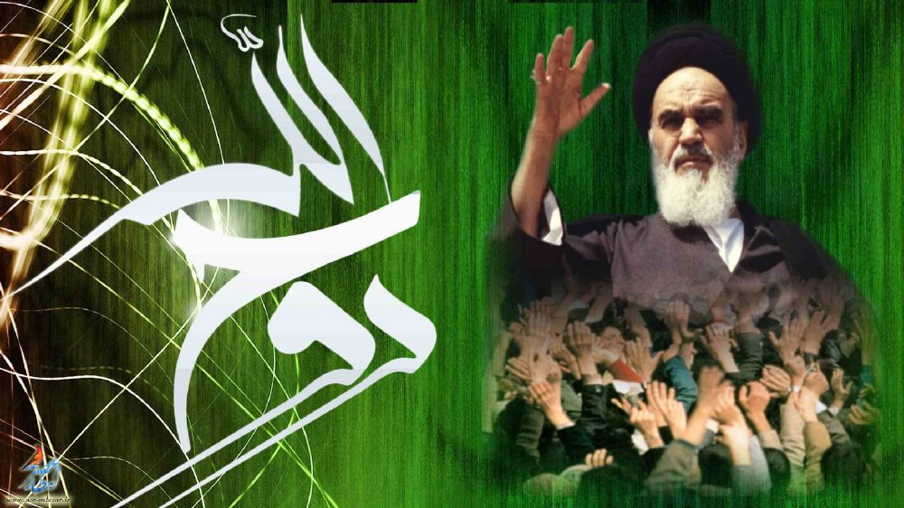
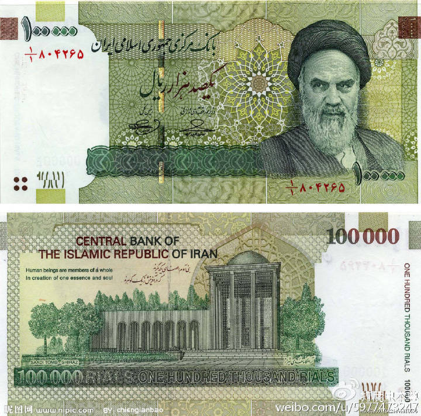
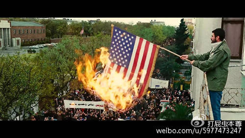
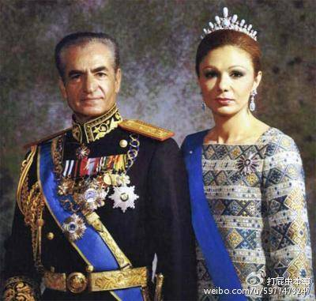
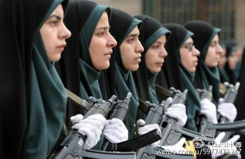

# 《伊斯兰往事2：我是霍梅尼，我为安拉代言》上

* [打屁虫先生](http://m.weibo.cn/u/5977473247)
* [原链接](http://media.weibo.cn/article?id=2309404011094631926826)

        浅谈伊斯兰中的另类“什叶派”与伊朗

  **“我们要向全世界输出革命，圣战不会停止，直到“安拉胡阿克巴”的喊声回响在全世界！”——阿亚图拉·鲁霍拉·穆斯塔法·艾哈迈德·穆萨维·霍梅尼**

  这一篇要讲的是一个伊斯兰国家中的另类**“伊朗伊斯兰共和国”**以及它的塑造者霍梅尼。对于霍梅尼这个人真的不知道如何评价才好，皓首匹夫，苍髯老贼？伟大的伊斯兰战士？把伊斯兰的普遍真理与伊朗的实际国情相结合的伟大领袖？大独裁者？反人类极端分子？这些带有明显感情色彩的评价虽然都不全面，但也从多个维度准确的描绘的霍梅尼的基本形象，一个矛盾到复杂，虔诚到极端，狡猾到睿智的多面的**宗教+政治领袖**，看到这里了之前阅读过我的文章的朋友都会明白我一再强调的观点，伊斯兰不是邪教，但伊斯兰有个重大的顽疾，即宗教对政治的强力作用！而霍梅尼既是这一顽疾的集大成者，而又有可能是这一顽疾的破局者！

## 大阿亚图拉之路：

  阿亚图拉：意为安拉的显迹或安拉的迹象（英文 Ayatollah ）。伊斯兰什叶派十二伊玛目支派高级教职人员的职衔，而其中最“德高望重”的教法学家被加以“大阿亚图拉”的称号，说白了就是伊朗什叶派穆斯林的教头，他们所领导的教士们在伊朗形成了一个独特的阶级或政治力量：欧莱玛教士集团。而本文的主角霍梅尼就是一位“大阿亚图拉”，霍梅尼生于1902年，从6岁起开始学习《古兰经》，然后呢...一直学，在各种宗教学院学，学完了就当讲师，然后呢....一直讲，讲到了60岁，这哥们就这样，60岁前一直徜徉在美妙的伊斯兰世界里，唱读讲传都是一把好手，并且顺利的获得了阿亚图拉的称号，成为了教士集团的核心成员，和前一篇凯末尔的激荡前半生比起来霍梅尼的前三分之二的人生单纯的像个处女，，，，哦，有一件重要的事情忘了交代，霍梅尼27岁时结的婚迎娶了一位13岁的女孩。。。。。。。。。从此两人过上了幸福的生活。

## 全面西化的伊朗和与众不同的“霍老师”：

  60年来真的平静如水吗？表面上当然平静如水，可下面却暗流涌动！霍老师前半辈子所处的时代正是伊朗版洋务运动和伊朗版丧权辱国的双高峰时期，英、俄（苏）、美三家前后对伊朗上下其手，国内也是一团乱麻，民族主义运动，社会主义思潮、全盘西化的政策等等无一不是对欧莱玛教士集团的威胁，这种威胁不但是在思想市场上会抢走份额，更重要的是会威胁到欧莱玛集团的权和利。欧莱玛集团的在伊朗的权势和财富绝非中国的和尚道士们可比拟的，整个伊朗的耕地百分之二十都是归属于欧莱玛集团的教产，而全国的清真寺和宗教学校也独立于王权直属欧莱玛集团，而其名下各种名目的伊斯兰基金会更是掌握着大量的财富，见一斑窥全豹，通过以上的基本概况读者们可以想见欧莱玛集团在伊朗举足轻重的势力了，而更可以想见的是不管伊朗是学英美还是学苏联，只要学的够彻底那么对于欧莱玛集团来说都是重大灾难，其实当时的伊朗在礼萨汗（**巴列维王朝开国君主，旧朝军人出身，政变上台，凯末尔的铁杆粉丝，为摆脱英、苏控制暗结德国，1941年时被苏英弄下台出洋**）的带领下已经在西化的路上大步向前了，欧莱玛的势力也在此过程中连遭重挫，更加雪上加霜的是随着20-30年代苏联的崛起又给伊朗以严重的冲击，苏联在伊朗北部搞起了革命输出，弄出来一个图德党（伊共），该党的纲领是把伊朗搞成一个社会主义国家，这在当时是个新鲜事儿 ，得到了快速的发展也成为一派政治势力。这样一来欧莱玛集团自然成为了伊朗反帝反苏反西化的中坚势力（不为安拉想也要为自己想），而霍老师就是在此过程中慢慢崛起，他在担任讲师的时候并不着重讲经，而是极力宣扬伊斯兰的社会化，以及欧莱玛集团在政治上应该积极主动有所作为，换言之就是强烈的表达了：“**要把伊斯兰主义的普遍原理和伊朗的实际国情相结合，走出一条具有伊朗特色的伊斯兰主义道路来**”。这些坚守伊斯兰反对世俗化的看法本来并不新鲜，但在当时的内忧外患且政府为了西化道路而多次对外国妥协忍让所带来的国内民族情绪的高涨的情况下（**其中50年代初伊朗首位民选首相摩萨台强行搞石油国有化直接被美中情局策划政变赶下台事件最为恶劣**），霍老师的保守观点很有市场，在欧莱玛集团内部更是很得人心。慢慢的霍老师得到了欧莱玛上层的赏识一步一步走进了欧莱玛集团的决策层。

## 巴列维的白色革命

   时间到了1960年代，这个年代可以用“风云激荡”四个字来形容，二战中未能解决的老问题以及二战后派生的新问题都在这个时代集中爆发了，目前世界上的主要国家在上世纪发生的最具影响力的政治事件几乎无一例外的诞生在60-80年代这个小周期内，而60年代则是这个小周期的开端，一切故事从这里开始，60年代的伊朗也是这样，两件标志性事件同时在60年代初发生，那就是**霍梅尼掌教和白色革命**，这貌似是一对双生的事件，都是蓄谋已久，但又那么猝不及防。先说“白色革命”，这是巴列维国王（礼萨汗之子41年继位）版本的“大跃进”，伊朗从1925年巴列维王朝建立开始在西化的道路上面一直走得比较快，虽然伴随着腐败、经济危机、贫富分化等严重社会问题，但站在历史的高度来看这段时间确实是伊朗的黄金时期，更为现代伊朗在伊斯兰世界中树立第二工业大国（第一是土耳其）打下来最牢固的基础。巴列维国王也认为在他和他父亲近40年的“洋务运动”后伊朗已经具备了初步现代化的基础条件，一举解决国内各种危机已经指日可待了，现在需要的是一次全面提速，深化改革，于是巴列维寄出了12招改革办法（**1．废除佃农制，把地主和寺庙的土地分给农民、2．全部森林国有化。3．将所有政府经营的工业企业出售给个人。4．这些出售的企业所获利润，应由劳资双方分享。5；修改选举法，准备实行普选，妇女可以参加普选，6．有计划的建立一支知识分子队伍。7.现代医疗下乡，一支由各科医生所组成的卫生工作队，到农村去进行免费医疗工作。8．提升农业现代化程度。9.在所有的农村，都要建立世俗法庭。10．全部水利资源国有化。11．制定全国性城乡建设的规划。12．改组所有政府机关，行政权力下放，并全面改进国民教育。**），其中最重要的是两条，1分土地、2卖国企，先说分地，伊朗的耕地绝大多数被清真寺和大地主占有，全国的普通农民占有的耕地只占全国总耕地面积15%-18%左右，对此，巴列维国王颁布了土改法，规定每个人拥有的土地不能超过一定量，多余的土地收归土改局，这样就把地主和寺庙的土地分给了农民或者没收国有，这一政策受到了广大农民的支持，然后就是卖国企，把政府控制的工业企业买个个体资本家或投资集团，使得这些大型企业获得更加先进的管理提高效率，这两项政策是白色革命的关键。从63年-75年间，白色革命给伊朗带来了天翻地覆的变化，伊朗建立起了全面的轻工业体系，并开始向原子能、电子工业等迈进。城市化方面，  伊朗的农村人口占比，从70%下降到48%，城市人口升至52%，产业工人成为城市中最大的群体。军事方面，1954年伊朗军费开支不过7800万美元，到了1977年则增至94亿美元，伊朗建立起了强大的陆军和现代化的空军，并且准备组建远洋海军。此时伊朗军队购买了大量先进的武器，空军力量领跑亚洲，甚至拥有美国王牌战斗机F14，伊朗也是美国之外装备此种飞机的唯一国家。伊朗成为全球第九大经济体，国力迅速增强，人民生活得到改善。1975年1月伊朗《世界报》自信满满地发表社论说：“如果一切按计划进行，再过10年或12年，伊朗将赶上欧洲主要国家的现有生活水平。”

## 霍梅尼的抗争：

  自从巴列维国王上台执政开始，宗教势力的日子一天比一天难过，不但经济特权被剥夺，宗教在社会中的地位也日薄西山，巴列维国王下令给妇女选举权，取消神学教育和伊斯兰教法，提倡妇女去掉黑色面纱，废除男性头巾，突出伊朗历史上雅利安人的作用以淡化伊斯兰教影响。此外各地城市街头所涌现的电影院、酒吧、赌场、豪华酒店和日益泛滥的色情业，这些均是苛严的伊斯兰教法所无法容忍的，面对岌岌可危的形势，1963年以霍梅尼为首的宗教势力开始起而反抗国王。虽然霍梅尼公开反对巴列维已经不是什么新鲜事，1942年他就发表过著作，阐述了要把伊朗改造成一个按照《古兰经》为基本指导的政教合一的国家，并公开驳斥巴列维的政策，但那时并未形成什么气候，这一次才是名副其实的两人的首次正面交锋！交锋的结果是霍梅尼完败。1963年3月伊朗爆发了由欧莱玛集团领导的全国性的示威游行，声势浩大，不过被巴列维国王迅速武力镇压，当年6月霍梅尼在一次布道中公开指责国王“表现的像个犹太人”，并对国王提出警告。次日深夜霍梅尼直接被秘密警察拿下，次日各地霍梅尼的支持者举着霍梅尼的画像，缠着裹尸布涌入首都德黑兰和各大城市举行抗议。巴列维国王毫不犹豫再次出兵清场，打死数千人。后来巴列维下令将霍梅尼释放，但出狱后霍梅尼继续玩命折腾，并表示“除非让刺刀刺入我的心脏，不然绝不向暴君屈服。”这下巴列维国王猛然发现，这位大阿亚图拉不好对付，软硬不吃油盐不进，且在宗教界一呼百应，杀也不是，关也不是，留更不是，那么只能赶走他（这是巴列维犯下的最严重的政治错误之一），1964年11月霍梅尼被逼流亡国外，此后在国外长达15年。

## 关于失败，关于政治：

  从游行抗议到霍梅尼出走，伊斯兰败的如此之快，为何？大势所然，当时的伊朗在王朝的两代君主的带领下高歌猛进，人民生活水平的提高是显而易见的，虽然伴随着各种腐败，混乱、不公，但这一切问题和经济快速发展比起来都要让位，特别是60年代至70年代中期，由于世界经济的繁荣，伊朗石油收入的增加和人民生活的改善使得大多数人认为明天会更好，从而不愿改变现状，其实这一幕中国人也是似曾相识的，1989的某个时候的中国也出现过类似的政治抗议，并且迅速失败，表面原因是政府强力镇压，但深层次的原因也一样，高速发展的经济使得所有负面的社会问题都被放到第二位，国家的快速发展，财富的快速积累使得大多数老百姓相信明天会更好，发愤图强搏一个美好的前程比参加政治活动更划算，这就是所谓的“大势”，是国家的现实状况和多数民众对未来的基本判断共同构成的。而对于巴列维国王出动军队残酷镇压伊斯兰主义者这件事，往往被说成是独裁者打击异见者，这个说法当然成立，但这件事本身也是一个必然。自由民主，平等博爱等政治理念推动了人类的重大进步本身是毋庸置疑的，但批评巴列维国王的人却忽视了一个重要的概念，那就是什么是政治？关于政治是什么，各门各派有着各种学术化的回答，但纵观整个人类的历史我们可以把政治看做是对两个问题的回答：**1、谁来制定规则？   2、怎样制定规则？**第一个问题是首要的，在第一个问题没有得到回答前，第二个问题是无意义的或者只是一个宣传口号而已，而且两个问题的回答方式是不一样的，第二个问题可以用法律、宗教、道德，政策等多种方式进行回答，但第一个问题通常使用暴力来回答，可能有人会说很多非暴力上台的例子，比如甘地的非暴力不合作，民主选举等等都没有运用暴力就解决了第一个问题，这其实是一种假象，对于非暴力不合作或与其相似的手段类型，他的底色其实也是暴力，英国人只有意识到甘地有动员数以亿计的印度人使用暴力的能力时才会考虑到非暴力情况下和平解决的这条路，也就是说甘地的非暴力是建立在他拥有强大的暴力能力的基础上的。至于民主选举，其实民主也是暴力的后果，民主所回答道的其实是第二个问题，民主本身只是规则的一部分而已。明白了这些，就不难看出巴列维国王像伊斯兰主义者开枪是一件必然的事件与他本人独裁与否无关，因为霍梅尼想要干的不是在第二个问题上与巴列维角力，而是想重新回答第一个问题。不管是独裁政府还是民主政府当遇到想要推翻现有的既成事实，重新回答第一个问题的对手时，无一例外的会把当初解决第一个问题时所运用的手段再拿出来。

**注：下一篇将着重谈霍梅尼如何翻盘，以及上台后对伊朗的改变，并讨论伊朗这个什叶派国家和以沙特为首的逊尼派国家有何不同**
