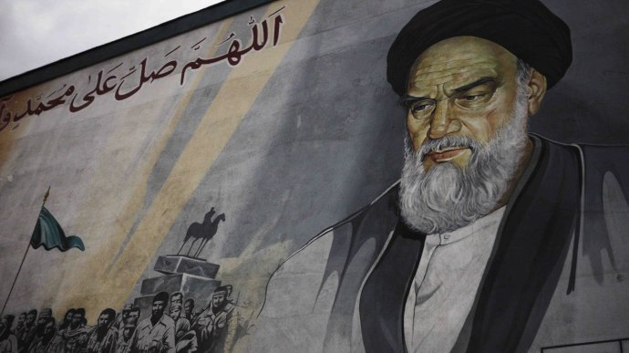
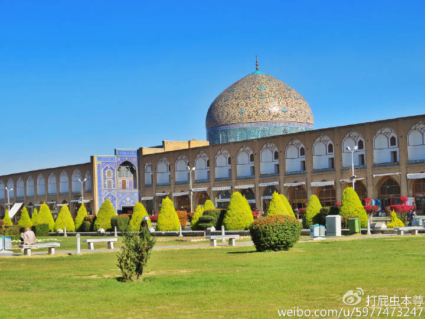
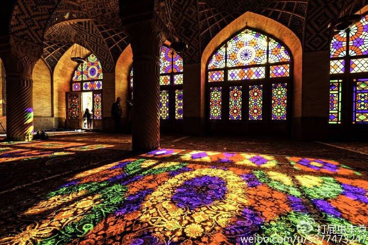
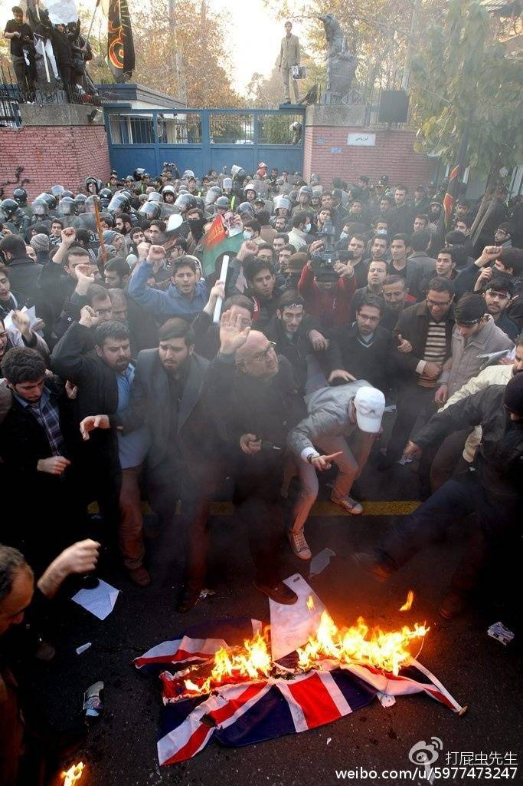
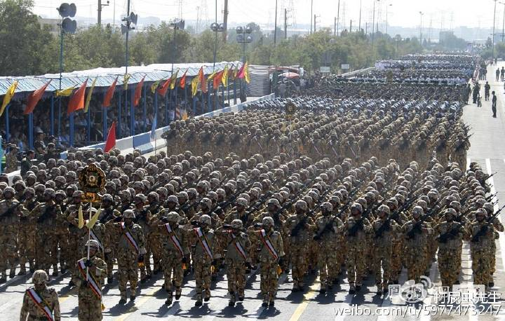

#《伊斯兰往事2：我是霍梅尼，我为安拉代言》下

* [打屁虫先生](http://m.weibo.cn/u/5977473247)
* [原链接](http://media.weibo.cn/article?id=2309404012205107453624)

		浅谈伊斯兰中的另类“什叶派”与伊朗

## 花甲之年，逃亡之路：

  因为组织反政府示威而被政府驱逐，亡命海外，这种事本该发生在年轻人身上比如学生领袖之类的，但霍梅尼这位老人家却挑起了这个大梁，他流亡的中转站是土耳其，短暂的停留了一年后他去往伊拉克，在伊拉克圣城纳杰夫定居下来，这一待就是14年，在纳杰夫，霍梅尼干起了自己的老本行，一方面在各个宗教学院和清真寺奔走不停搞起了唱传讲读系列活动，另一方面心系祖国，和国内的欧莱玛集团保持着紧密的联系，完全是一个翻版的孙中山和戴高乐，身在国外但却手握着一条无形线，若影若现的操控着国内的反对派势力。但这一切对于高速发展的伊朗来说似乎并不可怕，白色革命在伊朗继续如火如荼的开展着，在人民生活水平的不断提高的现实下，霍梅尼施展了浑身解数也没能在国内掀起什么大的波澜。然而在喜人的经济数据面前巴列维国王的自信开始无限膨胀，他把自己比作“万王之王”，凌驾于一切法律之上（**霍梅尼在国内时曾公开抨击巴列维即违反宪法又违反古兰经，这确实是实话**），他和他的家人以及他的追随者们过着超越平常人想象力极限之外的豪华生活，他们提前享受了胜利的“果实”，然而就是这种果实让巴列维国王和胜利永远的失之交臂，**这种果实的名字叫做腐败，它的种子叫做傲慢，培育它的土壤叫做权利**！我国以前不著名现在非常著名的科幻作家刘慈欣在他的作品《三体》中说过这样一段话：“**弱小和无知，都不是生存的障碍，傲慢才是**”。个人认为这句话几乎诠释了人类历史上所有的失败，巴列维国王也跳不出这个坑。腐败和傲慢如果说是失败的内因，那么总要有个外因把病症诱发出来吧，什么是外因？欧莱玛集团？不，他们只是下山摘桃子的。真正的外因是经济危机！就在公元1975年。

## 巨变前夜：

  一个国家在经济高速发展的建设时期，必然伴随着权利腐败，无论是独裁政权还是民主国家，基本都一样，但经济不可能永远在快车道上不减速，特别是像伊朗这种后发型国家，当人均GDP过了一定的水平线后，劳动成本必然升高，人口红利丧失，低技术的劳动密集型产业必然难以为继，做实业利润低了，资本家先想到的最便捷的方式不是投入科研提升技术（太慢，且不一定成功），而是利用手里的资金优势疯狂投资，哪里回报高就往哪里撒钱，结果把地皮抄到天上去了，接下来伴随的便是严重的通胀，货币贬值，老百姓遭了殃（中国前些年也出现过类似的情况），屋漏偏逢连夜雨，1975年后世界经济也不太景气，西方国家的能源需求量下滑，导致油价下跌，这对于伊朗这新兴产业尚不成熟，仍以能源出口为拳头产品的国家来说无疑是雪上加霜，国内经济形势混乱不堪，政府的钱袋子（油气）又缩水，使得巴列维对伊朗的经济控制能力急剧下滑。随着经济的停滞，过去被掩盖的问题开始暴露，民众开始不满巴列维的统治，并转而在宗教中寻找依托。数百万农民带着发财的梦想涌入城市，结果却成为城市的赤贫阶层。物价飞涨之下，一般的城市中产阶级也艰难度日，普遍不满于现状。留在农村的农民长期以来生活没有得到显著改善（虽然有土改，但政府没收得多，农民分的并不多，只是比过去稍好一些，经不起大的冲击），自认为是被遗弃的群体，更是怨声载道。生活无望的民众转而在宗教中寻找寄托，各类神学院校在地下兴起并蔓延，大量青年沉溺在宗教中不能自拔。说到这里可以反思出一个经济与腐败之间的关系，当腐败伴随着高速的经济发展时会呈现出：“**弱水三千我只取一瓢**”的状态，面对滚滚的经济洪流，老百姓们都忙着往自己桶里舀水，即便看见了偷水的也没工夫搭理，但洪峰总会过去，当杂乱无序暴风骤雨般的巨流慢慢变得平稳缓和有规律，河边的人各自能取多少水变得相对固定的时候，大家就会对偷水者表示愤怒和抗议，当大河因季节变换瘦成了一条涓涓细流时，大家就会坐不住了，这是如果有人在大喝一声：有人在偷水！那么就是大乱将至时！多数国家都无法避免第一阶段的腐败，但如果到了第二阶段还不加以控制，那么到了第三阶段就会控制不住或根本无法控制（我国目前就处于二阶段的开头）。

## 一夜翻盘：伊斯兰+五毛+公知大串联

国内局势的变化霍梅尼洞若观火，他加强了对国内的各种动作，但就在这时出了一个小插曲，那就是在1978年身为伊拉克副总统的萨达姆架空了他的表哥总统哈桑.巴克尔，实际控制了伊拉克，然后这位世界著名的世俗恐怖份子对霍梅尼这位“活圣人”非常不客气，直接让霍梅尼卷铺盖滚蛋，于是两人结下梁子（而伊朗和伊拉克也在这两人正式上台后的第二年抄家伙开打）。霍梅尼愤恨的离开了伊拉克，但他没有在中东其他国家逗留，而是选择去留巴黎，这真是个正确的决定，到了巴黎之后霍梅尼感到无比的幸福，因为法国做为白左的发源地给以了霍梅尼始料未及的行动自由，在这些道德富有，智商更“负”有的欧洲白左的保护下霍梅尼直接把他的住所变成了伊朗反政府的指挥中心，各路反政府人马大大方方的云集巴黎，虽然身处欧洲但由于交通与通讯的便利，霍梅尼对国内的操作反而更加便捷（讽刺的是霍在伊拉克反而受到各种限制与监控）。而在另一面，伊朗国内的局势到了1978年已经完全失控 ，当年1月发生反对伊朗君主体制的大规模示威活动；同年8月至12月，罢工及示威活动瘫痪了整个国家，一个好汉三个帮，闹事的当然不止宗教筒体，事实上当时伊朗国内共同倒皇的还有“公知”和“五毛”，也就是倾美的自由立宪派和倾苏的伊共份子也各显神通，按照今天的话来说就是：**绿绿+公知+五毛一起联合反政府**（这个画风简直要毁中国网友的三观，哈哈哈）！当然其中占股份最大人望最高的还是霍梅尼代表的欧莱玛，全国8万座清真寺直接变成了欧莱玛集团的根据地+兵营+宣传部，这个力量叹为观止！到了79年1月巴列维实在撑不住了，找了个看病还是度假之类的借口出国去了，老大一跑，底下立马鸟兽散，一年90亿美元武装的国防军斗志动摇，巷战中屡次被反政府游击队吊打，许多高级指挥官直接倒戈重新站队，而国内的媒体早就被教团拿下自不必说，这时的情况对于霍梅尼来说简直是一片大好，群众基础雄厚，舆论在手，对手武装力量瓦解，敌首潜逃！将革命进行到底的时候到来了，2月份霍梅尼就乘飞机飞回来阔别15年的伊朗，飞机落地的当天，万人空巷，200-300万群众自发到机场迎接，霍梅尼或许真的感到安拉的神迹降临在了德黑兰！

## 法基赫的监护：

  回来了，以胜利者的姿态回来了，一雪15年流亡之耻，但霍梅尼面对的是一个烂摊子，而全国人民又把所有的希望都寄托在他的身上，前路在哪里？这成为了霍梅尼面对的首要问题。但霍梅尼并没有惊慌失措，因为15年漫长的流亡生涯也是一个漫长的思考期，在此期间他给伊朗制定了一条出路：**法基赫的监护**，所谓的“法基赫”就是伊斯兰教法学家，而**法基赫的监护**就是为伊朗制定了一套“伊斯兰教法学家监国”的政治体制，伊斯兰教法学家成为了国家的监护人，凌驾于政府之上，负责对国家最根本最核心的方向性政策的把持，他们不干预政府的日常行政，但却是国家战略层面的操盘手，用一句我国人民熟知的政治术语来比喻就是伊朗这个国家的：**总设计师**。这位宗教+政治领袖开始在政治舞台上展现了他无与伦比的政治威望和老辣而精准的政治手腕，迅速的控制了局面 ，1979年3月，经过全民投票，伊朗伊斯兰共和国成立。同年颁布了一部伊斯兰宪法，宪法确认了霍梅尼终身领袖的地位，他统帅军队，决定宣战、停战和大赦。宪法确立了三权分立的政治结构，总统和议员均经选举产生，但当选总统须得到霍梅尼的认可，霍梅尼有权随时罢免总统。总统是国家的行政首脑，是仅次于宗教领袖的职务，但总统没有军权。

## 再造神权：

  霍从1979当政直到他1989年去世，这十年时间伊朗全面建立起了一套即不同于凯末尔主义的西方模式，又不同于纳赛尔主义的偏社会主义国家模式，更不同于沙特王权模式的独一无二的却又和这个国家高度融合的政治制度，这套政治模式可以看做现代化的神权政治，他以传统的神权政治为底色，加入了现代西方的民主制度做为国家日常运转的基本方式。在社会治理方面，严苛的伊斯兰教法全面实行使得整个社会环境收紧 ，伊斯兰革命卫队（**霍梅尼一手创建，独立于国防军直属宗教领袖管辖，伊朗的最高战斗力量**）及其他的伊斯兰团体强制对男女实施着装规定，妇女必须遮掩头发，男子不准穿着短裤。酒精饮料、大部分的西方电影、男女共游及晒太阳都被严禁。各阶层的教育课程经伊朗文化革命而变得伊斯兰化，课程由“伊斯兰大学委员会”设计。而其他宗教者在此期间受到极大的打击，人数急剧下降，政府的官位也被穆斯林垄断。霍梅尼在1979年7月禁止伊朗的电台及电视台播放军事和宗教以外的音乐，禁令维持了10年直至霍梅尼去世 。

## 火狱投射到现实 ：

  另一方面这十年间伊朗在经济、外交，军事方面都陷入了巨大的灾难和困境，首先在经济方面伊朗在霍梅尼时代可谓一塌糊涂 ，人民的生活水平比之巴列维时代不升反降，对于民众对经济失败的抗议霍梅尼表现出了令人叹为观止的奇葩态度，他公开表示经济和宗教比起来不值一提，认为“**经济是笨蛋的东西**”他在一个场合强调了殉道比起物质富饶更加重要：“**有人会牺牲他们的孩子来换取豪华的大屋吗？我实在无法相信这些祭拜的目的只是为了让瓜果的价格变得更便宜。**”  加之两伊战争的爆发，导致了政府负债及通胀，侵蚀了个人收入，并导致了史无前例的高失业率。在霍梅尼的伊斯兰式严格管治下，伊朗的绝对贫困人口在其统治时期的首六年内增加了45%，伊朗人移居国外的情况也加剧，革命以后估计“二至四百万企业家、专业人员、技术人员及熟练的工匠（及他们的资本）”都转移到国外。而在外部坏境方面伊朗也陷入了困境，由于全面实行沙里亚法激起了倾美和倾苏的世俗化势力和伊共的反对，国内的意识形态出现分裂，保皇派也在蠢蠢欲动，面对危机，霍梅尼玩出了一招声东击西，那就是**德黑兰人质危机**，他指示一帮“**爱国大学生**”冲击了美国驻伊朗大使馆，把大使馆工作人员抓了起来，这引发了两个后果，一是霍梅尼掌握了国内各派政治势力和美国秘密来往的绝密文件，一把抓住了政敌们的死穴，二是通过美国对伊朗前所未有的军事威胁把全国人民紧紧的团结在了新政权身边。这一箭双雕玩的炉火存青，但确实的本就紧张的美伊关系彻底破裂，西方世界长达30多年的对伊经济制裁就此开启（个人认为这是典型的以私害公，用国家利益为党派利益买单）。

  正所谓福不双至祸不单行，身边的老冤家萨达姆来了个乘火打劫，在美国的怂恿下，萨达姆相趁伊朗政权更迭，形势不稳的大好时机，先发制人一口气干翻伊朗这个什叶派穆斯林老巢，顺带把阿拉伯河西岸的油田抢到手，从而树立伊拉克在中东的主导权，1980年9月22日，伊拉克为这块有争议的河流，借口为抵御“伊斯兰革命”，悍然向伊朗发动军事进攻，这一打就是8年时间，而且主战场就是在阿拉伯河两岸（伊朗的油气产区），由于伊斯兰革命爆发后旧朝军队内的大量军官遭到清洗，年轻的伊斯兰革命卫队缺乏经验，使得伊拉克军队开始时占据了极大的优势，但毕竟有巴列维王朝半个多世纪的洋务运动积攒的国力作为保障，伊朗还是撑住了局面随后展开了反击，这样一来进战争入了极其残酷的拉锯状态，双方发生了许多骇人听闻的事件，在波斯湾双方海军都无差别攻击本国外的所有船只，导弹袭城战毁灭了大量的城镇，伊朗方面组织起了**伊斯兰儿童敢死队**，负责趟雷和冲锋，而萨达姆这位世俗化恐怖分子当然不吃这套，下令前线部队坚决开火，并且还动用了生化武器，整村整村的屠灭，直到1988年双方国力耗的油井灯枯，都实在熬不下去才签字罢兵，两败俱伤成为了战争的结果，这场战争前，伊拉克的外汇盈余近400亿美元，两伊战争战争结束时，它的外债是800亿美元，战争中，伊拉克的死亡人数是18万、伤25万，直接损失是3500亿美元。伊朗也欠外债450亿美元，死亡70万、伤110多万，仅德黑兰就有20万妇女失去丈夫；直接损失3000亿美元。战争使两国经济发展计划至少推迟20至30年。

## 为何没垮台？

  巴列维王朝面对一次经济危机就土崩瓦解，然而新生的伊斯兰共和国为什么在初生的头十年同时面对经济制裁、外交封锁，外敌入侵的情况下竟然屹立不倒？个人认为一方面是伊朗有一定的老本儿可以吃，巴列维王朝50多年的快速发展为伊朗打下来现代化基础。但更重要的就是霍梅尼所开创的这套制度很对伊朗人的胃口，一方面把通过宗教把底层人民团结在了一起又没有完全斩断现代化的道路，在1989年霍梅尼去世后，他的这套制度发挥了特有的灵活性，由于民选政府的存在许多伊斯兰教法被取消，世俗的踪迹在整个社会慢慢恢复，但又不影响法基赫监国的绝对权威，而巴列维时期遗留下来的完备的轻工业体系，和一定程度的重工业使得伊朗能够不完全依赖石油经济的束缚，对比一下两伊的命运就知道了，伊拉克是一路惨到底，而伊朗在战后面对美国的制裁虽然没有大富大贵，但也没有垮台，经济每年都能稳步增长1996年GDP恢复过1000亿$，2006年超2000亿$，2007年超3000亿$，2010过4000亿$，2011年过5000亿$，2012年的数据伊朗人均GDP6300左右比中国还高点。可以看出一个问题，伊朗革命和头十年的悲剧主要是由霍梅尼的个人错误造成的，由于他的绝对政治权威让他的错误得以蔓延，但一旦这位政治强人离开，伊朗就迅速的做出了调整，说明霍梅尼个人虽然有诸多政治决策失误，但他所开出的这套制度是很有特点的，起码符合伊朗的实际情况。除开这些因素意外，还有一个更为根本的问题就是什叶派的优势，为什么这种既不偏向西方也不偏向东方的灵活的制度会产生在伊朗，这和伊朗是个什叶派穆斯林国家有很大关系，什叶派和逊尼派比较起来虽然他是少数派别，但却有一个明显的优势，这个优势叫做：**创制**！也就是说同样的古兰经和圣训在逊尼派看来是唯一的真理，特别是古兰经更是一字不易的，而对于什叶派来说古兰经虽然一字不易，但内容是可以被解释的，圣训更是可以按照不同的时代对他进行不同的理解甚至否定部分内容，这就是伊朗的优势，它让伊朗可以和逊尼派国家走不同的道路，逊尼派国家想要现代化必须用凯末尔或纳赛尔的办法即强力制伏伊斯兰教，搞全盘西化，但这种办法必须依托政治强人，强人一死，隔不了几十年伊斯兰就会翻盘，埃及的穆斯林兄弟会死灰复燃和土耳其的伊斯兰回潮都是这个道理，也即是说逊尼派国家伊斯兰和现代化很难兼容，有你无我。但什叶派的伊朗在霍梅尼开创的制度下表现出了一种中性的协调，（当然这种协调是在霍梅尼个人死后出现的）。所以笔者认为伊朗将是未来中东甚至穆斯林世界最有前途的国家，也必然是第一个依靠自己开创的道路走向现代化的穆斯林国家，它将成为未来中东的主导。而我国目前的一带一路战略也因该把伊朗做为投资的重点。

## 后记：

  霍梅尼死于1989年，德黑兰万人空巷，他给伊朗发掘了一条崭新且独特的道路，也给伊朗带来了重大的灾难，个人文中或许有几分调侃，但文章的最后却无法对他做出评价，因为我们现在还不知道现代人类社会应不应该出现神权国家，也不知道神权国家能不能成功的走向现代社会