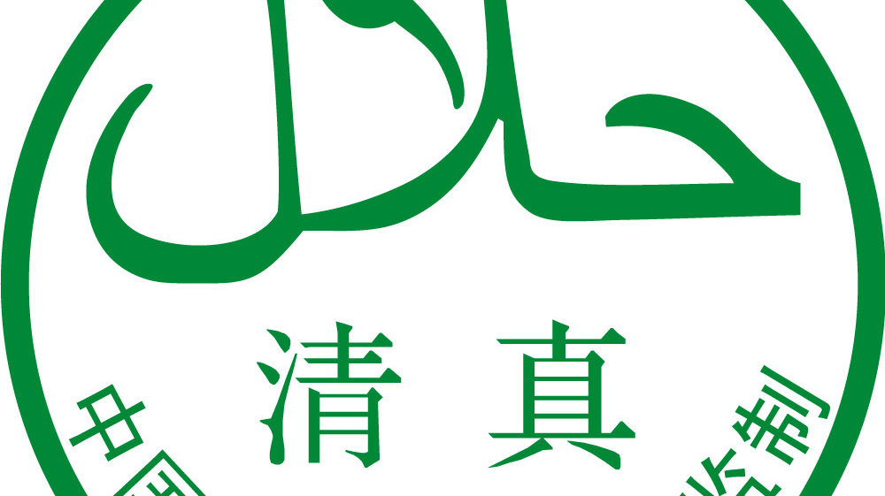
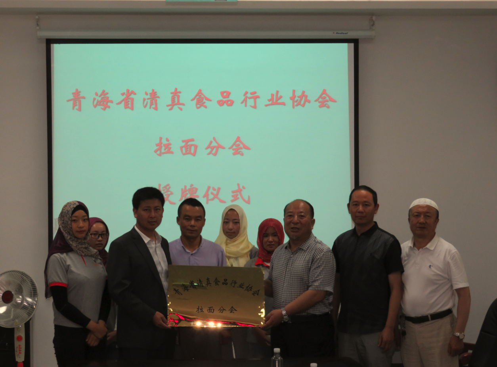
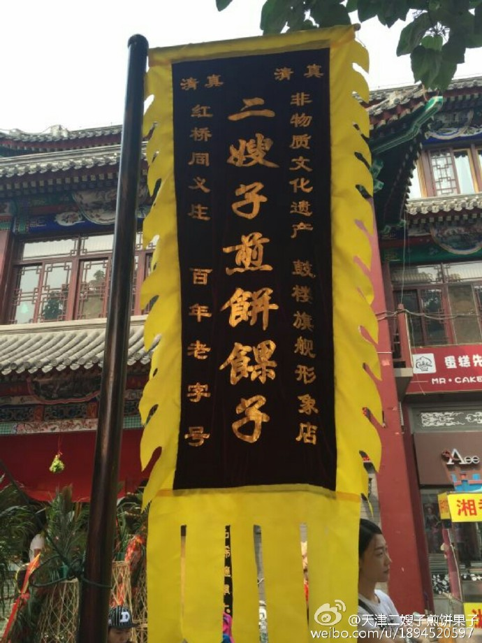
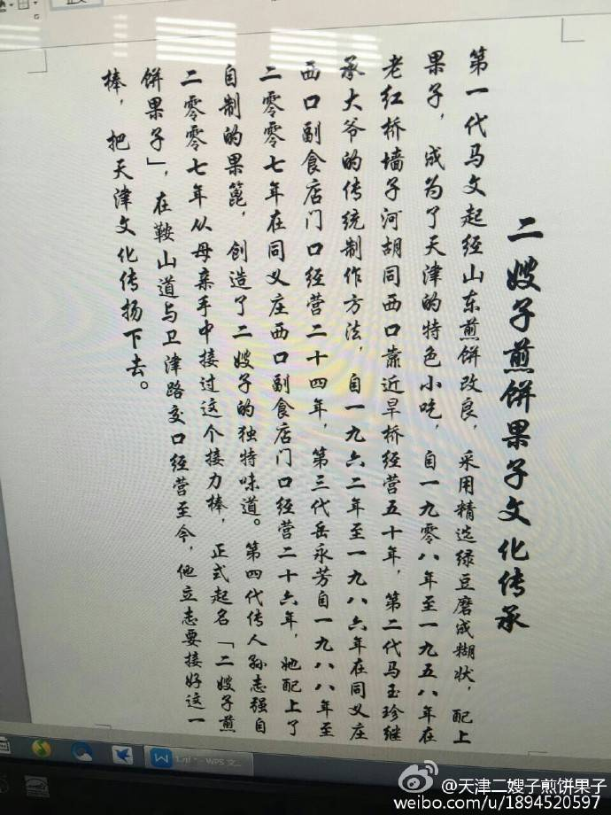
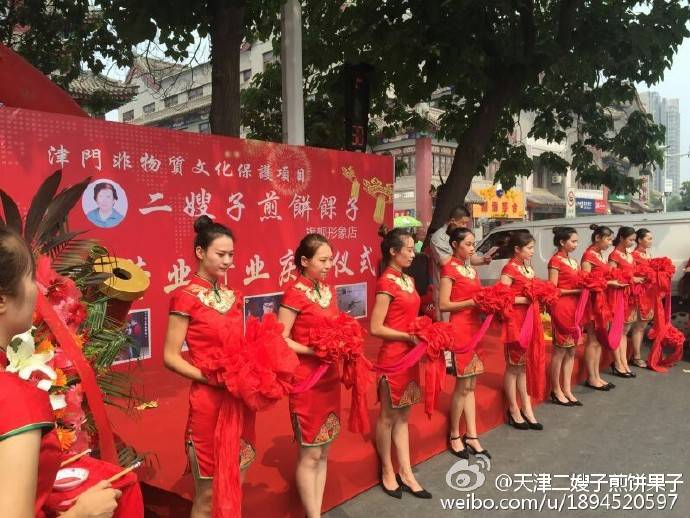

#清真煎饼会不会成为下一个拉面帮？

* 作者: [王昙的清真书橱](http://m.weibo.cn/u/5676163189)
* [原链接](http://media.weibo.cn/article?id=2309404007023883748541)

```
现在看来，这是一个必然的结果
```

谈到这个话题的时候，我们应该先分析一下拉面帮这个组织的真正成因，拉面帮主要的行为，就是在一切地区，利用他们内部所谓的四百米，五百米内不得卖面的行规，打砸其他面馆，借此敲诈，勒索，光是今年，就有十几起类似的事件。

他们为什么会有这么大的力量呢？分析之后我们才能知道，清真煎饼有没有成为拉面帮的可操作性。

一些人认为拉面帮成为一个欺行霸市的组织，与伊斯兰教有很大关系，这个观点也对，也不对。

拉面帮能做大​一方面是依靠了伊斯兰教的地方组织，每个地方的拉面帮的主要领导中，都有伊斯兰教的神职人员，也就是阿訇，阿訇利用自己的影响力，在拉面帮闹事的时候，负责组织号召，一来可以增强伊斯兰教的凝聚力，另一方面教徒看到这个宗教的力量这么大，也会因此变得更加虔诚。

拉面帮另一方面，依靠的是伊斯兰教教义上对非教徒的歧视，古兰经有大量诅咒异教徒下火狱的内容，还有在智力、人格等等方面侮辱非穆斯林的内容，真正去了解过伊斯兰教的穆斯林，难免都会在心理上产生一种优越感，这也是拉面帮敢于打砸，敢于堵门的原因，因为在他们看来自己掌握着绝对的真理，其他的不信伊斯兰教的人都是渣渣。

拉面帮大部分人都是对伊斯兰教教义有过了解，在宗教上比较虔诚的穆斯林。



所以女性都带头巾，说明他们对教义有了解，且坚持

拉面帮之所以成功，还有一些历史原因，因为兰州牛肉面的推广者马保子是回族，而他的名声比兰州拉面的开创者汉族人陈维精的名声大​，所以很多兰州汉族，也一直认为马保子才是兰州牛肉面祖师爷，这种历史的误会，也让拉面帮有了所谓的历史依据。

有了这三方面的支持，再加上一些地方因为团结问题，对聚众的拉面帮才去妥协的态度，也就造成了拉面帮越来越嚣张，毕竟他们有经验了，也确实得到了很多好处，有现实好处，还显得自己更加虔诚，怎么会不继续干下去呢？


围堵拉面店的穆斯林

那么下面我们来分析，清真煎饼有没有可能成为拉面帮这样的组织。

第一点，他们能不能借到伊斯兰教的组织力和教义支持？这点是毫无疑问的，我们看看清真煎饼的招牌就知道他们对清真是非常重视的，把清真两个字写在大旗的最上方，换句话说，他们是信仰伊斯兰教的穆斯林，而且也是穆斯林泛清真化现象的一员。



他们也一直在强调自己很清真

​其次是历史误会，事实上他们也在造成这种历史误会，我们看一下清真煎饼对外的宣传。



按照这个说法天津煎饼是穆斯林所改造出来的小吃，虽然他们是学习了山东煎饼，但他们天津煎饼的祖师爷，这点和兰州牛肉面的情况类似，主要他们在宣传上扩大力度，天津煎饼是穆斯林创造的食品的观念，会慢慢深入人心，这只是时间问题。

有些人说清真煎饼的经营者对伊斯兰教的教义理解更开放，你看他们剪彩的姑娘，都是穿旗袍的，所以他们的信教态度更开明，我的观点是，光凭这一点，我们并不能确定他们的态度是不是开明，而且在有利益驱使的情况下，这种开明的态度，是不存在意义的。

那些拉面帮的成员的真实宗教态度，有人去调查过么？他们需要的是伊斯兰教的组织和教义，他们内心真实的态度，对现实生活是毫无意义的。




而这种发展路线，清真煎饼也可以慢慢做到，这只是个时间问题，目前它当然会表现出比较开明的态度来，因为一方面它还不具备拉面帮的实力，说简单点，它还需要非穆斯林的财力支持，当它具备了足够影响力之后，它完全可以通过垄断市场，来实现利益，那么到时候非穆斯林再去抵制，事实上已经晚了。

非穆斯林对抗拉面帮这种组织，唯一能采取的合理合法的方式，也只有宣传大家去抵制而已，事实上非穆斯林在这种事情上，从来没有任何优势，甚至在很多地方都处于劣势状态。

所以我们现在要讨论的，并不是清真煎饼现在是不是拉面帮一样的组织。

而是未来他会不会成为拉面帮这样的组织？如果从善良的角度去分析，我当然希望清真煎饼的老板们，都能高风亮节，不被现实利益诱惑，遵纪守法，抵抗住金钱的腐蚀……

但如果我们现实一点，我们就会发现，好像变成拉面帮这种组织的利益更大一些，从现实角度去看，他们没有任何理由拒绝这种诱惑。

所以这清真煎饼，你是吃呢？还是不吃呢？


