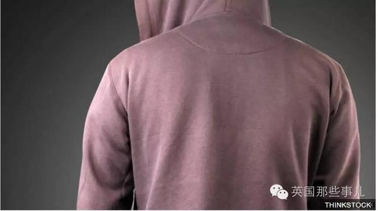
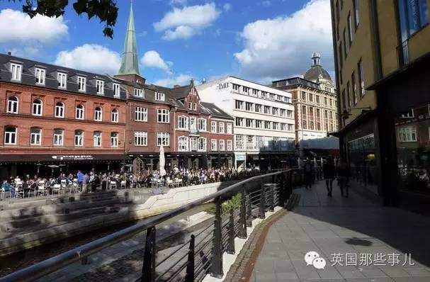
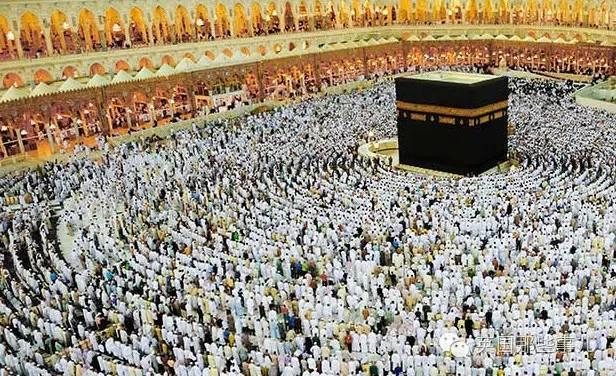
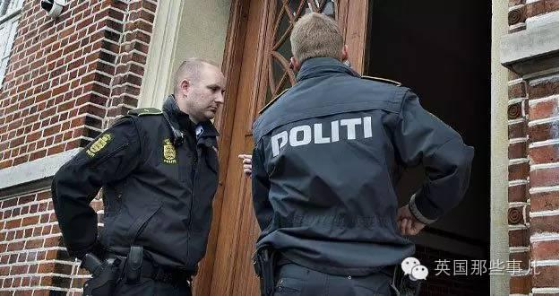
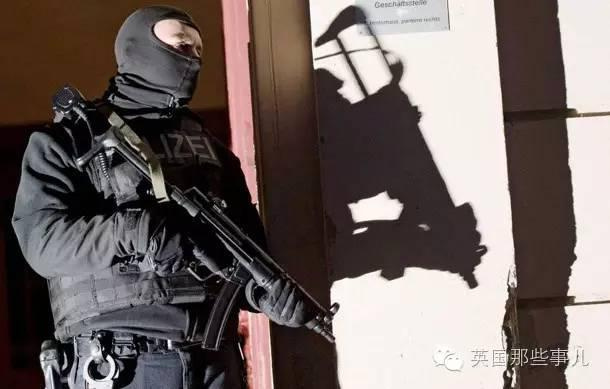
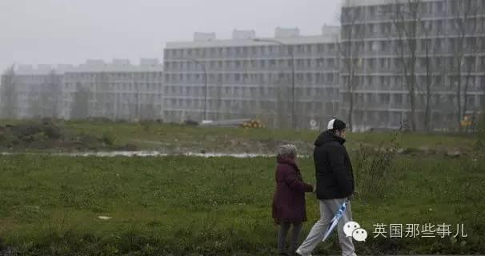
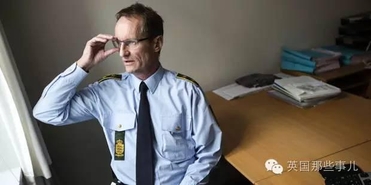
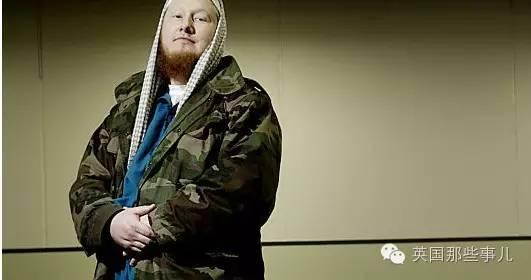

#我，是怎么差一点就成了圣战者的...一场洗脑与反洗脑的斗争...

* 原译者:[英国那些事儿](http://weibo.com/hereinuk)
* 2016-08-28 23:57
* [原链接](http://toutiao.com/i6323911856427631106)

话说....

今天的故事，要说说丹麦。

在2013年以前，丹麦曾经是欧洲人均产出激进分子第二多的国家.. 平均每100万丹麦居民里就有27人被恐怖分子洗脑而前往叙利亚或者伊拉克.

今天，我们就要从其中的一个丹麦中学生说起...

**【我，是怎么差一点就成了圣战者的..... 】**

我，是怎么差一点就成了圣战者的...一场洗脑与反洗脑的斗争...

今天这个故事的主角，为了保护个人隐私，媒体没有公布他的真名，他接受BBC的采访，说出了自己的故事.....

他出生在索马里，六岁时，跟随穆斯林父母移民到丹麦，在丹麦第二大城市奥胡思郊区的一个社区安了家....

我，是怎么差一点就成了圣战者的...一场洗脑与反洗脑的斗争...

在他们到来这里以前，这个社区里没有黑人，也没有穆斯林。 他们来到这之后，作为社区里的“少数民族”，他常被同学嘲笑，甚至会被同龄人责问他的血管里流的是不是人血。

最开始的时候，他会反击，会和别的孩子打架... 然而等他再长大一点，他决定换一个方法解决他的问题：他立志好好学习，博得老师和同学的喜欢，并成为一名遵纪守法的好青年。

这个方法一直到他高中快毕业都很有效：他平生第一次和丹麦土生土长的同龄人成为了朋友，并且开始在这片土地上找到了自己的归属感。

**然而，**

**这一切都被一次朝圣而摧毁了。**

他上高中的最后一年，父亲宣布要带他去麦加朝圣。

“在那以前，我几乎是把我的宗教丢在了索马里，”他说，“但是我父亲不一样。他对我说，你是个穆斯林...你要熟知自己的历史，背景和宗教。”

他跟随他全家去了麦加。

旅途结束，他对于回到丹麦表示不能再开心：

“从麦加回来，有了宗教的我就像换了个人。我看世界的角度和以前完全不一样了，我开始认识到信仰的重要性，我相信来生。”

我，是怎么差一点就成了圣战者的...一场洗脑与反洗脑的斗争...

为了展示自己的信仰，他放弃了牛仔裤和T恤衫，开始穿穆斯林传统服饰上学。

对此，他学校里的同学们，表示并不买账。当别的同学和老师对他的信仰表示出质疑时，他会大声的和人争论。

虽然现在的他承认那时自己解决问题的方式并不圆满，但是当时他就想着要保卫自己的信仰。 他的这种保护自己信仰念头，加上其他同学一些近似于钓鱼性质故意嘲笑和挑衅他信仰的言行，让他的反应越来越激动。

一次课堂辩论，班上的一个女生告诉全班同学，穆斯林“恐吓威慑”西方国家，肆意杀人，并且会用石头打死女人。这样的言论，他并不同意。 很快，两人便因为这句话争论了起来。最后，辩论技巧还欠佳的他在盛怒之中丢下一句：

**“你们这种人就不该存在在这世界上！”**

这一句话，

成了之后一切的导火索。那堂课的老师把这件事上报给了校长，校长随即报了警。

他很快被停学并被审问。警方突袭了他们的家，搜查了他的所有物品，跟他要了他邮件和所有社交媒体的帐号密码，翻遍了他社交网站和Email里的一切信息。

我，是怎么差一点就成了圣战者的...一场洗脑与反洗脑的斗争...

警方这么对他表示。

“我们之所以来这里，是因为你班上的同学对你表示害怕，他们觉得你可能已经转化成激进分子，他们害怕你可能做出一些危险的举动。 他们觉得你在沙特期间被洗脑了”

面对BBC的采访，他回忆起当时的场景：

“我把一切都交出来了，并且看着他们一点一点的搜查我的房间，那种感受太令人羞辱了。后来他们走了，留我一个人在那儿，又气又怕。”

我，是怎么差一点就成了圣战者的...一场洗脑与反洗脑的斗争...

当警察终于证明他的清白时，因为调查期间的暂时停学，他已经错过了学校的期末考试。学校也没有给他延期考试的机会——这意味着他不能按时高中毕业。

不久后，他的妈妈去世，而他将这一切都归咎于那个“拒绝他的西方社会”。

**“我感觉像是被这到处是种族歧视的社会狠狠地打了脸，”他说，“他们敢叫我恐怖分子？那我就成个恐怖分子给他们看看！”**

现在他回想起当时自己的这一切时，他脸上挂着尴尬的微笑。这么多年过去了，现在回想起自己那时的想法，自己都觉得可笑.....

但是无论现在觉得可笑与否，当时，当他把那段时间发生的事都跟他在清真寺的朋友们说了之后，这些朋友们很是同情他的遭遇。他们对西方国家处理穆斯林问题假仁假义的方式表示不满。

他们开始一起上网看圣战的录像，觉得这些圣战录像给他们的激励无比振奋..... 其中给他印象最深的是阿瓦尔·奥拉基，一名也门裔的美国极端分子。奥拉基2011年死于一场无人机空袭。

“他会说：‘我们在和西方打仗。如果我们不反抗，西方人会把所有穆斯林都杀死。’我对此并没有什么深刻的感受，但是我的朋友们都说他说的一点儿没错。”

**最终，有人告诉他，如果他想更好的了解伊斯兰并且受到穆斯林的尊重，他应该去巴基斯坦。巴基斯坦那儿有一所学校，他们是所有伊斯兰教学校里最好的....**

我，是怎么差一点就成了圣战者的...一场洗脑与反洗脑的斗争...

他回家向他父亲寻求建议。他父亲并没有反对他去巴基斯坦，只是建议他等到高中毕业之后再走。

然而几乎就在他问他父亲的同时.... 电话铃响了....

电话的那头，是一个叫Link的警员，Link希望能要求他过去，找他喝杯咖啡，聊聊天。

他把Link劈头盖脸的臭骂了一顿，并准备挂掉电话。这时Link做了一件他意料之外的事：他为他同事对他所做的一切道了歉。听到一位警察肯为近期所发生的事情负责人深深地触动了他，这成为了他人生转折点的第一步。

即使并不情愿，他同意与Link见面。当时他的想法是把自己的观点甩Link一脸：

“我要去巴基斯坦了，法律限制不了我的人身自由，我想干嘛干嘛。等我上完学攒够钱就走。再见，拜拜。”
然而，

Link提出了另一个提案：他想让他与另一位穆斯林Erhan见个面，并且和他聊聊最近发生的事。

我，是怎么差一点就成了圣战者的...一场洗脑与反洗脑的斗争...

虽然不怎么情愿，但是警察要求之下，他还是同意了.....

“帮警察说话，这人就是个穆斯林里的叛徒。”

这是他第一次走进Erhan办公室时的唯一想法。在他们最初接触的几个月里，他无时无刻不与Erhan处于敌对关系。每一次见面，他都会对Erhan进行搜身，生怕他身上带有窃听器。

对于他的挑衅，Erhan总是会用平静，低调而符合逻辑的方式进行反击。而这也让他无比懊恼.... 因为他总是说不过Erhan.....

为此，他经常向清真寺的朋友们请教，希望能用他们的帮助打败这个“警察派来的叛徒”。

而面对他的刁难，Erhan从来都没放弃自己的立场。

姜还是老的辣。僵持了一段时间，他表示他最终放弃了争论，并且开始听循Erhan的建议。

**“你受到了不公平的待遇，没错，”Erhan对他说，“但是如果你去了巴基斯坦，你这一生就完蛋了。”**

他表示Erhan帮助他理智的分析问题，并且让他意识到了巴基斯坦的危险性。Erhan并没有要求他放弃自己的信仰，他告诉他不滥杀无辜才能做一名好的穆斯林教徒。

**“当穆斯林和在丹麦拥有一个好的未来并不冲突，”Erhan说，“你可以为这个世界创造财富，而不是成为它的累赘。”**

“我对我的生活很满意，因为我能看见我的未来，一个之前被黑暗笼罩的未来。”他说，“如果我当时没有接到那个电话，我现在估计还在巴基斯坦，或者已经死翘翘了。现在我完成了这个项目，我打算和Erhan一样，成为一名导师。”

恩？ 导师 ？？

是的....

他之前所经历的这一切，其实都属于丹麦政府的一个反恐项目：

**【奥胡思模型计划】**

2007年，在伦敦的77炸弹爆炸事件之后。 丹麦政府开始认真的考虑这轮新的反恐形势 --- 恐怖分子不一定从外国潜入，而也可能从国内扎根，在国内被洗脑而转化成激进分子.....

**于是，当年他们开始策划准备了奥胡思模型计划，并在2013叙利亚内战爆发后正式实施。**

**整个项目里，对潜在的年轻激进分子的反恐预防，以软化的谈话为主...导师是奥胡思模型里最关键的一个环节。**

不但针对一些可能潜在转变成激进分子的本国居民，还会对一些哪怕已经去到中东又反悔回来的人网开一面，只要他们还没有犯下罪行，他们就会被奥胡思模型计划所接受。

**通常情况下，被警方怀疑为潜在极端分子的年轻人（包括那些刚从中东回来，并无犯罪记录的人）都会按需要被推荐给一名导师和/或一名心理医生。**

警方同时会调动资源，给他们安排住处，学校，甚至工作，从各个方面帮助他们重新融入社会。同时，这些年轻人的家长们会被要求加入一个由其他家长，社工，老师，青年俱乐部工作人员等组成的网络，协助发现并阻止更多的年轻人走上激进化的道路。

我，是怎么差一点就成了圣战者的...一场洗脑与反洗脑的斗争...

与此同时，欧洲的其他地方对于公民前往中东国家一律持打压态度。

法国强行关闭任何可能在生产极端分子的清真寺。英国把协助ISIS当作卖国贼。其他国家表示要吊销这些人的护照——这种惩罚以前只用在被定罪的叛徒身上。

但是丹麦让他的公民明白即使他们去了叙利亚，祖国也随时欢迎他们回家。并且如果他们需要，会提供给他们一切回归社会的帮助，只要他们在叙利亚没有犯罪。

这个被媒体戏称为“拥抱恐怖分子”的项目，是奥胡思目前以来最结实可靠的安全网。

**警方认为，狠狠的惩罚这些年轻的穆斯林激进分子只会让他们更愤恨，从而增加他们报复社会的可能性。为他们伸出援手是接近他们并且保证社区安全的唯一办法。他们想法的背后并不是幼稚无知，而是科学。**

“一开始面对恐怖主义，我们的反应是用军队和警力消灭他们，然而这并没有什么卵用，”马里兰大学的社会心理学家和暴力极端主义专家说，“这种反应把他们当作犯人，剥削他们的自由，并且鼓励歧视 - 这样只会使矛盾激化。这种行为告诉年轻人歧视是真实存在的，并且会进一步给他们反抗社会的动机。”

丹麦并没有用强制性手段阻止公民前往中东地区。相反，奥胡思项目选择用软化的手段，与激进化的根本作斗争。

他们表示：屈辱和对极端思想的寻求有很强的关联。像ISIS这样的组织很善于利用那些因为种族，宗教或政治歧视而被推倒社会边缘的人。

**而奥胡斯模型，却告诉像这次故事主角里那位一样的年轻人：这个社会有他们的一席之地。**

2013年，丹麦有30人跑去叙利亚.... 在这个计划实施之后的2014和2015年，被洗脑跑去中东的，分别只有1人和2人.......

就这样，这个丹麦城市拥有了全世界迄今为止最不寻常也是有效的反恐预防项目 -- 奥胡思模型计划......

Ref：

----------------------------

吖鳴：主要是这些人并不是从小被洗脑的，所以还能反洗脑回来

久远信市：很多时候这些人也就是本来就衣食无忧闲得慌，当你每天努力工作挣钱糊口养家过日子时，鬼才会去想参加什么战呢……

島穴：宗教问题真的很重要吗？我一点概念也没有。还是那句:愿世界和平

奶油蘸盐吃_一个铁吹：歧视会引起反抗，这也是必然的。抵制穆斯林的风潮接下去可能也会陷入这样的恶性循环

风之哀伤_Ver32：我觉得，不靠谱……不具备推广性

艾瑞莉娅的老公：洗脑和反洗脑的对决

河树精：我的愿望:1.世界和平2.种族平等，尊重人权

-----------------------