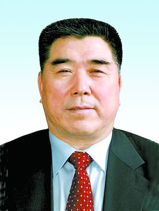
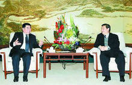

#【以史为鉴】2004年 河南中牟事件 参考（转）

* 转载者:[我西门吹雪](http://m.weibo.cn/u/5908283106)
* 09.16 10:21
* [原链接](http://blog.sina.com.cn/s/blog_5cd164f50100o82f.html)

`事情发生后，河南省省长李成玉《回族》，他派了回警支队，让少数汉民和多数回民互殴`

来源: http://blog.sina.com.cn/s/blog_5cd164f50100o82f.html

**目击者：河南中牟回汉冲突的根源  当时政府只抓汉人，不抓回民**

河南中牟事件，事情发生后，**河南省 省长 李成玉(回族)，他派回警支队去了**，他们去了以后偏袒回民，把少数汉民和多数回民包围在内任他们打斗。这样以来无益解决问题。 
当地汉族老百姓对省长很是不满，后来罗干带军队来才得以平息，也不知你来过黄河滩吗？**那时聚集了成万的回民带着白帽，要去参加战斗**

在河南中牟县发生大规模回、汉冲突的第四天，笔者来到中牟县城。在县城街谈巷谈的话题全是关于这次冲突，但大部分的群众认为这次冲突绝非偶然，而是因为长期以来的积怨太深。 

在中牟县医院停著大批警车，据说县医院里住的是汉族受伤的群众，为了防止回民来闹事而不得不加强戒备。相对中医院比较松懈，只有一辆警车。但是有大批救护院内停有六辆都是豫A? Y开头的车牌，是从郑州调来的，据说中医院内是回族伤员。 

第二天笔者从街头听到消息说，回民集居在一个叫「南仁」的村庄。这是在周围比较大的村庄，有几千人。**这个村庄的回民在中牟特别凶蛮，曾经在光天化日下后砸抢一家饭店，更有甚者，曾铲平一个叫「银地庄」的汉族村庄。**

随后笔者采访了被砸抢的饭店老板的妻子。**事情是因为饭店的老板开车在超车时与回族的一个司机发生了口角，随后店老板被回族司机和同伙打伤。在店老板被亲属 送进医院后，回族司机回村带领一帮回民冲进医院，将店老板拖出病房，生生拨下身上的输液针，在医院内进行野蛮殴打。店老板的妻子报警后，警察来到现场却不 敢上前阻止，店老板的妻子跪在他们面前哀求，他们仍然没有上前进行阻止。在对当事人进行了殴打后，回民仍然不出气，随后来到当事人的饭店将整个饭店砸毁， 连里面吃饭的客人也没有放过，见一个打一个。更让人不能理解的是，连店门口经过的公共汽车和饭店邻近的店铺也都未能幸免，都被不同程度的砸毁。但让人气愤 的是，事件的始终都是警察站在街的对面，却根本没有阻止，用当地老百姓的话来说：回民太凶，警察也惹不起。可笑的是，等回民打砸完毕之后，警察上前来疏导 交通了，看起来倒是很像是为这帮回民打扫战场的样子，他们做事不太乾净，要警察来替他们擦乾净屁股。至今店老板因为告当地政府不做为，又害怕被回民报复， 仍然不敢回家，他的妻子守著饭店整日以泪洗面。他们仍然没有得到一分钱的赔偿。**

随后笔者又赶赴曾在今年的三月份**被回民铲平的「银地庄」**。这是一个只有百十来户人家的小村庄，看上去很破败村口就是一□破烂倒塌的房屋。听说有人来采访关于回民砸毁村庄的事，村民纷纷前来向笔者诉苦。 

一个中年妇女带领笔者来到她家指著被砸烂后至今没有修补的门窗哭著说：「他们冲进来后见到什么就砸什么就连我家的洗脸盆都没有放过！」 

「那你当时知道他们为什么来砸吗？」 

「我哪知道？当时看见他们**戴著白帽冲进来**都吓傻了，他们个个手里都拿著家伙看见什么砸什么」。 

「那你后来知道是为什么吗？」 

「听说是因为我们村里的一个人和一个回民发生口角骂了几句。」 

「是哪里的人来砸的？」 

「是南仁村就是那个回民村。」 

「你得到了赔偿吗？」 

「只有一千多块怎么够呀，我家所有的东西都被砸坏了，玻璃都是烂的到现在都没有钱修补，家里的农用车也被砸坏了，现在种地都没办法种，以后的生活可怎么办呀。」 

「那钱是谁赔偿的你知道吗？」 

「不知道，村干部也没说只知道去领。」 
随后笔者又来到另一家，这家的大门明显的还可以看到被砸坏不能关闭。家里所有的门窗都被砸毁，彩电和VCD只剩下空壳，就连房间里的镜子和屋顶的吊灯也不能幸免一样被砸的粉碎。 

「事情过去这么久了为什么你不修理一下？」 

「没有钱呀。」 

「不是有赔偿吗？」 

「那点赔偿怎么够呀，好比你损失了十块只赔了你一块你说你怎么修？」主人无奈的对笔者说。 

「你们听说后来南仁村被处理了吗？」 

「没有听说，他们一贯这么横政府也不敢管他们。」 

「这样的事在你们这里经常发生吗？」 

「以前只是听说，从没想到会轮到自己的头上。」 

「你们整个村子都被砸了吗？」 

「对呀，一家都没能躲过。」 

「有人受伤吗？」 

「有呀，好几个头都被打烂了。」 
在回来的路上出租车司机气愤的对笔者说：「说到底这都是政府的责任，都是因为他们姑息养奸，政府和警察是干什么吃的？罚款、收钱的时候跑得比谁都,快出事就没人管了？」 

「政府为什么不管呢？他们不怕群众不满吗？」 

「他们才不管呢，只管自己吃饱喝足贪污腐败哪有时间管我们的死活？他们怕我们什么？他们只需要巴结好领导保住自己的乌纱帽就行了！」 

「你认为问题出在什么地方呢？」 

「我觉得大部分是政府的责任，虽说国家有对少数民族的优惠政策但决不是让他们无法无天！」 

**正是因为当地政府的漠视和纵容，在南仁周围的汉族村庄被三番五次的欺压之后，他们对政府已经绝望。在一个汉族女孩因为为回族司机让路不及时 被打伤后又被残忍的从赶来救护车上拖下放在车轮下碾死的时候，周围汉族村庄的愤怒像火山一样爆发了。十几个村庄联合与回民的村庄展开了一场惨烈的肉搏战。代价是惨痛的 ——几十鲜活的条生命就这样消失了。留下的是哭泣的亲人、破败的村庄还有伤者痛苦的哀嚎。** 

笔者当天非常幸运的混进了还在戒严的苇坡村就是打斗发生的地方。在这里笔者看到到处是横幅和标语「恶首必惩！」「坚决打击一切犯罪分子！」「坦白从宽、抗 拒从严。」「立即恢复正常生产秩序！」到处是各个部门来的工作队，到处都充斥著警察宣传车的声音，三步一哨五步一岗，所有的车辆无一例外全是警察和相关部 门的车辆。 

李成玉简介

李成玉，男，1946年8月生，回族，宁夏海原人，中央党校大专学历，1971年12月参加工作。曾任中共河南省委副书记，河南省省长，中华全国供销合作总社党组书记，理事会主任等职务； 

1971.12——1973.07，宁夏回族自治区海原县郑旗公社党委秘书；

1973.07——1975.12，宁夏回族自治区海原县委常委、郑旗公社党委副书记（其间：1974.07—1975.07 在中央民族学院干训部学习）；

1975.12——1976.10，宁夏回族自治区海原县委常委、李俊公社党委书记；

1976.10——1978.06，宁夏回族自治区海原县委常委、县革委会副主任；

浙江省委书记习近平和河南省长李成玉交谈

1978.06——1983.09，共青团宁夏回族自治区委书记、党组书记（其间：在

中央党校

学习半年）；

1983.09——1985.08，中央党校干部进修部学习；

1985.08——1988.05，宁夏回族自治区银南地区地委副书记、行署专员；

1988.05——1992.09，宁夏回族自治区人民政府副主席、党组成员；

1992.09——1995.12，河南省人民政府副省长、党组成员；

1995.12——1998.08，中共河南省委常委，常务副省长、省政府党组副书记；

1998.08——2003.01，中共河南省委副书记，常务副省长、省政府党组副书记；

2003.01——2008.03，中共河南省委副书记，省政府省长、党组书记；

河南省委书记李克强和省长李成玉交谈

2008.03——2008.05，中华全国供销合作总社党组书记；

2008.05——2011.8.28，中华全国供销合作总社党组书记、理事会主任；

2011.08.26——第十一届全国人民代表大会农业与农村委员会副主任委员；[2]

2013.03——第十二届全国政协委员会常务委员、人口资源环境委员会副主任。
