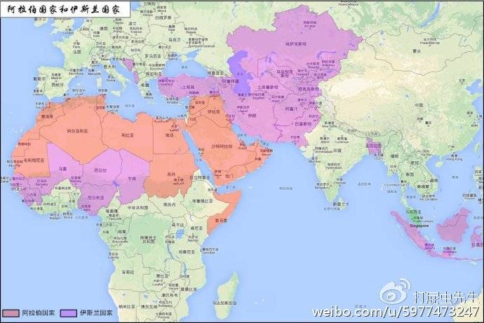
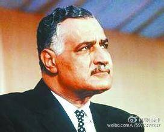

#伊斯兰往事3：埃及与泛阿拉伯主义的兴衰（上）
 
* 打屁虫先生
* 09.26 23:39
* [原链接](http://media.weibo.cn/article?id=2309404024103009921255)

```
扒一扒伊斯兰大国埃及的曲折国运
```
##中东强国的简历：

  讲到埃及不得不提到泛阿拉伯注主义和穆斯林兄弟会这两个政治词汇以及三个人的名字：纳赛尔、萨达特、穆巴拉克。和其他中东穆斯林国家不一样，纵观埃及的现代史少了一些蒙昧的灰暗，多了一些磅礴的感怀。之前讲述的土耳其与伊朗虽然都是穆斯林世界的强国，但这两个国家并非由阿拉伯人构成，而是突厥和波斯人的国家，而作为伊斯兰教的创始民族阿拉伯人在中东北非建立了几十个国家，而其中也有两强，一个沙特，一个埃及。但这两个国家的实力来源是不一样的，沙特的强大主要是两点，一是最大储油国的经济硬实力，二是伊斯兰教发源地的文化软实力，而埃及的重要地位则是由其地缘、人口、教育等方面决定的，首先埃及的位置处于欧亚非三大洲的结合部，一条运河更是链接两洋的战略要冲，其次埃及是中东地区的人口大国，尼罗河养育的8000万人给予了埃及巨大的人力资源，而埃及虽然经济水平远不及沙特但教育水平则在阿拉伯世界中称雄，以至于海湾诸国的基层公务员大量的都是由埃及人担任。这两个国家的实力来源也有一些相同之处，那就是美国，沙特和埃及的政府当局都是美国的坚定盟友，这确实是一个有意思的事，阿拉伯人可能是世界上仇美情绪最严重的民族，但他们的两大领头羊却是美国的伙伴，注意，这里说的伙伴是指政府间，民间政治势力特别是宗教势力是另一回事。除此之外另一个相同之处就是民族相同，他们都是阿拉伯人，这也是中东国家的一个与众不同的地方，我们一般所谓的民族国家都是一个主体民族为主基本构成一个国家比如汉族对应的中国，日耳曼对应的德国等，但中东北非情况不一样，除了伊朗土耳其外的其余的国家从摩洛哥到伊拉克，从也门到叙利亚等基本都是有阿拉伯人构成的，而之前这些地区先后都是在阿拉伯帝国和奥斯曼帝国的框架之下的，是一个延续了千百年的统一的共同体，而目前的局面则是在奥斯曼帝国解体后产生的，说以中东问题专家们曾说：**中东的一切问题，都是奥斯曼的遗产问题**。所谓的“泛阿拉伯主义”则是在这个基本历史背景下产生的，而在战后国际社会中第一个举起这面大旗的就是埃及。



阿拉伯国家都是伊斯兰国家，但伊斯兰国家不等同于阿拉伯国家

##泛阿拉伯主义：

其实泛阿拉伯这个感念并不是埃及人发明的，早在奥斯曼时期就有了阿拉伯主义运动的雏形，但那时的的阿拉伯运动和今天不是完全一样，  那时的阿拉伯民族主义者是基于阿拉伯人具有共同的语言、文化、风俗习惯等因素，提出了反对奥斯曼帝国的统治、建立一个独立、统一的阿拉伯国家的政治主张。其基本性质和满清时期搞反清复明的天地会差不多，但随着奥斯曼的解体散落各地的阿拉伯人在当地先后建立了各自的国家，这个时间段中阿拉伯统一的理想被放到了一边，中东的主流是主权独立和反殖民以及巩固新王权等， 从政治家到一般民众都沉浸在新国家诞生或革命胜利的喜悦和对美好未来的展望中  。一直到二战结束后联合国的一纸决议，导致了中东风云巨变，这份决议就是以色列建国，这个决定让全体阿拉伯人非常不爽。其实阿拉伯人在历史上对犹太人一直不错，两个民族在血缘上也是堂兄弟关系，而伤害犹太人最深重的恰恰是欧洲的基督教国家，直到纳粹对犹太人的大屠杀把迫害犹太人的事业推向顶峰，按道理说这一切应该让欧洲人买单才对，但实际付账的确实阿拉伯人，这让阿拉伯人感到极大的不公平，1948年战争爆发，以埃及为首的7个阿拉伯国家对刚刚建国的以色列动手，结果以色列果断还手，把阿拉伯勇士们抽的满地找牙，这一仗就是由埃及领头的，战争的失败使得本就怨声载道的法鲁克国王在民众的心目中的形象跌入底谷，三年后一个叫做：**迦玛尔·阿卜杜尔·纳赛尔**的年轻军官发动政变，法鲁克国王退位，第二年皇冠落地，共和国诞生。埃及的历史进入了新纪元，泛阿拉伯主义也如同尼罗河汛期的河水一般蔓延开来！



埃及首任总统纳赛尔

##带头大哥不好当：

  纳赛尔在埃及上台后对外高举泛阿拉伯主义的政治旗号主张建立一个以阿拉伯人为主体人民的地跨中东北非的统一的阿拉伯共和国，说白了就是把现有的几十个阿拉伯中小国家合并在一起搞一个大的共和国。对内采取了部分社会主义式的施政理念，强力打击伊斯兰宗教势力，以大规模国有投资发展经济，使得埃及经济在短期内取得了巨大成功（**传统的苏联经济模式虽然不符合现代经济发展的基本原理，但却像一剂强力的兴奋剂，可以让一个经济体在短期内实现高速增长，属于短跑无敌，长跑掉队的模式**），这种成功迅速的聚拢了人心，纳赛尔的个人政治威望瞬间爆表，成为了阿拉伯人心目中本民族的凯末尔，但同时也给三种人带来了巨大的忧患，一种是以色列人，一种是以穆斯林兄弟会为代表的国内传统的伊斯兰宗教势力，一种是以沙特为代表的其他阿拉伯王权国家的王室们。我们简单的说一下这三者和埃及当局的矛盾。

  首先是以色列，以色列在中东生存有三个大的前提条件，我们通俗点讲的话：1自己争气、2外援强大、3对手弱逼，这三条必须全占齐了才能立国无忧，其中任中一道罩门被破解都会给以色列带来旦夕之患，而这时的纳赛尔率领埃及高举泛阿拉伯主义的大旗搞得其他阿拉伯国家群情激奋，这在以色列看来无疑是埃及以带头大哥的身份振臂一呼，欲图把一群弱逼小队友整合成一个伊斯兰巨无霸，因此以色列自然而然的对泛阿拉伯主义以及旗手埃及视若死敌！反过来说埃及想要在泛阿拉伯运动中取得执牛耳的政治地位光靠振臂一呼当然是不行的，必须在实际行动中拿出真金白银和真刀真枪才能占领政治高地，否则就算振臂百呼也没个鸟用，比如卡扎菲就是个滑稽的例子。而在阿拉伯世界的政治课程中最高的高地就是打垮以色列、收复圣城、解放巴勒斯坦的兄弟姐妹！一条很明显的逻辑出来了：**谁能干翻以色列，谁才是真正的旗手，谁是真正的旗手谁才能在泛阿拉伯运动成功后成为大阿拉伯的领袖！**在这条逻辑的指引下埃及一马当先的奔向了战场。

  至于第二个对手穆斯林兄弟会的情况其实比较简单了，埃及当局要打以色列就必须富国强兵，要富国强兵就必须实现现代化，要实现现代化就必须把传统的宗教势力打压下去，最起码做到政教分离，凯撒上帝各管各的。这种强人政府打击宗教的情况在那个时代的伊斯兰世界很常见，凯末尔、纳赛尔、卡扎菲、萨达姆、巴列维等等莫不如是。而穆兄会面对纳赛尔政府的打击基本翻不了浪，原因很简单，在当时的阿拉伯世界，对抗以色列是最大的大局，只要纳赛尔把这个局拿住，任何反对派都没得玩，好比抗战时期的蒋介石，只要举起抗日的大旗，包括中共在内的国内各种反对派都不敢公开造次，反之，只要蒋介石对日虚以为蛇，那么中共也好，地方派也好，都可以此为借口给你搞两下子。而这种情况在对以亲善的穆巴拉克时代成为了现实，后面的文章中会详细说明

  最后是两强之一的沙特，沙特反对纳赛尔基于两点：1.对内政治体制极端对立，一个反帝起家一个帝制立国，一个是革命导师一个是被革命对象，且二者又是同处一山之虎，一家做大另一家就垮台，而事实上当时纳赛尔的革命确实风靡阿拉伯世界，共和体制取代帝制的步伐在阿拉伯诸国也如火如荼，沙特感到害怕是理所当然的。2.对外竞争关系，做为两强之一又富甲中东的沙特当然也有一个沙特版本的大阿拉伯梦，这使得沙特与埃及之间在泛阿拉伯运动的浪潮中处于一种竞争关系，颇有一些秦末时刘项相争的味道，耶路撒冷好比秦都咸阳，先入咸阳者称王的游戏规则在沙埃两国间天然适用，两者谁都不愿意看到对方取得太大的成功，暗中使绊子的事件在两国间可谓礼尚往来！


苏伊士运河

##失败的伏笔：

相对于上面的三个对手，真正让纳赛尔头痛的还是美苏之间的选择题，这么说的原因倒不是这道题有多难，而是这道题没得选，不管是重建大阿拉伯的伟大梦想，还是打击以色列的现实考量都是触犯美国核心利益的行动，美国几乎凭借一己之力酣斗苏中两大红色政权的时候，绝不予许再蹦出个信奉伊斯兰教的大一统的的阿拉伯国家（即便今天也是不予许的），而以色列对于美国的重大价值也就在于此，它如同打入中东的一颗钉子，有这颗钉子在，阿拉伯世界就清净不了。对此，纳赛尔别无选择只有导向苏联，这也意味着今后的必然失败，历史告诉我们，和苏联走得近的国家，下场一个比一个惨！而埃及也是如此，埃及对于苏联的战略考量来说无非就是一枚小棋子，你的任务就是通过时不时的打打以色列来牵制一下美国的力量，仅此而已，至于你的大阿拉伯梦想，苏联基本没兴趣，真要是搞成了的话对于苏联也未必是什么好事。所以后来一旦中东生乱，美帝帮以色列那是真帮忙，而苏修帮埃及多数情况下也就是个点到为止。这也就牵扯出了一个更加成层次的问题，那就是除了阿拉伯人自己，谁也不愿意泛阿拉伯运动的取得真正的成功！西方的基督教国家一万个不愿意自然不必说，而东方的红色国家也没谁真正死心塌地的支持泛阿运动，无非是为了对抗美国而在国际战略上借力牵制而已，谁愿意自己身边真正多出一个“绿巨人”来，一不小心把自己搞绿了怎么办？而同为穆斯林的非阿拉伯伊斯兰国家如伊朗土耳其等更是对泛阿运动多出三分忌惮之心，其中既有教派之别，又有民族之分情况更为复杂，而且历史和今天的现实告诉我们，杀害穆斯林最多的人恰恰是穆斯林自己。最后是阿拉伯内部各国当局，虽然他们的口号喊得最响亮，但没有一个不是鸡贼，鸡贼们都明白，泛阿运动理想宏大但现实多舛，而且就算成功了，最大赢家也是上面抗旗子的旗手，革命成功之日自己能不折本就算万幸，所以这些国家多数时候都处于一种观望+投机的姿态，调门唱的高，但真动手的时候，大多留有后手。由此看来，不管在哪个政治维度上来说泛阿运动都是一场冒险，而做为第一代冒险王的埃及会迎来怎样的命运呢？篇幅有限，我们还是下回分解。续文《伊斯兰往事3：埃及与泛阿拉伯主义的兴衰（下）》中将重点聊一聊决定埃及未来命运的中东战争以及后纳赛尔时代埃及政治大转向和穆斯林兄弟会的复辟之路。想要观看文章的网友请关注本博主@打屁虫先生，谢谢！
