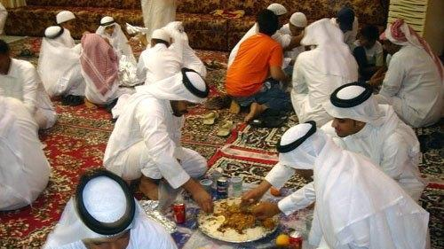
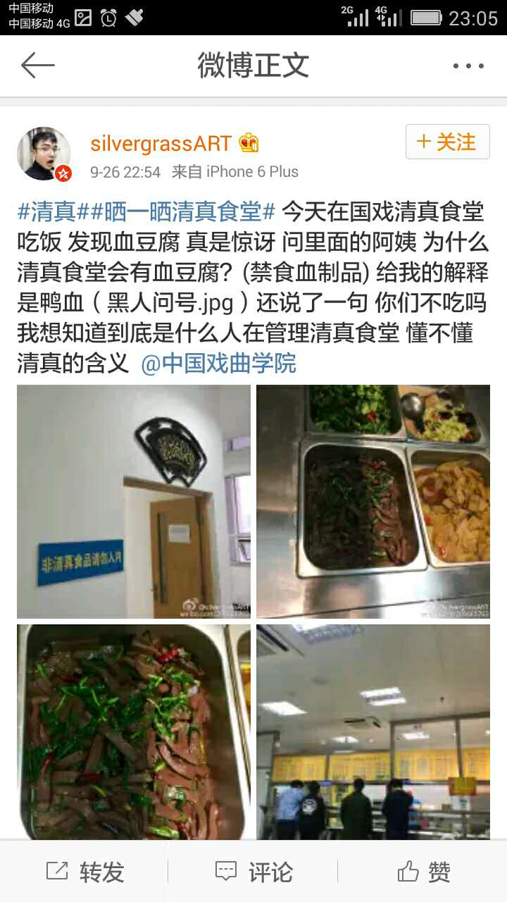
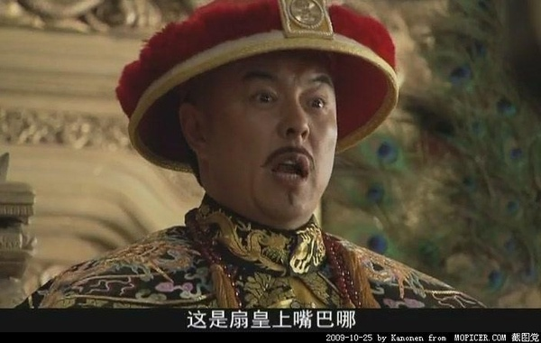

# 关于清真食品，谁侮辱了你，你又侮辱了谁？

* 灵异档案员王昙
* 2016-09-28 11:07:08 举报 阅读数：43871

  昨天有一位穆斯林对食堂的血豆腐表示了极大的愤慨。下面我就给容易产生这种愤怒的穆斯林科普一下，到底这种愤怒有没有必要。

  食物本来不分高低贵贱，每个国家，每个地区都有不同的饮食习惯，有的地方饮食比较单一，有的地方则比较复杂。

  宗教对食品的限制，往往与其创立背景有关，伊斯兰教的饮食规则，在古兰经和圣训中都没有明确的解释原因。

  我们以猪为例，古兰经中给出的解释是不洁。直接一点的理解就是肮脏，现代学者从各方面去考证，发现之所以伊斯兰教会对猪产生这种抵触，与养猪的成本，猪在当时的卫生条件，猪的习性有关。

  我们不是古兰经的作者——安拉。

  所以我们并不知道安拉在说出这些话的时候，是个什么心态，但如果按照目前伊斯兰教研究界的普遍观点，当一条古兰经的降世背景不存在的时候，这条内容也就失去效力了。

  换句话说，猪已经可以吃了。

  至于血液食品，那更没问题了。当时因为卫生条件的限制，血液食品确实可能存在一些卫生安全隐患。

  但现代这种隐患基本已经消除了，自然是可以吃的。事实上伊斯兰教的教义中，还有一条是不能浪费食物。

  那么把动物的血白白浪费掉的穆斯林，其实才是违反了教义的。

  当然了，对于教义的理解，全看个人，你可以觉得我分析的对，也可以说不对，但你无权要求厨师按你的理解去做菜，你只要选择不吃就可以了。

  猪肉对于世界人民来说，都是很不错的食物，而且从古至今，猪肉就是中华民族祭祀的时候的必须品。有些穆斯林公开说猪肉不洁，是在说中华民族自古以来就在用脏东西祭祀天地祖先吗？

  到底是人家侮辱了你，还是你在侮辱人家？

  另外圣训里也曾经说过，不要去侮辱别人的食物。

  那些编造谣言侮辱猪的，甚至不惜篡改本草纲目去贬低猪的穆斯林，明显是该开除嘛？

  怎么没有穆斯林因为他们违反了教义规定而抗议呢？

