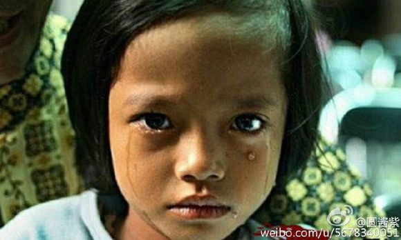

#西北落后农村宗教中的教育

* 作者 :[圆酱紫](http://m.weibo.cn/u/5678340051)
* [原链接](http://weibo.com/ttarticle/p/show?id=2309404019957594769839)

##一、大环境——自然地理

用西北来举例，气候干燥，水资源缺乏，土壤贫瘠，人们自给自足都是没有条件的，那种靠天吃饭的环境，留给他们太多的时间去信仰去崇拜，这种环境是很利于传播宗教的，把宗教和庄家收成、金钱运势捆绑起来，没有任何辨别能力的农民，深信不疑，甚至都能用“走火入魔”来形容。我时常听到，亲戚长辈说“真主给的平安、真主给的财富（财富其实还可以加一个引号的）”语言特别荒唐，试问真主能够满足人的基本生存需要，为什么要种庄家？为什么要去工作？为什么为了低保户不能落到自己家而成结队的去县政府门口闹事？你有闹事的时间，怎么不出去工作？去工地做小工一个月的钱也能是低保一年的几倍了。

##二、无法全面拓展——教育

西部的教育可以说是一塌糊涂，除了省、自治区首府教育比较完善！越往深走你会觉得越恐怖！清真寺比学校建的多，也比仅有的几所学校建的漂亮！村里的小学出现了无人读被关闭的情况。无人读：部分有认识到教育的重要性的家长，会把自己的孩子送到县城读书、或者有钱一点的送到市区！村的小学也就只省了那种家庭贫困的孩子，当然并不多，曾经了解到一个小学只有6个人，从一年级到五年级，6个人？一学期也许还有老师撑着，时间久了，为了6个人开办学校也就不是很现实了，结果很明显学校关闭！能转移到其他镇的转移，转移不了的呢？回家学习古兰经，因为清真寺每个村都有，而且没有人去强制，也会有很多中年人主动去清真寺，小孩当然是大人怎么说就怎么做了，很可怕这种幼育宗教！没有为社会做出什么贡献，却开始教怎么孩子怎么去分裂！

##三、基础文化设施不完善

经常在民族聚居地的人，应该很容易发现这样一个现象，信仰纯度高的年龄阶段，出现在5—16岁和35—死亡。幼少年时期信仰更多的是听长辈的，稍微上了年纪的人也是越是老去越就信仰的纯，也许很多人都不明白这和文化设施有什么关系？对于一个没有文化宫、图书馆、休闲广场的地方，你觉得人们的时间都去了哪里？当然都去了清真寺，有大把大把的时间让他们去做礼拜、念经、还有闲聊（无非就是说闲话）。现在说说中间那段时期的人去干什么了？读书到高中大学的也就在这其中了，或者说为了养家户口出去打工了，接触了大城市熏陶的人，一部分努力在城市生存了下来，一部分回家继续他们父辈们的路，生生相息永无止境！

##四、国家补助的利弊

也许这条会得罪很多人！西北少数民族聚居地，基本都是国家扶持的对象，与其说扶持还不如说救济！扶持的目的是为了脱贫致富，而现实不但没有效果，反而助长了部分少数民族的气焰！嚣张的向其他民族炫耀，他们是国家重点保护的对象，如果没有自身信仰的优越性，国家怎么可能这么重视少数民族呢！说这话也不怕噎……我看到的是，越扶持越懒惰，国家不是你的衣食父母，不必厚颜无耻的衣来伸手，饭来张口！依我之见，与其给他们金钱，还不如直接投资建设文化或者说引荐民族企业！那么多城市居民，努力工作人的纳税贡献值都给了农村，有些地区的人不但没有谢意，反而利用国家对他们的好，肆无忌惮的搞分裂，真是可笑至极！

##五、自身认识不足

我承认这个是和教育有关，但也不全是！为什么都是农村人没文化有些人就会让自己的孩子去读书，而有些人说读书没用，不让自己的小孩读书，逼迫去信仰！读书的时候说没钱，请问九年义务教育收费了吗？为了建清真寺每家每户5000，5000对于一个农民家庭可不是小数字，没钱借钱也会上交去修请真寺，要我说，这种人就应该祖祖辈辈穷一辈子的，圆子是不是现在也毒舌了！

- - -

信仰是自己的，你可以信仰，做你自己，不要试图影响他人和社会，如果说你的信仰是好的，无形中会影响别人去对你崇拜对你的信仰好奇！告诫心怀不轨的宗教信仰者，没人逼你去吃猪肉或者说让你去做自己不喜欢的事情，而你们为什么要要求别人配合你呢？你可以把自己包裹的像个粽子，为什么指责穿短裤的女性是为了吸引男人的眼球的呢？自由懂吗？说别人不贞洁呢？还用是一个没有糖纸的糖果来比喻，你是有多纯洁多高尚？做好你自己，品头论足你没有资格，你并没有别人过得好，看清了吗？阿拉伯式的皇族贵族血统以及生活都和你没关系，也许和你的爷爷、祖爷爷辈都没关系，更别说你了！和平稳定的环境是要共同努力的，如果作，请放肆作！也许社会稳定会来的更快一些！

基本陈述完毕，对了，不要猜测我的哪里人，也不要无聊到把我发到某个小县的贴吧，这种人无聊至极，你牛过好你自己，在亲情和爱情面前，我谁也不放弃！我会用自己的方式努力，让我爱的人都乐于接受！

也许我说的不全是理，确实是现实存在的！

希望和我一样的女生，能勇敢去面对，不放弃不妥协，社会环境我们改变不了，但是可以改变自己。