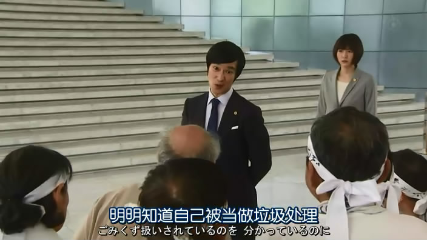
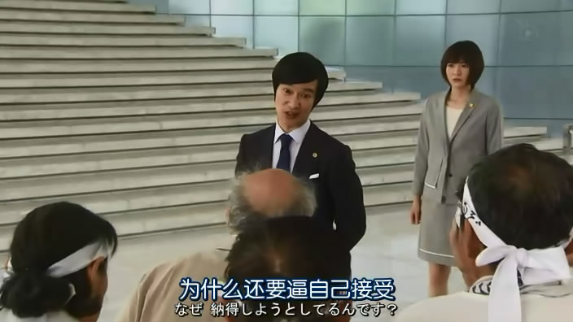

#作为一个回族，为什么我会抵制清真餐

* 作者: [灵异档案员王昙](http://m.weibo.cn/u/2981083181)
* [原链接](http://m.weibo.cn/2981083181/4043151116842115)

因为我吃的每一口清真餐，都有同胞的血和肉。

很多人认为清真的干净，事实上，从现代卫生标准来说清真的和不清真的，在洁净程度上是没有区别的。而它背后涉及到的可怕罪恶，却是你无法想象的。

事实上大多数宗教可能都会有一些饮食上的禁忌。比如佛教会对杀生之类的比较忌讳。道教中有四不吃的规矩。

伊斯兰教的饮食禁忌，也没有什么出奇之处。但从宗教的内容而言，伊斯兰教的规定就很奇葩了。

首先它没有信仰自由，很多伊斯兰教信徒，用穆斯林的增长速度来说——你看穆斯林的人数增长的速度很快，它如果是一个邪恶的宗教，怎么会有人去加入呢？

其实这个观点很可笑，大多数人信仰伊斯兰教的原因其实只有一个——就是家里的长辈们信，所以他也必须跟着信。

就算是不是信仰伊斯兰教的人，算人数的时候，也会被划进伊斯兰教信徒的团体里。因为计算伊斯兰教圣徒的人会自动的认为，你父母是伊斯兰教徒，所以你也是伊斯兰教徒。

比如说你是一个回族，如果你想要改变自己的民族，在有些地区你是要找宗教部门进行一些认证的。所以说这个宗教是一个没有宗教信仰自由的宗教，它严重干涉了很多人的宗教信仰。

我身边的很多穆斯林朋友，事实上他们信仰的根本不是伊斯兰教，他们是不可知论者，他们怀疑神创论。他们对大多数宗教的态度都一样，包括伊斯兰教，那就是无所谓。但因为长期不吃猪肉，所以他们很多人也是不吃猪肉的。这就让很多人觉得他们是穆斯林，其实根本不是。
在穆斯林的六大信仰中，包括有认主独一。这里说的认主独一的主，是必须要认同古兰经里的主——那个往同性恋的头上砸原石的主，那个恶毒诅咒非穆斯林的主。你如果怀疑神创论，或者不完全认同古兰经里的主，你就不是一个认主独一的穆斯林，那至少你和传统意义上的穆斯林是有区别的。

可事实上，他们也被算进了穆斯林群体，我觉得我现在应该也被算进了穆斯林群体。所以伊斯兰教的人口增长数字，根本就是有很大水分，不可信的一个东西。

伊斯兰教的另外一个问题是干涉别人的婚姻自由，并且给很多人渣玩弄女性提供了一个光明正大的理由。

我认识很多穆斯林朋友，他们并不认主独一，对伊斯兰教的好感也几乎没有。可却被家人逼着要嫁给穆斯林，或者要娶穆斯林。这种现象非常普遍，可以说伊斯兰教对于很多人的婚姻，造成了极其负面的影响。

有些人已经年过三十之间，至今不敢找对象，因为家里人不会允许他去找一个非穆斯林，而他自己实在受不了一个穆斯林。

而还有一些穆斯林呢，他们会去找非穆斯林的女朋友，但他们往往会在玩弄够了的时候，对女友说：“对不起，我是穆斯林，我有自己的信仰，我不能和你结婚。”

有一位在北京上学的穆斯林大学生，公开表示绝不会和自己的非穆斯林女朋友结婚，找女朋友只是为了玩玩。这种人事实上也非常多，而且他们以自己的宗教信仰，来理直气壮的去玩弄别人，心里从来不会有半分的愧疚，因为他们觉得有一个神在背后替他们背书。

伊斯兰教另外一个问题，是因为他在古兰经中对非穆斯林进行了大量的侮辱和歧视。这就导致了尊重信仰这个宗教的人，或有或无的都会被这个宗教的教义所影响。换句话说，他们无意之中也会觉得自己和非穆斯林不一样。

而人性其实大多时候是丑恶的，我们不能把希望寄托于人性的善，能去化解这些负面的内容。

这是为什么很多难民穆斯林去欺辱欧洲原住民的时候，他们不会有负罪感。原因很简单，因为在他们的信仰中，那些人根本不是人。

这些教义，一方面引发了很多治安事件。从古至今也引发了很多战争，导致很多根本没有必要的流血和牺牲。

很多穆斯林常常会说那些教义是降世背景的！并不是说，不同的时期也要按照统一标准去做。

那么我请教下是不是说的古兰经读写了降世背景？如果没有写，那就是在传播极端思想。麻烦你们去倡议一下，印刷古兰经的人加上降世背景。

关于清真餐的问题：

我们大家都知道清真餐的原材料，其背后是由宗教人士提供的，至少由信仰这个宗教的人提供的。

很抱歉，我实在没有办法区分，到底提供哪些材料的人，他的思想有多开明。至少他没有去明确地表示自己不支持我上面说的那些内容，所以在我看来他就是这些事情的帮凶。我为什么要给一个帮凶去提供资金呢？

我在吃下清真餐的时候就会想到那些，婚姻得不到幸福的人、被极端分子杀害的人和被长期侮辱的非穆斯林的痛苦。就会让我觉得我每吃一口清真餐，都在吃他们的血和肉，还有眼泪。

所以我拒绝食用这种可怕的食物，当然，我也不会干涉任何人去吃这种东西。你喜欢事不关己，高高挂起；你喜欢看着别人受苦，而自己怡然自得。那么随你便。
就像那些中东的穆斯林，他们对东方和西方进行了数百年的侵略，依靠自己的组织术获得的巨大的利益。结果报应不爽，他们今天遭到了更可怕的屠戮。

这个世界上没有任何一件事是完全和你无关的，当你冷漠的看着别人受苦而不采取行动的时候。可怕的后果，可能正在不远处看着你。

希望你利用自己的钱包能做出正确的选择。

