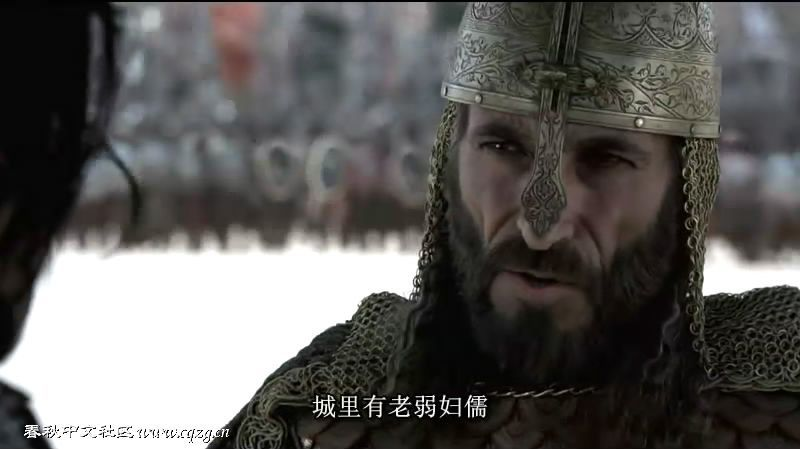
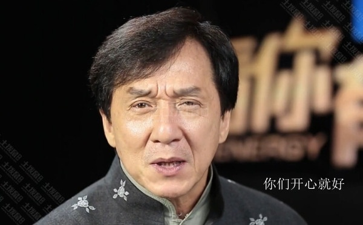
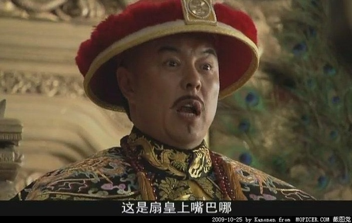
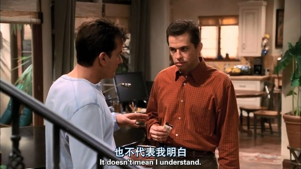
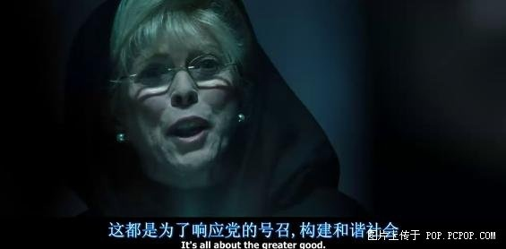

# 到底什么才是真正的穆斯林？

* [灵异档案员王昙](http://weibo.com/u/2981083181)
* 2016-11-17 13:23:02
* [原链接](http://weibo.com/ttarticle/p/show?id=2309404042791981342166)

#####正信派思想的核心是男女平等、否定经典中诅咒非穆斯林的内容、不限制家人的宗教信仰自由、不推崇穆罕默德以及四大哈里发的行为、不执著于宗教仪式、饮食禁忌、积极参与有益于社会的活动、坚决与极端思想划清界限。

事实上，中国的大部分穆斯林，压根就不知道穆罕默德、古兰经、圣训的具体内容。他们中一部分只看过古兰经中劝人向善的内容，更多的连古兰经中的半点内容都没有看过。一些熟识经文的穆斯林，也大多是只知其音不明其意，又或者连“读”都做不到，只会“背”。

他们之所以信仰伊斯兰教，与其说是信仰，倒不如说是一种被家人培养出的生活习惯。

如果你让他们去看古兰经的话，他们的第一反应就是惊讶，所以说这部分人他们也是穆斯林。

#####你问他们信不信造物主，他们大多数人是半信半疑的。他们对造物主的信任和对其他宗教神灵的信任其实差不多。对于穆罕默德残害异教徒、四大哈里发毁灭其他宗教这种行为他们也是厌恶的、不同意的。

#####所以，事实上他们已经承认了正信派的核心思想。他们之所以之前没有出来说话，是因为之前的很多问题，并没有现在这么尖锐。

今年的难民危机彻底改变了很多穆斯林的生活，也让保持这种思想的穆斯林群众无所适从。他们不知道自己以前的生活犯了什么错误，觉得自己被骂莫名其妙。

但其实不是这样的，这些人当然是有责任的。一个人对自己的宗教信仰无知到这种程度，当然是他的问题。但这种人，和那些坚信古兰经丝毫不能改变、认为穆罕默德是完美无缺的圣人的人，也是有本质区别的。

#####所以对这种人我们应该区别对待，可我没有时间去逐一分辨——这种人有多少，到底哪个穆斯林是这种人，哪个穆斯林是另一种人。

#####这就是我之前发正信派的相关内容的原因之一，有了这个东西，我们可以更好的去区分穆斯林群众，把他们和那些坚持古兰经完美无缺的人区分开。

比如有些女性穆斯林，她不戴头巾，没有读过古兰经和圣训，不知道穆斯林女性要行割礼。这种人在那些坚持古兰经一字不能改的人眼里，其实就是伪信士。

#####人家都认为她是伪信士了，她又何必为他们站台呢？

因为她无法第一时间去摆脱穆斯林的身份，因为这个身份是他的家人硬塞给他的。他如果直接过去把这个身份抛弃，很可能会引起一些家庭矛盾，而且他的家人也是和他一样的穆斯林，他也不希望自己的家人被骂。

#####这就是正信派要去拉拢的人，追求现代化生活的文化穆斯林，他们事实上只是把一部分民族文化当成了宗教文化。

#####我并不是要把伊斯兰教本身，改变成另一个样子，让大家去喜欢它。

那些虔诚的信徒，我管不了他们，毕竟大家的世界观不同。我也没办法去管他们，他们明明知道自己的亲人朋友中不是穆斯林的人，是要去火狱的。在这种情况下，居然还会去信仰这个宗教。对于这种人，我只能说他们太无情了，我对他们无话可说。

所以说正信派这是一个用来区分的标签，你承认正信的内容，并且可以做到，你就是正信派的穆斯林。

反之如果你做不到，你就不是，就这么简单。

顺便说一句，恐怖分子也是穆斯林，那些违法乱纪的人也是穆斯林，这点我们必须要承认。因为在伊斯兰教的观念里，只有真主才能判定谁是谁不是，任何妄言异己者非穆斯林的，他们的真主都不会喜欢他。用“他们不是真正的穆斯林”洗地的行为，是很蛋疼的。

但他们不是正信派穆斯林。这个流派只是为了那些因为家人，因为习惯，因为生活环境而留在伊斯兰教中的人。

对于其他的人，我管不了。如果他们违法乱纪，自然有国家管他们。

如果他们坚持那些侮辱异教徒的，无神论者的经文，我保留骂他们傻逼的权利。在他们宣传自己的信仰的时候，我不介意你骂他们一句臭傻逼。

毕竟被骂了，我是要还击的。

