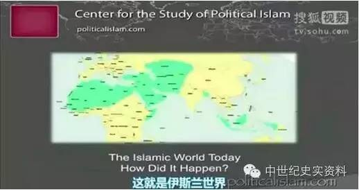
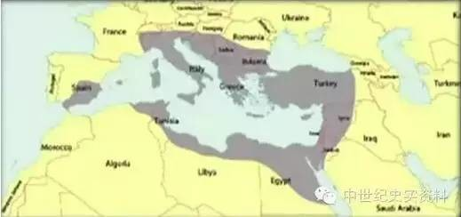
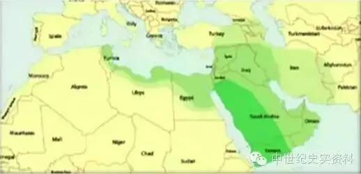
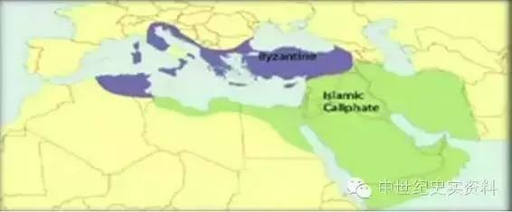
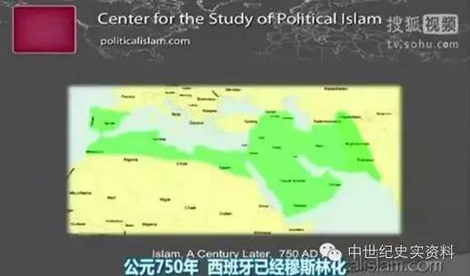
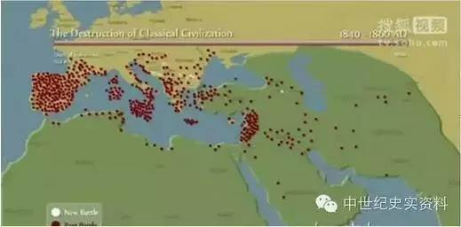
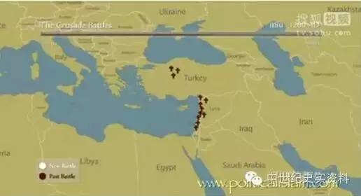
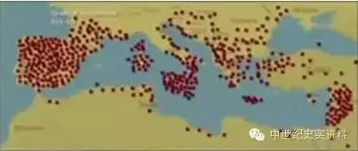
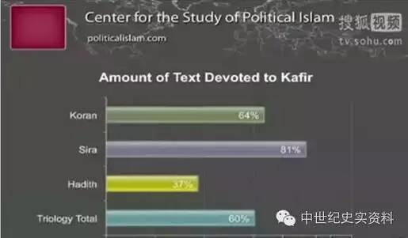
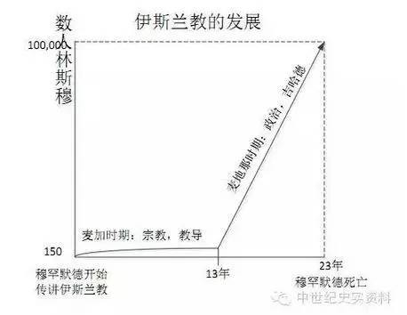

# 我们因何而恐惧？伊斯兰教一千四百年扩展的秘密

* [文字版原链接](http://chuansong.me/n/2443041)
* [QQ视频版本](http://v.qq.com/x/page/y0316ixcy13.html)
* [爱奇异版本](http://www.iqiyi.com/w_19rrylp8kl.html)
* [youtube版本(需翻墙)](https://www.youtube.com/watch?v=_xDODMbKYec)

这个课程的ppt讲座讲员，即比尔·华纳博士是美国的物理学家，他取得过量子物理及数学专业博士学位，担任过大学教授、创办过企业，同时他也是一名应用物理学家。华纳博士一直致力于对宗教和历史问题的研究，近年来他创立了“政治伊斯兰研究中心”，写作、出版了十余本有关伊斯兰的著作。

在演讲中，华纳博士以他科学家的修养和习惯，用数据和大量事实向我们展示，在伊斯兰教一千四百多年的血腥历史上，它毁灭了哪些曾经辉煌灿烂的文明，清除了哪些宗教，屠杀了一亿多卡菲尔（非伊斯兰教徒），强奸并贩买了无数异教妇女和孩童，他同时为我们纠正了很多对历史错误认知和常识。

有良心的学者质问：在真相面前，为何世界主流的文明国家都对此残酷的历史装聋作哑、缄口不提，却一厢情愿地鼓吹多元文化融合这一虚假幻象，即便在今天全世界非伊斯兰教国家都面临相同的伊斯兰恐怖主义恐怖威胁时，每一个国家包括美国人依然不敢大胆发声，说明历史真相，讲清事实，将矛头直指那个邪恶的原教旨主义伊斯兰宗教呢？

有多少基督徒甚至一些牧师助纣为虐，不惜抹黑教会中世纪历史事实，攻击辱骂中世纪的基督徒和十字军，反而为7-21世纪穆斯林残酷的杀戮基督徒的圣战歌功颂德呢？又有多少“基督徒”居然认同同性恋牧师和婚姻，公然敌对上帝创造的一夫一妻制婚姻，如英国圣公会、美国圣公会，美国长老会（PCUSA）……

伊斯兰教，是上帝的鞭子，为要惩罚背道的基督徒，如同当年上帝使用亚述人和巴比伦人，惩罚背道的以色列北国和南国一样。穆斯林并不可怕，无神论又算得了什么，武士道也不过如此……教会里面最可怕的，乃是喊着基督反对基督命令和基督教会的基督徒！

正如我告诉你们的，9·11事件让我突然意识到自己的使命，就是要把那些难懂的书变得易懂。现在我已经写完了，就放在后面的桌子上。

我有时形容自己是这样一类人，他们会读又厚又大的书，然后再把他们写成任何人都可以理解的现代小型本。事实上，我相当乐于此道，我不怎么上网，当人们遇到我的时候，他们会对我感到失望，一些反圣战人士问我：“你看到过我的网站吗？”“没有。”我甚至不看自己的网站，除了克雷格分类网、雅虎头条和德拉吉报道，我对上网很少有兴趣，就是这样。

所以,我喜欢读那些又大又厚又老的书，真的，但问题是我原以为只要我把我的书写得通俗易懂，无论是关于古兰经的书还是关于穆罕默德的书，或是关于伊斯兰教法的书，总之一切都写得通俗易懂的时候，我想“这下我们赢了”，但是我错了，我们连比赛的资格都没有，因为我发现，除了少数人外，在座的各位请相信我，你们是如此的人微言轻，其他人对于“伊斯兰教的真正本质是什么”这个问题的答案及相关反应是恐惧憎恶和愤怒，当我试图向人们讲解一些有关伊斯兰教的东西的时候，他们都吓坏了。所以我料想当我的书出版的时候人们会落荒而逃，而事实上，他们真的逃跑了，离我远远的。

**我曾经以为只有一个重大问题摆在面前，那就是“伊斯兰教的真正本质是什么”，而随后我发现有第二个问题，而且是更重要的问题，“为什么我们惧怕了解伊斯兰教”？**

还记得我以前和你们谈论过的有关故事的话题吗，事情是这样的，我的书是基于现实的，要读懂他们需要理性思维，但与人们打交道时，你要学会做销售，任何推销员都会告诉你，相对与感觉事实是次要的。那你又是从何处获得感觉的呢？除了其他地方以外，都是从故事里获得的，我最初考虑的是“为什么大家如此恐惧，即使他们什么都不知道”，但后来我发现，原来他们是知道一点模糊的关于伊斯兰教涉及暴力的故事的，他们也知道伊斯兰教涉及奴隶贸易，这并不令人感到惊讶，真的，还记得我给你们讲过的苏菲派王室的故事吗？一座宫殿不断地从地下室反出气味，每个人都闻到了味道，但是他们就是不想谈论它，在这一切背后的深处，几乎都是原始思维在作祟，所以，问题的根本在于我们不了解伊斯兰教的历史，我们不知道这个问题的答案，见图1，这就是伊斯兰世界。它是怎么来的？

图1伊斯兰世界

你可以去问那些非常有学问的人，但是他们给不了你这个问题的答案。

**北非是如何从欧洲基督徒的北非变成阿拉伯穆斯林的北非的？这是怎么发生的？这是一个重要问题吗？中东又是如何从基督徒的中东变成穆斯林的中东的？这是一个重要问题吗？**

我认为这些都是非常重要的问题。好，为了搞清楚穆斯林世界是如何产生的，我们必须先了解一下，看看伊斯兰是如何进入我们的世界的。

为了做到这一点，伊斯兰入侵了拜占庭帝国的世界，我们知道在“希瑞”里记载，“希瑞”就是穆罕默德传记，穆罕默德把他最后的日子都花在杀害和镇压基督徒上面，他死后，这个过程依然继续，那么，让我们来描述一下这个被伊斯兰入侵了的世界，见图2。

现在有人告诉我们，罗马帝国崩溃于日耳曼蛮族的入侵，你们都听过这个故事吧？这是假的，这是不正确的，这是错误的，那么日耳曼蛮族部落入侵罗马以后发生了什么呢？他们建立起他们自己版本的罗马帝国，他们保留了古典文化，他们说罗马人的语言，他们聘请罗马哲学家和罗马律师，让这些人来教他们的孩子并管理他们的学校，他们进入罗马帝国，不是要摧毁敌国，而是要为自己获取财物。帝国的东部，也就是所谓的拜占庭帝国在这里。

图2日耳曼人入侵之后的情形

这里的重点在于，他们依旧如同一个古典帝国，他并没有崩溃，接着，当西罗马灭亡后，拜占庭逐渐发挥其政治影响力，现在，这是罗马帝国的新形态。这就是拜占庭帝国，他即将被入侵，这也是现如今业已被伊斯兰侵占了的古典世界。注意，此前古典世界依然在运作，要记住这一点，这是至关重要的。虽然它被削弱了，但是它依然在运作。下面我们看看究竟是什么导致了他的崩溃。这里我们看到的是25年里，伊斯兰扩张蔓延的三个阶段，图3是二十五年来的扩张产物。

图3伊斯兰扩张蔓延的三个阶段产物

**同样是对拜占庭帝国，为什么阿拉伯人能做到的事，伊朗的波斯人就做不到呢？**

问题的答案在这里，它实际上是和伊朗共同作用的结果。希腊人和波斯人很久以前就一直打仗，对吧？温泉关300勇士，就是为了抵御波斯人的入侵，对吧？亚历山大大帝他击败了波斯人，在伊斯兰入侵以前，波斯人持续攻打了罗马人和拜占庭人二十五年，一系列的大规模战争使得波斯人疲惫不堪，也使得拜占庭帝国极度虚弱。接着，黑死病爆发了，三分之一的人死了，所以，当伊斯兰入侵时，由于同波斯的长期战争以及三分之一的人口损失，拜占庭帝国的实力已经被严重削弱。其经济也崩溃的只剩三分之一，你觉得奥巴马的经济已经够糟了？试一下损失三分之二的经济是什么样子吧。

所以，这是已几经衰弱的帝国，在被一群具有“使命感”的人入侵，那么重点在这里，这三种不同的绿色阴影代表着不同的哈里发，伊斯兰帝国始建于此，创造它的人是那些可以被称为穆罕默德门徒的人，为什么知晓这一点是十分重要的？因为他们了解穆罕默德，他们牵过他的手，他们中的一员，阿里娶了她的女儿，艾布·伯克尔是他的岳父，这些人不仅仅是宗教意义上的兄弟，也是家族血缘意义上的兄弟。他们了解穆罕默德就如同我了解我的妻子。

那他们做了什么呢?他们是外出宣讲古兰经去了？不！他们才没有，他们拿上刀剑，骑上他们的骆驼和马，然后跑出去攻打基督徒和波斯人去了。就是说，这才是伊斯兰教的真正本质。看到没，这就是树上的果子，大规模毁灭，现在再来回顾一下这里发生过的其他事情。

埃及是地中海的面包篮，叙利亚是古典帝国思想界的心脏，在二十五年里，古典文明失去了它养活自己的能力，也失去了它最大的智囊团。这直接摧毁了古典基督教。我们今天所拥有的基督教不过是早期基督教的残肢断臂。为什么？因为伊斯兰摧毁了它的心脏，把它转化了。图4是古典帝国灭亡的第一阶段。

图4古典帝国灭亡的第一阶段

图5一个世纪以后攻占情况

没了，古典帝国的心脏没了。

OK，图5是一个世纪以后，注意西班牙这里，公元750年，西班牙已经穆斯林化，这是极其迅速的征服，这将成为非常重要的历史事件，因为这是前所未有的。如果把国家比做人的话，那这一切就相当于在一夜间发生，这种前所未见的残酷攻击正是我们为什么惧怕伊斯兰教的关键。

接下来，你们要看到的历史是你们之前从未听闻过的，我不是历史学家，但我是个科学家，而且我可以根据数据进行推理。以前我读穆罕默德的故事时，当时我被灌输了一大堆的是什么导致了黑暗时代的谎言，日耳曼蛮族没有导致黑暗时代，首先，怎么会，这些野蛮人是日耳曼人，这些人和创造德国的人是同样的人，你跟我说他们太愚蠢以至于学不会如何实施罗马法和其他事务？当然不是，他们是相当聪明的人。他们没有导致崩溃，但那就是经典理论，你去范德堡大学，那就是他们要教给你的。让我们来看看数据。最近有大量的古代文献被转换为数据库格式，所以它可以被访问，那里有大量的地中海水下及沿岸的考古学研究从这个考古学研究当中，我们能够跟踪历史和经济状况。之前我给你们的经济崩溃程度的数据就是来源于对沉船的研究，因为你如果不买很多，如果十分之一的船，让我们假设十分之一的船沉没，当然实际数字不会那么高，但是不管那么多了，如果你看到大量的沉船，那就意味着当时有大量的船只在这片海域航行。

当他们的数据下降了，那就意味经济级下滑了，所以从这些数据中我们可以知道很多。尤其是这个古代文献数据库，为我们提供了548场伊斯兰攻打古代世界的战役，这些全部都是最新信息。我曾和那些认为自己是历史研究者的人探讨，于是他们开始了“让我们来数数伊斯兰对欧洲的战役‘有入侵图尔’、‘有入侵直布罗陀’、‘还有勒班陀’、‘维也纳之门’”OK，数出五个，你跟历史学家谈，他们也就能拼凑出5场战役，还有我提醒一下你们可以得到全部的幻灯片，如果你们想要就给我发电子邮件，OK？

这些新数据向我们展示了什么呢？向我们展示了这些：看那些白色的原点，他们代表着新的战役，接着它们就会变红，这些白的都是新的每一次我都会向你们重复展示这个过程。每个时间刻度代表20年，新的战役在二十年内会显示为白色，之后它们会变成红色，表明它们是过去的战役，所以白色的就代表正在发生的。红色的就代表过去发生的。让我们来看一下这548场战役的整个过程是怎样的，在70秒的时间里，我们将看到长达一千五百年的征服。

图6被占领地区的战争情况

看看！这一切发生的多么快，你们不知道法国曾被如此猛烈的攻打，你们知道吗？看一下，在西班牙正在发生什么，还有在那些岛上这里的很多袭击和战斗。如果它们发生在海岸线，那就意味着是在掠捕奴隶，强制奴役曾在这里广泛持久地发生。战争依然在继续，现在我们进入了巴格达的黄金时代，但这对于各地的基督徒来说无异于一场灾难。

在西班牙，一次战役后，骑士们的头被割下来，人头堆成的小山是如此之高，以至于骑在马背上的人都无法从它的上方望过去。现在，北非的欧洲文明全都不复存在了。顺便说一下，你们可以看到时钟条正在屏幕上方走，待会有一个时间段会短暂出现代表北非发生的5场战役的小点，那就是巴巴利海盗大战，这里就是了，OK?

现在，拜占庭灭亡了，东欧正在被攻打，请注意！伊斯兰的征服是残酷无情的，它是不会停止的。这是你们从未被告知过的历史这段历史，解释了伊斯兰世界是如何产生的，现在它们慢下来了，因为伊斯兰正在变弱，为什么伊斯兰正在变弱？腐败！基本所有帝国的崩溃都源于内部。

**请注意，并不是日耳曼蛮族部落的入侵导致了古典文明的崩溃，实际上，古典文明是被伊斯兰摧毁的，现在问题来了，为什么我们不愿知道这一点？一会我们将回答这个问题。**

现在让我给你们一些摘要通过前面的那些小圆点。基本上我向你们展示的仅仅是“量”，OK，那些战争虽然残酷，但只是量化数据，刚才，在70秒的时间里我们向你们演示了一千两百年的战争，现在我要大约用四分钟的时间，想你们展示每个世纪的大事记，这样你们就可以对正在发生什么有一个感性的认识。

七世纪，穆罕默德派哈立德“安拉之剑”去杰芝麻部落让其归信伊斯兰教，他们拒绝了，于是哈立德杀光了所有人。

在伊拉克的奥雷斯战役中，哈立德花了两天时间来围捕战败者，然后把他们置于干涸的河床上，并割掉他们的头直到血流成河。接着。哈立德捉住了波斯袄教部落的首领，首领的妻子当时也在场，哈立德割掉了首领的头，放干了他的血，血染红了大地，而哈立德就在这鲜血地上强奸了她的妻子，这就是穆罕默德同伴中的一员，这就是伊斯兰圣战的本质。

那么哈立德又是从哪里学会做这一切的呢？是从穆罕默德那里，从穆罕默德在海白尔战役那里，乌玛尔征服了耶路撒冷，每个犹太人和每个基督徒都成了“顺民”，所谓顺民就是第三等的半奴隶。在接下来的几个世纪，你们将看到所谓的“黄金时代”。一直以来，我们被灌输“黄金时代”的神话，伊斯兰教是多么美好云云，下面就是“黄金时代”里正在发生的。

他们开始攻打信德，那里是印度教的地方，2万6000印度教教徒死亡，亚美尼亚贵族被赶进一座教堂辩论过后，教堂被点燃并在他们的头顶崩塌。

在以弗所，7000希腊人沦为奴隶，我们仍在“黄金时代”，所有新教堂下令被摧毁，在阿摩利阿姆全体基督徒被剥夺自由沦为奴隶。埃及基督徒反抗“人丁税”，所谓“人丁税”就是基于伊斯兰教法的“顺民税”。

教堂被焚烧，村庄被捣毁，十世纪，我们还在“黄金时代”，在萨洛尼卡，2万2000基督徒沦为奴隶，在塞维利亚，基督徒被大屠杀，在埃及和叙利亚，3万座教堂被摧毁。“你有你的信仰，我有我的”，我们仍在“黄金时代”。

6000摩洛哥犹太人被杀，数百科尔多瓦犹太人被杀，4000格拉纳达犹太人被杀，格鲁吉亚和亚美尼亚被入侵，在印度，1万5000人被杀，50万人沦为奴隶。“黄金时代”仍然压在我们头上，在也门，犹太人被给予选择皈依伊斯兰教或死，格拉纳达的基督徒被驱逐到摩洛哥，在皈依伊斯兰教或死的命令下，印度的许多城市被摧毁，在一个城镇，2万印度教教徒变成奴隶依然是挥之不去的阴影。

“黄金时代”，5万信仰印度教的女性决定通过改信伊斯兰教来换取自由，一场新的二十年的运动：从印度教教徒那里转化出40万个新穆斯林佛教；僧侣被屠杀；尼姑被强奸；在大马士革和采法特，基督徒被大量杀害；马拉喀什犹太人被大屠杀；在大不里士，犹太人被强迫改信伊斯兰教。

再一次的，我们还在“黄金时代”，开罗发生暴乱，教堂被焚烧，大不里士犹太人被强迫改信伊斯兰教。帖木儿，有史以来最邪恶的人之一，在一天之内残杀了9万印度教教徒。

在另一场战役中3万人被残忍的屠杀，另一个穆斯林领袖捉了18万印度教教徒充为奴隶。噢！我们终于走出了“黄金时代”！

看你能否找出任何变化，在印度，帖木儿捣毁了700个村庄，随后他转向了伊拉克，灭绝了景教徒和詹姆士派基督徒。来自中国的丝绸贸易的一半是由景教徒掌握的，景教徒也在中国的朝廷派有使者和传教士。阿富汗曾经部分是信仰基督教的，现在？俱往矣！阿富汗教会是已被毁灭的教会的一部分，但是没人知道！经过七百年的持续攻打，他们终于摧毁了君士坦丁堡。

十六世纪，帖木儿的儿子捣毁寺庙，强迫人们改信伊斯兰教。他手下的两个将军建了两座人头塔。再一次地，你无法从它的上方望过去。

贵族妇女，尤其是印度教妇女开始殉夫，自焚这种大规模的集体自杀是为了避免成为苏丹后宫的性奴，十七世纪，也门和波斯的犹太人被强迫改信伊斯兰教，希腊人被强迫改信伊斯兰教，在波斯，袄教教徒被迫害，超过50万的印度教教徒被杀害，十八世纪更多的袄教教徒被迫害，吉达犹太人被驱逐，摩洛哥犹太人被大屠杀。

对印度教教徒的迫害在继续，十九世纪（在伊朗）更多的犹太人被强迫改信伊斯兰教，巴格达犹太人被大屠杀！在土耳其25万的亚美尼亚基督徒被杀戮，而在波斯，袄教教徒已经被彻底灭绝。20世纪，超过100万的亚美尼亚基督徒被杀害，所以，现在你不仅知道战争的数量，还知道了这里所发生的一切的残酷程度，你现在知道了质与量，你能想象一切是多么地恶劣吗？**可权威学说告诉我们，古典文明的消失不仅与伊斯兰无关，事实上，伊斯兰还是知识的源泉，因为欧洲的乡巴佬已经失去了他们的传统知识，而那些睿智精明的阿拉伯穆斯林在“黄金时代”里保存了所有的文化知识，这就是我们学校所教授的，而我主张古典文明是被伊斯兰所灭！**

好的，我们刚才所讨论的都是陆地的事，现在我想谈一谈海上的事，因为古典文明是基于地中海的，埃及曾是地中海世界的一部分，它以前并非非洲的一部分，因为从埃及的亚历山大到尼日利亚曾经得走一辈子，但你乘船的话10天就到了，这有何实际意义吗？当然，这是当时最为廉价的运输方式，用船从埃及拖运一吨谷物到罗马，同样的花费，用牛车只能拉75英里，这很重要，演讲结束后我要经过洲际公路开车回家，我不认为在中途我会受到攻击或者袭击，我相信在洲际公路上是安全的，在罗马统治下地中海就曾经就是这样，但这一切已经结束了。

当年的君士坦丁堡港口，可容纳多达500艘船只，由此可见当时海上运输的重要性，但现在，海上的通航自由已经荡然无存了。看看这些东西吧，我们是从历史，从数据中了解到这些的，罗马与法国以往都是通过船只往来的，在伊斯兰入侵后，他们便只能通过阿尔卑斯山的山路交通了，他们为什么要这么做呢？因为海上通航自由已经不存在了，这点很有意思，黑死病在地中海地区曾是一个众所周知的严重问题，他从这里传播到君士坦丁堡一般为4个月，因为两者之间曾有海上贸易往来，但随着海上贸易的终结，所以现在当黑死病爆发时，它从一个港口传到另外一个港口，走了一遭花了四年才传到这里，看出我想要表达的意思了吗？那便是，海上贸易几乎为零，作为一个商人要做点生意，你可能落得船没了，货也丢了，人也被戴上镣铐成了奴隶的下场，顺便说一下，这极大地减少了贸易往来，夸张点讲，基督徒在地中海片板也下不了水，这造成什么后果呢？这使得欧洲被孤立并处于贫困之中，那么你们知道巴巴里海盗所负担的责任吗？你知道索马里海盗担负的责任吗？都一样，都在实践“圣行”，即穆罕默德之道。

有一段著名的圣训不断被传述，穆罕默德从一个梦里醒来，梦见他的伊斯兰圣斗士正在地中海穿行，一有机会，伊斯兰便会实施经济战，穆罕默德本人就袭击过商队，纽约是什么时候被袭击的？噢！世贸中心，我对伊斯兰诸多战争手段还是相当佩服的呢，穆斯林对战争的理解远超常人，为了战争无所不用其极，包括子宫，都被当做战争的武器，这便是伊斯兰经济圣战，你们知道有三个黑暗时代吗？在欧洲，在土耳其，在北非，没人告诉过你这些对吗？好奇怪啊！罗马所有的遗迹后来都怎么样了？过去生活在那里的人曾把遗迹当做菜市场，大量人曾在那里采石，被保留下来只不过是由于它太过庞大，如果那里依然摞着石头，说明那里就没人。对北非的侵略是极其残酷与迅猛的，以至于只在港口里留下了一层考古学意义上的淤泥，怎么会这样呢？

北非曾是可灌溉的农田，罗马人是非常有智慧的人，在道路两旁种植橄榄树，这样既能提供阴凉又能对道路进行保护。在过去，你可以投标租赁一段北非的罗马道路，之后你要对橄榄树和道路进行养护，作为回报，你可以得到一些橄榄，这样，罗马人既可以从出租道路中收到钱，又可以免费对道路进行养护，同时还有人可以做生意赚钱，这不是智慧又是什么？

但这一切都终结了，因为这些入侵的阿拉伯人不是农民，而是牧民，北非人原先是基督徒。因此，当山羊——阿拉伯家庭每户平均拥有50头山羊，他们把山羊赶到基督徒的农田里，而作为顺民的基督徒却无权抗议，一边是屠杀，一边是羊毁庄稼，港口中的淤积层就是这么产生的，以上就是北非经济残酷血腥且迅速地崩溃的过程，那么当时欧洲又剩下什么呢？剩下了，毛皮，木材，刀剑与奴隶，接下来我们要揭开的是我们不愿意面对的历史，曾经有一百万基督徒被卖做了奴隶，顺便说一下，威尼斯人就是曾经帮助阿拉伯人的人贩子。

图7十字军战役

另一则让人尴尬的消息是，犹太人曾在跨地中海的奴隶贸易中占据相当大的份额，这里面没什么好人，没一个是好人，你现在大概想说，我真的不想在了解那段历史了，但这是真的，我们被灌输的另一样东西就是在十字军东征中，基督教是多么的坏，而那些可怜的穆斯林又是多么的令人同情，我曾不止一次听到牧师们满怀愧疚的宣讲这个“严重的错误”，首先，伊斯兰教徒摧毁了3万多座教堂，犹太人和基督徒成了“顺民”，有无数针对基督徒的暴行在发生，基督徒纷纷逃离中东，拜占庭皇帝向罗马教宗求助，帮帮我们吧！在当时能说出这话是相当不容易的，因为拜占庭皇帝与罗马教廷素来不和，看来这会儿他们真的陷入绝境了，那么摆在罗马教宗前面的又是什么呢？西班牙大部已经被穆斯林化，在我们的屁股时不时的揣上一脚，呦！这块基督教区丢了！哎呦！这块基督教区也丢了！在这种地缘政治现实前面，事情不是说我们已经备好鞍马，从穆斯林那里偷点牛羊回来那么简单，那是我们被灌输的历史，现在有人告诉你，十字军东征和伊斯兰圣战在道义上是相同的，所以我们应该感到羞愧难当，痛苦不已，事实是，十字军是防御性质的，它只持续了三百年，最后一次是在八百年前，而所有的伊斯兰圣战都是进攻性的，它持续了一千四百年，现在仍在持续，难道这就是所谓的在道义上相同？为什么！为什么！为什么！他们不在教会学校里教授这些？而那些牧师却宣讲：“十字军东征简直糟糕透了。”不！十字军东征是教会为数不多的有骨气的行动之一。然而我们却为此道歉。

接下来，让我们看看伊斯兰带来的“诸多好处”。有人告诉我们有两个不同的黄金“时代”。一个在安达卢斯，这个位于西班牙美妙的王国里，多元文化和睦相处。犹太人、基督徒，穆斯林，共同生活在欧洲的“黄金时代”里。你们都听说过吧。继续。这是安达卢斯黄金时代的战役地图。在战争发生的同时，奴隶订单很快被排满。

图8被穆斯林占领的地区发生的战役

西班牙第一张奴隶订单来自于哈里发。他订购了3000名金发处女。她们被船装运离西班牙。战役在继续，基督教骑士们不断战死。但是请注意，基督徒们从未放弃战争。战争持续了700年。打了150场战役。当时哈里发不止一个，这个是北非的哈里发。看到这里，你们明白了吧。为什么当伊莎贝拉和费迪南德在光复西班牙以后，他们要求每个在西班牙境内的穆斯林都必须离境。他们驱逐了所有的穆斯林。

现在我向你们提一个问题：“安达卢斯到底是多元化的黄金时代还是恐怖统治时代？”我主张它是恐怖统治时代，而不是什么黄金时代。当然，也有少数人在黄金时代里面过的不错。比如精英们就过的不错，一些有钱的犹太人和有钱的基督徒也过得不错。其他人就只能饱受战乱和奴役之苦了。当时的基督徒必须穿长袍，这样便于从远处识别。基督徒也不能佩剑，而且还要缴纳特别税。

**我们不禁问“为什么没有人告诉过我们这些史实？”**接下来是巴格达黄金时代。在这里展现的是巴格达黄金时代所发生的所有战役。当时，穆斯林不只是在忙着杀基督徒，他们还忙着制定伊斯兰教法教规，还忙着编录圣训。

当然，他们也还忙着从事奴隶贸易等这样的事。你们看所有那些描述苏丹后宫场景的异域风情的画片，是不是有几分古代版《花花公子》的情色味道？那个时候美丽的女人穿着薄纱，不过，所有的这些女人都是基督徒。怎么样，听上去不浪漫了吧？在巴格达发生的另一件事情是，一种新的哲学在产生。

在这种哲学中，既没有原因也没有结果。这导致了思维上的瘫痪。这就是在神话般的黄金时代所发生的全部战役。在黄金时代，犹太人和基督徒是顺民，基督徒是性奴。有件事让我瞠目结舌。在巴格达时代，他们发明了一种哲学，在这种哲学里面，没有自然律也没有因果律。

我是一名科学家，我们的工作基于两条定律。一个是矛盾律，看数据间是否有矛盾。另一个就是因果律。我刚刚给你们解释了为什么在黄金时代里，你找不到一个穆斯林能够取得获得诺贝尔奖的重大发现。因为你不能在成为一个科学家的同时却不相信因果律。你就是不能，这是行不通的。接下来基督徒们翻译了吹嘘“黄金时代”的文章。

请注意，不是有人告诉我们说当年是一个如此伟大的文化巅峰时代吗？但是实际情况是穆斯林毁掉了百分之90的书！还有人告诉我们说对于穆斯林保留百分之10的书应该这么想，“噢！这可是黄金时代啊！我们要活在对穆斯林永远的感激当中。”但是问题在于如果穆斯林没有来，我们会有那百分之百的书啊！

印度曾一度有座图书馆，在当时，世界上最大的图书馆是那烂陀寺的佛教图书馆，穆斯林攻取那烂陀寺后，士兵们向将军报告图书馆的书还在，然后他们问“我们应该怎样处理图书馆的书？”来自将军的命令是这样的：如果书里包含的是古兰经已有的内容，那我们已经有了，烧了它。如果书里包含的是古兰经没有的内容，那么这书就是错的，烧了它。

穆斯林所到之处，绝大多数图书馆都遭此厄运。为什么会有人告诉我们，美妙的黄金时代为我们保存了文化知识？奥斯曼帝国1683年，我展示这幅图的原因是伊斯兰侵占了欧洲，这是当今的伊斯兰世界。现在我向你们展示一下伊斯兰世界是如何产生的。伊斯兰世界是通过对于任何不是穆斯林的人的残酷无情迫害而产生的。现在让我们转到现代。前面所讲的部分都是1922年前的。这里有个数据库，记录了自9·11以来所发生的19，000起伊斯兰圣战。

图9穆斯林包含圣战的教义的书籍

图10穆斯林教义中提到卡菲尔的书籍

图11伊斯兰教人数增长情况

这数据库表格的顶端分别是日期和国家，城市，死亡人数，受伤人数和备注。当你把19,000条数据摆在像我这样的人的面前时，我就会问，我们如何把他们变得有意义？现在，就让我们把他们变得有意义吧。顺便问一下，你们在田纳西当地的报纸上，读到过有关这19,000条攻击的报道吗？你们听到过，在晚间报道上，对吗?好的，继续。

这里展示的是伊斯兰圣战发生的地点。如果你感兴趣的话，你会注意到一些东西。这就是伊斯兰世界，所有的伊斯兰圣战都是以它为中心展开的，但是请注意看，有多少是发生在欧洲的？我得到数据后会对它进行分组解析。我根据伊斯兰的教义来分析这些数据，伊斯兰所坚持的是什么？在我第一次演讲，我就告诉你们，他们紧盯着卡菲尔，所以我就从伊斯兰立场用卡菲尔来分析这些数据。

你看，我才是终极的多元文化者。我是你们见过的唯一一个基于伊斯兰来分析伊斯兰的人。继续，这里展现的是过去十年攻击的总次数。绿色线代表穆斯林对穆斯林的暴力。接下来，我只关心一件事。这也是我的座右铭——把武器和情报卖给战败方。红色线代表穆斯林对卡菲尔的暴力。这几乎保持在同一水平，这很有趣。**顺便提一下，几乎没有一天是不发生伊斯兰战争的。现代的伊斯兰圣战和以前的是一样无情。顺便说一下，这些曲线证明的事情之一便是伊斯兰不仅对卡菲尔有害，也对穆斯林有害，这是数据告诉我们的，好的，现代的圣战是残酷无情的，无论是对卡菲尔，还是对穆斯林本身，他们也自相残杀，他们在叙利亚残杀穆斯林的原因是他们不是真的穆斯林，OK？**

以前我们介绍过一种新现象，那就是非政府的、民间的，家族式的伊斯兰圣战，1922年以前，所有的圣战都是由哈里发发动的，这是完全不一样的，好，现在我们看看这个图，受攻击第一位的依然是以色列，第二位？泰国？不可思议，再来看看菲律宾，排在第三，是个人口众多的基督教国家，第四印度是印度教国家，伊斯兰圣战针对犹太人、基督教徒、佛教徒、印度教徒、穆斯林自身，这是数据告诉我们的，你现在会去参加一些令人烦躁的文化多元论的会议，里面教士，拉比，玛依目等各色人物粉墨登场，教士与拉比一搭一档，而穆斯林则摆出胜利的姿态，接下来穆斯林告诉他们什么?噢！基督徒和犹太人，他们是有经人，在亚伯拉罕宗教里，我们不都是兄弟吗？你看我们其实是一样的，我们在亚伯拉罕那里都是一家人，那他是对“一家人”怎么做的呢？好吧，这是一个你的有经人，这又是一个你的有经人，结果是犹太教徒，基督教徒，佛教徒，甚至印度教徒都被杀，这就是当“亚伯拉罕兄弟宗教”的下场，数据并不支持理论，因为理论根本就是错的，这里没有什么亚伯拉罕兄弟之情可讲的，它只存在于布道坛讲道人的想象中，圣战目标包括犹太教徒，基督教徒，佛教徒，印度教徒，啊！还有世俗主义者，只有你想不到的，没有它们杀不了的，它针对一切卡菲尔。

接下来我们来看看“和平的宗教”，548场屠杀，1万九千场圣战，在一千四百年中，只有一百四十年没打仗，因此伊斯兰是91%的战争加上9%的和平，因此如果有人宣称伊斯兰是和平的宗教，他只说对了9%，问题来了，为什么它这么暴力？看看它的教义吧，有关圣战的条文可以在穆圣传，古兰经和圣训中找到，他们是靠圣战起家的，因此便有了鼓动圣战的教义，这结果上造成了文明的崩塌，圣战的罪恶可以用数字来表示，历史上有2亿七千万人被杀，看看吧！哭吧！

伊斯兰教义推动着历史，而历史反过来揭露了伊斯兰政治的本质，政治伊斯兰是所有卡菲尔国家的敌人，这是一部一千四百年的思想史，今天，所有权威的专家都是伊斯兰的辩护者，为什么直到现代才有人揭开古兰经的秘密呢？我们为什么不讲讲真实的穆罕默德呢？真有那么难吗？为什么“黄金时代”的虚假宣传被当做真实的伊斯兰历史来写呢？为什么我们要保持蒙昧并继续忍受下去呢？

我在这提出一种解释，我认为持续了多个世纪的暴行已经让西方人产生了巨大的心理阴影，犹如被虐的小狗，被殴打的妻子和被强奸的孩子，我们已经不能够正常思考了，当你走到被打的狗面前时，你会看到它被吓得直往后退，这便是西方人的心理，我们否认攻击的存在，有多少圣战被报道过？教会甚至不承认有基督徒被迫害受难，这便是他们使用的战术。

恐惧，任何穆斯林发表的公开言论，都有一定的恐惧元素在里面，愧疚。哦，天呐！我们没有好好对待穆斯林，如果我们待他们好些，一切都会变好的，我们的学校从来不教授真正的历史，你们有没有注意到，9·11以后，政治氛围变得多么怨恨和愤怒吗？原因在于，不允许我们对敌人发怒，所以我们对彼此发怒，我们充满无力感，穆斯林不承认他们买过一个奴隶，杀过一个人，他们傲慢又自信，认为伊斯兰教是完美的，伊斯兰一词为“顺服”之意，他们期待卡菲尔顺服，“伊斯兰才是最大的受害者”，在9·11后我们经常听到这样的论调，经过一千四百年的圣战，暴行，奴役，窃取，欺骗，强奸，杀戮和凌辱之后，卡菲尔的心态已经变得与施虐者完全一样了！

唯一的解决方案，就是直面历史，接纳并包容它，我们治愈一个国家的办法与我们治愈一个被残酷虐待过的人是一样的，我们必须再次回到事发之前，而这正是我们恐惧万分的原因。