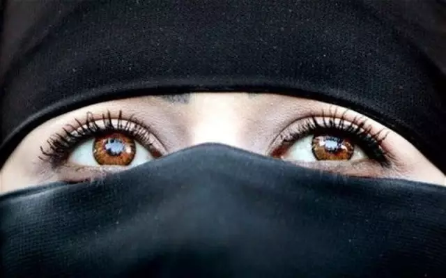
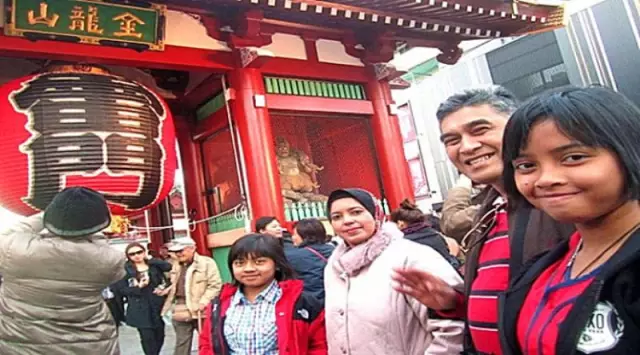
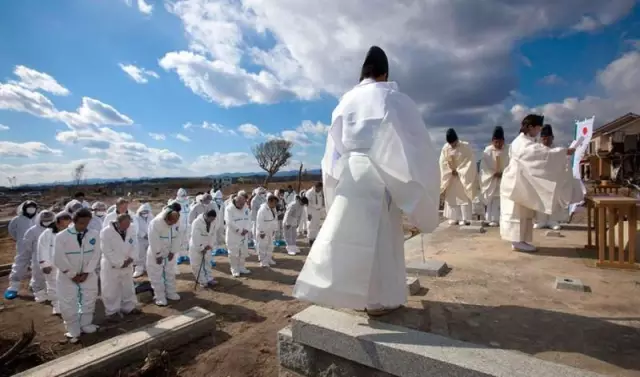
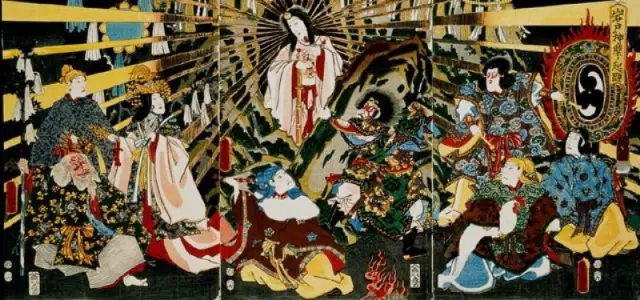

# 那个几乎没有穆斯林的世界

* 2015-11-22
* Mordechai Kedar 群学书院
* [原链接](http://mp.weixin.qq.com/s?__biz=MzA4MzM4Mjg4Mg==&mid=400678688&idx=1&sn=5e571ba8b5a73a2e83d9c735f0274c6d&scene=2&srcid=112385f5oX7DCh0yNCuno5WK&from=timeline&isappinstalled=0#wechat_redirect&location=35)

世界上还有一个国家，无论是官方还是民众，对待穆斯林事务用的是完全另一种方式，这个国家就是日本，这个国家在任何层次的穆斯林事务上都保持低调

11月13日，巴黎遭受恐怖袭击，举世震惊。众多舆论将矛头指向了欧洲穆斯林移民问题。他们认为随着穆斯林移民的大量涌入，英、法、德等国传统社区遭到破坏，遇到了前所未有的文化转变，“欧洲溃败论”甚嚣尘上。

其实，不只在欧洲，连美国、加拿大、澳大利亚，甚至是中国，都不同程度地受到伊斯兰文化的影响。应该如何应对这一新世纪的难题，成为摆在各大国面前的一个考验。特别是在欧洲，随着穆斯林移民的涌入，现在正在经历着显著的文化转变。法国，德国，比利时和荷兰就是范例，来自于穆斯林国家的移民，以及穆斯林的高生育率，影响着生活中的每一个区域。

    
我们有兴趣去知道世界上还有一个国家，同样有较高的生活水平与安定的社会环境，却成为一片“没有穆斯林的土地”（the land without Muslims），无论是官方还是民众，对待穆斯林事务用的是完全另一种方式，这个国家就是日本，这个国家在任何层次的穆斯林事务上都保持低调。政治上，伊斯兰国家的政治大佬几乎从不访问日本，日本领导人访问穆斯林国家也很罕见，和穆斯林国家的关系基于石油和天然气，因为日本要从部分穆斯林国家进口，官方的政策也不会给来日本的穆斯林公民资格，谨慎到甚至不会给穆斯林永久居留权。

日本禁止劝说公众去领养伊斯兰地区的孤儿的行为，任何穆斯林积极游说皈依伊斯兰都被视为变节他国，几乎没有机构教授阿拉伯语，在日本进口一本古兰经都很难，在日本的穆斯林，通常都是外国公司的员工，日本几乎没有清真寺，日本政府的政策是近最大的努力阻止穆斯林进入，就算是在本地外国公司派来的物理学家，工程师和经理也不例外，日本社会还是希望穆斯林在自己家祈祷就好了。

日本公司在寻找外国工人的时候，会特别标注，不需要穆斯林工人，任何进入日本的穆斯林，甚至很难租到房子，只要是穆斯林居住的地方，周围的邻居都会很烦躁，日本禁止任何伊斯兰机构的建立，建设诸如清真寺伊斯兰学校几乎不可能，在整个东京目前只有一位祈祷主持人。

    
相较于欧洲，几乎没有日本人关心伊斯兰，如果日本女人嫁给了穆斯林，她将被她所在的社会和家庭抛弃，日本没有伊斯兰教法，日本有些许根据伊斯兰教法制定的清真食品，但是在超市买到很难。

日本人对待穆斯林的方法也体现在数量上，在日本1.27亿人口中，只有1万穆斯林，少于百分之一，被转化成穆斯林的日本人极少，在日本有数以万计的外劳是穆斯林，大部分来自于巴基斯坦，作为建筑公司的工人进入日本，然后，由于社会对待穆斯林持负面态度，他们都很低调。

造成这种情况有以下几个原因：

首先，日本将所有的穆斯林一同视为基本教义派，就是那些不愿意放弃传统观点接受现代思维方式和行为方式的，在日本伊斯兰被视为一种奇怪的宗教，任何有智商的人都应该避免接触。

第二，大部分日本人都没宗教信仰，但是行为习惯却受到神道教和佛教元素影响，混成一体融入进国民习惯，在日本，宗教和民族主义的概念息息相关，对待外国人偏见时时刻刻都存在，无论他们是中国人，韩国人，大马人，印尼人，西方也不例外。有些人称其为“民族主义感的完成形态”，也有人称其为“种族主义”，不过看起来两者都不是错误的。

第三，日本根本就不接受一神论的概念，也不相信一个抽象的神，他们的世界观和物质世界的关系更深，无信仰，无感情。他们似乎也总会把犹太教和伊斯兰归为一类，基督教在日本却不被消极对待，很明显，耶稣的形象在日本更像是佛祖或是神道教。

日本最有意思的事情就是，他们对待伊斯兰无论多么负面消极，他们内心里根本不会感觉到愧疚，他们对待穆斯林国家恩怨分明，他们对待他们经济利益所涉及的石油和天然气资源，和有益于日本的穆斯林国家维持友好关系，另一面，日本的民族主义者观点，认为伊斯兰适合某些国家但是不适合日本，因此，穆斯林必须滚在国外。

因为日本对待外国人大多脾气温良，态度平静慈祥，外国人对待日本人也趋向礼貌和尊重，在外国人面前，日本人的交流方式极少吵大声或者粗语用词，因此外国人对日本人心怀敬意，尽管他们内心是种族主义而且在移民事务上歧视穆斯林。日本官员被问到日本人对待穆斯林方式这种尴尬问题，通常都不会作答，应为他知道回答事情会让人更愤怒，他不能也不愿意给予明确的答复，他将会一笑而过，如果，有压力的话，他将请求宽裕的时间请示上级指示，不过答复是永远也不会给出的。

日本让这个国家几乎没有一个穆斯林存在，因为日本对待伊斯兰和穆斯林的态度已经漫布在国家的每一个层次的人群中，随便从大街上找个人，或是公司机构，或是高级官员，在日本，相较于其他国家，这里没有“人权”机构给穆斯林支援来对抗政府，在日本，没有任何穆斯林能非法偷渡的到这里赚一毛钱，也几乎没有人给他们法律支持，让他们获得临时或者永久居留权，更别说公民身份了。

还有一样帮助日本远离穆斯林移民的是，日本人对待外劳的态度，外劳在日本被视为消极的存在，因为他们抢了本国人饭碗，日本老板觉得有责任定要雇佣日本人，即使花销比外国人贵上几倍。在日本，老板和员工的关系比起西方要深刻的多，老板和员工觉得双方要相互负责，老板觉得有责任要给员工生活，员工觉得有责任给老板工作结果，这种情况就让责任心很低外劳的接受度很低。

事实上，公众和官方对待穆斯林移民的态度合一，就使得日本世界竖起一道铁墙，穆斯林既没法也没能力穿过，这道铁墙使得世界对日本穆斯林事务的批评沉默下来，因为全世界都了解，批评日本是没有意义的，就算批评也不会让日本对穆斯林移民敞开大门。

日本正在给全世界上演一堂有趣的教学课：民族传统和移民准入有着直接的相互关联，人民如果有牢固清晰的民族传统和身份认同，将不会让世界上其他地区的失业人口进入本国。如果，人民的民族传统和身份认同薄弱易碎，那么面对着外国文化的入侵将毫无应对之力，终将入脑入户。
