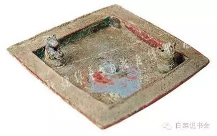

#一个不信仰伊斯兰的维吾尔，还能是维吾尔吗？

* 原创 2016-08-11
* 作者:曼谷
* [原链接](http://mp.weixin.qq.com/s?__biz=MzAwNTUyMTUzNw==&mid=2649823516&idx=1&sn=506c9a3e44c7c187e988555dd52ad689#rd&location=35)


一直以来本人都推崇的是个人自由至上，在不影响他人及不触犯法律的前提下，做什么都不应该受到他人的干涉。同时本人十分反感族群思维的绑架，我不喜欢拿我不认识的人成绩给我自己贴金，我更不希望因为我不认识的人犯得罪，而得到牵连“享受”不公的待遇。我们强调每个人都是一个单独的个体。
——神秘的大白菜


* * *

```
一切宗教都许诺：良知美德终将获得酬答，但才智或灵慧却没有得到任何许诺。
——叔本华
```

　　经常有人说“维吾尔是个全民信仰伊斯兰的民族，伊斯兰是维吾尔的信仰，每个维吾尔人自出生起便是穆斯林。”

　　那么，一个不信仰伊斯兰的维吾尔还能是真正的维吾尔吗?

　　自我们出生起，便自动被划入了穆斯林的阵营，被告知自己穆斯林的身份。于是我们被教育穆斯林该怎么样，不该怎么样，做什么死后可以升天堂，犯什么死后又会入地狱。

　　我们几乎不会有自由选择的权利，从出生起我们只能一条道走到黑，生是伊斯兰的人，死是伊斯兰的鬼....

　　但稍稍回顾一下维吾尔的历史，我们可以发现伊斯兰从来就不是Uyghur人唯一的选择，在伊斯兰之前，维吾尔就信仰过萨满教、祆教(拜火教)、佛教、摩尼教，甚至也有不少人信仰过基督教。

　　以往和不少朋友谈起过维吾尔信仰的演变，但发现大部分人对这段历史半知半解，所以在抛出自己观点之前，先简单介绍一下uyghur人有过的这些信仰。

* * *

　　1.萨满信仰

　　萨满教可以看做是图腾崇拜、祖先崇拜和自然崇拜等一系列的原始信仰的总和。萨满一词最早出现在《三朝北盟会编》，“兀室奸滑而有才……国人号为珊蛮。珊蛮者，女真语巫妪也，以其通变如神。”

　　对于萨满的词源，维基百科是这样解释的：

　　至于“萨满”这个词的来源，学术界众说纷纭，一部分学者认为“萨满”来自梵语的sramana “沙门”，并可能是通过汉语被借入通古斯语言中，而其他学者则认为这个词是通古斯语族的本土词，和动词sa-mbi “知道”的词根同源。

　　上面这段大家看着可能比较枯燥，来讲几个在我们生活中仍可见的萨满习俗：

　　例一：我们都听过或者说过“yar zimin mini yutsun”(让大地把我吞了)，这句话大意是让大地惩罚自己(的过错)，这句在文学作品中经常出现。

　　那么，为什么由大地来惩罚?这句是否意味着，在很早以前大地是我们所敬畏，或者崇拜的对象?

　　例二：在南疆乡村家里有人病了，老一辈人喜欢说“bahshi gha uqutup kuyay”(大意是请个巫师);情侣间一方疯狂的迷恋另一方，也有可能被说“bahshi gha uquti waptu”(大意是被人下蛊了)。

　　伊斯兰教是禁止各类巫术的，那么uyghur人的这些习俗又是从哪儿来的?


　　从我观察来看，我们生活中萨满信仰遗留的习俗很多，比如维族人喜欢的is purutux(重大时刻烟熏)、sama usuly(萨玛舞)、墓地里的树枝上系彩条等等。萨满信仰已被维吾尔人摒弃许久，不过萨满的一些观念和习俗扔影响着我们生活的方方面面。

　　2.祆教信仰

　　拜火教也叫拜火教(同时也被称为琐罗亚斯德教)，由波斯人琐罗亚斯德(前628年-前551年)创造。主要教义是二元论，即宇宙现象包括了善与恶两种元素，善与恶会不断地斗争，最后善将取得胜利。这种宗教崇火，所以被拜占庭人称为拜火教。

　　1978年，在乌鲁木齐阿拉沟的一座古墓中，出土了一件高方座承兽铜盘。据考证，这件公元前5世纪至公元前1世纪的铜盘，与中亚发现的祆教祭祀圣火的铜盘形状和用处有很大的相似性。类此的铜盘在伊犁新源县(天山北)、喀什的塔什库尔干(天山南)等地都有发现，我觉得这些可以说明祆教信仰在公元前就已经进入了天山南北的广大区域。苏联历史学家巴托尔德也在他的《突厥史十二讲》一书中提到过，祆教在天山南北的广大区域有着众多的信徒。



　　那么，祆教信仰在当代维吾尔人的生活中还能找到吗?最典型的就是我们每年一度的nowruz(诺鲁兹)节了。

　　据我所知，诺鲁兹最早的记载出现在公元前2500年左右的波斯文献中，不过后来祆教在波斯盛行，诺鲁兹便有了更多的祆教元素。之后祆教从波斯传入天山南北且很快被当地人接受，诺鲁兹也跟着成了天山南北众多民族的节日之一。一直到现在维吾尔、哈萨克、柯尔克孜等民族每年举行隆重的庆典，庆祝诺鲁兹节。

        (其实关于诺鲁兹节应该归为祆教还是萨满教学术界没有统一的观点;从出现记载的年份看确实可以归为萨满信仰，但是从庆祝诺鲁兹的地区和民族来看，大概范围与祆教传播的范围较为一致，所以我暂时把诺鲁兹归为祆教信仰了。当然不管是属于萨满信仰还是祆教信仰，都不源于伊斯兰的信仰)

　　3.佛教信仰

　　佛教信仰时期也是维吾尔人多种信仰并存的时代。当时的西域，佛教、祆教、摩尼教(下文会介绍)三教互相鼎力，互相融合，加上全世界各地的文化和宗教不断涌入，西域文明达到了它的巅峰，也出现了一大批极有名的僧侣(如鸠摩罗什)，他们担任着佛教的信使，把源自印度的神秘宗教传到了中原，甚至漂洋过海传到了日本。而西域的佛教，也被高昌、于阗尊为国教，建立了大量的寺庙、石窟。

        4.摩尼教信仰

　　摩尼教是三世纪的波斯人摩尼(也叫做牟尼)所创立，是祆教、佛教、基督教的基础创造的一种宗教。据说摩尼在世时曾派一名弟子到东方斯基泰民族中去传教，但不知道是否属实。(倚天屠龙刀中把小昭尊为圣女的明教，其实就是摩尼教)

　　摩尼教传入天山南路之西域(塔里木盆地)，应在694年以前。因为据敦煌出土的一件文书，在此数年前罗布泊的石城镇的首领为萨马尔罕出身的摩尼教僧侣。苏联学者巴托尔德也在其著作中多次提到，摩尼教在突厥人中流行极为广泛，在回纥汗国时期就被立为国教。

5.伊斯兰信仰

　　伊斯兰教约9世纪开始传入，到960年，喀喇汗国王萨土克·布格拉汗(Satoq Bughrahan)率所属百姓改宗，皈依伊斯兰教。喀喇汗王朝独尊伊斯兰后，于阗、高昌仍盛行佛教，经过长达百年的征战，于阗、高昌的佛教徒们战败，被灭国并皈依伊斯兰。至此，伊斯兰教成为了uyghur人唯一的信仰。

　　6.基督教信仰

　　基督教在一些文献中也被叫做景教。在7世纪左，基督教也传入了西域。考古学家在高昌故地发现有叙利亚语、粟特语、中世波斯语和突厥语的基督教福音书和教论、以及该地寺院的壁画等;而之后的一些伊斯兰文献也记载有龟兹附近的拜城有基督教徒和其它宗教信徒一起居住。这些都可以说明，独尊伊斯兰前的西域，确实生活过不少基督徒。

　　不过皈依伊斯兰后，没有出现关于基督教的记载。一到19世纪末20世纪初，一些传教士活跃在天山南北传播基督教，不过效果甚微。

* * *

　　维吾尔人的信仰从来就不是静止不变的，从现有的这些文献来看Uyghur至少存在六种不同的宗教信仰，但为何走到今天，我们却开始固化自封，拿“独尊伊斯兰”来束缚自己，甚至开始拿同样借口来绑架别人，看不得Uyghur出现不同的信仰?

　　曾经看过一个记载，据说千年前的高昌就已奉行信仰自由，高昌王甚至允许在境内各种宗教自由传播，不同信仰的人一起居住。

　　但千年后的今天，我们却觉得除了伊斯兰其他宗教都是洪水猛兽，甚至“信仰自由”也成了uyghur人禁忌中的禁忌，几乎不会再有人在公开场合讨论或呼吁信仰自由，胆敢有谁对单一信仰提出异议，那便是家庭的耻辱、民族的罪人。

　　我们不再想起我们的先人也曾是“卡费勒”（异教徒），也遗忘了曾经有那样的一群维吾尔，在于阗、在高昌为了佛教信仰，与皈依伊斯兰的穆斯林uyghur开战，血流成河、尸骨累累，只为了保住不同的信仰。

　　那么，一个出生在维吾尔家庭的人，，努力工作、积极向上、尊重他人，但他没有选择伊斯兰的作为自己的信仰，那这个人做维吾尔还能算合格吗?


* * *

曼谷是国内TOP3大学历史专业的维吾尔族学生，曼谷愿意透露的就这么多了。

同时白菜想说的是关于任何信仰，确实是你个人的自由没错。但我认为这自由应该是在你有成熟的心智时自己做出的选择，而不是从小开始就接受洗脑式的灌输。本人很反感一些发自己小孩五六岁就做礼拜的照片家长还开心的不得了那种。

说的有点多了。

最后，本人异常凶残且极其心眼小，留言喷人需谨慎！