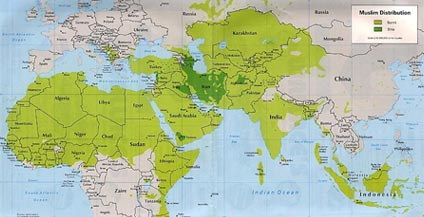

#2010 年开始的阿拉伯之春，到 2015 年，北非以及中东地区的格局有何变化或发展趋势？
现在知道叙利亚内战还在继续，伊拉克被is欺负了，埃及，利比亚，巴林，这些国家现在什么情况，现在的媒体全部聚焦在is上面了，北非以及中东国家现在的情况和以前相比有何变化？？？

* 作者：[小屋住不下](https://www.zhihu.com/people/xiao-wu-zhu-bu-xia)
* 链接：https://www.zhihu.com/question/28103514/answer/39406934
* 来源：知乎
* 著作权归作者所有，转载请联系作者获得授权。

谢邀。
先提供一个观察框架：

**2010年的“阿拉伯之春”，本质上是该地区内外因结合作用的后果。从外因上讲是08年金融危机和09年欧债危机在全球的蔓延，从内因上讲是这些国家各自均面临经济结构脆弱、军政府独裁、世俗派与宗教力量撕裂社会、以及高生育率带来的人口爆炸等问题。外因好比流感，内因好比健康体魄。流感袭来，有的国家只是打个喷嚏，有的国家就要住院。
而且，由于某些共同特点，这些国家“住院”的基本形式就是世俗化民主势力（走亲西方路线）和伊斯兰教政治势力（走民粹化路线）之间互相缠斗，导致动乱、纷争不休。**

因为涉及的国家太多，下面只拣四个有代表性的主要国家挨个介绍一下，科普一下它们的背景以及“阿拉伯之春”之后至今发生的事，让大家了解一下为什么“阿拉伯之春”是这么一个发展路径。

**突尼斯**：突尼斯旧属奥斯曼帝国统治，1881年成为法国的保护国（事实上的殖民地），1956年独立。突尼斯独立之初本来是一个君主国，按传统习惯，最高统治者称贝伊（怀疑可能跟我们说的“巴依老爷”是一个词，懂的请来说一下），实行君主立宪制。但当时的政府首脑布尔吉巴（别笑……）利用铁腕手段清洗亲法政治家和封建贵族力量，迫使贝伊效忠议会，最后更软禁并废黜了贝伊（参考我们的袁大头同志）。

1957年，贝伊退位，突尼斯共和国成立。从此时起直到1987年，突尼斯共和国的总统都是布尔吉巴。他在实行独裁统治之余，对突尼斯进行了大量社会改革，包括提升妇女地位、发展经济、建立社保机制、推行世俗化等等。此人极度痛恨妇女面纱，称其为“丑陋的破布”。

1987年，布尔吉巴因长期身体恶化，被时任总理本·阿里取而代之。

本·阿里在位期间继续推行世俗化，并在对外政策上继续亲西方。他在政治方面相比布尔吉巴要开放一些，放松了报刊审查制度，开始实行总统大选，并让反对党合法化。自1989年到2009年，此人三次在大选中获胜，得票率分别是99.66%、94.48%和89.62％（依照他修改的宪法，总统有权连任3届）。

所以得票率99%的总统并不只有萨达姆。但是这哥们不跟西方对着干，所以革命爆发前，欧洲媒体经常赞誉突尼斯是“北非民主国家的典范”。

2009年，随着欧债危机的爆发，法国乃至欧洲人去突尼斯旅游的人数大幅下降，突尼斯经济表现下滑，青年失业率激升，社会矛盾加剧。2010年，随着一个小贩的自焚，突尼斯首都发生动乱，本·阿里被迫下台，逃往沙特阿拉伯。典范国家就此完蛋。

然后就是连台好戏上演：

本·阿里1月13号宣布要改革，1月14号出逃。总理当天下午按照宪法规定发表声明宣布暂任总统，晚上就有人质疑他是不是合法获得了转交权力。1月15号上午，突尼斯宪法委员会认定总理此举违宪，总统职位应交给大议长。一个月后，有人攻击大议长跟本·阿里是一伙的，大议长也被迫辞职。3月9日，本·阿里所在的政党宪政民主联盟被宣布为非法组织，就地解散。

简直精彩。

本·阿里在位期间主要打击了两派，一派是追求西方民主的世俗主义政党，一派是主张伊斯兰化的伊斯兰政党。本·阿里倒台后，两股势力都迅速膨胀，然后互相缠斗。

按照过渡政府的方针，突尼斯要先选出一个“制宪议会”充当过渡政府，再制订一部新宪法，并在新宪法的指导下选举新政府。2011年12月大选就是为了选举“制宪议会”。这次大选的结果是一个世俗的左翼党领袖Marzouki当了总统，而伊斯兰政党伊斯兰复兴运动党则成为议会第一大党（85席，Marzouki的党只有29席），其领袖Jebali出任政府首脑。这个伊斯兰复兴运动党在伊斯兰政党中算是温和派了，它赞同经济自由主义政策。但是在社会问题上，它赞同伊斯兰理念。

大选后，伊斯兰政党和反对党就伊斯兰法在宪法中应占何种地位展开反复的斗争。这期间伴随了数次暗杀，以及从2011年一直延续到2014年的全国紧急状态。不过，到2014年1月，新宪法已经通过。宪法承认伊斯兰教的重要地位，同时保护信仰自由和言论自由，禁止对宗教信仰的诋毁和对不信仰任何宗教者的谴责。2014年12月，大选举行，原本·阿里政府成员Beji Caid Essebsi获胜，当选为新一届总统。

2012年突尼斯经济有所回升，但13年随着党争和扯皮局面的出现，突尼斯经济表现下滑，通货膨胀和失业率依旧维持在高位上。世界银行估计2014年突尼斯经济状况将有好转。（最新数据好像还没出来）

点评：突尼斯是第一个爆发革命的国家，也比较典型地代表了这批阿拉伯国家存在的主要问题：

**1）革命前，名义上实行选举制，实质上实行独裁制。**

**2）经济结构高度依赖西方，欧债危机爆发后本国经济马上出现问题。无法享受经济增长福利的民众自然要起来反对政府。**

突尼斯自焚的小贩本来是个大学生。经济好的时候，很多突尼斯大学生毕业后从事导游、服务业工作，卖苹果给法国人就能赚不少钱。欧债危机爆发后，法国人不来了，大学生大量失业——偏偏他们还都是自尊心比较强的人，不接受底层社会地位，又受不得警察的屈辱，所以干脆自焚。

**3）革命后旧独裁者压制下的社会问题逐一显露。**
**突尼斯、埃及还有很多国家都面临两个问题：是更西方化，还是更伊斯兰化？过去三十年，这些国家的独裁者不约而同选择的道路是：一手反西化，一手反伊斯兰化，同时引入资本主义和市场经济，大力发展本国经济。**

但是这帮国家建立起来的依附型经济十分脆弱，其获利者只有少数利益集团，大部分民众的利益很容易被剥夺。欧洲国家一打喷嚏，这个玩法就完蛋了。

旧玩法完蛋了，不代表旧问题解决了。原来被压制住的两批人——一批主张世俗化和西方民主的精英（以律师、医生和大学教授为代表）跟另一批主张重现伊斯兰文明伟大荣光的精英（以阿訇们为代表）开始上台，之后就开始互斗。前者代表西式精英，背后是西方势力；后者代表传统宗教贵族，背后是广大穆斯林信徒。

目前来看，所有“阿拉伯之春”中遭受动荡的国家都出现了这个问题。

突尼斯算是解决比较好的，埃及解决得就比较糟糕，利比亚则面临国家分裂。

当然，解决最糟的是伊拉克。尽管萨达姆不是在“阿拉伯之春”中倒下的，但类似的问题是一直存在的。伊战之后，世俗化精英在美国帮助下上台，结果是被广大极端穆斯林的怒火包围（美国人都把我们的家打成这样了，你们就是走狗！），后果就是ISIS大肆猖獗。

突尼斯算是在这些国家里转型最成功的一个。它能实现这个目标也是有一定特殊因素的：

**1）突尼斯在北非地缘中属于边缘国家，不像埃及、叙利亚和伊拉克那样处于各种力量的撕扯之下，受ISIS的直接影响也比较小。**

**2）突尼斯本身是进入意大利和欧洲的门户，受西方文化影响比较大，它内部的伊斯兰政党属于比较温和的派系，最多主张点一夫多妻什么的，没有要求全盘伊斯兰化。**

不过，跟其它几个国家一样，突尼斯的经济是否能在未来几年内得到好转，变数还很大。随着欧洲自身的问题进一步恶化，我对包括突尼斯在内的大部分阿拉伯国家未来的经济前景都不看好。

**埃及**：埃及情况跟突尼斯非常相似。埃及原先也是奥斯曼土耳其的行省，后来变成英国的保护国。1922年，英国形式上承认埃及独立，实质上建立傀儡政权。1952年，纳赛尔发动政变，推翻埃及国王，1956年，他成为埃及正式总统。从他开始一直到2011年穆巴拉克下台，55年里埃及只换了三个领导人。

纳赛尔是个很牛的领导人，即位之初就宣布把苏伊士运河国有化。英法不干了——当年修这个运河老子花了那么高的代价，还要指着它继续赚钱呢。所以英、法、以色列合伙发动第二次中东战争。有趣的是，这次战争遭到了美苏的一致反对——美国人是为了战后道德话语权，而苏联人是为了把人们的视线从匈牙利事件上转移开来。总之，两边都想争取埃及，而且颇下血本：美国人中止了对英国的援助，苏联人则威胁要使用核武器。英法没奈何，宣布退兵。

曾经历史上的全球第一大殖民帝国和第二大殖民帝国被逼得这么惨，想想也是有些凄凉。

此役之后，纳赛尔威望一时无二，成为阿拉伯世界众望所归的领袖。

这里特别提到第二次中东事件，是因为它标志埃及与突尼斯以及其它国家最大的不同之处：

**埃及从实力上来讲是地区大国，从位置上来讲是阿拉伯世界的中心；但是放眼全球，它只是全球玩家在中东地区的一个棋子。它在地区的野心和全球事务中的尴尬地位，注定了它在后来一系列事件中的悲剧。**

打完这仗之后，埃及野心膨胀。1958年它跟叙利亚合并成立阿拉伯联合共和国。仅仅过了3年，叙利亚十分不爽，自行退出。
1967年埃及发动第三次中东战争，联合约旦、叙利亚，进攻以色列。埃及背后是苏联，以色列背后是美国。这次看似压倒性优势的进攻后来被证明是一次作大死事件，阿拉伯方面惨败，埃及丢掉了西奈半岛。据说纳赛尔为了不让国内民众了解惨败的状况，下令射杀逃回的士兵。

1970年纳赛尔去世，萨达特继位。因为第三次中东战争的奇耻大辱，加上国内经济形势不好，萨达特决定对以色列动武挽回面子。1973年埃及发动第四次中东战争，进入西奈半岛。以色列因为害怕失去美国的支援，不敢先发动战争。但战争爆发后，他们很快抢回西奈半岛，并攻进叙利亚。后来在美苏调停下，战争结束。埃及收回西奈半岛，作为交换条件，它正式承认以色列。

（这时候尼克松正赶上水门事件，心情极为烦躁。调停决定是基辛格和白宫参谋长决定的。他俩以尼克松的名义给勃列日涅夫发信解决，苏联人还纳闷美国人怎么这么好说话呢。什么叫帝国？一个参谋长，一个顾问，决定了阿拉伯地区未来几十年走向和几十万人的生命，这个就叫帝国。）

此役之后，阿拉伯国家知道以色列不好惹，之后几十年没敢再动过。这也是军事独裁的一个好处：以阿拉伯民众对以色列的仇恨程度，换个民主政府上去，肯定又要开战。

所以埃及这种国家，想当领头羊，实际上是大国的棋子，这不是悲剧，这是荒诞剧。

1981年萨达特遇刺，穆巴拉克上台。

穆巴拉克在位期间推行经济自由化。但是在一个独裁政权中推行经济自由化，后果就是总统和军队首脑的亲戚朋友们吃得脑满肠肥，利益集团盘踞各要害部门。埃及经济跟突尼斯一样，高度依赖旅游和石油出口。欧洲一完，埃及跟着完。10年青年失业率糟到什么程度？开罗有50%的年轻人没有工作。埃及人的尊严被践踏到什么程度？警察在大街上看着谁不爽，随意扇耳光。穆巴拉克是美国的坚定盟友，每年从美国接受数十亿美元的经济援助，13亿美元的军事援助。与此同时，埃及有40%的人每天收入在2美元以下。
2011年，穆巴拉克下台。

跟突尼斯类似，穆巴拉克的反对派也有两派，一派是伊斯兰原教旨主义的穆斯林兄弟会，一派是向往西方民主的青年学生运动组织。13年被搞下台的穆尔西就是穆兄会的领袖。当时他因为抗议穆巴拉克，被关进监狱，但不久就越狱了。穆巴拉克下台后，权力掌握在军政府手里。埃及人民对此十分不满，穆兄会就借机组织抗议，迫使军政府同意12年就进行大选。

2012年，穆尔西在大选中获胜。同年，新宪法颁布。在穆斯林兄弟会的主导下，这部宪法离政教合一只有一步之遥：它宣布伊斯兰教在埃及法律体系和社会生活中处于核心地位，主张宗教领袖伊玛目拥有崇高的地位。

这部宪法立刻引起了自由派的强烈反对，国家依旧处在混乱之中。

13年，军方领导人宣布暂停宪法，罢黜、软禁并起诉穆尔西。当年12月，军方宣布穆兄会为恐怖组织。到2014年，超过1.6万穆兄会成员被拘捕，上千人被判处死刑。

2014年，军方总统候选人塞西以96.9%的得票率当选总统。

点评：埃及内部问题跟之前我们讲过的模式高度符合：穆巴拉克在位的时候，一手反自由派，一手反极端穆斯林。穆巴拉克倒台，自由派跟穆斯林互掐，穆斯林有强大群众基础，基本上就要把埃及变成政教合一国家。但是，埃及对美国来讲有重大地缘战略价值，美国绝不会放任这种事情的发生。于是在美国支持下，埃及军方发动政变，干掉穆尔西，重新控制局面。

经过4年的民主斗争，埃及民众成功地回到了起点。

唏嘘什么的，留给诸位自行思考。这里提醒大家一个事实：

1981年，埃及人口3500万。到2011年，埃及人口达到了8100万（这是官方统计数字，学者估计在9100万以上）。30年涨到过去的2.5倍。与此同时，埃及的可耕地面积和农业技术可没增长——这个罗马帝国的粮仓，现在是世界上最大的粮食进口国之一。

**这在经济史里是什么现象？
——典型的马尔萨斯人口陷阱。**

当前极端穆斯林主义成为全世界的严重问题，这不假。但它的背后是过去三十年来，初步现代化给这个地区带来的高人口出生率和低人口死亡率，导致穆斯林人口迅速膨胀，并扩散到周围的欧洲、中亚以及非洲地区，与当地人发生激烈冲突。

=====以下进入私货时间=====

在前现代社会，我们如何解决马尔萨斯陷阱问题？

不好意思，答案是王朝崩溃，农民起义，大规模战争，简单点，两个字：杀人。

现代社会，这个问题怎么办？

很多人指责伊斯兰教的落后，原教旨主义的可怕。但是在这个古老的王国，没有像样的基础设施和教育体系让人们接受教育，没有工业化经济给人们一份工作，成天游荡在街头流浪、抢劫、得过且过的人们除了信仰那些文化水平不高的阿訇教导给他们的落后、可笑的宗教（我的意思不是伊斯兰教落后可笑，而是说，那样一种状态下，人们接受的教育跟中世纪落后愚昧的天主教也没有什么区别。关键不是宗教问题，是社会经济水平问题），他们的生活还有别的寄托吗？

这不是东方与西方之间的战争，伊斯兰教与基督教之间的战争；部分西方学者说这是“子宫战争”，我认为还不够准确。

**这是先步入现代社会的文明全面压制落后文明后，落后文明以最原始、野蛮的方式对先进文明展开的报复，他们进行报复的武器就是妇女的子宫。吊诡的是，先进文明看起来处在劣势，正是因为它主动给自己戴上了道德枷锁，不愿意在这个层面上像野蛮人一样开战。
在这场战争中，我不问谁正义谁邪恶，我只问一个问题：
该怎么办？**

=====私货时间结束=====

=====2015-02-11更新=====

**利比亚**：利比亚的事很简单，有意思的故事都发生在卡大佐身上。

跟前两个国家一样，利比亚早先还是属于奥斯曼（你可以大概想象一下当年的奥斯曼帝国有多牛逼），后来变成意大利的殖民地。
利比亚名义上是一个国家，实际上是三个地区凑起来的。这三个地区分别叫的黎波里塔尼亚(Tripolitania)、昔兰尼加(Cyrenaica)以及菲赞(Fezzan)。记不住？没关系，我也记不住。你就知道这几个地区还有大部分掌控在部落酋长手里，各个部落的人听酋长的，酋长听火力最强的，这就够了。

1969-2011年，卡扎菲是火力最强的那个人。他的力量主要集中在首都和几个比较大的城市。2011年针对他的内战就是一次典型的“农村包围城市”。

卡扎菲这个人有多逗比呢？

纳赛尔之后，卡扎菲想要继承他在泛阿拉伯世界的地位，但是没人鸟他。不要紧，这个有梦想的人开始了自己为圆梦而不懈奋斗的历程。

1970年，卡扎菲派副手密访中国，要中国卖原子弹给他，他就可以和台湾断交。我估计主席听完这事儿，半天都没缓过劲儿来——他这辈子大概没见过这么谈判的。

1972年，他提议重新开搞阿拉伯联邦共和国，成员包括利比亚、埃及、叙利亚，在后来的版本里还有苏丹等其他国家。埃及忙着跟以色列打打和和，没理他。

1977年，卡扎菲宣称埃及跟以色列的和谈背叛了利比亚人民，开片。为了证明此举是人心所向大势所趋，他还专门组织过2万人跑到埃及边境去抗议。

当时利比亚由于丰富的石油资源，经济发展十分强劲。1977年的时候利比亚人均国民收入非洲第五，人类发展指数非洲第一，当时的人均收入就远超中国。但卡扎菲希望在利比亚建成社会主义，于是开始改革。经过多年奋斗，利比亚经济停滞不前，终于在革命后又重新恢复增长。

1978年，卡扎菲进攻乍得。同年利比亚与中国建交，但不顾中国多次抗议仍允许台湾驻利比亚机构使用“中华民国商务办事处”头衔。

1988年，因策划洛克比空难事件，利比亚遭到联合国长期经济制裁。该制裁在2003年卡扎菲与西方国家关系缓和后撤销。

1994年，卡扎菲捐赠大量资金给曼德拉政党参选。曼德拉当时的原话是“那些被我跟卡扎菲总统的友谊激怒的人们，去跳游泳池吧。”

1997年，卡扎菲获南非政府颁发的“Good Hope”奖。

2006年中国举办中非合作论坛，卡扎菲在事前写信给非洲国家领导人，斥责中国此举为新殖民主义，不许他们与会。那年来中国的代表团有48个国家，利比亚派的团长是级别最低的。

真的，再有说卡扎菲是中国人民老朋友的，可劲儿抽丫的。

2008年，卡扎菲获非洲部落领袖赐予的“万王之王”称号。同年，法国主导的“地中海联盟”成立，该组织遭到了利比亚的强烈反对。

……

卡扎菲被干死后，一派支持世俗势力的民兵和一派支持宗教势力的民兵各自支持一个议会和总理，互不承认。现在基本处于内战边缘——如果事实上的内战还没爆发的话。

点评：利比亚局势很简单：卡扎菲在的时候，利比亚因为他的逗比完蛋；卡扎菲不在的时候，利比亚因为内战完蛋。

**叙利亚**：叙利亚情况比前几个国家多了一点复杂因素。前几个国家只涉及旧殖民地、殖民地后面的军事独裁政权，以及这些独裁政权压制下的世俗-宗教势力冲突。

叙利亚还涉及到另外一层，就是教派问题：叙利亚大部分人信仰的是逊尼派，而领袖巴沙尔则是什叶派教徒。

所以叙利亚自己国内的反抗势力此起彼伏，主力都是逊尼派。

图上浅绿是逊尼派，深绿是什叶派。

主要伊斯兰国家都是逊尼派，只有少数几个，比如伊朗、叙利亚才是什叶派。所以不想巴沙尔倒台的国家里面，伊朗是最积极的之一。（插一句，为什么伊朗政局比较稳定？因为伊朗的政体最接近伊斯兰律法中承认的政教合一政体，合法性最高。然后相对应的，逊尼派中沙特的合法性最高，因为也是政教合一的王权政体。）

萨达姆本来也是逊尼派，美国干掉他之后，什叶派在伊拉克势力迅速扩张。如果不是ISIS崛起，伊拉克本来很可能倒向伊朗。
ISIS是极端逊尼派。

总之，突尼斯、埃及的问题是国内力量想让独裁者倒台；利比亚的问题是西方世界想让卡扎菲倒台，而叙利亚的问题则是整个阿拉伯世界（伊朗不是阿拉伯国家）都想让巴沙尔倒台。“阿拉伯之春”只是个契机。

但是叙利亚没倒台，因为它背后有俄罗斯。

仔细看看地图，高加索下来就是叙利亚。作为一个陆上疆域如此巨大、边界线如此漫长、邻国如此复杂、地缘利益如此纷乱的国家，俄罗斯历史上对在其周边建设缓冲国和中立地带的渴求超乎了一般人的想象。

为什么这次乌克兰事件普京态度如此强硬？因为他已经退无可退。

叙利亚也是如此。乌克兰背后有德国（乌克兰事件中美国其实是一箭双雕，既坑了俄罗斯又坑了欧盟），叙利亚反对派本来也得到德国和美国的支持。按照原计划，巴沙尔最多撑到2013年，之后美欧就是从黑海和里海两个方向逼近俄罗斯本土。可谁也没料到半途中杀出来一个ISIS，给搅黄了。

叙利亚的现状是反对派打巴沙尔，反对派打反对派，反对派打ISIS，ISIS打巴沙尔，ISIS打所有人……

=====总结阶段（私货时间）=====

开始说好了，只盘点四个国家。相信看完这四个国家，大家是可以自行判断其它国家未来与出路的。

简单说，四个字：没有办法。

亲西方派有知识分子，有理念，代表了比较先进的一方。但是他们空有情怀，手中无枪，也没有广大群众的支持。在政治斗争中，他们基本上只能依赖外部力量干预。但西方干预中东，一定不是为了当地人民的利益。

宗教派有绝大多数人民的支持。但是他们目前为止依然没有找出一条改革伊斯兰社会、使这个古老宗教与现代社会相适应的办法。目前绝大多数伊斯兰政党只是利用了下层人民对独裁者的厌倦和对美国的痛恨而上台掌权的，至于掌了权之后怎么办，没有人心里有谱。

总之，庆幸这个世界的老大是美国吧，美国人为这些事操心，我们就不用了。——我们也没有能力操心：不说别的，美国大学教授为了研究苏丹，都能娶一个苏丹老婆。中国教授不娶女学生就不错了，我们举国能挑出几个以当地语言研究当地历史文化社会制度的学者？

而且，除了地缘政治和宗教冲突之外，20世纪中叶开始，大部分阿拉伯国家经历了高速人口增长，这也是当前动乱的一个关键因素。

几亿人口就是几亿张嘴，你不喂他们东西吃，他们就反过来吃你。

看看中国历史就知道，几百年治乱循环，本质上其实都是马尔萨斯人口陷阱下不得不通过大规模内战来消灭掉剩余人口的结果。
感谢工业化，它给我们提供了摆脱这种命运的可能性。

中国与伊斯兰国家之间存在根本性区别。中国的隐患不是伊斯兰式的，而是德国式的——我说的是一个世纪以前的德意志帝国。
但中国与德国也有区别——虽然不多，但依旧存在：德国之后有日本，有苏联，但日本和苏联在经济上都没有达到中国今天的高度：以一己之力为全世界提供产品，居然还产能过剩。

中国之后，恐怕很难出现第二个中国——中国太大了，沿海淘汰的工业，还可以往内陆迁移，而不是像日本那样迁到台湾和东南亚。

中国的崛起，搞不好堵死了大量后发国家崛起的道路，这，也许也是伊斯兰世界悲剧的成因之一。