#遮面是穆斯林女性的传统服饰吗? (编者题)

* 作者：李飞
* [原链接](https://www.zhihu.com/question/30233795/answer/47353215)
* 来源：知乎
* 著作权归作者所有，转载请联系作者获得授权。

你们够了，真的。

宗教作为一种精神世界的解释，一旦涉及现实世界就会变的奇怪甚至变态。

现在中国政治权力反对布卡和蓄须，是因为这两个背后代表的原教旨主义的入侵，本身中国回族原来对于是否戴面纱几乎是don’t care的状态，不信？

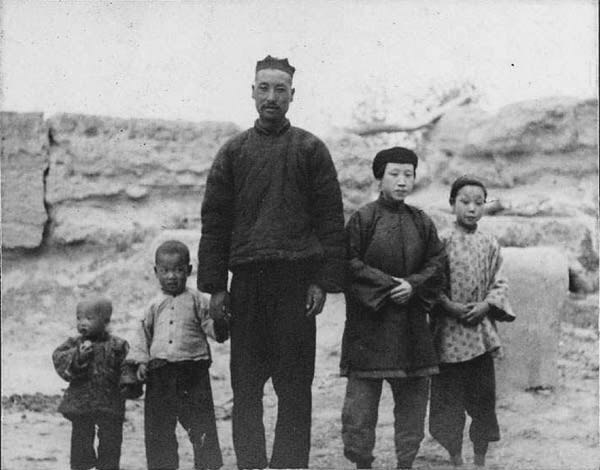

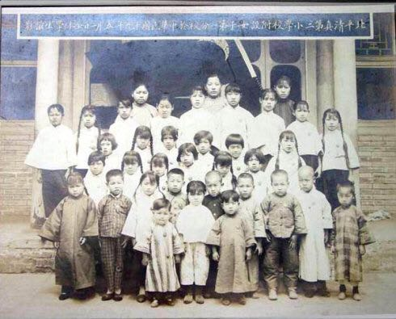

第一张是穆斯林家庭的老照片，第二张是北京清真女校。但也不是说没有人戴

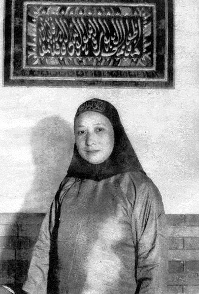

这个是清真寺的女阿訇

而就算那个时候阿拉伯世界也是无所谓的状态。

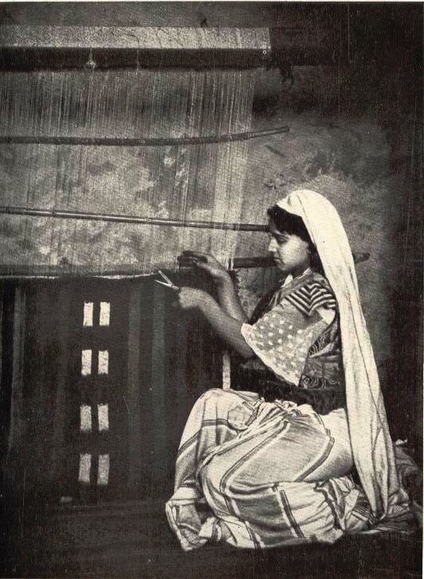

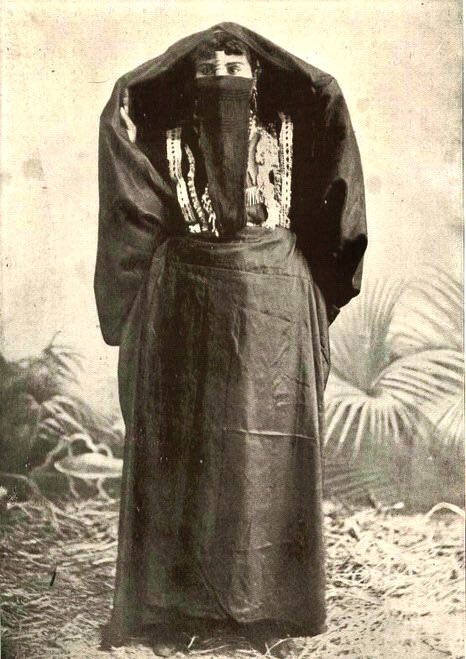

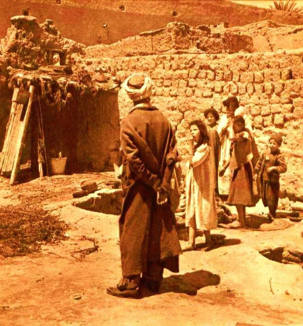

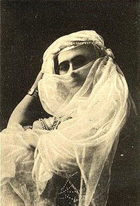

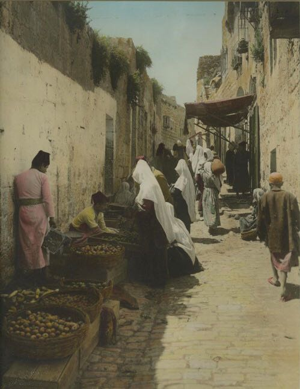

历史再远点，欧洲人油画中的伊斯兰教的王宫和女奴市场

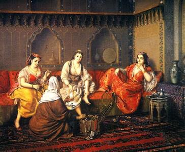

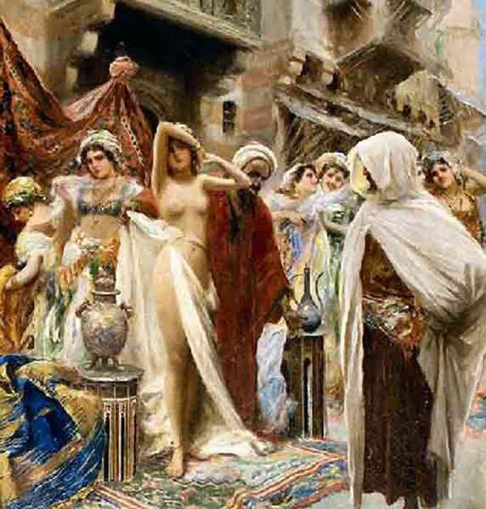

而现在中国回族的国外活化石东干族戴吗？不戴

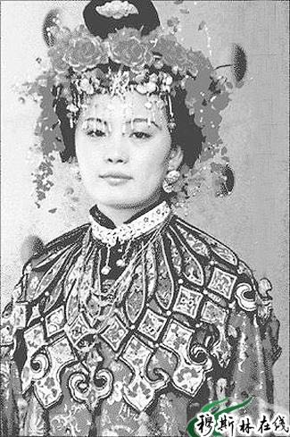

可见在现在60年到100年前前，戴不戴面纱，伊斯兰教世界无所谓，就算古兰经中对衣服规定也说的不清楚，给现代宗教人士维护传统父权落后意识制造了相当大的空间。

我还要说，伊斯兰教传统是相当多的继承了中亚之前传统帝国文化，戴面纱不是伊斯兰教带来的，比如说这个伊斯兰崛起前波斯雕塑中女性已经戴上面纱

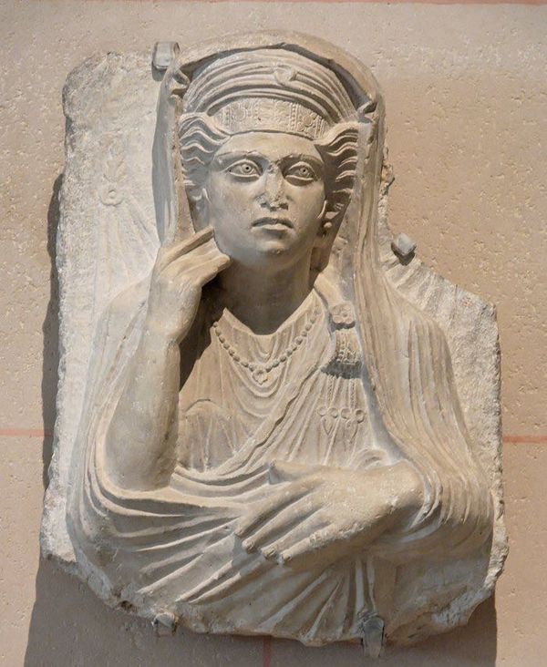

而继续说道，宗教一旦涉及政治就会变态，和我们一般认为的不同，伊斯兰教自从哈里发教权领袖被架空政治权利，伊斯兰世界教权就已经被世俗君主权利控制，而欧洲教权衰落还得到14世纪法国自立教宗开始。可以说在伊斯兰一千多年大部分历史里，宗教完全服务于世俗君主，对于社会管制真有那么严，那么如今的蒸馏酒技术也就不会诞生于阿拉伯世界了（欧洲的蒸馏酒技术是十字军东征后带回欧洲的，中国蒸馏酒技术是元代色目人带到中国的，而就教义解释上也有部分教派认为伊斯兰反对的是利用粮食酿造的酒精饮料而非果酒）

伊斯兰世界的教权化也就这一百年的事，而全世界对伊斯兰世界的负面看法也是这一百年形成的，这里不得不要说，伊斯兰世界过去世俗君主被相继推翻形成的巨大权利真空，原始的沙漠部族势力借助教权涌入这个真空，而他们道德所维护的是远远落后于世界的部落父权意识，父权意识面对西方日益拥涌进的女权独立自主意识，不得不重新寻求宗教人士的帮助利用古兰经从服装上开始限制女权。（说的就是沙特这家借着英国武装入主穆斯林圣地的沙漠部族）

再者，也不要说别人斯德哥尔摩症，在现代化，全世界开始同一化下，我到底是谁，怎么定义自己还是自己难道不是一个全世界各个后发国家和民族正在询问自己的问题吗？汉服运动不就是部分汉族寻求这个问题的回答吗？当然反对的也挺多的。

只是啊，西域很多民族经济政治问题，借着原教旨主义，有些人放弃本来属于自己的民族文化倒向贝都因人继承自波斯帝国再扭曲的文化向政治实权发难，真不知是祸是福

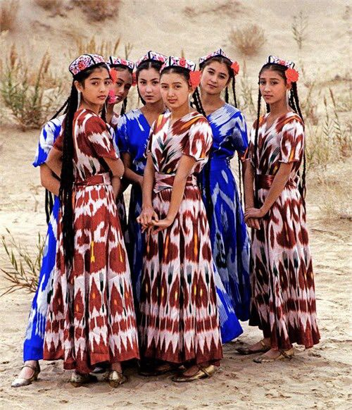

原教旨提倡的布卡不是阿拉伯女性传统服饰，由于资料暂时缺乏，给你们看看在欧洲和穆斯林自己的绘画中女穆斯林到底怎么穿。

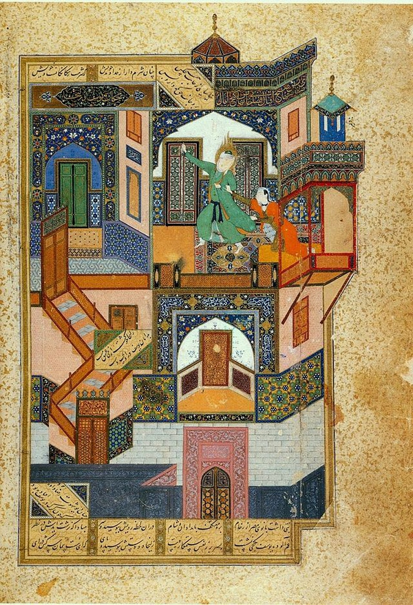

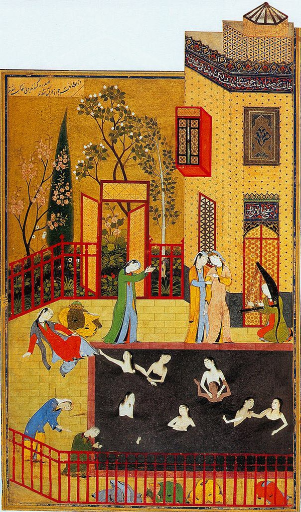

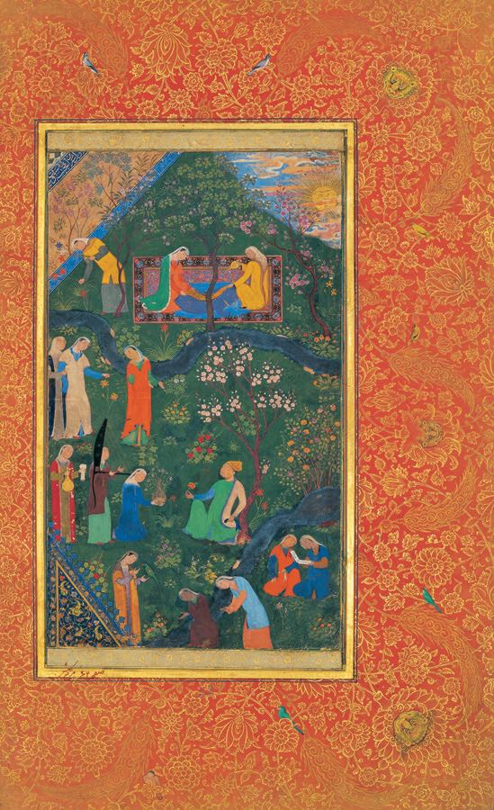

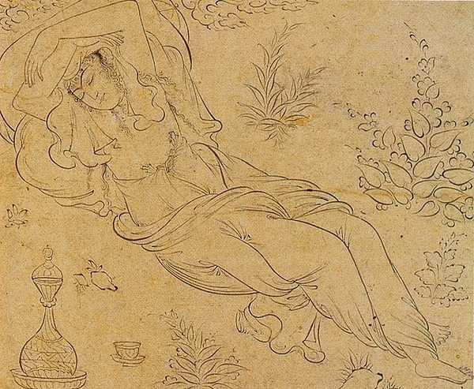

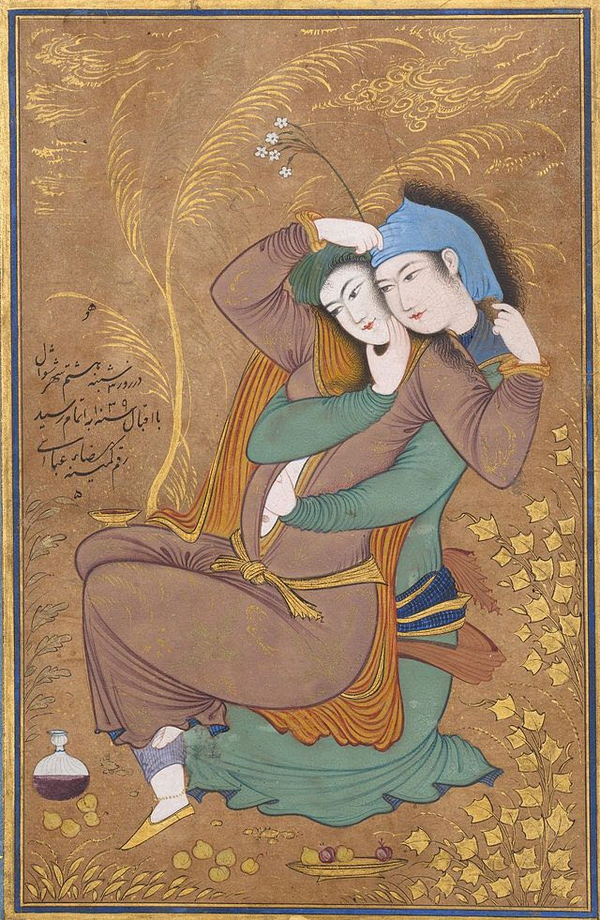

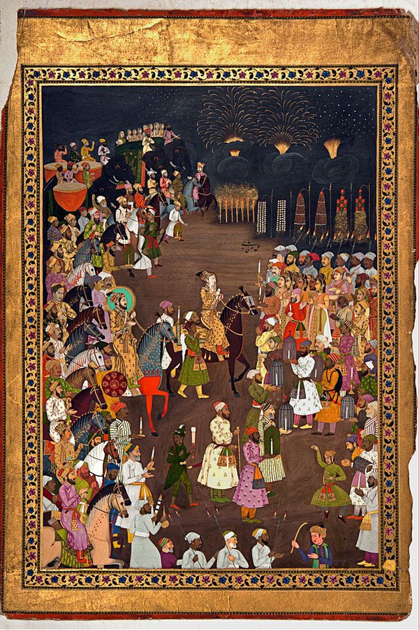

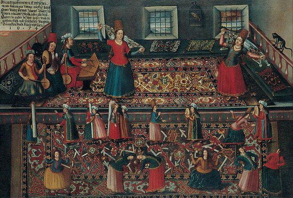

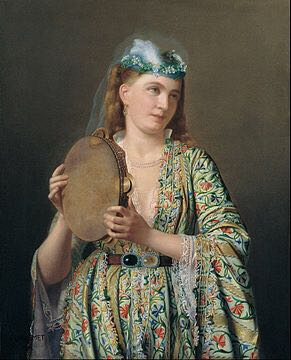

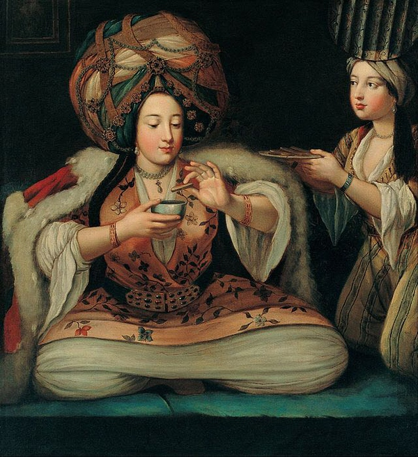

这些画除了最后两幅是欧洲油画，其他都是波斯16世纪左右开始的细密画，画中女性对照下，哪里有现在原教旨提倡的布卡那种单调无味的黑色面纱？更多的是我们记忆里西域可爱甜美的畏兀儿少女背后各种颜色透明的纱巾，布卡一直都说是沙特阿拉伯近代才传播出来的一种伪穆斯林传统服饰，之前根本不见于任何穆斯林画作中，也可能细密画流行较晚没有记录在绘画中。

PS最后开个地图炮，现在很多穆斯林很浮躁，一生也就只知道古兰经了，完全就不懂伊斯兰历史，也只随声附和听风就是雨的，外人不懂伊斯兰历史和文化，也就不懂了，作为穆斯林自己都不懂被一些别有用心的人鼓动起来真心难看。19世纪末的时候，埃及的穆斯林历史学者几乎可以无障碍的和经学家讨论穆圣生平，分析伊斯兰崛起的各方面非宗教因素而写出伊斯兰文化史这样一部流芳百世的巨著，而现在稍有不注意对穆圣的讨论就要被诅咒，被恐吓等等要求闭嘴的手段来发泄自己的过剩的精力。请求知乎上穆斯林和非穆斯林能努力提高素质和学识，不要在不要脸的互相问候