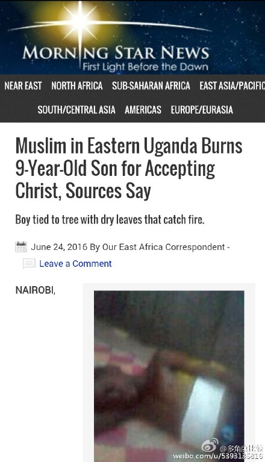
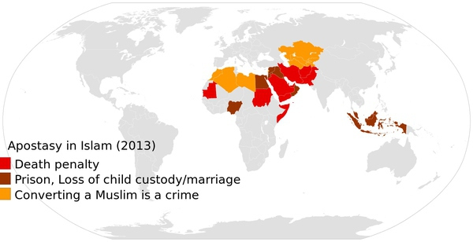
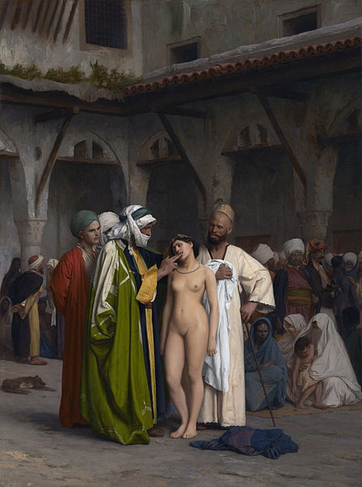
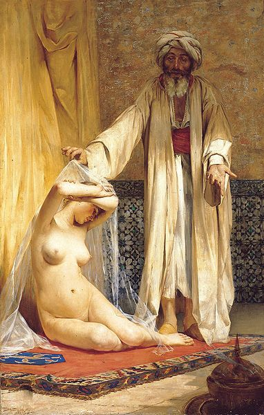
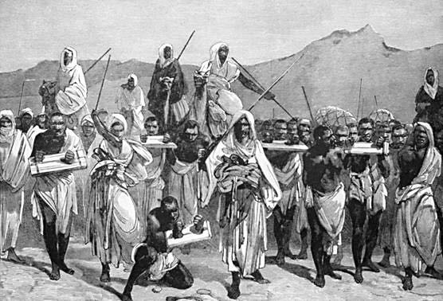

# 从经文分析为什么伊斯兰和其他文明不可能兼容(编者题)

* 作者：匿名用户
* [原链接](https://www.zhihu.com/question/20353131/answer/29036194)
* 来源：知乎
* 著作权归作者所有，转载请联系作者获得授权。

**@罗斯rogers 摘抄的答案最后提出了改革道路，然而在下认为一切抛开古兰经而单纯分析伊斯兰世界表象的研究都是治标不治本的。基督教改革用圣经至上代替了教会至上，但圣经和古兰经很不同，且古兰经本身就是至上的，改革伊斯兰=改革古兰经 改革古兰经=消灭伊斯兰然后造一个新的玩意儿。 穆斯林自己改古兰经是不可能的，先知穆罕默德已经自封为封印先知，他以后决不能更改一丝一毫。所以除了屈服只有斗争。我的回答就从分析经文来看待伊斯兰和其他文明不可能兼容，最后还是得实力说话。
【少图预警】纯干货论述，看图说话党可以忽略**

    其实伊斯兰本质是混合宗教思想的政治意识形态。强烈的政治诉求加上对暴力的有条件赞许导致恐怖主义 ，言语直白的古兰经相比圣经，其实更是一部律法书和政治纲领。
    看 完古兰经和圣训，伟嘎耶教法经就发现，根本是政治纲领和律法书。纳粹以种族判敌我，用暴力手段，列宁主义以阶级判敌我，用暴力手段，伊斯兰教以信仰判敌 我，用暴力手段。所以说伊斯兰是政治因为用暴力铲除异教执行沙里亚法。而信仰是内心的东西。虽然暴力有限制，但穆斯林的虔诚和狂热会被一次一次被利益群体伪 造的条件而利用，产生暴民和恐怖分子。
    目的是在整个世界创建一个伊斯兰的社会秩序，将所有战争之境（伊斯兰教中将信仰伊斯兰的地区称为伊斯兰之境，不信仰伊斯兰教的地区称之为战争之境）变成伊斯兰之境，全世界的人最终都变成穆斯林；不是为了单纯的自卫 。（古兰经9：33；48：28)

以下是古兰经整节摘录，部分洗地的表说断章取义哦。

    九:一二三.信道的人们啊！你们要讨伐邻近你们的不信道者，使他们感觉到你们的严厉。你们知道，真主是和克己者在一起的。
    六五.先知啊！你应当鼓励信士们奋勇抗战，如果你们中有二十个坚忍的人，就能战胜二百个敌人；如果你们中有一百个人，就能战胜一千个不信道的人；因为不信道者是不精明的民众。
    9二九.当抵抗不信真主和末日，不遵真主及其使者的戒律，不奉真教的人，即曾受天经的人，你们要与他们战斗，直到他们依照自己的能力，规规矩矩地交纳丁税。
    五:三三.敌对真主和使者，而且扰乱地方的人，他们的报酬，只是处以死刑，或钉死在十字架上，或把手脚交互著割去，或驱逐出境。这是他们在今世所受的凌辱；他们在后世，将受重大的刑罚。
    六十六:九先知啊　你当与不信道的人们和伪信的人们奋斗　你当以严厉的态度对待他们他的归宿是火狱　那归宿真恶劣

    8一七.你们没有杀戮他们，而是真主杀戮了他们；当你射击的时候，其实你并没有射击，而是真主射击了。（他这样做）原为要把从自己发出的嘉惠赏赐信道的人们。真主确是全聪的，确是全知的。【用来消除穆斯林杀人的负罪感】
    8一二.当时，你的主启示众天神：“我是与你们同在的，故你们当使信道者坚定。我要把恐怖投在不信道的人的心中。”故你们当斩他们的首级，断他们的指头。
    4-74以后世生活出卖今世生活的人，教他们为主道而战吧！谁为主道而战， 以致杀身成仁，或杀敌致果，我将赏赐谁重大的报酬。
    9-111真主确已用乐园换取信士们的生命和财产。他们为真主而战斗；他们或杀敌致果，或杀身成仁。那是真实的应许，记录在《讨拉特》、《引支勒》和《古兰经》中。谁比真主更能践约呢？你们要为自己所缔结的契约而高兴。那正是伟大的成功。
    8:60.你们应当为他们而准备你们所能准备的武力和战马，你们借此威胁真主的敌人和你们的敌人，以及他们以外的别的敌人，你们不认识那些敌人，真主却认识他们。凡你们为主道而花费的，无论是什么，都将得到完全的报酬，你们不会吃亏。
    9:3.（这是）从真主及其使者在大朝之日传示众人的通告：真主及其使者对于以物配主者是无干的。如果你们悔过，那对于你们是更好的，如果你们背离，那末，须知你们不能逃避真主的谴责。你以痛苦的刑罚向不信道者报喜吧。
    47：4. 你们在战场上遇到不信道者的时候，应当斩杀他们，你们既战胜他们，就应当俘虏他们；以后或释放他们，或准许他们赎身，直到战争放下他的重担。事情就是这样 的，假若真主意欲，他必惩治他们；但他命你们抗战，以便他以你们互相考验(这就是为什么伊斯兰世界打打杀杀不停)。为主道而阵亡者，真主绝不枉费他们的善 功，
    不信道者所有的财产和子嗣，对真主的刑罚，不能裨益他们一丝毫。这等人是火狱的燃料。——第三章 第十节
    33:二六.他曾使帮助他们的那些信奉天经者，从自己的堡垒上下来，并且把恐怖投在他们心里，你们杀戮一部分，俘虏一部分。
    33:二七.他使你们继承他们的土地、房屋、财产和你们尚未踏过的土地。真主对于万事是全能的。(穆斯林有权掠夺非穆斯林)
59章2-5讲述了如何杀戮征服基督徒和犹太教徒
    1. 在初次放逐的时侯　他曾将信奉《圣经》而不信《古兰经》的人从他们的家中驱逐出境　你们没有猜想到他们会退出去　他们猜想自己的堡垒能防御真主但真主的刑 罚　竟从他们料不到的地方降临他们　他将恐怖投在们的心中　他们用自己的手和信士们的手拆毁自己的房屋　有眼光的人们啊你们警惕吧　
    2. 假若真主没有判决他们应受放逐　他必在今世惩罚他们　他们在後世将受火刑　
    3. 这是由於他们违抗真主和使者　凡违抗真主者　真主必定惩罚他　因为真主的刑罚确是严厉的　
    4. 无论你们砍伐海枣树　或任其依然存在　都是真主所允许的　他准许伐树　原为凌辱放荡者　
同时，古兰经 61 ： 10 至 12 的上下文描述的就是：战争 ；安拉对战士列阵作战 （本章的题目） 的喜爱；

对不想参战的伪信者的谴责；这里可以看出伊斯兰教本性好战。
**一部20多万字的经书，里面486处提到“惩罚，刑罚”，215处提到“火狱”，106处提到“砍”和“杀”，55处提到“严厉”；35处提到“仇恨”，“仇视”；23处提到“恐怖”；116处提到“恐惧”“畏惧”，28处提到“烈火”，25处提到“血”，95处提到“顺从”，98处提到“祸，灾”。仅有的1处提到“宽容。
如果还幻想和穆斯林和平相处那么请阅读古兰经(3:118)：“信教的人们啊!你们不要与不同教的人真诚相处，他们会不遗余力谋害你们，他们希望你们遭难，他们的口中已吐露怨恨，他们的胸中所隐讳的，尤为恶毒。”
我们再来看看《布哈里圣训集》 “布哈里圣训集”一书是伊斯兰逊尼派最具权威性的圣训集，除古兰经外没有比布哈里圣训更可靠的伊斯兰经典**

    穆罕默德说他被命令与人战斗，直到他们说只有神(真主)配得被敬拜(布哈里圣训4：52：196)
    穆罕默德奉命和人类进行斗争，直到他们念清真言。 (布哈里圣训1：25，392，393；4：52：196)
    穆罕默德和欧麦尔命令穆斯林侵略异教徒的国家，与他们战斗，直到他们只敬拜安拉或交纳人丁税。 (布哈里圣训4：53：386)
    最好的穆斯林是那些用将锁链扣者人的颈项直到他们接受伊斯兰的穆斯林。 (布哈里圣训6：60：80)
    征服麦加之後，就是圣战。当穆斯林统治者叫你打圣战时，你应该立即响应。 (布哈里圣训4：52：79，311)
    有一天穆斯林会发动圣战。 (布哈里圣训4：56：792)
    穆罕默德允许在晚上攻击多神教徒的战士，而这可能使他们的女人和儿童暴露在危险中。 (布哈里圣训4：52：256)
    穆罕默德攻击古莱扎，屠杀 (已经投降的) 古莱扎的战士，俘虏他们的女人和儿童，在穆斯林当中分配他们的妇女，孩子和财产。他从麦地那放逐所有犹太人。 (布哈里圣训4：52：280；5：59：362，443，444，447，448)

伊斯兰儿童启蒙读物和日常规范标准《伟嘎耶教法经》出征篇教授了如何征服异教徒，如何贯彻欺骗伪装自保，壮大实力后征伐异教徒。什叶派也有类似的塔基亚原则。穆斯林儿童就被灌输了杀人的思想。至于面对异教徒的伪装：

	被迫宣称不信，内心却为信仰而坚定者 (古兰经16：106)

信道的人，不可舍同教而以外教为盟友；谁犯此禁令，谁不得真主的保佑，除非你们对他们有所畏惧（而假意应酬）。真主使你们防备他自己，真主是最后的归宿。(古兰经3：28)
纵观历史，一个孤立非伊斯兰地区的穆斯林人口繁殖达到30%以上必然发动对异教徒的战争。波黑战争、陕甘回乱都是如此。
或许，指望伊斯兰教称为一个和平的宗教还不如奢望撒旦重归天堂。（本人非宗教徒，只是比喻。）当然了，今天大多数的穆斯林的生活并没有靠着暴力，因为古兰经 像是一个自由支配的选择。如 果你想和平，你就能找到和平的经文。如果你想战争，你就能找到战斗的经文。你能找到只允许打防御性圣战的经文，你也能找到证明侵略性圣战是正当的经文。比 如，引用在「伊斯兰是和平」这吟诵中的一句经常听到的经文据称是这样说的：「如果你杀了一个人，有如你杀了所有人。」但古兰经 5 ： 32 的原文是这样说的：「如果你杀死了一个人 – **除非那人是谋杀或是在这捣乱** – 那你有如杀死了所有人。」紧接着下来的经文为那些与穆斯林作战并「捣乱」地方的人列出了一系列的野蛮惩罚，包括斩死、十字架钉死、或分尸。但，这同样可以为
圣战的理由：比如，如果穆斯林们有天对于捣乱的定义变为了”世俗主义，民主主义，和非伊斯兰教价值观。“（05年伦敦77爆炸案大家还没忘吧？7 月 8 日，伦敦的穆斯林周刊不觉羞耻地发表了
Abid Ullah Jan 的一篇冗长的社论，文章的标题为「伊斯兰、信仰和力量」。文章的大概意思是说穆斯林应该为从非穆斯林那里获得更多的政治和军事力量而努力奋斗，战争是所有 穆斯林义不容辞的责任，全世界应该建立起伊斯兰国家，都应信奉伊斯兰，执行伊斯兰教法。）写了这么多，各位心中也都该清楚了，穆斯林中根本就不存在理性与 非理性之分。只有天性好战与不好战之分。当需要时，穆斯林们就会被教义煽动来进行圣战。当不需要时，伊斯兰教又是个和平的宗教，所有穆斯林都是世界中一 员，相亲相爱。虽然民族定罪论一向是被世界人民所反对的。但如果一个宗教教人行恶，那么这个宗教本身就罪恶。我的观点并不偏激，所有的一切都为事实，如若 有穆斯林看到这篇文章后喊打喊杀，那么请回去后翻一翻你们的古兰经和圣训集然后援引原文来论证我这篇文章的素材有造假，对穆斯林，对伊斯兰教的侮辱与诽谤之嫌。
部分引用自余鲲的日志[推荐穆斯林大学生选读书目（孤岛）](http://blog.renren.com/share/459575908/13574224695?from=0101010202&ref=favminifeed&sfet=102&fin=0&ff_id=459575908#nogo)
穆斯林没资格喊信仰自由，因为古兰经和圣训都说不仅后世惩罚，更要在现世杀死叛教者，出生在穆斯林群体根本没权利选择自己的信仰。被洗脑灌输是一回事儿，死亡威胁是两手准备
古兰经第4章第89节说穆斯林可以杀死“违背正道”的（第88节所指的）“诈伪者”，而第90节则列出了一些例外情况。
[《布哈里圣训实录》](https://zh.wikipedia.org/wiki/%E5%B8%83%E5%93%88%E9%87%8C%E8%81%96%E8%A8%93)4:52:260、9:84:57、58及64、9:89:271记载穆罕默德说叛教者应被杀死。
**《伟嘎耶教法经》叛教篇**详细介绍了如何在现世惩罚改变信仰的穆斯林。有监禁——死刑两个阶段。
在[伊斯兰法（沙里亚法）](https://zh.wikipedia.org/wiki/%E4%BC%8A%E6%96%AF%E8%98%AD%E6%95%99%E6%B3%95)，共识是男性叛教者必须被处死，除非他有精神病或是非自愿情况的叛教，例如性命受到迫切威胁。根据逊尼派的沙斐仪派、马立克派及罕百里派教法学说，女性叛教者必须被处死，而根据逊尼派的哈乃斐派学说及什叶派学者的说法，女性叛教者须被囚禁，直至她重新信仰伊斯兰教为止。

由此可以解释全世界每年2000多起荣誉处决，就是女性因自由恋爱选择和异教徒通婚，或者选择其他信仰而被父亲兄弟依据古兰经处死。新疆也有，美国有因为衣着暴露而被穆斯林父母谋杀的新闻[阿富汗裔穆斯林夫妇杀害3名漂亮亲生女儿 因其衣着暴露高清版 在线视频观看](http://www.tudou.com/programs/view/4dn_VnuT5NY/)。2008年，沙特的的18岁女孩法蒂玛因改信仰基督，被其叔父割掉舌头，用汽油活活烧死。英国女孩芭娜兹因和非穆斯林男子恋爱被父亲和叔父处死[英国穆斯林少女遭私刑处死生前求救影带引关注](http://www.iqiyi.com/w_19rqvvx2y5.html)
随巴基斯坦父母生活在英国柴郡沃林顿市的17岁女孩Shafilea, 因西方的生活方式，追求自由恋爱不愿被伊斯兰束缚包裹，被父母杀死肢解抛尸灌木丛。[Shafilea Ahmed: a girl betrayed](https://www.theguardian.com/commentisfree/2012/aug/03/shafilea-ahmed-a-girl-betryaed)



父亲焚烧改宗基督教的儿子

在沙里亚法统治下，不存在信仰自由一说。
叛教者是任何原先为穆斯林(包括那些出生时父母已是穆斯林的，以及那些由其它信仰改信伊斯兰的人)，后来背弃伊斯兰，改信其它信仰，及任何对伊斯兰攻击的人
伊斯兰教法统治的地方，没有宗教自由，要抓住，杀死，隔离叛教者；在穆斯林的思想中，宗教系统是一个有机体，不容许任何成员从身上分割出去；改变宗教基本上就是改变他与群体的连结，及对群体的忠诚

    古兰经有关对叛教者的教导
    · 叫穆斯林这样
    o 不要以自己的父兄为保护人，如果他们弃伊斯兰而取迷信的话(古兰经9：23)
    o 捕杀违背正道的诈伪者(古兰经4：88，89)
    o 讨伐在缔约之后违反盟约而且诽谤伊斯兰的人(古兰经9：12)
    · 叫穆罕默德对在表示信奉伊斯兰教之后又不信的人战斗并严厉地对待他们(古兰经9：73，74)
    · 既表示信道，又作証穆罕默德的真实，然后表示不信的人，这等人的报应，是这样
    o 他们遭受神(真主)的弃绝与天神和人类的共同的诅咒(古兰经3：86，87)
    o 神(真主)将以别的民众代替他们(古兰经5：54)
    o 他们受重大的刑罚(古兰经16：106)
    o 他们的忏悔绝不被接受(古兰经3：90)
    o 他们的善功在今世和后世完全无效；他们将永居火狱中(古兰经2：217)
    穆罕默德教导穆斯林这样对待叛教者
    · 若有人叛教，改变他对伊斯兰的信仰，就把他杀了(布哈里圣训4：52：260；9：83：17，37；9：84：57，58，64；9：89：271)
    · 不论在任何地方找到叛教者，就杀死他们，杀人的将会在復活日在乐园有奖赏(布哈里圣训9：84：64)
    哈里发阿布伯克将叛教视为叛国
    后来的伊斯兰教法正式确定如下
    · 穆斯林要尽各样力量促使男性叛教者反悔，倘若三天之内他没有回转其信仰，则他将被处以死刑
    · 女性叛教者要下狱，直到回头为止
    · 叛教者的婚姻作废

即使在不执行伊斯兰教法的伊斯兰社会，人们仍然会逼迫，排挤，摒弃，仇恨，毒打，辱骂，嘲讽，诅咒，蔑视，关押或杀死叛教者；叛教者不能再承受其家族的产 业，且会失去他的父母，儿女，面对失业，且很难再找到工作，也要面对可能发生的身体伤害；执法人员会放任穆斯林对他执行死刑；政府不会把杀叛教者的穆斯林 绳之以法
伊斯兰这样对待叛教者，是否令不少名义上为穆斯林的人，即使内心不是真的信奉伊斯兰，也要在外表上假装相信呢？对叛教者的法律是造成穆斯林很少改信基督教或其它宗教的原因
**联合国大会世界人权宣言第十八条说明：[人人有思想、良心和宗教自由的权利；此项权利包括改变他的宗教或信仰的自由，以及单独或集体、公开或秘密地以教义、实践、礼拜和戒律表示他的宗教或信仰的自由。] 这显然与伊斯兰对叛教者的做法不能协调，且若伊斯兰为正道，又何惧教众离开而用死亡威胁去剥夺穆斯林及其子女信仰选择权？**
在公元1892到1938年间瑞典宣道会从事的宣教事工之后，向中国西北部穆斯林传福音的努力，几乎已经不存在。瑞典宣教士流血流汗的工作，在四个城市中 引领了约三百个维吾尔人改信耶稣(尔撒)。然而宗教迫害和内战造成教会实际上的损失和苦难。那些归正基督徒被绑在一起，如果不回归信仰就只有死路一条。执 刑者在一群维吾尔基督徒殉道前说：[根据我们的法律，我有责任判处你们死刑，因为你们所传讲的信息，已经破坏我们的信仰。]公元1938，瑞典人被驱离中 国，其余的教会信徒被囚禁在喀什噶尔附近，后来只剩下六位。
相比之下基督教的信仰

    耶稣(尔撒)让人自由决定跟从他或离开他(约翰福音6：60至68)，他要跟从他的人考虑清楚跟从他的代价，全心全意，若非如此，他宁愿他们不跟从他(路加福音9：57至62)
    神(真主)不强逼人跟从他，若有人离开，神(真主)会让他自由决定，但神(真主)会很期盼的等待，欢迎他回转(路加福音15：11至32)



**男女问题**
**《古兰经》**：

    (4-34)男人是维护妇女的，因为真主使他们比她们更优越，又因为他们所费的财产。 
    贤淑的女子是服从的，是借真主的保佑而保守隐微的。你们怕她们执拗的妇女，你们可以劝戒她们，可以和她们同床异被，可以打她们。如果她们服从你们，那末，你们不要再想法欺负她们。真主确是至尊的，确是至大的。
    （2－228）男人的权利，比她们（女人）高一级。真主是万能的，是至睿的 
    （4－3）你们可以择你们爱悦的女人，各娶两妻、三妻、四妻；如果你们恐怕不能公平地待遇她们，那末，你们只可以各娶一妻，或以你们的女奴为满足。这是更近于公平的。
    2:223　你们的妻子好比是你们的田地（女性成为男性的财产）　你们可以随意耕种　你们当预先为自己而行善　你们当敬畏真主　当知道你们将与他相会　你当向信士们报喜　
    4:11 真主为你们的子女而命令你们。一个男子，得两个女子的分子。如果亡人有两个以上的女子，那末，她们共得遗产的三分之二；如果只有一个女子，那末，她得二分 之一。如果亡人有子女，那末，亡人的父母各得遗产的六分之一。如果他没有子女，那末，只有父母承受遗产，那末，他的母亲得三分之一。如果他有几个兄弟姐 妹，那末，他母亲得六分之一。（这种分配）， 须在亡人所嘱的遗赠或清偿亡人所欠的债务之后。棗你们的父母和子女，谁对于你们是更有裨益的，你们不知道棗这是从真主降示的定制。真主确是全知的，确是至 睿的。【如果父母健在，有一儿一女，一女的1/2,男的拿两倍。。。加上父母的1/3。。。怎么算这玩意儿】


《古 兰经》的56章12-39节：

    “他们躺在宝石镶嵌的床上，长生不老的少年端着碗、壶和一杯最纯的酒服侍着他们（这酒既不会让他们头疼，也不会让他们迷 醉）；他们自己选择水果和喜爱的禽肉。他们还会得到深色眼睛的天堂美女（houris），如同蚌壳里的珍珠一样贞节；这是对他们的行为的报偿……我创造了 这些天堂美女并使其成为处女，作为他们的贴身爱侣……”
    古兰经第45章70-75 讲述了天堂里白皙的处女是安拉对穆斯林的奖赏。
    从而在《圣训》2687 对这些色情的教条进行解释
    听到先知穆罕默德说：‘给天堂中的人们的最小奖赏，是一座有8万名奴隶和72位妻子的住所，它的圆顶上镶嵌着珍珠、碧玉和红宝石’，它的跨度相当于从 Al-Jabiyyah[大马士革的郊区]到 Sana’a[也门]的距离’。 
**72处女由来**

近代伊斯兰护教家试图淡化这些描述中的明显的物质主义和性暗示。但是正如穆斯林百科全书所说，即便是正统的穆斯林神学家——例如al Ghazali（卒于公元 1111 年） 和Al-Ash’ari （卒于公元935年）——也“承认天堂中的肉欲的愉悦”。古兰经的注释者、博学的Al-Suyuti (卒于公元1505年)生动细致地详细描述了这种肉欲的愉悦。他写道：“每一次我们和一个天堂美女睡觉，我们都会发现她是处女。此外，被主选中的这些人的 阴茎永远不会变软。他们将永远勃起。每次你做爱的感觉美妙至极，绝非人间的感觉。如果你在人间体验到这种感觉，你会昏过去。除了在人间的妻子，每一个被选 中的人[即穆斯林]将与70位[原文如此]天堂美女结婚，而她们的阴道全都美妙极了。”
**男性可以休妻（古兰经第二章227-223），女性无权离婚。**
如果她在今世曾有两位丈夫（结过两次婚），她就选择二者之一。一夫多妻既然可行为何不能一妻多夫？穆罕默德娶9-12妻，为何只让男人娶4妻？

《布哈里圣训实录》记载了穆罕默德一些关于女性的言论：

    女人在智力上及信仰上比不上男人（见1:6:301[4]）
    女人的心智有缺陷（3:48:826[5]）
    妻子如果因为拒绝与丈夫行房而引致他愤怒地入睡，她会被天神（天使）诅咒直至早晨。（4:54:460[6]）
    火狱的居民大多数是女人（4:54:464[6]）
    “被一个女士统治的人民永远不会成功。”（5:59:709[7]）

穆罕默德品德问题
穆 罕默德曾一夜与11个女性发生关系，白天也会交合（布哈里圣训268，270，284），强奸9岁女童阿伊莎（布哈里圣训 5：58：234；7：62：65，88圣训中有大量穆罕默德和女童阿伊莎共浴性爱的记录，也有穆罕默德在阿伊莎6岁订婚之时就已临幸她的说法）。违背古 兰经承认的亚当夏娃一夫一妻的创世纪，娶了12个老婆（不含女性奴隶），只让教徒娶四个。以天使降下神谕为理由强娶儿媳栽娜卜（麦加第一美女，养子宰德之 妻，宰德因养父穆罕默德说天使降下神谕要娶自己的妻子而被迫离婚）爬灰乱伦，然后不承认领养关系。而且栽娜卜是穆罕默德的姑表妹。
神(真主)准穆罕默德享受他给予聘礼的妻子，他的奴婢，即神(真主)以为他的战利品的，他的从父的女儿，他的姑母的女儿，他的舅父的女儿，他的姨母的女儿；穆斯林妇女，若将自身赠与穆罕默德，若他愿意娶她，这是特许他的，其他穆斯林不得援例古兰经33：50至52)
和穆罕默德交媾的女子名单
1. Khadija/Khadijah
2. Sauda/Sawda bint Zam'a/Zam’ah
3. 'A’isha
4. ‘Umm Salama
5. Hafsa/Hafsah
6. Zainab/Zaynab bint Jahsh
7. Juwairiya/yya/yah
8. Omm/Umm Habiba
9. Safiya/Safiyya/Saffiya
10. Maimuna/Maymuna bint Harith
11. Fatima/Fatema/Fatimah
12. Hend/Hind
13. Sana bint Asma’ / al-Nashat
14. Zainab/Zaynab bint Khozayma/Khuzaima
15. Habla
16. Divorced Asma’ bint Noman
17. Divorced Mulaykah bint Dawud
18. Divorced al-Shanba’ bint ‘Amr
19. Divorced al-‘Aliyyah
20. Divorced ‘Amrah bint Yazid
21. Divorced an Unnamed Woman
22. Qutaylah bint Qays
23. Sana bint Sufyan
24. Sharaf bint Khalifah

```
我觉得你的主总是很快的满足你的心愿和欲望”（布哈里圣训卷六，295页）圣妻阿伊莎对穆罕默德说。
```

**因为9岁的阿伊莎不懂事就嫁给年过五旬妻妾成群的穆罕默德，因此可以想象这段婚姻的幸福程度，之后阿伊莎在行军中掉队于第二天早晨和一位帅哥Safwan bin al-Mu‘attal归队，阿里指责为通奸，引发“骆驼战争”，导致伊斯兰分裂为什叶派和逊尼派两大阵营，仇杀征战千年，死亡千万。说白了还是裤裆里那点事儿。**
穆 罕默德死后年轻的阿伊莎必须守寡，因为穆罕默德虽然支持寡妇再嫁，但并不愿自己尊守，因此降下一段经文：古兰经33章53条：信士们啊！你们不要进先知的 家，除非邀请你们去吃饭的时候；你们不要进去等饭熟，当请你去的时候才进去；既吃之后就当告退，不要留恋闲话，因为那会使先知感到为难，他不好意思辞退你 们。真主是不耻于揭示真理的。你们向先知的妻子们索取任何物品的时候，应当在帷幕外索取，那对于你们的心和她们的心是更清白的。你们不宜使使者为难，在他 之后，永不宜娶他的妻子，因为在真主看来，那是一件大罪。（穆罕默德不好意思说的话都借天使和安拉的名义说了=。=）
[沙特12岁女孩要与80岁丈夫离婚 或成沙特首例反童婚范例(图)](http://gb.cri.cn/27824/2010/02/09/3525s2754374.htm)
[沙特阿訇强奸虐待5岁女儿致死 仅赔5万美元](http://news.hexun.com/2013-02-07/151035401.html)
[也门八岁新娘 命丧初夜](http://www.lishi.com/news/201604/8518.html)
[沙特女孩遭强奸被判入狱及鞭刑引起世界关注](http://news.qq.com/a/20071127/005312.htm)
[沙特女性被贴电子标签 一旦出国丈夫将收通知](http://news.xinhuanet.com/world/2012-11/27/c_124008953.htm)
[沙特女性被高科技“定位” 女性不得驾驶汽车](http://lady.163.com/12/1231/17/8K2PUIQP00264IIU.html)
[沙特禁止女性开车 称会损伤子宫导致色情](http://www.qlwb.com.cn/2013/0929/44572.shtml)
[挪威女子迪拜出差遭强奸 反被判16个月监禁](http://www.chinadaily.com.cn/hqzx/2013-07/19/content_16800058.htm)
[揭开沙特女人的神秘面纱](http://blog.sina.com.cn/s/blog_62d736e50102v3s8.html)



**古兰经讚成奴隶制(古兰经58：3)**

    穆罕默德教导男性穆斯林可与女奴发生性关係(古兰经4：3；23：5，6；33：50，52；70：29，30；布哈里圣训 3：34：432；3：46：718；3：47：765；5：59：459，637；7：62：137；9：93：506)；女奴是穆斯林的[战利品]
    穆罕默德在 Banu Quraydhah杀戮八百个犹太人，俘虏其余的作为奴隶 (古兰经33：26)
    穆罕默德，四个哈里发，和穆斯林领袖，都拥有很多奴隶，有黑人，阿拉伯人，埃及人，犹太人，基督徒，男的，女的(布哈里圣训 1：2：29；1：8：439；1：11：661；5：57：50；5：58：182；5：59：512，541；7：65：341，344，346，352，371；7：67：410，413；7：71：654；7：72：734，845；9：83：23；9：85：80；9：86：100；9：89：277，293，296；9：92：462)

**和平时期与女奴性交**
古兰经第23章是在622年他从家乡城市迁移到麦地那之前－穆罕默德还在麦加生活期间－被啟示的。在他传教的早年，他从没有对任何人发动过战争，所以儘管他 遭受到一定程度的迫害，但这些年可以算是和平时期了。想更多了解第23章有关的歷史和文学背景的话，请登陆Cmje 。
古兰经23：5-6说：

    （大多数真信士）是严格守住他们私处的，除非对他们的妻子和他们合法佔有的那些人，因为他们的心不是受谴责的。（Sayyid Abul A’La Maududi, The Meaning of the Quran,卷3, 237页）
这裡的关键语句是「他们合法佔有的那些人」。马杜迪（Maududi，卒于1979年）是一位备受尊崇的古兰经经註家，他解释了这个句子的简单意思，说与女奴性交是合法的。
马杜迪写道：

    两种女人排除在守私处这个一般命令之外：（a）妻子，（b）一个人合法拥有的女人，也就是说女奴。所以，这节经文清楚地定下了这个律法，即一个人允许与他的女奴发生性关係就像是跟他的妻子一样，发生关係的基础是佔有而不是婚姻。如果需要婚姻作为条件，女奴也应包括在妻子之列，没必要把她们分开来提。（出处同上，241页, note 7）
在这个部份，马杜迪忽略或拒绝批判的主要一点是穆罕默德自己不但认可整个奴隶制度，而且认可在这种制度内男主人与他们的女奴隶之间的性关係。但他和敬虔的穆 斯林怎么能够批评他们的先知而不严重损害伊斯兰呢？但如果穆斯林带批判的眼光仔细想一想，而且为了人类着想的话，他们必须这么做。

应该注意的是，也是在麦加啟示的古兰经70：29-30使用了与古兰经23：5-6几乎一样的措词。男人必须对任何人保持他们的贞操，但他们的妻子和女奴除外，意思是男人可以和这「两种」（马杜迪的话）女人性交。 
…



**战争时期与女奴性交**

穆罕默德从麦加迁移到了麦地那，到我们下面将要引用的古兰经第4章被啟示的时候，他已经打过许 多次战争和发生过许多小衝突了。例如，624年他在白德尔（Badr）之战中攻打麦加人，625年在侯德（Uhud）之战中再次与麦加人交战。他还在 624年驱逐Qaynuqa的犹太部落，625年又驱逐Nadir部落。他把允许男主人跟他们的女奴隶发生性行为的政策推行到他的新城市麦地那，他还允许 他的士兵跟奴役的女战俘性交。 
…
古兰经第4章24节说：

	严禁你们娶有丈夫的妇女，但你们所管辖的妇女（如战俘）除外…（Maududi,卷1, 319页）（还可参见古兰经4：3和33：50）
所以，女俘虏有时被迫要嫁给她们的穆斯林主人，不管她们的婚姻状况如何。这就是说，主人被允许跟受奴役的人类财产发生性关係。

马杜迪在对这节经文的註释中说，对穆斯林圣战士来说娶女战俘是合法的，即使她们的丈夫还活着，也是合法的。但如果丈夫跟他们的妻子一起被俘虏了，又是怎样的 一种情况呢？马杜迪引用一个律法学派的话说穆斯林不可以娶这样的女人，但有其他两个学派说丈夫和妻子都被俘虏后他们的婚姻即被解除（第44点註释）。

这种性的不公正是应该谴责的，但安拉愿意这样－古兰经如是说。

你可以预到，圣训把古兰经啟示的这种不道义保留了下来。

圣训就是古兰经之外穆罕默德言行的记载。最可靠的圣训收集者和编撰者是布哈里（Bukhari，卒于870年）。

圣训表明穆斯林圣战者实际上跟被俘虏的女人发生性关係，无论她们结婚与否。在下面这一段中，Khumus的意思就是五分之一的战利品。

穆罕默德的堂弟也是他的女婿阿里（Ali）刚洗完一个让人放鬆的澡。为甚么？

先知派阿里到哈立德（Khalid），去把Khumus（五分之一的战利品）带来…阿里（在与Khumus中的一个女奴发生过性行为之后）洗了一个澡。

穆罕默德对于那憎恨阿里这种性行为的人的反应是甚么呢？

你讨厌阿里的这种行为吗？…不要恨他，因为他从Khumus中应得的比这还要多。（布哈里圣训5：59：637 Cmje） 。

所以，穆罕默德随便地认为五分之一战利品当中的女奴可以当作性工具来对待。阿里是一个穆斯林英雄。他是穆罕默德跟第一个妻子卡蒂贾（Khadija）所生之 女法蒂玛（Fatima）的丈夫。所以给世人当模范的先知怎么会责备他的女婿跟女奴发生性关係呢？毕竟，奴隶是准许捕猎的猎物。古兰经如是说。

而且，神圣的圣战者跟他们俘虏的女人性交时不可以施行中断性交，但不是因为我们预料的原因：纯粹的公正。

当正在军事战场上出征远离他们妻子的时候，穆斯林圣战者「获得阿拉伯俘虏，我们渴望妇女，禁慾对我们很辛苦，我们想做中断性交。」他们向圣先知问这事，注意他所没有说到的东西是很重要的。

他没有责骂他们也没有禁止这不道德的行为说它是禁止的。相反，他在神学和离奇的命运教义裡迷失了方向：

你们最好不要这样做（中断性交）。没有人註定存在，除非他真的存在，直到復活日。（布哈里圣训﹔还有类似的圣训请看这裡5：59：459 Cmje和这裡8：77：600 Cmje)

这就是说，这些询问的穆斯林应该停止性交中断，而是应直接完成性交。命运控制了谁将会出生。当时机到的时候，穆罕默德却不去禁止这种极度不道德的做法。

在任何军队中有一些士兵强奸妇女是一回事。所有军队都有犯下这种错误行为的犯罪士兵。但把强奸编进神圣的经文裡是另一回事。

伊斯兰把强奸编成法典使其合法化。

古兰经没有废除这种性犯罪真是令人失望，它应该用最清楚的字眼说：你们在任何情况下都不要与女奴发生性关係！

**结论**
也许有人会辩论说美国在内战之前（1861-1865）美国的奴隶主也对他们的奴隶实行了性犯罪，所以基督徒或美国人（两者不是一样的）有甚么资格抱怨伊斯兰呢？

然而，我们的回答是这两种情形是不一样的。首先，将美国与自称为真主啟示的穆罕默德创立的穆斯林群体相提并论是错误的。相反，把一个宗教的创立者（耶稣）跟 另一个宗教的创立者（穆罕默德）相比较才是最好的。第二，在新约裡没有哪处地方说神给了男人－基督徒或世俗主义者－跟女奴可以发生性关係的准许。这违反耶 稣职事的精神和整个新约的精神。新约作者认为耶稣是旧约的成就者（http://www.answering- islam.org/Authors/Arlandson/fulfilled.htm)。如果美国人在过去的时代做过这事，那他们就不是在遵循神的律 法。然而，古兰经却把这性罪行编成法典并合法化它，而且还声称这本书是从安拉通过吉卜利里（加百列）传下来给穆罕默德的。任何一个思维清晰的人都能看到与 处以最绝望条件下（奴隶身份）的女人性交是错误的。

因此时至今日，虽然阿拉伯国家在欧美压力下废除奴隶制，但非洲仍有三个伊斯兰国家广泛蓄奴。**毛里塔尼亚1/5人口是奴隶**，奴隶被视为会说话的家畜。

苏丹：每个奴隶售价15美元，在阿拉伯人（穆罕默德信徒）入侵埃及时期，溯尼罗河南下，袭击苏丹境内的黑人村庄，杀死成年男子，抢掠女人和儿童为奴，开启了苏丹延续至今的奴隶制度。

苏丹摆脱殖民统治后曾试图废除奴隶制度，但在上世纪80年代初爆发第二次内战后，喀土穆政府要依靠阿拉伯游牧部落作战，因此默许了他们劫掠女性和儿童为奴的行为，奴隶贸易在苏丹死灰复燃。

尼日尔的奴隶制度由来已久，在这里，买卖奴隶的传统已经持续了上千年。法国人在19世纪进入尼日尔后，曾承诺废除这里的奴隶制，后来却沮丧 地发现，在伊斯兰信仰的支持下，这几乎是不可能的事情，因为大奴隶主拥有很大的权力，没有他们的合作，无法废除奴隶制度。2003年，尼日尔政府通过法 令，禁止奴隶主无端惩罚奴隶，这一法令最终成了一纸空文。

**著名的桑给巴尔的奴隶市场的罪行主要由穆斯林犯下。但黑奴消费者白人在给奴隶贸易背锅的今天，黑奴生产者穆斯林却集体失声。**



**即使在相对光鲜的海湾富国**，很多男仆女仆社会身份仍然是奴隶（男：赛骆驼骑手 女：性奴隶），虽然衣着光鲜。沙特王子曾没忍住怒火，在英国将其男仆打死，至今仍在服刑，但如果发生在沙特呢？
伊斯兰奴隶制部分经文分析TheReligionofPeace
**穆罕默德劫杀麦加的商队**
穆罕默德亲身参与军事行动，同时参与谋杀他的敌人；他滥杀(甚至俘虏)，用战利品；圣训有不少的记载
公元624至627穆罕默德消灭三个居住麦地那的犹太部族(Kaynuka， Banu Quraydhah ，Kurayza)
当 穆罕默德在麦地那巩固他的势力之后，他就吩咐特使杀掉好几个私人仇敌，特别是那些嘲笑他的诗人；他要的是暗杀和復仇，在麦地那被敌人围攻时，城中的一些犹 太人和敌人同谋；在胜利后，穆罕默德同意挖掘大屠杀用的乱葬岗，将数百名这个部族的人用剑杀死

	穆罕默德杀人的方式可以很残酷，如于公元628在麦地那处决Uraynah氏族的八个人时，斩他们的手，脚，用烧红的铁烙眼，不给水 喝，丢弃在多石的Harra(布哈里圣训1：4：234；2：24：577；4：52：261；5：59：505；7：71：623；8：82：797)
    o 多多记念神(真主)者(即穆斯林)，有穆罕默德可以作为他们的优良模范(古兰经33：21)
    o 穆罕默德是这样
    § 穆罕默德具备一种伟大的性格(古兰经68：4)
    § 穆罕默德既不迷误，又未迷信，也未随私欲而言(古兰经53：2，3)
    · 穆斯林以穆罕默德的言行为楷模持身律己，待人接物
    · 穆罕默德将其判决事的权柄等同神(真主)的权柄(古兰经33：36)
    · 穆罕默德有罪
    o 穆罕默德应当为过失而向神(真主)求饶(古兰经4：106；40：55；47：19；110：3)
    o 穆罕默德求神(真主)饶恕他过去犯的罪及将来会犯的罪，在暗中犯及在公开犯的罪(布哈里圣训8：75：379；9：93：482)
    o 古兰经说神(真主)赦宥穆罕默德以往的和将来的过失(古兰经48：2)
    § 这表明穆罕默德当时曾经犯罪，并且知道以后还会犯罪
    § 古兰经叫穆斯林为穆罕默德祝福，应当祝他平安(古兰经33：56)
    § 全世界的穆斯林，每次提到穆罕默德的名字，也同时为他代求：[但愿神(真主)为他祷告，施怜悯，赐平安与他。]这意味穆罕默德没有平安，尚未得救，他没有与神(真主)同在。

最近正在读《阿含经》佛教的理论太复杂咯，看来伊斯兰也是有其成功的原因的，非常适合知识水平低下学习能力弱的底层群体，话语直白而肤浅。每条写得明明白 白，无论农夫还是铁匠都能阅读。详细规范了生活和思想，给人打上一个标签，找到一个群体，树立一个敌人，完成一次洗脑。有条件允许暴力和掠夺，用功修（主 道而战）就可以抵消罪。使贪婪而低级的人既可以满足自己的欲望又可以有崇高的名义和心理安慰体系保护。这就可以解释为什么伊斯兰在蒙昧的冷兵器时期扩张迅 速而强大，并且掠夺性游牧民族会主动皈依。而知识经济的今天，号称十多亿穆斯林拿一个以色列没办法。犹太人一千万获得了近百诺贝尔科学奖，思想家和科学家 多次改变人类世界。穆斯林十多亿坐拥石油财富几乎没一个诺贝尔科学奖得主，没一个改变人类历史的科技发明。阿拉伯人和犹太人都是亚伯拉罕的子孙，都是闪米 特族。一个盛产世界上99.9%的恐怖分子，一个盛产76%的诺贝尔科学家，为什么呢？信仰异也。众多恐怖分子的共同特点就是为了伊斯兰圣战，请问谁听说 过佛教徒圣&战杀异教徒？

更正，99.9%不准确，依据芝加哥大学的暴恐统计数据库

	无论是占了恐怖袭击的65%（2011-2014），以及自杀性恐怖袭击的96.8%（1985-2015）或99.5%（2015）

作者：匿名用户
链接：知乎 - 与世界分享你的知识、经验和见解
来源：知乎
著作权归作者所有。商业转载请联系作者获得授权，非商业转载请注明出处。
同时，伊斯兰不像佛教那样只要行善，虽然不能顿悟，但也能善因得善果，转世不堕落饿鬼、畜生、夜叉。。。而是 可以在人道得到好的来世，甚至修为天人部。伊斯兰不论你杀人也好，抢劫也罢，只要是为了伊斯兰干的，都是善功，但无论你牺牲自己救人无数，还是让世界变得 更美好，你只要不是穆斯林都要下地狱。所以穆斯林往往是不讲道理的。并且内心非常歧视非穆斯林，认为他们是肮脏的，所以不能进清真寺，生命是下贱的，所以 可以奴役杀戮。在奥斯曼土耳其统治时期，通过税收，立法，武力威胁，和臭名昭著的血贡等方法迫使境内非穆斯林改信伊斯兰。坚持原信仰的如基督徒和犹太人，就被称作“赖雅”， 意思是畜生。
原文如下。

	《古兰经》对“不信道的人”，就是非穆斯林。下场的描述
    不信道者，你对他们加以警告与否，这在他们是一样的，他们毕竟不信道（2:6）
    真主以封闭他们的心和耳，他们的眼上有翳膜；他们将受重大惩罚（2:7）
    不信道者而且否认我迹象的人，是火狱的居民，他们将永居其中（2:36）
    须知真主是仇视不信道人们的（2:98）
    终身不信道，临死还不信道的人，必受真主弃绝，必受天神和人类全体的诅咒(2:161)
    他们将永居火狱，不蒙减刑，不获宽限。（2:162）
    不信道者所有的财产和子嗣，对真主的刑罚，裨益他们一丝毫。这等人是火狱的燃料。（3:10）
    他们的情状，犹如法老的百姓和他们以前的各民族的情状一样；他们否认真主的迹象，固真主因他们的罪恶而惩治他们。真主的惩罚是严厉的。(3:11)
    你对不信道者说：“你们将被克服，将被集合于火狱。那卧褥真恶劣。(3:12)
    对于不信真主的迹象，你们应当以痛苦的刑罚向他们报喜。（3:21）
    至于不信道的人，我要在今世和后世，严厉地惩罚他们，他们绝没有任何援助者。(3:56)
    在世没有信道，临死时仍然不信道的人，即使以满地的黄金赎罪，也不被接受，这等人将受痛苦的刑罚，他们绝没有任何援助者。(3:91)
    不信道的人绝不要认为我优容他们，对于他们更为有利。我优容他们，只是要他们的罪恶加多。他们将受凌辱的刑罚。(3;178)
    不信我的迹象的人，我必定使他们入火狱，每当他们的皮肤烧焦的时候，我另换一套皮肤给他们，以便他们尝试刑罚。真主确实万能的，确实至睿的。（4:56）
    不信道的人，将来必受火刑。（8:14）
    你们为不信道而尝试刑罚吧(8:35)
    不信道的人化肥他们的钱财，以便阻止别人遵循真主的大道；他们在花费之后，必定悔恨，而且被战胜。不信道的人只被集合到火狱去（8:36）
    你们要与他们战斗，直到迫害消除，一切宗教专为真主（8:39）
    你以痛苦的刑罚向不信道者报喜吧(9:3)
    难道他们不知道吗？谁违抗真主及其使者，谁将受火刑的惩罚，并永居其中。那是重大的凌辱。(9:63)
    不信道的人们还要因为自己的行为二遭受灾殃，或他们住宅的附近遭受灾殃，直到真主应许到来。真主确实不爽约的。（13:31）
    不信道的者对他们族中的使者说：“我们誓必把你们驱逐出境，或者你们誓必该信我们的宗教！”他们的主就启示他们说：“我誓必毁灭不义者。”(14:13)
    不信主者，他们的善功比如一堆灰，在暴风之日，被狂风吹散，他们对于自己所谋求的，不能获得一点报酬。这确实深深的迷悟。(14:18)
    不信道而且障碍主道的者，我将因他们的破坏而增加他们所受的惩罚。（16:88）
    不信真主迹象者，真主必定不引导他们，而他们将受痛苦的刑罚。（16:104）
    不信道者已经有为他们而裁制的火衣了，沸水将倾注在他们头上(22:19)
    他们的内脏和皮肤将被沸水所融化(22:20)
    他们得受铁鞭抽打（22:21）
    他们每因愁闷而出逃火狱，都被拦回去。你们将尝试烧灼的刑罚吧！(22:22)
    不信真主的迹象及真主会见的这等人，对我的恩惠已绝望了，这等人，将受痛苦的惩罚。(29:22)
    你们的归宿是火狱，你们绝没有任何援助者。(29:25)
    他们要求你早日昭示惩罚。火狱必定是包围不信道者的(29:54)
    在那日，刑罚将从他们的头上和脚上降临他们。他说：“你们尝试你们色行为的果报吧！”(29:55)
    至于不信道而且否认我的迹象，以及后世的相会者，将被拘禁在刑罚中。（30:16）
    不信道者，将自受其不信的恶报，行善者只为自己预备安宅。(30:44)
    至于侼逆者，他们的归宿，只是火狱，每当他们想要逃出，都被拦回去。有声音对他们说：“你们尝试以前你们所否认的火刑吧！”(32:20)
    我是他们稍稍享受幸福，然后，强迫他们去严厉的惩罚。(32:24)
    你说：“不信道者，在判决日，虽信无益，并且不获得宽贷。”(32:29)
    他们将被弃绝，无论他们在哪里被发现，就在哪里被逮捕，而被处死。（33:61）
    真主确已绝弃不信道者，并为他们准备了烈火。(33:64)
    他们将永居其中，不能得到任何保护者，也不能得到任何援助者。（33:65）
    他们的面皮在火种被翻转之日，他们将说：“但愿我们曾服从真主，服从使者。”(33:66)
    他们说：“我们的主啊！我们服从我们的领袖和我们的伟人，而他们我们违背正道。(33:67)
    我们的主啊！求你用加倍的刑罚处治他们，求你严厉地绝弃他们。(33:68) 
    不信道者，将遭火狱的火刑，既不判他们死刑，让他们死亡；又不减轻他们所遭的火刑。我这样一切忘恩的人们！(35:36)
    他们在里面求助说“我们的主啊！求你放我们出去，我们将改过迁善。”难道我没有延长你们的寿数，使能觉悟者有觉悟的时间吗？警告者已降临你们了。你们尝试刑罚吧，不义者绝没有任何援助者。(35:37)
    不信道者，将一队一队地被赶入火狱，迨他们来到火狱前面的时候，狱门开了，管狱的天神要对他们说：“难道你们族中的使者没有来对你们宣读你们主的迹象，并警告你们将有今日的相会吗？”他们说：“不然！不信道的人们，应该受刑罚的判决。”(39:71)
    他们说：“难道你们族中的使者，没有昭示你们若干明证吗？”他们说：“不然！”天神们说：“你们祈祷吧！但不信道者的祈祷只在迷悟中！”(40:50)
    你们的主说：“你们要是祈祷我，我就答应你们；不肯崇拜我的人，他们将卑贱地入火狱。”(40:60)
    我必使不信道者尝试严厉的惩罚，我必以最恶劣噩报酬报答他们的罪恶。(41:27)
    那就是真主敌人所受的报酬——火狱，他们在火狱中有永久的住宅，那是因为报酬他们否认我的迹象。(41:28)
    至于不信道者，我说：“难道没有人对你们宣读过我的迹象吗？但你们自大，你们原是犯罪的民众。”(45:31)
    他们所作的罪恶，将来要对他们显现，他们所嘲笑的刑罚，将来要来临他们。(45:33)
    或者将对他们说：“今日，我忽视你们，如你们以前忽视今日的相会一样。你们的归宿是火狱，你们绝没有任何援助者。”(45:34)
    那是由于你们把真主的迹象当作笑柄，尘世的生活欺骗了你们的缘故。“今日，他们不贝放出火狱，也不得过思。（45:35）
    不信到的人们，将一蹶不振，真主将使他们善功无效。（47:8）
    不信道的人们，在今世的享受，他们像牲畜饮食，火狱是他们的归宿。（47:12）
    不信道，并妨碍主道，且在认清正道后反对使者的人们，绝不能损害真主一丝毫，他要使他们的善功无效。(47:32)
    不信道并妨碍主道，死时还不信道的人们，真主绝不赦宥他们。（47:34）
    不信真主和使者的人，我确已为这类不信者预设了火狱。(48:13)
    不信道，而且否认我的迹象的让你们是火狱的居民，他们将永居其中。那归宿真恶劣。（64:10）
    先知啊！你当与不信道的人们奋斗，你将以严厉的态度对待他们。他们的归宿是火狱，那归宿真恶劣。（66:9）
    谁违抗真主和使者，谁必受火狱的惩罚，而且永居其中。（72:23）
    他们在其中不能睡眠，不得尝饮料。(78:24)
    只能饮沸水和脓汁。（78:25）
    故你当以一种痛苦的刑罚向他们报喜。（84：24）

因此一旦穆斯林成功实行沙里亚法，那么非穆斯林和妇女将会非常悲惨。
沙里亚法对待异教徒：(英文网站)
PROJECT OPEN BOOK: Documenting the persecution of Christians in the Islamic world
Persecution of Christians
http://www.jihadwatch.org/archives/004893.php
http://www.jihadwatch.org/archives/004893.php
http://www.fco.gov.uk/servlet/Front?pagename=OpenMarket/Xcelerate/ShowPage&c=Page&cid=1086624724300
Muslim countries becoming bolder in persecuting Christians.
http://www.nydailynews.com/news/ideas_opinions/story/413586p-349692c.html
· 在伊斯兰统治下，非穆斯林(包括犹太人和基督徒)是二等国民，地位低于穆斯林；有关他们的条例包括这些

    o 奥玛法规
    § 要缴纳很重的人头税(即交纳丁税)(古兰经9：29)，及地税
    § 不准参军
    § 不准建造新教堂，庙宇，会堂，只可更新旧的，不可增建
    § 不准在房子或教堂上安装十字架
    § 不能举行公开宗教集会
    § 所建造的房屋不能高于穆斯林所建造的
    § 所穿的衣服与穆斯林所穿的不同，通常要佩带作为识别的徽章
    § 不准骑马，只准骑骡或驴
    § 对穆斯林表示尊敬，例如让座
    o 根据伊斯兰法学家，其它条例还有
    § 不能传播其信仰
    § 不准大声祈祷或读经，以免被穆斯林听到
    § 不准公开出售他们的宗教书籍，只可在他们当中发行，出售
    § 不准用电台，电视，报章，杂誌，或其它传播媒介，播出或刊出他们的宗教仪式
    § 在法庭中的见证不具有和穆斯林同等的效力
    § 不准携带自己的武器
    § 隔离在少数民族居住区，让他们在政经上成为社会的下层
    · 不准以物配主者临近禁寺(古兰经9：28)
    · 若一个穆斯林杀死一个非穆斯林，不需判死刑(布哈里圣训4：52：283；9：83：50)
    · 若一个非穆斯林杀死一个穆斯林，就要接受伊斯兰律法判为死罪
    · 由于古兰经记载[神(真主)绝不让不信道者对信道的人有任何途径](古兰经4：141)，不准一家公司的穆斯林老板授权给一个异教徒管辖一个穆斯林，非穆斯林没有尊荣(古兰经63：8)
    · 古兰经教导穆斯林
    o 不要以犹太教徒和基督教徒为盟友(古兰经5：51)
    o 不与非穆斯林相亲相爱(古兰经58：22)
    · 穆罕默德要将所有异教徒赶出阿拉伯(布哈里圣训4：53：393)

虽说古兰经有宗教绝无强迫，但是不强迫你不信伊斯兰。在伊斯兰世界除了受迫害的科普特基督徒，还有巴哈伊信徒（剥夺公民权和处决领袖）
**伊斯兰教义相关事件：炸毁巴米扬大佛（世界第二大佛）、公元642年烧毁亚历山大图书馆、破坏金字塔且拆除未遂、毁西域千年佛窟壁画、恐怖主义、亚美尼亚大屠杀屠杀、同治陕甘回乱屠杀、泉州屠杀、荣誉谋杀、波斯文明灭亡、埃及文明灭亡、拜占庭文明灭亡、 强X幼女、一夫多妻殴打妇女、每年数千荣誉处决（父兄杀死子女弟妹）、宗教酷刑（沙特宗教警察当街斩首肉刑违背古兰经的宗教犯，伊朗绞死同性恋、乌干达同性恋者将被活活烧死 遭拷打逼供、饮酒者和改变信仰者，但贩 毒五公斤才处死）、中国西北大面积贩毒、埃及全民性骚扰强奸、印尼屠hua、世界各地广泛攻击异教徒，如印度穆斯林常袭击杀死印度教徒和锡克教教徒。缅甸南部穆斯林屠杀佛教徒、拉什迪、特奥梵高、韩国神父、贩卖黑奴（这仅仅是我知道的）**
《突厥语大词典》中有诗歌描述圣战：我们如洪水奔流，走进了城市，拆毁了佛庙，在佛像上拉屎…《新疆伊斯兰汗朝史略》记述了中亚新疆伊斯兰中大量穆斯林屠杀佛教徒毁灭寺庙的历史。


**PS女性物化和奴隶掠夺奖励也是伊斯兰政治暴力机构的奖赏系统。
虽然穆斯林不等于恐怖分子是正确的，但伊斯兰和暴恐有统计学强正相关也是客观的，用肉体消灭来解决观点分歧从穆罕默德传教时期，到哈萨辛派（山中老人领导下的木剌夷），再到现在形形色色恐怖组织教派仇杀，是和伊斯兰教义分不开的。**

**引用天国王朝里面Tiberias的话“一开始我们都以为我们为了上帝而战，后来我意识到我们是为了土地财富而战，我很羞愧。”伊斯兰教这种暴力动员能力和敌我意识让很多不幸的穆斯林为了上天堂而成为背后得利者的炮灰，杀了自己，杀了更多平民。**

**总结：只进不出（人员数量）+暴力解决意识形态（战争倾向）+神圣化暴力和现世后世两世物质激励性激励（战斗人员士气、战斗欲望、恐惧）+物化女性（战士性保障）+不信任异教徒和仇恨灌输（战斗欲望）+jizya税（征服异教徒物质激励和壮大伊斯兰物质手段）+Sharia统治唯一合法性（与欧洲民主世俗法律政治不可调和的根本分歧）=伊斯兰群体和其他群体矛盾**

**总的来说，因为伊斯兰既具有暴力动员潜力，民粹道路和文化多元鼓励是其滋生温床，欧洲对于伊斯兰来说是老鼠进了米仓，毁灭性不知道如何定义，总之血不会少流。要保护米仓除了杀死老鼠就是让老鼠变成自己人，这都意味着消灭穆斯林身份。**


reference
匿名用户的文档