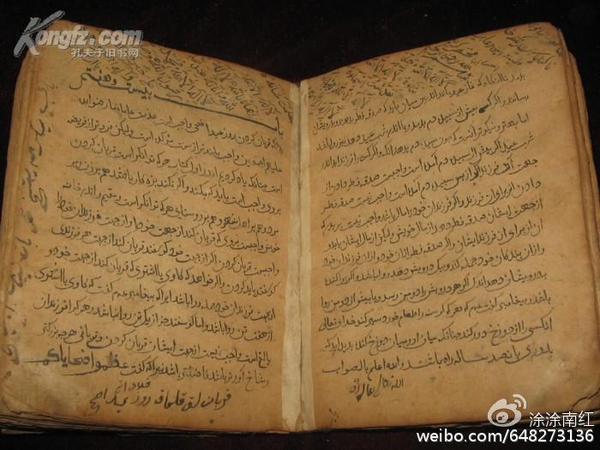
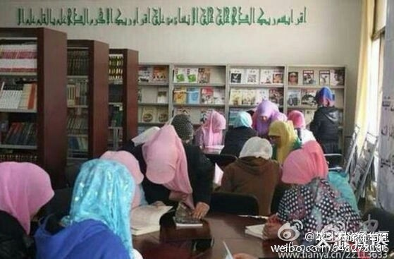
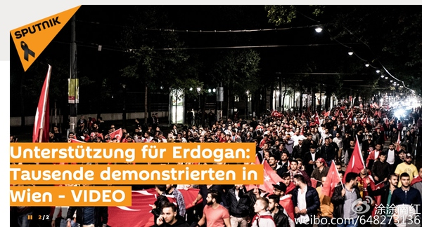
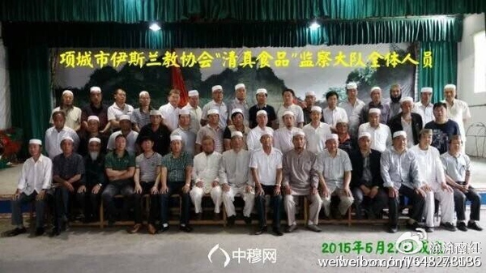
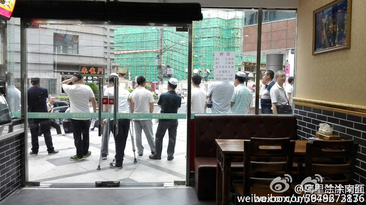

# 无可回避的挑战------中国与伊斯兰

* 作者：[涂涂](https://www.zhihu.com/people/nanhong0)
* 链接：https://zhuanlan.zhihu.com/p/21634807
* 来源：知乎
* 著作权归作者所有。商业转载请联系作者获得授权，非商业转载请注明出处。

## 伊斯兰的普遍困境

当下伊斯兰世界对现代化进程普遍存在“无力感”和“挫折感”，举凡现代化产品的构想、研发和制造，几乎都只有极低的贡献度。虽然人口众多，然而在科技进步、思想解放方面成就极小，因此伊斯兰教徒在“现代化”的语境下，发言权甚小，与其人口规模极不相称（国内国外基本都一样），《古兰经》中所宣称的“真理在手”的先进性、优越性以及“代治大地”的掌控权根本无法得到体现。虽然教义声称有全知全能、特慈普慈的真主可以托靠，然而在现实中却是事事不顺、屡屡挫败，无论是在国家建设还是在对外战争中，往往一败涂地。国家建设的失败或战争的失败产生了大量的穆斯林难民，使得教义宣称的“两世吉庆”着落渺茫，因为“后世”如何无人知晓，而“今世”的失败却显而易见，故而普遍存在焦躁情绪，这种焦灼情绪常常演化为对现代化进程的敌视和仇视，认为“现代化进程”对伊斯兰教徒而言，是个“非友好”的进程，只有扭转现代化的牛头，重回穆罕默德时代，才有机会重现伊斯兰的“黄金时代”。然而，这种让全球开倒车以求伊斯兰的荣耀的诉求，注定是虚幻的妄想，毕竟世界并非为伊斯兰教徒而存在，

伊斯兰教徒依《古兰经》教义，宣称世界为真主所创，并喜欢简单粗暴地将世界划分为“穆”与“非穆”，而归信真主的穆斯林，有种种超越“非穆”的优越权利（例如上天堂、“代替真主治理大地、宽待”非穆并向他们收取人头税等）。伊斯兰教徒喜欢津津乐道地宣称自己人数众多，然而现实是，即使按照“穆”与“非穆”的二元划分，16亿人的穆斯林实际上是少数派，56亿“非穆”人口才是世界上的大多数，而且在社会结构、国家治理、科技进步、文化发展方面，总体实力远远领先于伊斯兰世界。不要说“非穆”的总体实力，从文明竞争的角度，无论是以美国为主的西方文明还是以中国为主的东方文明，任何一个文明的实力都远胜伊斯兰。这种现实上的孱弱使得伊斯兰教义鼓吹的“代治大地”底气不足，至于“仁慈”地统治非穆更是空谈。要命的是，这种差距，不仅体现在现实的实力上，还体现在未来的趋势中。在可预计的未来，无论是西方文明还是东方文明，发展道路都远较伊斯兰文明要宽广和明朗得多。尤其是东亚，无论是中国、日本、韩国、新加坡甚至越南，都在短短几十年里取得了突飞猛进的建设成就，而伊斯兰国家的现实成就及未来则黯淡得多。甚至从社会结构上来说，许多伊斯兰国家可以说仍然是“伪装成现代国家”的封建国家，例如沙特，而另一些伊斯兰国家则干脆是“中世纪部落”的集群而已，例如阿富汗。这样的国家，根本不可能成为现代社会的楷模，富裕的沙特如果石油资源枯竭，甚至连国家的出路都不知在何方。伊斯兰国家大面积的挫折（最直观的是屡次对外战争的失败），使得伊斯兰世界不仅存在着个体“两世吉庆”无从着落的焦躁，同时还存在着“国家向何处去”的焦虑。一部分伊斯兰国家，例如沙特，甚至也幻想用扭转现代化的牛头，输出伊斯兰原教旨主义，将世界重新导入伊斯兰的原始状态，以求重现荣光，重新扮演领导者的角色。**这种从穆斯林个体层面到伊斯兰国家层面都存在的“扭转乾坤”的妄想及其行动，是当今世界伊斯兰暴恐层出不穷的根本原因**（因为他们自己也认为正常竞争几无胜算）。这类暴恐，由于包括了个体自发层面、极端组织层面甚至国家恐怖主义层面，因而此起彼伏，防不胜防。然而这种反人性、反人类的暴恐行为只会招来更多的鄙视和打击。毕竟，暴恐行为更多地是给平民个体造成伤害及恐慌，但根本不可能吓倒一个强大的现代化国家。从国家战争的角度上，伊斯兰势力的战场表现实际上常常成为笑话。

从个体到国家，伊斯兰面对现代化发展，有深深的受挫感。

那么伊斯兰的出路究竟在哪里呢？本来最朴素的回答是：从哪里跌倒，就在哪里爬起来。伊斯兰的挫折，首先是国家建设的失败，然后是由于国力孱弱招致的战争失败或外敌入侵。如果没有国家建设的失败和对外战争的失败，伊斯兰世界也就没有那么多难民，就没有那么严重的“两世吉庆”竟成泡影的焦虑。然而，许多穆斯林极其不愿意承认、始终不愿意面对的是：伊斯兰世界失败的最大原因不在外部，而恰恰就在自己。**毁掉伊斯兰国家的，其实首先就是穆斯林自己，然后才是外因。**

毛泽东说：落后就要挨打。这个世界，因为落后而挨过打的，比比皆是。当欧洲处于中世纪时，实际上是挨相对先进的伊斯兰世界的打；当东方文明自高自大时，则被经历了工业革命的西方国家吊打。然而，不论如何，欧洲凭借文艺复兴，走出了黑暗的中世纪，并开启了数次工业革命；东方文明也先后通过学习西方现代国家，自强而强，陆续都摆脱了一穷二白的困境。然而这种自强而强、咸鱼翻身的努力及成果，在伊斯兰国家所见有限。其中最重要的一个原因是，**当初凭经立教、被奉为至高无上的《古兰经》，在经历了1400年后，已经严重不适应现代社会**。现代社会的进步，首先要求思想解放，然而《古兰经》宣称已经完美，并被“封印”，顶多只能提出不同的阐释，绝不可被修改-----然而，由于1400年的社会变迁，仅仅是提出不同的阐释是解决不了它的“不适应症”的。《古兰经》跟佛经不一样，它不只是思想上的指导，而且几乎是穆斯林从生到死、衣食住行一切行为的指导，它甚至规定了怎么吃（例如不食猪肉）、怎么穿（女性要遮蔽“羞体”）、怎么拜（例如一天五次的礼拜）、怎样做卫生（大小净）、什么情况下要作战和杀戮、什么情况下可以隐藏信仰……等等等等，不仅在思想上并且在无数的行为细节上约束着伊斯兰信徒。现代社会鼓励包容，而伊斯兰强调“穆”与“非穆”正邪分明；现代社会强调男女平等，而伊斯兰禁锢女性，连身体都是“羞体”；现代社会要求有足够的时间来学习新知识新科技，而伊斯兰强调用大量时间来礼拜功修以攒“后世的路费”……从思想到行为，伊斯兰与现代社会格格不入。

伊斯兰部分教义与现代社会格格不入。

以《古兰经》为经典的伊斯兰教，宣称伊斯兰是天启宗教，完美并被“封印”，自立教之初即宣称穆罕默德是真主最后的使者，这实际上是断了伊斯兰与时俱进的进化之路，因为**任何试图修改教义的行为都是离经叛道、死无葬身之地的叛教行为**。然而世界不会因此迁就《古兰经》，当这本1400年前的经书不能适应现代化的发展，又不能进行宗教改革时，伊斯兰世界被现代化远远甩下就是必然。**这种1400年的思想上的差距及由此带来的行为差异，就是伊斯兰落后、并由于落后而产生焦虑和敌视情绪的根本原因，不经历一次宗教革命，事实上无解。**

## 神奇的“自洽性”加强了无解

思想总是有碰撞。现实中“穆”与“非穆”往往会有思想交锋，但当“非穆”试图从思想上“启发”穆斯林时，往往是一场徒劳，鸡同鸭讲，然后不欢而散。

**奇异的是，无论你如何看待伊斯兰教义，无论它怎样不适应现代社会，它自身实际上有相当完备的“自洽性”的。只是这种自洽性是建立在“神是存在的”以及“神的世界凡人不懂”或者说“安拉的意欲无人可知”的基础上的，并非完全是建立在人类的常识和常用的逻辑上。**如果你试图用科学证据或者自然界的证据来证明“真主不存在”，那必定是徒劳的，因为现有的科学成果既不能证实也不能证伪“神的存在”。如果你试图用逻辑诘难的方式来驳倒《古兰经》，**也许能在细枝末节上有微不足道的胜利，但总体是攻不破它的“自洽性”的**。例如，你可以“以子之矛攻子之盾”，引用古兰经的内容来证明真主的能力或许不是全知全能，而是有能力边界的，比如造男人需要泥土和精血，造女人则是从男人身上取了肋骨为材料----这意味着真主创世不仅依赖原材料、不仅需要时间，而且似乎工序上也有先后。但一切诸如此类的诘难、一切“非穆”看来有矛盾或不合理的教义，基本上穆斯林只要一句“这是真主的意欲，真主的意欲非人所知”就足以让你傻眼。**换而言之，在最终的层面上，人的思维无法与不可知的神的思维来争锋， “穆”与“非穆”实际上连辩论的共同基础都不存在**（穆斯林的辩论基础实质是其基本教义：“万物非主唯有真主”。在此基础上伊斯兰能实现理论自洽。你承认这点那就不用辩了；你不承认这点，那也不用辩了。）

真主降示，完美并被封印、绝不可改的《古兰经》

站在现代社会的角度，《古兰经》中的许多教义，比如鼓吹异教徒下火狱、鼓吹征服甚至杀死异教徒、鼓吹圣战和扩张、显而易见地歧视女性等等，无疑是不符合社会的和平与发展需要的。但是由于“真主是无始无终地存在的”、“真主是普慈特慈、绝对正确的”、“真主知道人们不知道的事情，其意欲凡人不可知”等等教义，使得**伊斯兰如有层层金钟罩铁布衫护体，无论你怎么不信服它，都无法整体攻破它，因而也极难从外部改革它。**

伊斯兰的这种学说上的自洽性虽然使它在辩论时能让“非穆”无功而返，然而这种自洽性在现代化的国家建设上毫无用处------正如同你可以滔滔不绝、辩才无碍但解决不了实际问题。所以每当外部世界对伊斯兰提出指摘也好、建议也好，伊斯兰世界总能给你一个说法，然而却改变不了任何事情，尤其是并不能减少越来越多的难民和愈演愈烈的暴恐。往往是辩解之后，噩耗再传，于是再次辩解……

**思想落后，但能自洽；虽能自洽，但却无用；虽然无用，但不可改------这是伊斯兰面临的巨大矛盾。**

## 中国与伊斯兰

对中国而言，伊斯兰传入也已1000多年。应当说，既然它能存在1000多年，自然有其理由，比如它的教义中毕竟也有鼓励行善和互助的内容。但由于其教义的极端封闭，伊斯兰作为外来宗教，中国化的程度是非常低的，几乎可以说是“寄居千年、绝不融合”。部分伊斯兰教徒在血统上和语言上崇拜阿拉伯，自视“高贵”，与“非穆”不同食、不通婚，处处强调宗教的纯洁性，有难以遏制的建立纯洁的“伊斯兰”教区的冲动（历史上曾妄想割据建立伊斯兰国）。一旦国家有难，往往有宗教野心家趁势而起，给国家和民族、当然也给伊斯兰信徒带来极大伤害，这种伤害有时在人口损失上以数千万计，从而极为血腥。

伊斯兰的“中国化”程度很低。出于非常奇怪的心理，信徒会崇拜阿拉伯的语言和一切。

那么在尊重伊斯兰教的前提下，伊斯兰的封闭性可否打破呢？答案是：很难。当你试图与一些穆斯林交流时（并非想灌输无神论），仍然会发现这种交流是十分困难的，原因仍然是**价值观和思维逻辑完全不在一个频道**。比如关于生育，我们很难理解在并不富裕的情况下近乎无节制的生育冲动，但对伊斯兰信徒来说，多生多养是真主喜悦的事情。至于多生多养之后既不能给个体带来幸福也未给国家带来富强，往往是6个难(贫)民变成10个难(贫)民，但穆斯林似乎对此并不在意，反正按真主喜悦的去做就好；非穆建议是否该用更多的时间来搞好学习和工作，但对虔诚的信徒而言，数理化什么的都是并不重要的副科，信教和功修才是至关重要的主科；至于贫困和死亡，对虔诚信徒来说也并不是头等大事，虽然说“两世吉庆”，但显然，能后世能上天堂才是最要紧的，如果要牺牲今世来换后世，那么就换了------想想看啊，用短短几十年的顺从甚至“苦难”，换后世万万年地永居天堂，当然是一本万万利的大赚特赚！所以，常人很难想象伊斯兰信徒为了上天堂会付出什么样的代价，有人说，你用整个世界跟他换，他都不一定换！在这样完全不同的价值观下，别说是你想在思想上“解放”他，恐怕他还在思想上轻视你或者同情你。在这种情形下，实际上，**经济上的扶助和文化上的提升甚至对这部分信徒毫无作用**------这可以解释虽然贫困和失望通常是滋生伊斯兰极端分子的主要原因，但经济和教育状况良好的暴恐/分裂分子也屡见不鲜（本拉登就是典型，他既不缺钱，也有文化、也不是自己想当国王，但是断然就那么“殉道”了！再比如，哈比娅缺钱吗？）。**因此想当然地认为经济改善了、文化提升了，宗教带来的挑战和威胁就不存在了，显然是极为幼稚的。伊斯兰带来的挑战，外显的是暴恐的挑战，但深层次上是文化和思想上的挑战，并不因为你在物质上和文化上对其信徒有所给与和照顾，于是伊斯兰的思想上的挑战就不存在了。**（欧洲对穆斯林难民的福利还不够吗？）

德国收容穆斯林换来的是大规模的骚乱和性侵。认为给与了经济照顾，宗教问题就没了？

既然必须共存，但又很难从思想上“解放”穆斯林，那么我们应该怎么对待伊斯兰呢？ 答： **“宗教的归宗教，法律的归法律，但是法律优先”**。英国人在印度曾经无论怎样都无法说服某些教徒放弃以人为祭的宗教习俗，于是给出了简明的意见：你的教义是以人为祭？OK，我的法律是杀人偿命！只要你拿活人祭祀，那么你自己也别想活了。其结局是，教徒选择了守法而放弃了人祭。

这个经验对我们的意义是：与其指摘其教义的暴力或封闭，不如订好清晰的规矩才是正事。老一辈革命家也早早告诫我们尊重信徒的信仰，不要试图对宗教信徒灌输无神论。

**我们最重要的是，想清楚我们的国家需要什么、社会需要什么，容忍什么，不容忍什么，然后制定法则，昭告天下，各色人等，都必须一体遵行，无论你是无神论者还是什么教徒。但现在的宗教政策和法律法规，显然是有重大缺陷的，甚至不公平到了自虐的地步、优惠到了“剜华夏之肉，补伊斯兰之疮”的地步。**这些类似于“两少一宽”的规定或者“考试加分”或者“大额补助”的政策照顾，**首先是想偷懒，指望用一定的怀柔就应付掉了伊斯兰的挑战。然而我们前面已经说过：并不因为你在物质上和文化上对其信徒有所给与和照顾，于是伊斯兰思想就不会挑战你了。**这种“给你特权，你我和谐”的政策，最好的结果是：部分穆斯林领情，但伊斯兰肯定不会领情，伊斯兰教义并不因为你的怀柔而有任何改变；而最坏的结果是：穆斯林和伊斯兰，通通都不领情！反而加剧了民族问题的不平等，鼓励了将寻常纠纷上升为民宗事件而司法执法部门对此缚手缚脚，不必要地加速了伊斯兰教在少数民族传统聚居区之外遍地开花-----而**帮助伊斯兰教遍地落脚，显然超出了国家的义务和责任。**这是多做的蠢事！不断新建的清真寺，究竟意味着什么？难道仅仅是一个做礼拜的地方吗？看看土耳其就知道了：**清真寺，实际上是伊斯兰版的“支部建在连队上”**！对此如果视而不见，那就是彻头彻尾彻里彻外的鸵鸟政策，是会误国误民的！常见到并没几个穆斯林的地方政府显摆建了个漂亮的清真寺而作为政绩来秀，实在是可笑。政策导向如此荒谬亟待纠偏。

清真寺的动员力！单纯地将它看为一个礼拜堂是幼稚的。

面对伊斯兰，我们应该更加理直气壮一些，我们要明确地表示**“既支持、又限制”**，从信仰自由的角度，我们允许和支持伊斯兰的存在；**同时，我们也要明明白白地强调，从国家利益角度，伊斯兰的部分教义是不符合国家利益、不符合宪法精神、不符合社会进步需要的**（例如政教合一、无节制的生育、歧视和敌视异教徒、歧视女性、不重国法重教法、倾向暴力轻视生命等等），对此，我们应该旗帜鲜明地用法律形式明确地加以限制和禁止，并认真地执行到位，而不是遇到部分人一鼓噪“宗教自由、少民权利”，于是又习惯性地妥协了。

**我们要强调的是“平等”和“守法”，要强调“宗教既不是法外之地，也不是违法行为的庇护伞和减罪卡”。**重复一遍：我们再也不应提供民宗特权以赎买和谐（这是典型的假和谐），或者幻想帮助发展了经济、帮助提升了文化于是伊斯兰思想的挑战就没了。伊斯兰的挑战，始终需要我们持续面对，无巧可取。而当下最要紧的事一是**严肃检讨包括《城市民族工作条例》在内的有关的民族宗教政策，从公平、公正、合理的角度来立法立规，而不是试图取悦部分人来化解宗教思想带来的挑战；**

二是要**反复强调绝不允许以教法和私法干预社会，坚决打击宗教抱团式的违法违规，要真正做到有法必依、执法必公。没有法律不敢管、管不了的小团体。**

务必遏制这种以教法监察社会的行为！坚决遏制政教合一的冲动和试探！

绝不允许以清真名义以私法欺行霸市！

三是**对已经存在的照顾政策要进行认真的审视，该取消的取消（例如莫名其妙的高考加分-----高考是为国选材，不是大家分果果！）、该限制的限制（例如阿拉伯化的苗头）、该执行的执行（例如公平地依法进行计划生育工作）。**

宗教信徒的计划生育工作也必须依法开展！不能只是汉族搞计生。

中国绝不允许出现宗教警察！

要做好这些工作，显然比处处给糖给红包要累多了，更可能会遇到抵制和反弹。但这些才是真正要做的事情，而且也是躲不过去的------捂盖子、假和谐，能躲过初一，难道还能躲过十五吗？你看欧洲躲过了没有？
