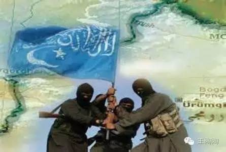
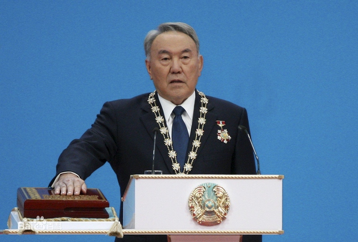
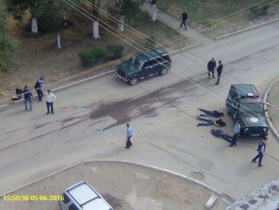
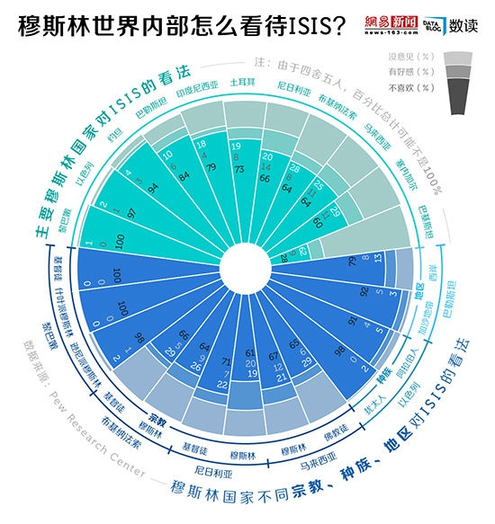
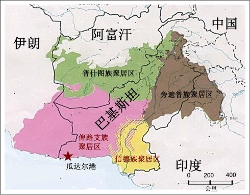
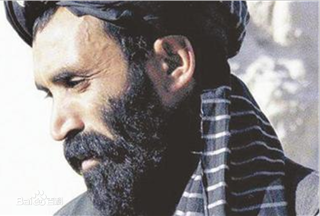
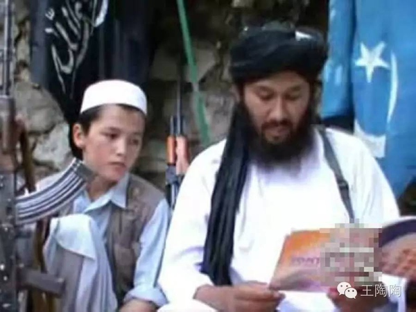
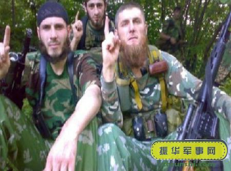
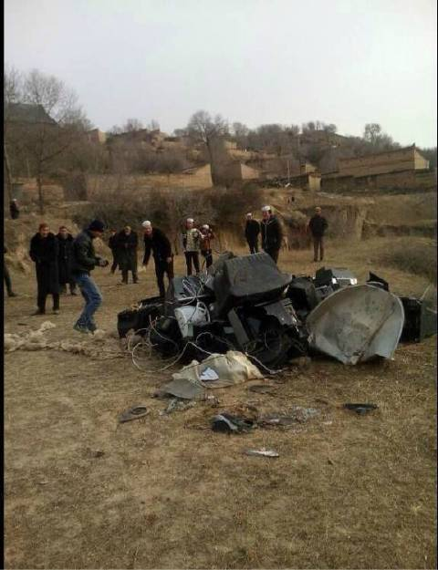

# 中国未来最可怕的祸患在于新疆

* 作者: [王陶陶](https://www.zhihu.com/people/wang-tao-tao-91-97)
* [原链接](https://zhuanlan.zhihu.com/p/22260233)

中国未来最大的祸患在哪里？

尽管南海问题备受瞩目，美日对华不吵不休，台湾香港时常鼓噪，这些问题看起来严重，但是长远来看，其对中国的实质影响是相当有限的，随着时间的推演，中国处理这些问题的筹码将越来越雄厚，解决此类问题的能力也将越来越强。

实际上，中国未来真正的祸患在于约占中国领土面积六分之一、却在内外交困中日益脆弱的新疆。因为，从长远来看，引发新疆问题的内外肇因或将愈来愈不可控，而该难题所造成的后果也将愈来愈严重。

**一方面，新疆的地缘环境在未来十年内很可能急剧恶化，伊斯兰恐怖主义等不稳定力量将会在新疆周边国家越来越得势，并将通过广阔的边境向新疆进行猛烈地渗透。**

随着美国在阿富汗的不断撤军，腐败软弱的阿富汗政府将进一步失去对局势的控制。毫无疑问，阿富汗将沦为塔利班和ISIS等伊斯兰极端势力的乐园，并一如既往地向包括新疆的周边地区扩散其激进意识形态。

中亚地区最重要的地区大国哈萨克斯坦，其76岁的领导人纳扎尔巴耶夫自1990年起已经担任该国总统26年，身体早已不如往昔。不过，哈萨克斯坦并没有建立稳定的政治制度，这个民族成分极为复杂的新生国家，很大程度仰赖纳扎尔巴耶夫个人的威望和政治技巧维系在一起。曾经被视为纳扎尔巴耶夫继承人的两位女婿阿利耶夫和库利巴耶夫，一个被无情驱逐，一个则遭到冷遇，实际上，该国正处于后继无人的窘境。同时，哈萨克斯坦国内的伊斯兰极端主义随着贫富分化的加剧，近些年也越来越严重——这也意味着当老总统去世之后，哈萨克斯坦乃至整个中亚地区的稳定都将面临巨大冲击。

**西部俄罗斯少数民族的分离企图、国内蠢蠢欲动的恐怖主义势力，都在静静地等待纳扎尔巴耶夫的死亡**

**2016年6月5日，哈萨克斯坦阿克托别市发生恐怖袭击，造成17人死亡——这只是近年来发生在该国的恐袭事件中的一起**

作为世界上人口增长最快的国家之一，巴基斯坦特别是西北部普什图族的人口数量，已经远远超出了该国凋敝经济的承受力。在人口压力的冲击下，腐败、原旨主义和贫富差距，使得该国的恐怖主义在西北部愈来愈失去了控制。塔利班甚至isis和东突在其西北部来去自如，肆无忌惮地将这里作为后勤地或者训练场；基地领袖本拉登和塔利班首领奥马尔则在巴基斯坦堂而皇之地隐居下来。从长远来看，巴基斯坦效率低下且三心二意的政府将无力制服反叛者，极端势力在巴基斯坦的破坏力和影响力将会不断壮大。

**数据显示，巴基斯坦是世界上对宗教极端主义最为热衷的国家**

**复杂的族群结构使得巴基斯坦并非一个天然国家，这个国家主要依靠伊斯兰教凝聚在一起，这也使得其必须拥抱伊斯兰教意识形态**

**2011年，时任CIA的局长帕内塔宣称情报显示奥马尔正位于巴基斯坦卡拉奇市的阿迦汗大学附属医院治疗**

种种事实表明，新疆周边的地缘秩序将会进一步地崩塌，而伊斯兰极端主义将会在混乱的废墟上得以壮大，而新疆漫长的边境如同毛细血管一般，将为极端分子和极端思想的渗入提供最佳的管道。

**另一方面，随着新疆地区人口结构的迅速变异和正常民间外来投资的流失，新疆地区将进一步演化为极端势力孕育的温床。**

由于主要针对汉族之计划生育政策的执行，使得新疆的族群结构在不远的将来陷入前所未有的失衡。根据2012年新疆维吾尔自治区统计局的《新疆统计年鉴》，2011年汉族的人口约占新疆总人口的38%，但与此同时，汉族新生儿却急剧下降到新疆新生儿总数的17%，这一纸面数据，事实上并未排除大量东迁却持有新疆户籍的汉族人口。

恐怖袭击的频发和安全形势的恶化，使得民间投资日益视新疆为畏途，导致了大量私人资本和与之对应的就业岗位的不断东迁。而国家资本的对口援疆，在创造一定的就业机会的同时，也因为大量货币的涌入造成了较为严重的通货膨胀。

安全上的恐暴隐患、生活上的就业难和物价高、政策上的户籍不便与对少数民族的倾斜，都在迫使新疆的汉民大量逃离。2014年3月，《纽约时报》中文网刊登了新疆喀什人王茜的文章《把我知道的新疆说给你听》，详细地描述了恐惧与无奈之下，一个新疆普通汉民被迫逃离新疆的心路历程——这也是相当部分新疆汉人的普遍心态。

事实上，那些手持简陋武器的宗教圣战士和宣扬极端主义的地下阿訇，绝非可以被轻易低估的对手，因为他们不但极其狡诈、残忍，而且并不缺乏夺取最终胜利的野心、意志和远见卓识。这些疯狂的好战分子身经百战，其务实而冷血的大脑远比官员、媒体和知识分子更能洞察到新疆问题的本质——新疆的未来决定于新疆的人口比例结构。

这些恐怖分子通过一系列残酷事实，充分地意识到：只要新疆的汉族人口比例足够高，那么就永远不会有新疆的分离问题；反之，只要新疆的汉族人口比例足够低，那么新疆就一定会紧步俄罗斯的车臣和塞尔维亚的科索沃的老路。这是任何温情感人的事迹都无法抹杀的政治铁律，也无关任何道德与情怀。

连续恐暴的目的就在于此，通过不断的杀戮和流血制造足够的恐慌，迫使企业和汉族人口大量东逃，最终在族群上彻底统合新疆。实际上，从近年来新疆汉族人口流失的情况来看，圣战士们正在简单高效、有条不紊地锁定成功。

就像通过那些并不遥远的前例所看到的那样：在塞尔维亚的科索沃，伊斯兰科索沃解放军游击队通过大规模恐袭迫使当地的塞尔维亚人大量逃离，最终对科索沃实现了人口置换；在俄罗斯的车臣，当地圣战士以无序屠杀的方式袭击当地俄罗斯人，迫使接近当地一半人口的俄罗斯族不断逃亡，在短短的十年时间里，将车臣变成了一个完全车臣化的地区。到了那个时候，即便政府的军队击败了分裂势力的反抗，也最终一定会永远失去这些地方，因为人口结构改变了，有效统治也无从谈起——如今，车臣的统治者乃是车臣军阀卡德罗夫，而非俄联邦的政府。

**东突恐怖分子发出恐袭威胁**

**车臣恐怖分子通过不停地威胁和暴恐，迫使当地的俄罗斯族大量逃离车臣，最终使得车臣完全车臣化。即便俄罗斯拥有雄兵百万，现在也只能靠卡德罗夫的独立王国勉强维持个脸面而已。**

新疆宗教分离势力的威胁还远不及此，它的成功很可能会刺激中国大西北日益强悍的宗教势力的野心。毕竟，极端意识形态的传播从来都是病毒式的，考虑到西北部分宗教力量在教民中已经取得丝毫不逊于当地政府的政治威望和组织能力，那么，新疆问题的恶化将很可能会引发无可挽回的地缘灾难。

先哲有云：“见端知末，查微知著”。古往今来，那些真正的祸患往往孕育于无形，噬人的猛兽则常常潜伏于草丛。在问题未发时处理的代价，远比酿成大祸后小，而讳疾忌医，则必然祸之不浅。

而新疆问题的本质，并非某个政党存亡的问题，也不是某个政权存亡的问题，而是五千年文明之中国存亡的问题。她关系着中国文明的生死，影响着子孙后世的未来，容不得一丝一毫的推卸和掉以轻心。

**最后，向奋战在反恐前线的百姓、干部和战士们致以最崇高的敬意！**

**根据临夏城市生活综合门户网站的报道，甘肃省东乡县汪集马奇清真寺，以电视机违背教义为由，收缴了当地穆斯林家中的电视机统一烧毁**

**德高望重的马有德阿訇死后，至少十五万穆斯林自发参加了葬礼，规模之大令人震惊**

++++++++++++++++++++++++++++++++

逐步推出现代马基雅维利思维政治《无可匹敌的力量——群众运动》 ，欢迎关注公众号。
