# 西班牙是如何驱逐穆斯林的？ - 卡夫卡斯的回答 - 知乎

* 作者：卡夫卡斯
* 链接：https://www.zhihu.com/question/47582639/answer/106673460
* 来源：知乎

历时一个多月后，本文终于彻底完工了，大致为读者勾勒了西班牙驱逐穆斯林的历史，全文如下：

## 一、背景

伊比利亚半岛的穆斯林主要是在阿拉伯人征服伊比利亚半岛后形成的，在阿拉伯帝国时期，阿拉伯人与柏柏尔联军基本就上攻下了这个半岛，基本上只有北方的山区仍为基督徒控制，半岛上的居民也大量改宗，这一地方的穆斯林主要来源就是“非常少的撒哈拉以南的黑人+少量的阿拉伯人+稍微多一点的柏柏尔人+改宗的本地居民”，值得注意的是，这里的本地居民中不仅仅是半岛南方的居民，也包括了一些加泰罗尼亚人的先民与当时已经形成的巴斯克人。

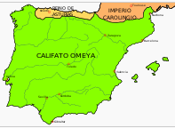

绿色代表伍麦叶王朝时期穆斯林控制的伊比利亚半岛区域

在几个世纪里，伊比利亚半岛都是穆斯林统治的土地，在鼎盛时期，在穆斯林的控制区内，穆斯林占比超过了80%，有超过500万穆斯林。也就是说，这里的伊斯兰化的深度高于同期的黎凡特，乃至后来的巴尔干、高加索与南亚等地。

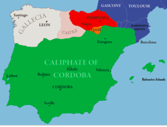

绿色代表公元1000年左右，处于鼎盛期的安达卢斯（伊斯兰的伊比利亚），绿色区域内穆斯林占比超过80%，这一区域包括了里斯本、萨拉戈萨、马德里等名城

后来穆斯林政权衰落，贵族们腐化严重，四分五裂成为泰法诸国，北方的基督教政权也就相应南下，开启了所谓的再征服运动，初期，北非更虔诚的两支穆斯林先后北上，一度相对完整地统一了穆斯林地区，并抵御了北方基督徒一段时间，但是并未成功，在相对拉锯的总体形势下，基督徒仍然系统性地朝南推进。在这整个数百年的过程中，大约一共有300万穆斯林改宗了基督教（作为类比，伊拉克在1920年的人口仅有300万），没有改宗的逃难至北非或者半岛南方的最后一个穆斯林政权格拉纳达。

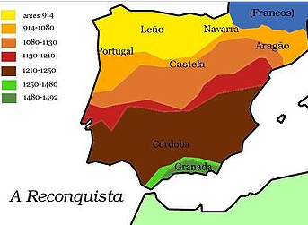

再征服运动的时间线在空间上的反映

其实，再征服运动在蒙古消灭南宋时期就大致已经完成了，只剩下格拉纳达的最后一个穆斯林政权，但它奇迹般地再挺了近200年，直到拜占庭灭亡后还挺了近50年。在格拉纳达被征服的时候，半岛上仍然信仰伊斯兰教的民众已经不多了，他们又被强制改宗——大致在15世纪晚期，格拉纳达被征服时仍信仰伊斯兰教的民众的后代，才是历史意义上的摩里斯科人，他们与整个再征服运动中改宗的穆斯林并不完全等同。中文网络，乃至张承志的《鲜花与废墟》一书中所述超过100万西班牙穆斯林遭驱逐，应当是整个再征服运动中被驱逐的人口，被驱逐的摩里斯科人一般认为在30万左右。

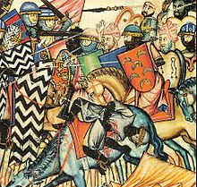

这幅画表现了再征服运动期间的一次大战，右侧的穆斯林一方绘出了8位骑士，从样貌上观察，其中1位是黑人，1位接近于北非人，其余的穆斯林骑士均为白人

在讨论摩里斯科人长达100多年的挣扎史时，不能不提到奥兰法特瓦，这一法特瓦在1504年发布，以发布地北非奥兰为名。该法特瓦是针对陷入强制改宗危机的西班牙穆斯林所发布，放松了传统沙里亚对于穆斯林的要求，允许穆斯林在公开场合装作信仰基督教，做伊斯兰教法所不允许做的事情，以便能够在充满敌意的社会中生存下来。法特瓦的主要内容是放松了对礼拜、慈善、净身、朝觐等方面的要求，甚至允许穆斯林像天主教徒那样礼拜，允许他们接受洗礼，食用猪肉与酒。 对于安达卢斯的穆斯林而言，法特瓦非常宽厚，他们的礼拜可以以眼神的形式履行，天课可以以对一个乞讨者施以同情的目光继续，等等。法特瓦还允许穆斯林忽略掉每日五次的礼拜，在夜间一起弥补，允许他们大量采用土净的方式清洁，甚至以用眼神看着那些清洁的物体，就算在礼拜前净身工作的完成。法特瓦允许穆斯林消费酒与猪肉，以及其他被沙里亚禁止的东西，甚至允许穆斯林公开参加基督教的弥撒等仪式，只要他们内心认为这是“非法而且迫不得已的”。一般认为，在摩里斯科时期，他们正是以奥兰法特瓦的形式实践伊斯兰教的——虽然这与传统的伊斯兰大为迥异。

此图有6位摩里斯科人后裔，6位西班牙人，你能把他们区分出来吗？（标A的是摩里斯科人后裔）

## 二、摩里斯科人在被驱逐前的分布

摩里斯科人的分布地主要是在南方的安达卢西亚、瓦伦西亚地区与入海口靠近巴塞罗那，贯穿阿拉贡王国的伊波拉河地区——他们在格拉纳达一度占据多数，在瓦伦西亚王国占人口的三分之一，在狭义的阿拉贡王国占六分之一，在整个伊比利亚部分的阿拉贡王室领地占总人口的20%，同样散居在整个卡斯提尔王国，虽然西班牙的美洲殖民地原则上不允许摩里斯科人移民，但他们事实上也渗入了美洲。

在格拉纳达陷落时，西班牙全境的人口大约在700-800万间，而穆斯林的人口一般认为是50-60万。格拉纳拉陷落时，西班牙全境内，大约一半的穆斯林居住在过去的格拉纳达埃米尔国境内，另一半穆斯林接受着阿拉贡王室的统治，而在卡斯提尔王室领地里只有2万。

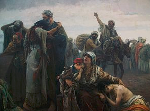

被驱逐出伊比利亚的摩里斯科人

格拉纳达地区在伊斯兰化前，已经是伊比利亚半岛罗马化最深的地区之一，当地的穆斯林基本上都是本地居民改宗，也深受古罗马文化的影响，不少人的祖先可以直接追溯到罗马时期的贵族，但他们的“西班牙化”程度却是最低的，那里的摩里斯科人曾多次造反，第二次大规模的造反大约发生在摩里斯科驱逐事件之前40年的1568-1571年间，这次造反被镇压后，他们就被驱逐到西班牙境内的其他地方，大约两代人后便迎来了最终的流放，值得注意的是，他们仍然会使用阿拉伯语。

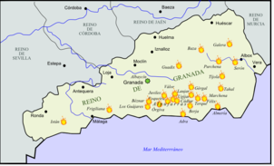

在1568-1571年间，格拉纳达地区的摩里斯科人点燃了起义的烽火

瓦伦西亚王国的摩里斯科人主要居住在王国东部与瓦伦西亚城区，他们以灵活使用阿拉伯语与西班牙语乃至瓦伦西亚方言著称，也以其信仰虔诚知名，瓦伦西亚在事实上是摩里斯科时代西班牙穆斯林的中心城市，尤其是在格拉纳达的摩里斯科人被流放至全国其他地方之后，这一地区的穆斯林宣教团会深入西班牙境内的其他摩里斯科社群宣教，他们也凭借靠海的优势，与奥斯曼帝国乃至北非的柏柏尔海盗建立了联系，值得注意的是，由于经济方面的竞争，瓦伦西亚的摩里斯科人与其他居民间存在着较强的敌对关系。

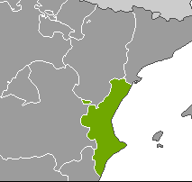

属于阿拉贡王室领地的瓦伦西亚王国领土

在狭义概念上的阿拉贡地区，这里的摩里斯科人主要是本土改宗的穆斯林后裔，包括巴斯克穆斯林后裔、加泰罗尼亚穆斯林后裔与柏柏尔人等殖民者混合而成，他们并不使用阿拉伯语，由于他们与当地领主的关系良好，事实上他们可以相对公开地实践自己的信仰。

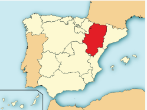

红色部分即为狭义概念上的阿拉贡地区

卡斯提尔的摩里斯科人主要散居在一些城镇之中，注意的是，摩里斯科时期的卡斯提尔已经包括了巴达霍斯地区与安达卢西亚的大部分土地。这一区域的摩里斯科人也相当多，他们主要还是居住在南部刚并入卡斯提尔王国的地区，但也散落在北方，甚至在西班牙统一后渗入了历史上几乎从未被穆斯林征服的阿斯图里亚斯地区。在卡斯提尔，摩里斯科人的主要聚居区有比利亚鲁维亚-德洛斯奥霍斯、阿瓦雷洛与奥尔纳乔斯，等等，在这些地方他们占据了当地居民的多数，甚至所有的居民都是摩里斯科人。卡斯提尔的摩里斯科人高度融入当地社会，与“老基督徒”很难区别，他们不说阿拉伯语，不少人已经成为了虔诚的基督徒。格拉纳达的摩里斯科人被驱逐至卡斯提尔后，与当地的摩里斯科人也是矛盾重重，事实上，卡斯提尔的摩里斯科人与“老基督徒”的通婚远多于他们与格拉纳达摩里斯科人的通婚。在整个卡斯提尔的摩里斯科社群中，唯一的例外是位于巴达霍斯地区的奥尔纳乔斯，这里的居民几乎全是摩里斯科人，由于多山环境的防御，他们也相对公开地实践伊斯兰信仰，事实上，日后卡斯提尔王国驱逐摩里斯科人的重心就是奥尔纳乔斯，而这里的摩里斯科人也被允许全副武装的离开故土，并在摩洛哥的拉巴特城郊建立了塞拉共和国（这一共和国主要业务是海盗活动，他们的第一位总统竟然是一位改信伊斯兰教的荷兰人）。

摩里斯科时期的卡斯提尔王室领地，黑线部分是最后吞并的格拉纳达

大西洋中的加那利群岛也有“摩里斯科人”，这里的摩里斯科人在来源上与半岛迥异，他们不是伊比利亚穆斯林的后代，而是基督徒海盗劫掠北非穆斯林居民时所获的奴隶，或者柏柏尔海盗侵犯加那利群岛时被当地居民抓获的俘虏。在这一群岛中，被俘虏的穆斯林主要充当奴隶，日后逐渐改信了基督教，并融入当地居民之中，甚至充当西班牙劫掠他们北非家乡时的向导。加那利群岛的摩里斯科人并未遭到驱逐，他们在兰萨罗特岛中占据了近半人口，日后也大量移民美洲。

殖民美洲后，西班牙并不允许摩里斯科人移民美洲，但是事实上仍有不少摩里斯科人到达了美洲，第一批殖民智利的西班牙人便包括了摩里斯科人，在1560年的秘鲁，更有多位当地的民众因为传播伊斯兰教而遭遇酷刑。在西班牙驱逐摩里斯科人时期，事实上有部分摩里斯科人前往了美洲殖民地，尤其是墨西哥，但他们最终也彻底融入了新大陆的居民之中，彻底丧失了族群的认同。值得一提的是，由于摩里斯科人在事实上也参与了西班牙对美洲的殖民，他们对于跨大西洋的航线并不陌生，在被驱逐之后，不少摩里斯科人加入了柏柏尔海盗，柏柏尔海盗也由此受益，他们甚至多次深入美洲，抓捕印第安人为奴。

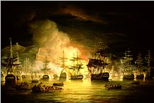

北非的柏柏尔海盗团，北至冰岛，南至阿根廷，西至纽芬兰，都曾遭受过柏柏尔海盗的劫掠

## 三、驱逐摩里斯科人

在今天，西班牙驱逐摩里斯科人并不是一个陌生的议题，事实上百年之前，在中国人最早开眼看世界的《瀛寰志略》一书中，徐继畲便记录了这一事件，徐先生在此书中对伊斯兰教并不友善，但他对这一事件的评价仍是负面的，这倒是与今天中文网络上相当一部分人的观点大相径庭。

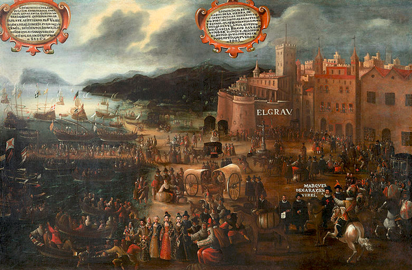

瓦伦西亚驱逐摩里斯科人

在被驱逐前，格拉纳达的摩里斯科人已经发动了数次起义，在最后一次大规模起义失败后，这一地区的摩里斯科人遭受了强制迁移，他们被迁移至卡斯提尔王国的其他地方，当时的菲利普二世国王希望这样可以加强对摩里斯科人的同化进程，毕竟在再征服运动中，西班牙已经同化了数百万穆斯林。这在事实上，也对格拉纳达的摩里斯科人发挥了一定的作用，但对于瓦伦西亚与阿拉贡，情况却截然不同，在那些地方，伊斯兰仍然相对公开地得以实践，族群间的关系也相对西班牙其他地方显得更加紧张。

大概在同一时期，由于尼德兰地区新教徒锲而不舍地反抗，西班牙承认了这一地区的主权转移，而奥斯曼帝国也继续朝西挺近，希望能够到达罗马城下。在过去，西班牙的统治阶级往往热衷于强调西班牙在保卫天主教王国中的重要地位，而在尼德兰的失败反倒使得贵族们更加激进，他们更希望重燃西班牙的荣光。与此同时，在新教徒们批判西班牙的理论中，便包括“西班牙曾被穆斯林污染”，“西班牙国内仍有大量秘密穆斯林”的论点，无疑的，一部分西班牙贵族接受了新教徒敌人的观点。此外，在17世纪最初一段时间，由于美洲殖民地内产金的下降，西班牙境内爆发了经济危机，这进一步加深了国内在就业市场等领域，摩里斯科人与其他居民的竞争关系。

对于当时的西班牙而言，伊斯兰是应当被铲除的威胁，这点可谓全国共识，然而，如何对待摩里斯科人，各方观点却不明确，毕竟摩里斯科人已经在名义上成为了基督徒。一部分贵族认为应该给予摩里斯科人更多的时间来同化他们，使他们成为“完全意义上的基督徒”，这样的观点也被罗马教会所认同。

最热衷于捍卫摩里斯科人是瓦伦西亚与阿拉贡地区的贵族，因为这涉及到贵族们自身的经济利益，这些贵族能够从当地摩里斯科人提供的廉价劳动力中获得大量经济利益。而反对的观点则涉及到大量具体观点迥异的贵族与不同阶层的平民，包括瓦伦西亚的宗教裁判所长官，他多次要求菲利普三世国王终结摩里斯科问题，甚至提出了大屠杀的议案。最开始，这些观点并未得到决策层的认同，在1596年，菲利普三世的财政长官莱尔马公爵便正式指控摩里斯科人与柏柏尔海盗勾结，这样的指控声浪已经在民间存在了很长时间。然而，尽管很多人持有这样的观点，仍有很多人为摩里斯科人辩护，包括阿拉贡地区的政务会，他们认为“即使摩里斯科人希望背叛西班牙，他们也没有实现这一目的的手段”，但是，莱尔马公爵继续坚持他个人强烈的反摩里斯科观点。最终，在认为摩里斯科人是“异端和叛徒”的瓦伦西亚大主教帮助下，莱尔马公爵说服了菲利普三世国王，大主教还提出了更具煽动性的计划，比如国王可以没收摩里斯科人的财产和土地，这样可以增加王室的现金流，大主教同样鼓励国王将摩里斯科人贬为奴隶，但这样的提案被国王拒绝。决策层达成共识后，在1609年，对于摩里斯科人的驱逐正式开始了。

驱逐摩里斯科人主要发生在1609（瓦伦西亚）-1614（卡斯提尔）之间，当时的西班牙国王是菲利普三世，驱逐的主要原因是担心摩里斯科人与奥斯曼帝国以及法国南部的胡格诺派教徒勾结。在驱逐摩里斯科人时，当时官方的数据中，被驱逐的摩里斯科人大约是30万，占了西班牙全国人口的4%，驱逐最严重的地区是瓦伦西亚王国，当时，阿拉贡与瓦伦西亚的当地贵族极为反对这一驱逐，因为摩里斯科人为当地提供了相当程度的税源，但是在西班牙加强中央集权的大背景下，这一反对并未能够起到实际性影响。被驱逐的摩里斯科人的确大量前往北非，但也有相当部分摩里斯科人前往了法国、意大利与德国，其后他们要么留在当地，要么又前往北非，或者秘密潜回西班牙，马赛一度作为中转站，接纳了超过3万摩里斯科人。事实上，被驱逐时，相当多的摩里斯科人已经成为了虔诚的天主教徒，但这并未能够改变他们的命运，有部分摩里斯科人前往了法国等天主教国家并融入当地，但也有为数不少的摩里斯科天主教徒被驱逐至北非，并因为不肯改信伊斯兰教而在当地遭到迫害乃至殉难。

被驱逐至北非后，摩里斯科人大量参与海盗活动，由于这些熟悉欧洲甚至美洲情况的民众的加入，柏柏尔海盗的声势进一步壮大，深谙西式武器与战法的摩里斯科人也使得北非的军事能力得以加强，为摩洛哥摧毁桑海帝国出力不少。而驱逐摩里斯科人，也导致西班牙丧失了大量劳动力与税源，尤其导致瓦伦西亚地区经济出现严重的经济衰退；被驱逐的摩里斯科人，由于熟稔欧陆局势，除了参与针对西班牙的海盗活动之外，也为英国与摩洛哥之间的同盟穿针引线，在一定程度上促使西班牙丧失地中海海权，乃至最终把对海洋的掌控转移至英国，国际史学界普遍认为这是失策的举措。

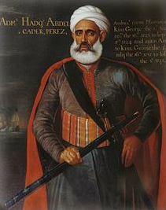

阿卜杜卡德尔·佩雷斯，乔治二世时期的摩洛哥驻英国大使，他的姓氏表明了其摩里斯科后裔的身份，他在任期内进一步加深了英摩关系

北非的摩里斯科人在今天已经基本上融入了当地社会，但在他们刚进入北非时，迥异的文化背景使得他们与当地格格不入，他们基本上只在内部通婚，同时深以自己的“安达卢斯来源”为傲，他们仍然继续说着在西班牙时说的语言，包括西班牙语、加泰罗尼亚语、巴斯克语，等等，并谨慎地保存着自己独特的文化，直到大致法国大革命时期，这些摩里斯科人才全部改用阿拉伯语。

虽然法国、意大利等国也接受了少量摩里斯科人，但他们最主要是去处还是穆斯林世界，奥斯曼帝国官方对他们持欢迎态度，他们也大量定居于君士坦丁堡、萨洛尼卡、萨拉热窝等名城。不过，整体而言，摩里斯科人的最重要去处还是北非。有8万摩里斯科人前往了摩洛哥，他们主要来自卡斯提尔王国，例如，奥尔纳乔斯一城的所有摩里斯科人都前往了拉巴特。阿尔及利亚地区则主要接纳了12万摩里斯科人，他们主要来自瓦伦西亚，这批摩里斯科人的命运相对悲惨，他们并未遭到当地居民的热烈欢迎，而时常为当地的游牧部落所劫掠，第一批被流放的摩里斯科人就选择前往阿尔及利亚，但他们几乎在到达这里的同时就遭到了当地部落的攻击。大概有8万摩里斯科人前往了突尼斯，对于这个小国而言，这是一个相对庞大的数字，这批摩里斯科人主要来自阿拉贡王国，也有少部分来自卡斯提尔与瓦伦西亚，他们收到了热烈的欢迎，并融入了当地自13世纪起便存在的安达卢斯社群之中（那一批社群是较早移民的伊比利亚穆斯林，主要来自塞维利亚与瓦伦西亚），摩里斯科人的到来，在相当大程度上促进了突尼斯经济的发展，同时，在很大程度上，突尼斯也成为了摩里斯科人在被流放后的智识中心。

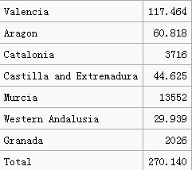

此表来源于法国学者对于被驱逐的摩里斯科人口的调查，绝对数量不一定准确，低于被最普遍接受的30万这一数字，但是地区的比例相对精准。这位学者认为一共驱逐了27万摩里斯科人，而瓦伦西亚一地就驱逐了近12万，狭义的阿拉贡地区驱逐了6万，两者相加后，阿拉贡王室领地一共驱逐了18万摩里斯科人，占被驱逐总数的2/3。

## 四、对于驱逐数量的争议

传统史料中，一般认为西班牙完全驱逐了摩里斯科人，至多也只有1万摩里斯科人留在西班牙。而现代对各国史料的深入发掘，认为避免了被驱逐命运的摩里斯科人比想象中的高得多，这里感谢 @姜委员长提供的信息，比如充当宗教人士的摩里斯科人不用被放逐，等等——事实上，正如前文所述，很多摩里斯科人已经成为了事实上的天主教徒。

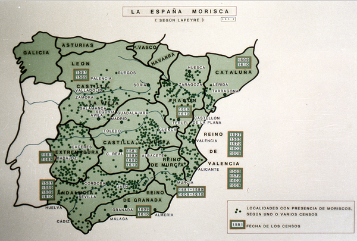

通过现代研究还原的被驱逐前摩里斯科人在西班牙的分布情况，绿点代表摩里斯科人的分布。由于起义被镇压后遭到了强制迁移，格拉纳达并没有太多的摩里斯科人。同时，尽管阿拉贡王室领地内的摩里斯科人几乎被全数驱逐，但卡斯提尔王室领地内的摩里斯科人却大量地避免了被驱逐的命运

被驱逐前的摩里斯科人数量一直是学术研究的重点之一，一般认为，在格拉纳达陷落之际，西班牙全境约有50-60万穆斯林，而现代的研究则认为16世纪初期的摩里斯科人数量可能高达100万，而在一个世纪之后，摩里斯科人遭到了驱逐，其人数约为30万。考虑到再征服运动中，在“摩里斯科人”这一概念形成前，已有数百万穆斯林改信了天主教，我们有理由认为摩里斯科人的数量多于实际被驱逐的数字。

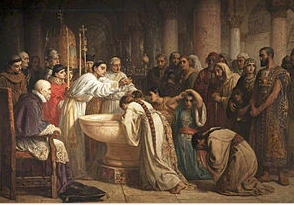

格拉纳达的摩里斯科人接受天主教洗礼

2007年，便有学者对驱逐摩里斯科事件重新进行深入研究，他以当时摩里斯科人占据多数的比利亚鲁维亚-德洛斯奥霍斯为例，发现当地的居民经历了3次放逐，但是要么成功避免了被驱逐的命运，要么在被驱逐后又返回原乡，并被他们并非摩里斯科人的邻居保护与隐藏起来。这一研究对于摩里斯科人研究具有革命性意义，此后的相关研究也越来越多，发现事实上不少摩里斯科人不仅在非摩里斯科邻居（这些邻居很有可能祖先也曾是穆斯林，只是在15世纪晚期前家族即已改宗）的保护与隐藏下成功避免了被驱逐的命运，即使在被驱逐后，他们也大量秘密地从北非、葡萄牙、法国等地返回原乡。后来，还有大量历史文献被发掘出来，包括1628时，新上任的西班牙国王菲利普四世要求塞维利亚地区不要再驱逐摩里斯科人的指令，以及格拉纳达地区许多富贵家族隐藏其族源的记录，等等。

巴达霍斯地区对于摩里斯科人的驱逐更是相当失败，不仅因为奥尔纳乔斯的摩里斯科人在摩洛哥建立了相当程度上专门针对西班牙的海盗共和国，更因为当地其他地区的摩里斯科人，基本上都在当地民众乃至政府官员社会性的支持下留在了原乡，在巴达霍斯，除了奥尔纳乔斯，很多地方的摩里斯科人与其他民众的关系都非常好（巴达霍斯位于西班牙南方，非摩里斯科人的民众，其祖上也有极高的可能性曾是穆斯林），官员们对王国的政令也是阳奉阴违，由于靠近葡萄牙，这一地区的摩里斯科人也往往短暂的前往葡萄牙避难，风头一过即返回原乡，在这一有着大量摩里斯科人的地区，除了奥尔纳乔斯，其他地方的摩里斯科人基本上没有受到太大的影响。

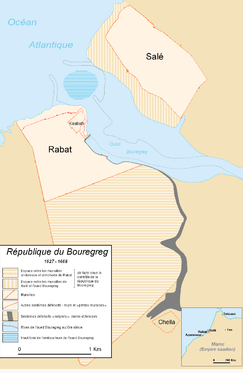

位于摩洛哥西部大西洋海岸的塞拉共和国，塞拉与拉巴特旧城隔河相望，并且已经成为了今天摩洛哥首都拉巴特都市区的一部分

同样的情况也发生在穆尔西亚南部，穆尔西亚地区在格拉纳达与瓦伦西亚之间，其南部的很多地方，摩里斯科人占据了人口多数，在驱逐令下达的时候，穆尔西亚的摩里斯科人紧密地团结在一起，他们靠着与邻居间良好的关系与错综复杂的家族关系网络结成了紧密的社会-经济屏障，虽然他们仍然遭到驱逐，但是为他们保留了驱逐后重返原乡的可能性，事实上这一地区的摩里斯科人中，有很多人在驱逐后上仍回到了原乡（《堂吉诃德》一书中桑丘的朋友里科特，正是穆尔西亚的摩里斯科人，书中也有他与很多同伴返回西班牙的记载——根据当代对塞万提斯的研究，更是表明他有相当大的可能性祖上是科尔多巴的穆斯林，当然由于在格拉纳达陷落时已经成为了天主教徒，也因此并不属于“摩里斯科人”）。

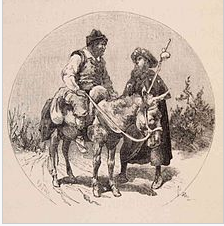

《堂吉诃德》一书中的插画，描绘了骑马的桑丘与旧友，摩里斯科人里科特相遇的场景

卡斯提尔地区对于摩里斯科人的驱逐被证明是低效的，当地官员与平民都普遍对摩里斯科人持有同情态度，仅以应付性的态度对待政令，但在东部的阿拉贡王室领地（包括加泰罗尼亚、阿拉贡与瓦伦西亚等西班牙东部地区），驱逐却相当成功，事实上，对于摩里斯科人的驱逐正是始于这一地区，虽然当地贵族极力反对国王的命令，但这一政策仍然得以全方位的推行，能够逃避或者能够返回原乡的摩里斯科人几乎为零。

阿拉贡王室领地的伊比利亚部分

不过，尽管现代研究表明，有大量摩里斯科人事实上留在西班牙与它的殖民地，但毕竟摩里斯科人的“身份认同”从此在西班牙被抹去了，在西班牙官方乃至主流民间语境中，西班牙不再有“摩里斯科人”这一身份存在。最后一次对怀疑秘密信仰伊斯兰教的民众的大规模迫害发生在1727年，这些民众受到了相对较轻的惩罚；在19世纪奥斯曼帝国派遣使者进入西班牙时，大使在自述中表示当地仍有秘密信仰伊斯兰教的穆斯林；直到20世纪早期，德国研究者的观察中，西班牙农村中，尤其是穆尔西亚地区的一些社群中，仍然有线索表明这些社群中存在着“伊斯兰”，或者“摩里斯科”认同，他们秘密实践着一种民俗式的，充满了自我想象而与正统伊斯兰教截然不同的所谓“伊斯兰教”，保存着大量摩里斯科时代的传统，以及一些不寻常的，带有宗教色彩的阿拉伯词汇。

事实上，驱逐摩里斯科人的数量，低于巴尔干的穆斯林难民乃至俄罗斯对高加索山民的驱逐，更远低于巴基斯坦的“穆哈吉尔民族”，就数量上而言，并不能算什么“大驱逐”。这一事件普遍被国际史学界认为失策，即使在中国，百年前认为穆罕默德“市侩尔”，穆斯林“性同犬羊”，思想带有鲜明的反伊斯兰色彩的徐继畲先生，也对西班牙驱逐摩里斯科人进行了讥讽，相行之下，它在当下中国所受到的吹捧无疑应该引人深思。

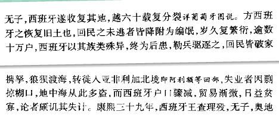

《瀛寰志略》一书中对西班牙驱逐摩里斯科人一事的记载

## 五、摩里斯科后裔

摩里斯科人后裔主要聚居在北非的城镇里，在今天，他们也跟随马格里布的其他居民一道，大量移民欧陆与北美。摩里斯科人聚居的北非城镇有着中世纪西班牙建筑的风格，而其中聚居的摩里斯科后裔们更是城镇中一道别样的风景线，他们的姓氏，来自于西班牙/葡萄牙城市的阿拉伯化名称，或是直接是西班牙/葡萄牙式名字的变种，他们的体态也接近欧洲人。早期的人类学家这样写到：“在阿拉伯人中，有着摩尔人。他们比阿拉伯人更接近白种人，或许这是因为他们是被驱逐出西班牙的摩里斯科后裔的缘故，他们流着伊比利亚的血。”这意味着“摩尔人”，主要都是浅肤色的民众，而非皮肤偏棕色的阿拉伯人，更不是黑人。另一位人类学家这么说：“摩洛哥的这座城市里的富裕阶层，定居在城镇中的摩尔人，这些来自安达卢西亚的民众或许根本没有和当地的穆斯林在血统上融合，从种族的角度考虑，他们完全就是安达卢西亚人。西班牙的穆斯林更多地是继承了阿拉伯征服前本地民众的血脉，从种族的概念考虑，这远多于阿拉伯-柏柏尔人给那个半岛带来的。”

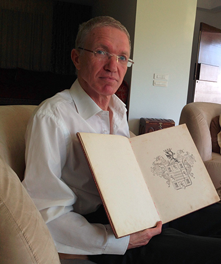

摩洛哥首都拉巴特的摩里斯科后裔，这位先生属于Bargach家族，Bargach就是西班牙本土姓氏Vargas（巴尔加斯、瓦尔加斯）的转音。Bargach家族是摩洛哥著名的上层家族之一，这一家族的先祖是奥尔纳乔斯的老基督徒行政长官，他自愿与当地普通民众一道流放，并改信伊斯兰教。Bargach家族成员仍普遍具有西班牙认同，哪怕是今日。

找到摩里斯科人后裔并不难，因为他们中绝大多数人都有着阿拉伯化的西班牙/葡萄牙名字，抛开托雷斯、佩雷斯、冈萨雷斯、加西亚这些最易判别的名字不提，很多摩里斯科人以自己的家乡为姓，比如“Chiba”，就来源于靠近瓦伦西亚的西班牙城市哈蒂瓦 （Xativa），此外，还有Zbiss （Llopis，即洛皮斯），Chbili （Seville，即塞维利亚）， Gharbi （Algarve，即今天葡萄牙境内的阿尔加维地区；事实上阿尔加维正是来自于Al-Garve的转音，Garve在安达卢斯的阿拉伯语中有着西方之意），Gharnati （Granada，即格拉纳达），或者以安达卢斯为姓（Andalussi、Andaloussi），等等。此外，在北非地区，还有相当部分姓氏是摩里斯科人所特有的，例如在摩洛哥的拉巴特，传统的上层社会由一批“古老家族”所占据，其中相当部分家族来源于安达卢斯，包括Bargach、Achour、Ajenaoui、Balansiano、Briji、Cherqi、Farchado、Ghandour、Ghannam、Krispo、Lisser、Palissio、Yabouri、Zreda等姓氏，他们都是中世纪伊比利亚居民的后裔。

在领英上通过搜索相关姓氏找到的摩里斯科后裔

## 六、补充·时间线

711. 穆斯林征服伊比利亚半岛
1492. 格拉纳达投降，伊比利亚最后一个穆斯林政权终结
1499. 格拉纳达地区发生首次强制改宗事件
1501 - 02.强制改宗大范围发生，穆斯林被给予改宗或者驱逐两个选项，摩里斯科一词开始频繁使用
1516. 开始强制摩里斯科人改变服饰与习俗
1525 - 26. 阿拉贡王室领地开始强制对摩里斯科人实施改宗
1526.摩里斯科人进行起义
1562. 格拉纳达地区的阿拉伯语开始遭到禁止使用
1569 - 70.第二次摩里斯科人起义，起义失败后，格拉纳达地区的穆斯林被大量强制迁移至卡斯提尔王国的其他地方
7 October 1571.西班牙领导下的神圣同盟与奥斯曼帝国进行海上战争，并取得了勒班陀战役的胜利
1609, April 9. 莱尔马公爵签署了驱逐摩里斯科人的法令
1609, September 30. 正式开始驱逐瓦伦西亚的摩里斯科人
On October 20, 1609. 部分摩里斯科人对驱逐展开反抗，但在11月被平息
1610. 驱逐阿拉贡王国的摩里斯科人
1610, September. 驱逐加泰罗尼亚地区的摩里斯科人
1611 - 1614. 摩里斯科人从卡斯提尔王室领地被驱逐

为了对比起见，未来我也会在其他文章中介绍19世纪奥斯曼帝国的穆斯林难民，敬请期待。

## 相关文章

[俄罗斯是怎么征服高加索的？ - 卡夫卡斯的回答](https://www.zhihu.com/question/47320553/answer/105414074)
[希望了解摩里斯科人的现况？ - 卡夫卡斯的回答](https://www.zhihu.com/question/46618344/answer/102050088)
[欧洲穆斯林-西班牙被遗忘的历史-摩里斯科人（一） - 卡夫卡斯的文章 - 知乎专栏](https://zhuanlan.zhihu.com/p/20944403)
[欧洲穆斯林-西班牙被遗忘的历史-摩里斯科人（二）-摩里斯科的人种与其后裔 - 卡夫卡斯的文章 - 知乎专栏](https://zhuanlan.zhihu.com/p/20945092)
[欧洲穆斯林-西班牙被遗忘的历史-摩里斯科人（三）-奥兰法特瓦 - 卡夫卡斯的文章 - 知乎专栏](https://zhuanlan.zhihu.com/p/20947653)