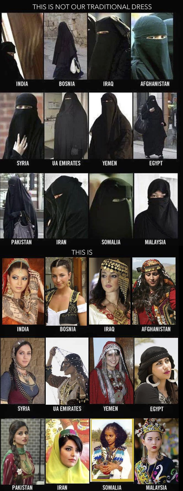
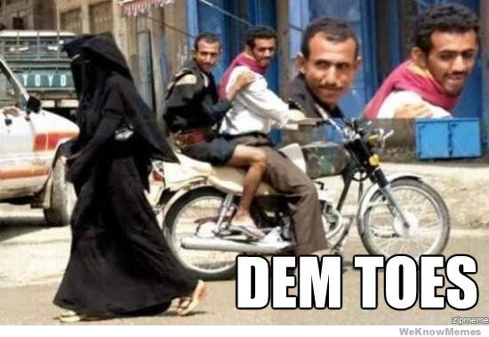

* 作者：Santi Pan
* 链接：https://www.zhihu.com/question/49076588/answer/114709779
* 来源：知乎

不戴的更迷人！

不过似乎穆斯林不是很在乎穿着

其实极端穆斯林罩袍并非一无是处。虽然不好看，但是好用啊。比如说：

    2016年2月5日讯……1个由8名英国皇家空勤团特种部队成员组成的小队穿着极端伊斯兰教义规定的女性服装罩袍吉里巴甫，渗透到了“伊斯兰国”ISIS目前履行首都职能的叙利亚拉卡，引导美国“收割者”无人机击杀了ISIS的一名高级成员，并成功撤离。

    ……

    SAS成员所穿的罩袍，内藏突击步枪、弹药及手榴弹，他们自称是IS高层的妻子，在一名与情报部门合作的叙利亚人协助下，乘坐IS成员常用的货车，毫无阻拦地成功进入拉卡。

    在小队锁定目标房屋后，便向盘旋在当地上空的美国空军预警机传送坐标。之后，预警机指挥无人机发射导弹，成功把IS高层及其亲信击杀。
