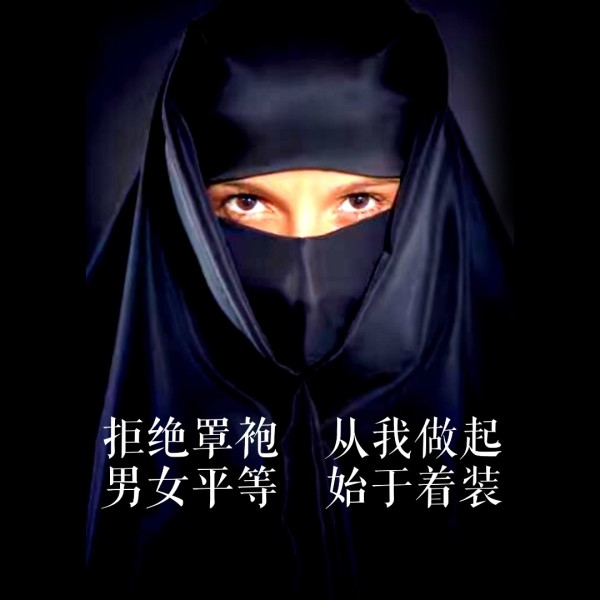

#为什么要旗帜鲜明的去反对——穆斯林女性穿罩袍戴头巾的行为？

* 作者:[灵异档案员王昙](https://www.zhihu.com/people/wang-tan-33-32)
* [原链接](https://zhuanlan.zhihu.com/p/23721108)

事实上，根据一些原则来说，别人穿什么或者不穿什么，与我们是没有关系的。但为什么会有那么多人出来，反对伊斯兰教的这些规定呢？

答案很简单——因为，无论他们是否去干涉别人穿什么，只要他们存在，事实上都是在干涉别人穿什么。

穿罩袍的女性往往会把不穿罩袍的女性比作故意勾引别人的淫荡货色，并且引经据典的说他们会下地狱。就算不当面说出来，也会在网上找一些其他的地区出现这种行为的照片，去宣扬这种理论，使不穿罩袍的女性处在一种道德的弱势状态。

####这种行为难道不是在强制别人穿罩袍吗？

曾经有人做过研究，发现其实着装和被强奸的几率是没有关系的。换句话说，你无论穿什么其实都会有可能被强奸。就算你是个男的，也可能被强奸。

相反的，强奸犯往往会找那些看起来比较保守比较老实的女人下手。假设我是一个强奸犯，我觉得，对穿罩袍的人下手会比较好些。因为穿罩袍的女性肯定思想保守，被强奸了之后肯定不会到处宣扬，甚至于不会报警，出于理性思考，穿罩袍的女性更好欺一些。而不穿罩袍的女性，往往思想比较独立。

所以并不是强奸犯的首选，所以罩袍起不到保护女性的作用，相反会激起某些人的犯罪欲望。

至于所谓的，穿罩袍的女性就不是勾引男人之类的说法，更加的是无稽之谈。

男性会被女性吸引，有可能是因为眼神有可能是因为身材。穿罩袍其实并不能避免勾搭男人。甚至于有可能你穿的罩袍反而激起了某些人的变态欲望。

最主要的是，这种思想对于男女平等是极其有害的。女人会勾引男人，难道男人就不能勾引女人吗？男人看到漂亮的姑娘会会欲望，难道女人见到漂亮男人就不会有吗？事实上都会有的。那么为什么不把男人也罩起来呢？

####这本身就是男女不平等啊！

而且这种思想不但侮辱女性，也侮辱男性。他把不穿罩袍的女性，设定为喜欢勾引男人的女星。又把所有的男人都设定为会去强奸别人，会被勾引的男人。并且把这种思想加载在宗教中大肆宣扬。这是一种什么样的心态？

所以说我们去反对罩袍，并不是反对穿罩袍的人。而是针对那些穿了罩袍，还到处宣扬自己多么有信仰的人。你有信仰，难道别人就没有信仰吗？你把其他宗教信仰者，着装自由的人又置于何地呢？

如果说他们只是穿罩袍，不传播这种思想，无论是公开的传播还是私下的传播，他们都能做到不传播，那么他们穿罩袍我是很无所谓的，只要不干扰到国家反恐就好。

但他们可能不传播吗？明显是不能的。

所以这个时候再去尊重他们的自由选择，就是间接的不尊重不穿罩袍的人的自由选择。

我的母亲是穆斯林，但她也不穿罩袍。正信派穆斯林也不穿罩袍，而且明确地反对穿罩袍这种行为。东部大部分地区的穆斯林，也事实上没有穿罩袍的这种行为。当然，被罩袍思想侵蚀的一部分穆斯林除外。换句话说，我们也是在维护不穿罩袍的穆斯林群众的着装自由。

道理就是这样，欢迎内心想让女性穿上罩袍的家伙来辩。

我和所有支持不穿罩袍的穆斯林流派站在一起，在此特别鸣谢东北北京，河北，福建等地的穆斯林格迪目老教。感谢他们长期以来，与这种极端思想对抗的行为，并且希望他们能更加坚持下去。

####当邪恶出现的时候，你不去抗争，就是屈从。