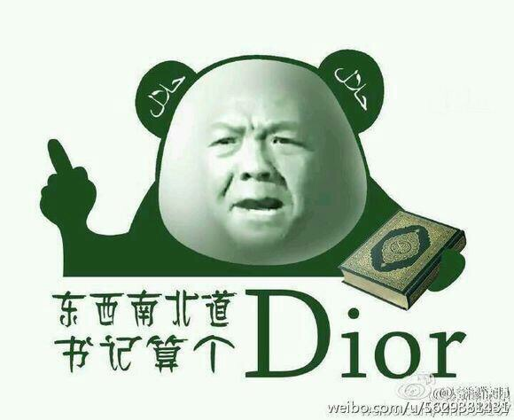

#伊斯兰奇图怪谈

## 车祸

## 民族团结大于天

## "枪击案"相关漫画
约旦基督教画家把一幅嘲笑ISIS漫画贴在社交媒体上，引起保守穆斯林抨击。他被警方以侮辱伊斯兰教罪拘留。尽管画家道歉，称只是支持叙利亚总统阿萨德什叶派，不喜欢逊尼派的ISIS，无意冒犯伊斯兰教，但依然被起诉。就在法院门口，他被一名50岁的极端穆斯林连开三枪打死。

漫画里的对话大意：【天堂】
* 安拉：晚上好，阿布·萨利赫，需要服务吗？
* 圣战者：要啊！你是主吧，给我把那杯酒端来，叫天使给我弄些腰果。等完事了，给我安排个能一直使唤的佣人来擦地板，你再把空盘子端走。别忘了在帐篷上装个门啊，以后进来记得先敲门。

## 魔兽怪图

## 塔基亚原则图解

## 伊斯兰表情包

## 伊斯兰父亲

## 政治正确

## 清真逻辑

## 清真书记算个dior

## 伊斯兰式洗地

